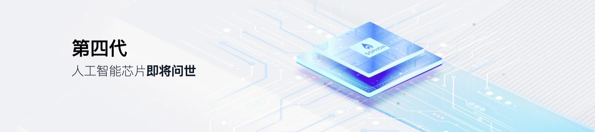
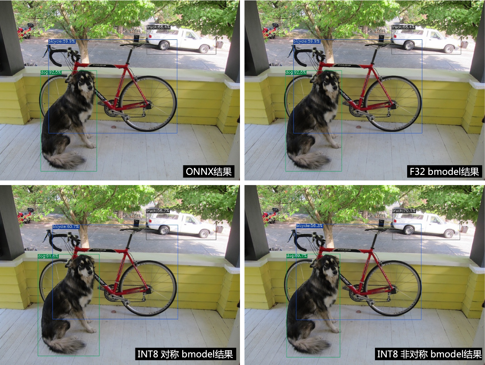

# TPU-MLIR

本项目是算能智能AI芯片的TPU编译器工程。该工程提供了一套完整的工具链，其可以将不
同框架下预训练的神经网络，转化为可以在算能TPU上高效运算的二进制文件`bmodel`。

算能承续了比特大陆在AI领域沉淀多年的技术、专利、产品和客户，以成为全球领先的通用
算力提供商为愿景，智算赋能数字世界为使命，专注于人工智能芯片、RISC-V指令集高性能
CPU服务器以及相关产品的研发与销售。旗下算丰全系列人工智能产品包括智算芯片、智算
模组、智算盒子、智算卡、智算服务器等，丰富的产品形态为各型数据中心提供高效能的计
算平台。公司具备全球领先的先进制程设计能力，现已成功量产云端、边端人工智能芯片并
规模化商业落地。

更多关于**TPU-MLIR**的信息可以参考[TPU-MLIR整体架构](./design/flow.md)。

目前该工程支持BM1684x，后面会陆续支持BM1684、CV183x、CV182x、Mars等等芯片。

# 编译工程

克隆本工程代码后，需要在docker中编译。

* 从[dockerhub](https://hub.docker.com/r/sophgo/tpuc_dev)下载所需的镜像。

``` shell
docker pull sophgo/tpuc_dev:latest

# myname1234 just a example, you can set your own name
docker run --privileged --name myname1234 -v $PWD:/workspace -it sophgo/tpuc_dev:latest
```

容器建立后，代码在docker中的目录为`/workspace/tpu-mlir`。

* 编译代码

在工程目录下运行以下命令：

``` shell
cd tpu-mlir
source ./envsetup.sh
./build.sh
```

# 代码验证

``` shell
# 本工程包含yolov5s.onnx模型，可以直接用来验证
pushd regression
./run_model.sh yolov5s
popd
```

**以下可选：**

如果要验证更多网络，需要克隆其他模型，参考<https://github.com/sophgo/model-zoo>

克隆后模型路径对应为`/workspace/model-zoo`，然后如下命令验证：

``` shell
# 执行时间很长，该步骤也可以跳过
pushd regression
./run_all.sh
popd
```

# 使用方法

以`yolov5s.onnx`为例，介绍如何编译迁移一个onnx模型至BM1684x TPU平台运行。

该模型来在yolov5的官网: <https://github.com/ultralytics/yolov5/releases/download/v6.0/yolov5s.onnx>。

在本工程已经放在`model/yolov5s.onnx`。

## 准备模型和数据

建立`model_yolov5s`目录，注意是与本工程同级目录；并把模型文件和图片文件都放入`model_yolov5s`目录中。

操作如下：

``` shell
mkdir model_yolov5s && cd model_yolov5s
cp ${REGRESSION_PATH}/model/yolov5s.onnx .
cp -rf ${REGRESSION_PATH}/dataset/COCO2017 .
cp -rf ${REGRESSION_PATH}/image .
mkdir workspace && cd workspace
```
## 将模型转化MLIR

如果模型是图片输入，在转模型之前我们需要了解模型的预处理。如果模型用预处理后的npz文件做输入，则不需要考虑预处理。
预处理过程用公式表达如下（x代表输入)：
$$
y = （x - mean） \times scale
$$

官网yolov5的图片是rgb，每个值会乘以`1/255`，转换成mean和scale对应为`0.0,0.0,0.0`和`0.0039216,0.0039216,0.0039216`。

模型转换命令如下：

``` shell
model_transform.py \
    --model_name yolov5s \
    --model_def ../yolov5s.onnx \
    --input_shapes [[1,3,640,640]] \
    --mean 0.0,0.0,0.0 \
    --scale 0.0039216,0.0039216,0.0039216 \
    --keep_aspect_ratio \
    --pixel_format rgb \
    --output_names 350,498,646 \
    --test_input ../image/dog.jpg \
    --test_result yolov5s_top_outputs.npz \
    --mlir yolov5s.mlir
```

`model_transform.py`支持的参数如下:

| **参数名**           | 必选？ | **说明**            |
| ------------------- | ----- | ------------------- |
| model_name          | 是    | 指定模型名称          |
| model_def           | 是    | 指定输入文件用于验证，可以是图片或npy或npz；可以不指定，则不会正确性验证 |
| input_shapes        |       | 指定输入的shape，例如[[1,3,640,640]]；二维数组，可以支持多输入情况 |
| resize_dims         |       | 原始图片需要resize之后的尺寸；如果不指定，则resize成模型的输入尺寸 |
| keep_aspect_ratio   |       | 在Resize时是否保持长宽比，默认为false；设置时会对不足部分补0 |
| mean                |       | 图像每个通道的均值，默认为0.0,0.0,0.0                    |
| scale               |       | 图片每个通道的比值，默认为1.0,1.0,1.0                    |
| pixel_format        |       | 图片类型，可以是rgb、bgr、gray、rgbd四种情况              |
| output_names        |       | 指定输出的名称，如果不指定，则用模型的输出；指定后用该指定名称做输出 |
| test_input          |       | 指定输入文件用于验证，可以是图片或npy或npz；可以不指定，则不会正确性验证 |
| test_result         |       | 指定验证后的输出文件                                         |
| excepts             |       | 指定需要排除验证的网络层的名称，多个用,隔开                      |
| mlir                | 是     | 指定输出的mlir文件路径                                       |

转成mlir文件后，会生成一个`${model_name}_in_f32.npz`文件，该文件是模型的输入文件。它是通过对图片输入进行预处理后得到的数据。


## MLIR转F32模型

将mlir文件转换成f32的bmodel，操作方法如下：

``` shell
model_deploy.py \
  --mlir yolov5s.mlir \
  --quantize F32 \
  --chip bm1684x \
  --test_input yolov5s_in_f32.npz \
  --test_reference yolov5s_top_outputs.npz \
  --tolerance 0.99,0.99 \
  --model yolov5s_1684x_f32.bmodel
```

model_deploy.py的相关参数说明如下：

| **参数名**           | 必选？ | **说明**                       |
| ------------------- | ----- | ----------------------------- |
| mlir                | 是    | 指定mlir文件                                              |
| quantize            | 是    | 指定默认量化类型，支持F32/BF16/F16/INT8                     |
| chip                | 是    | 指定模型将要用到的平台，支持bm1684x（目前只支持这一种，后续会支持多款TPU平台） |
| calibration_table   |       | 指定量化表路径，当存在INT8量化的时候需要量化表                 |
| tolerance           |       | 表示 MLIR 量化后的结果与 MLIR fp32推理结果相似度的误差容忍度 |
| correctnetss        |       | 表示仿真器运行的结果与MLIR量化后的结果相似度的误差容忍度，默认0.99,0.99 |
| excepts             |       | 指定需要排除验证的网络层的名称，多个用,隔开 |
| model               | 是    | 指定输出的model文件路径                                  |


## MLIR转INT8模型

转INT8模型前需要跑calibration，得到量化表；输入数据的数量根据情况准备100~1000张左右。

然后用量化表，生成对称或非对称bmodel。如果对称符合需求，一般不建议用非对称，因为非对称的性能会略差与对称模型。

这里用现有的100张来自COCO2017的图片举例，执行calibration：

``` shell
run_calibration.py yolov5s.mlir \
  --dataset ../COCO2017 \
  --input_num 100 \
  -o yolov5s_cali_table
```


转成INT8对称量化模型，执行如下命令：

``` shell
model_deploy.py \
  --mlir yolov5s.mlir \
  --quantize INT8 \
  --calibration_table yolov5s_cali_table \
  --chip bm1684x \
  --test_input yolov5s_in_f32.npz \
  --test_reference yolov5s_top_outputs.npz \
  --tolerance 0.85,0.45 \
  --correctness 0.99,0.90 \
  --model yolov5s_1684x_int8_sym.bmodel
```

转成INT8非对称量化模型，执行如下命令：

``` shell
model_deploy.py \
  --mlir yolov5s.mlir \
  --quantize INT8 \
  --asymmetric \
  --calibration_table yolov5s_cali_table \
  --chip bm1684x \
  --test_input yolov5s_in_f32.npz \
  --test_reference yolov5s_top_outputs.npz \
  --tolerance 0.90,0.55 \
  --correctness 0.99,0.93 \
  --model yolov5s_1684x_int8_asym.bmodel
```

## 效果对比

本工程有用python写好的yolov5用例，源码路径`python/samples/detect_yolov5.py`，用于对图片进行目标检测。阅读该代码可以了解模型是如何使用的：先预处理得到模型的输入，然后推理得到输出，最后做后处理。以下用该代码分别来验证onnx/f32/int8的执行结果。

onnx模型的执行方式如下，得到`dog_onnx.jpg`：

``` shell
detect_yolov5.py \
  --input ../image/dog.jpg \
  --model ../yolov5s.onnx \
  --output dog_onnx.jpg
```


f32 bmodel的执行方式如下，得到`dog_f32.jpg`：

``` shell
detect_yolov5.py \
  --input ../image/dog.jpg \
  --model yolov5s_1684x_f32.bmodel \
  --output dog_f32.jpg
```


int8 **对称**bmodel的执行方式如下，得到dog_int8_sym.jpg：

``` shell
detect_yolov5.py \
  --input ../image/dog.jpg \
  --model yolov5s_1684x_int8_sym.bmodel \
  --output dog_int8_sym.jpg
```


int8 **非对称**bmodel的执行方式如下，得到dog_int8_asym.jpg：

``` shell
detect_yolov5.py \
  --input ../image/dog.jpg \
  --model yolov5s_1684x_int8_asym.bmodel \
  --output dog_int8_asym.jpg
```


四张图片对比如下：




# 辅助工具

## 模型推理工具`model_runner.py`

支持 bmodel/mlir/onnx/tflite

``` shell
model_runner.py \
  --input resnet18_in_f32.npz \
  --model resnet18_1684x_f32.bmodel \
  --output resnet18_output.npz
```

## `bmodel`模型工具

可以通过`model_tool`工具来查看和编辑`bmodel`文件, 用法参考以下列表:

```
  model_tool
    --info model_file : show brief model info
    --print model_file : show detailed model info
    --extract model_file : extract one multi-net bmodel to multi one-net bmodels
    --combine file1 .. fileN -o new_file: combine bmodels to one bmodel by filepath
    --combine_dir dir1 .. dirN -o new_dir: combine bmodels to one bmodel by directory path
    --dump model_file start_offset byte_size out_file: dump binary data to file from bmodel
```

例如, 获取`bmodel`的基本信息：

``` shell
model_tool --info resnet18_1684x_f32.bmodel
```
