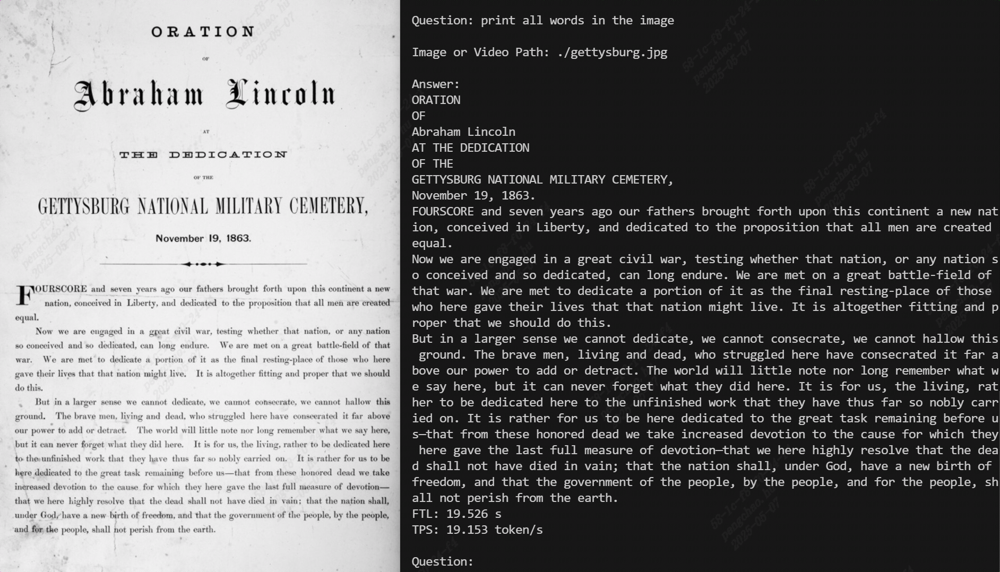

# TPU-MLIR

For Chinese version: [README](https://github.com/sophgo/tpu-mlir/blob/master/README_cn.md).

TPU-MLIR is an open-source machine-learning compiler based on MLIR for TPU. This project provides a complete toolchain, which can convert pre-trained neural networks from different frameworks into binary files `bmodel` that can be efficiently operated on TPUs.

Currently, supported Deep Learning frameworks are PyTorch, ONNX, TFLite and Caffe. Models from other frameworks need to be converted to ONNX models.

It also supports compiling [HuggingFace](https://huggingface.co) LLM models. Currently, the qwen2 and llama series are supported, with more types of LLM models to be added in the future.


# How to Build

First, you need to install the specified Docker, and then you can choose either to use the prebuilt package or to compile from source.

## Install Docker

* Download the required image from [dockerhub](https://hub.docker.com/r/sophgo/tpuc_dev).

``` shell
docker pull sophgo/tpuc_dev:latest
```

* If the pulling failed, you can download it in the following way:

``` shell
wget https://sophon-assets.sophon.cn/sophon-prod-s3/drive/25/04/15/16/tpuc_dev_v3.4.tar.gz
docker load -i tpuc_dev_v3.4.tar.gz
```

* Create the container:

``` shell
# myname1234 is just an example, you can set your own name
docker run --privileged --name myname1234 -v $PWD:/workspace -it sophgo/tpuc_dev:latest
```

## Using prebuilt package (Method One)

We provide TPU-MLIR python package for quick installation by skipping the building step.
Environment prerequisite: python >= 3.10 and ubuntu:22.04 (It is recommended to use our docker image directly).

``` shell
pip install tpu_mlir
```

## Compile source (Method Two)

After the container is created, the directory of the code in docker should be `/workspace/tpu-mlir`.

* Building

Run the following command in the project directory:

``` shell
cd tpu-mlir
source ./envsetup.sh
./build.sh
```

# Usage (Example: Qwen2.5-VL)

Using `Qwen2.5-VL` as an example, here’s how to compile a [HuggingFace](https://huggingface.co) LLM model.

1) Download the `Qwen2.5-VL` model:

```shell
git lfs install
git clone git@hf.co:Qwen/Qwen2.5-VL-3B-Instruct-AWQ
```

2) In a Docker environment, compile `Qwen2.5-VL`:

```shell
llm_convert.py -m /workspace/Qwen2.5-VL-3B-Instruct-AWQ -s 2048 -q w4bf16 -c bm1684x --max_pixels 672,896 -o qwen2.5vl_3b
```

The main arguments supported by `llm_convert.py` are:

| Parameter     | Short | Required? | Description                                                                          |
| ------------- | ----- | --------- | ------------------------------------------------------------------------------------ |
| model_path    | m     | Yes       | Path to the model weights                                                            |
| seq_length    | s     | Yes       | Maximum sequence length                                                               |
| quantize      | q     | Yes       | Quantization type (e.g., `w4bf16`/`w4f16`/`bf16`/`f16`, etc.)                         |
| q_group_size  | g     | No        | Group size for quantization; default is 64                                           |
| chip          | c     | Yes       | Target platform (e.g., `bm1684x`/`bm1688`/`cv186ah`)                                  |
| max_pixels    | —     | No        | Multi-modal parameter; maximum resolution, e.g., `672,896` or single integer `602112` |
| out_dir       | o     | Yes       | Output directory                                                                      |

After the conversion completes, the corresponding bmodel file will be generated in the specified output directory.

3) Run the bmodel in a PCIe or SoC environment:

- Copy the [python_demo](https://github.com/sophgo/LLM-TPU/tree/main/models/Qwen2_5_VL/python_demo) folder into your PCIe/SoC environment, then build:

  ```shell
  mkdir build && cd build
  cmake ..
  make
  cp *cpython*.so ..
  cd ..
  ```

- Copy the generated bmodel to the runtime environment and execute:

  ```shell
  # Replace xxxx.bmodel with your actual bmodel filename
  python3 pipeline.py -m xxxx.bmodel -c config
  ```

The execution result looks like this:



# Usage (Example: yolov5s)

Introduce the usage of `TPU-MLIR` by a simple example of compiling `yolov5s.onnx` and running it on the BM1684X TPU platform.

The model comes from the official website of yolov5: <https://github.com/ultralytics/yolov5/releases/download/v6.0/yolov5s.onnx>.

It has been placed in project path `regression/model/yolov5s.onnx`.

## Preparation

Firstly, create a `model_yolov5s` directory at the same level directory with this project. Then put both model and image files into it.

The operation is as follows:

``` shell
mkdir model_yolov5s && cd model_yolov5s
cp ${REGRESSION_PATH}/model/yolov5s.onnx .
cp -rf ${REGRESSION_PATH}/dataset/COCO2017 .
cp -rf ${REGRESSION_PATH}/image .
mkdir workspace && cd workspace
```
## Model to MLIR

If the model takes images as input, we need to learn its preprocessing before transforming. No preprocessing needs to be considered if the input is npz file. The preprocessing process is formulated as follows:

$$
y = （x - mean） \times scale,
$$

where `x` represents the input.

The input of the official yolov5 is RGB image. Each value will be multiplied by `1/255`. Mean and scale are `0.0, 0.0, 0.0` and `0.0039216, 0.0039216, 0.0039216` respectively.

The model conversion command:

``` shell
model_transform.py \
    --model_name yolov5s \
    --model_def ../yolov5s.onnx \
    --input_shapes [[1,3,640,640]] \
    --mean 0.0,0.0,0.0 \
    --scale 0.0039216,0.0039216,0.0039216 \
    --keep_aspect_ratio \
    --pixel_format rgb \
    --output_names 350,498,646 \
    --test_input ../image/dog.jpg \
    --test_result yolov5s_top_outputs.npz \
    --mlir yolov5s.mlir
```

Main arguments of `model_transform.py` (for complete information please check the technical reference manual):

| **Argument**           | Required？ | **Description**            |
| ------------------- |  :-:  | ------------------- |
| model_name          | Yes    | Model name          |
| model_def           | Yes    | Model definition file (`.onnx`,`.pt`,`.tflite` or `.prototxt`) |
| model_data          | No    | Specify the model weight file, required when it is caffe model (corresponding to the '.caffemodel' file) |
| input_shapes        | No    | The shape of the input, such as `[[1,3,640,640]]` (a two-dimensional array), which can support multiple inputs |
| resize_dims         | No    | The size of the original image to be adjusted to. If not specified, it will be resized to the input size of the model |
| keep_aspect_ratio   | No    | Whether to maintain the aspect ratio when resize. False by default. It will pad 0 to the insufficient part when setting |
| mean                | No    | The mean of each channel of the image. The default is 0.0,0.0,0.0                    |
| scale               | No    | The scale of each channel of the image. The default is 1.0,1.0,1.0                    |
| pixel_format        | No    | Image type, can be rgb, bgr, gray or rgbd              |
| output_names        | No    | The names of the output. Use the output of the model if not specified, otherwise use the specified names as the output |
| test_input          | No    | The input file for validation, which can be an image, npy or npz. No validation will be carried out if it is not specified |
| test_result         | No    | Output file to save validation result                                         |
| excepts             | No    | Names of network layers that need to be excluded from validation. Separated by comma                      |
| debug               | No    | if open debug, immediate model file will keep; or will remove after conversion done |
| mlir                | Yes    | The output mlir file name (including path)                                       |


After converting to mlir file, a `${model_name}_in_f32.npz` file containing preprocessed input will be generated.


## MLIR to F16 bmodel

Convert the mlir file to the F16 bmodel by the following command:

``` shell
model_deploy.py \
  --mlir yolov5s.mlir \
  --quantize F16 \
  --processor bm1684x \
  --test_input yolov5s_in_f32.npz \
  --test_reference yolov5s_top_outputs.npz \
  --model yolov5s_1684x_f16.bmodel
```

Main arguments of `model_deploy.py` (for complete information please check the technical reference manual):

| **Argument**           | Required？ | **Description**                       |
| ------------------- | :-: | ----------------------------- |
| mlir                | Yes    | Mlir file                                             |
| quantize            | Yes    | Quantization type (F32/BF16/F16/INT8)                     |
| processor           | Yes    | The platform that the model will use.      |
| calibration_table   | No    | The quantization table path. Required when it is INT8 quantization                 |
| tolerance           | No    | Tolerance for the minimum similarity between MLIR quantized and MLIR fp32 inference results |
| correctnetss        | No    | Tolerance for the minimum similarity between simulator and MLIR quantized inference results. 0.99,0.90 by default |
| excepts             | No    | Names of network layers that need to be excluded from validation. Separated by comma |
| debug               | No    | if open debug, immediate model file will keep; or will remove after conversion done |
| model               | Yes    | Name of output model file (including path)                                  |
| dynamic             | No     | dynamic codegen for to support dynamic shape                                |

## MLIR to INT8 bmodel

Before converting to the INT8 model, you need to run calibration to get the calibration table. The number of input data is about 100 to 1000 according to the situation.

Then use the calibration table to generate a symmetric int8 bmodel. It is generally not recommended to use the asymmetric one if the symmetric one already meets the requirements, because
the performance of the asymmetric model will be slightly worse than the symmetric model.

Here is an example of the existing 100 images from COCO2017 to perform calibration:

``` shell
run_calibration.py yolov5s.mlir \
  --dataset ../COCO2017 \
  --input_num 100 \
  -o yolov5s_cali_table
```


Execute the following command to convert to the INT8 symmetric quantized model:

``` shell
model_deploy.py \
  --mlir yolov5s.mlir \
  --quantize INT8 \
  --calibration_table yolov5s_cali_table \
  --processor bm1684x \
  --test_input yolov5s_in_f32.npz \
  --test_reference yolov5s_top_outputs.npz \
  --tolerance 0.85,0.45 \
  --model yolov5s_1684x_int8.bmodel
```

## Results Comparison

This project has a yolov5 sample written in python (path:  `python/samples/detect_yolov5.py`) for object detection. Read the code to learn how the model is used:
  1. preprocess the input
  2. model inference to get output
  3. post-process the output

The following code is used to verify the output of onnx/f32/int8 model respectively:

* ONNX model:

``` shell
detect_yolov5.py \
  --input ../image/dog.jpg \
  --model ../yolov5s.onnx \
  --output dog_origin.jpg
```


* F16 bmodel:

``` shell
detect_yolov5.py \
  --input ../image/dog.jpg \
  --model yolov5s_1684x_f16.bmodel \
  --output dog_f16.jpg
```

* INT8 **symmetric quantized** bmodel:

``` shell
detect_yolov5.py \
  --input ../image/dog.jpg \
  --model yolov5s_1684x_int8.bmodel \
  --output dog_int8.jpg
```


Outputs of different models are compared below:


# Auxiliary Tools

## Model Inference Tool `model_runner.py`

Supports bmodel/mlir/pytorch/onnx/tflite/caffe.

``` shell
model_runner.py \
  --input resnet18_in_f32.npz \
  --model resnet18_1684x_f32.bmodel \
  --output resnet18_output.npz
```

## Tool for `bmodel`

The `bmodel` file can be viewed and edited by `model_tool`:

```
  model_tool
    --info model_file : show brief model info
    --print model_file : show detailed model info
    --extract model_file : extract one multi-net bmodel to multi one-net bmodels
    --combine file1 .. fileN -o new_file: combine bmodels to one bmodel by filepath
    --combine_dir dir1 .. dirN -o new_dir: combine bmodels to one bmodel by directory path
    --dump model_file start_offset byte_size out_file: dump binary data to file from bmodel
```

For example, to get basic information of `bmodel`:

``` shell
model_tool --info resnet18_1684x_f32.bmodel
```

# Resources

Here are some resources to help you better understand the project:

| Index | Documents |
| :---: | --- |
| 01 | [TPU-MLIR paper](https://arxiv.org/abs/2210.15016) |
| 02 | [TPU-MLIR Technical Reference Manual](https://tpumlir.org/developer_manual_en/index.html) |
| 03 | [TPU-MLIR Quick Start](https://tpumlir.org/quick_start_en/index.html) |

| Index | Sharing Sessions |
| :---: | --- |
| 01 | [TPU-MLIR Paper](https://www.bilibili.com/video/BV1My4y1o73Q/?share_source=copy_web&vd_source=90fd7c624ed0c40af96748bd0b8dd3e8) |
| 02 | [LayerGroup](https://www.bilibili.com/video/BV1wo4y1z7AG/?share_source=copy_web&vd_source=90fd7c624ed0c40af96748bd0b8dd3e8) |

| Index | Topic | Video Links |
| :---: | --- | --- |
| 01 | What is Depp Learning Compiler? | [Depp Learning Compiler Intro](https://www.bilibili.com/video/BV1yP4y1d7gz/?share_source=copy_web&vd_source=90fd7c624ed0c40af96748bd0b8dd3e8)|
| 02 | MLIR Intro | [Basic Syntax (1)](https://www.bilibili.com/video/BV1CP411n7fj/?share_source=copy_web&vd_source=90fd7c624ed0c40af96748bd0b8dd3e8), [Basic Syntax (2)](https://www.bilibili.com/video/BV1Gt4y1F7mt/?share_source=copy_web&vd_source=90fd7c624ed0c40af96748bd0b8dd3e8), [Basic Syntax (3)](https://www.bilibili.com/video/BV1UN4y1w72r/?share_source=copy_web&vd_source=90fd7c624ed0c40af96748bd0b8dd3e8), [Dialect Conversion](https://www.bilibili.com/video/BV1UG411c7nm/?share_source=copy_web&vd_source=90fd7c624ed0c40af96748bd0b8dd3e8), [Pattern Rewriting](https://www.bilibili.com/video/BV1R44y1d7xv/?share_source=copy_web&vd_source=90fd7c624ed0c40af96748bd0b8dd3e8)|
| 03 | TPU-MLIR Intro | [Overview](https://www.bilibili.com/video/BV19d4y1B7eR/?share_source=copy_web&vd_source=90fd7c624ed0c40af96748bd0b8dd3e8), [Front-end Conversion](https://www.bilibili.com/video/BV1yv4y1S7WT/?share_source=copy_web&vd_source=90fd7c624ed0c40af96748bd0b8dd3e8), [Lowering](https://www.bilibili.com/video/BV1gg411z7mC/?share_source=copy_web&vd_source=90fd7c624ed0c40af96748bd0b8dd3e8) |
| 04 | Quantization | [Overview](https://www.bilibili.com/video/BV1d8411j7t4/?share_source=copy_web&vd_source=90fd7c624ed0c40af96748bd0b8dd3e8), [Formula Derivation](https://www.bilibili.com/video/BV1SW4y1H7Uu/?share_source=copy_web&vd_source=90fd7c624ed0c40af96748bd0b8dd3e8), [Calibration](https://www.bilibili.com/video/BV1qK411R75k/?share_source=copy_web&vd_source=90fd7c624ed0c40af96748bd0b8dd3e8), [QAT](https://www.bilibili.com/video/BV12g411J7WQ/?share_source=copy_web&vd_source=90fd7c624ed0c40af96748bd0b8dd3e8)|
| 05 | TPU Memory | [Ep1](https://www.bilibili.com/video/BV1T24y1G7pu/?share_source=copy_web&vd_source=90fd7c624ed0c40af96748bd0b8dd3e8), [Ep2](https://www.bilibili.com/video/BV1VY4y1y7ET/?share_source=copy_web&vd_source=90fd7c624ed0c40af96748bd0b8dd3e8) |
| 06 | TPU-MLIR Practice | [To Onnx Format](https://www.bilibili.com/video/BV1FD4y1H7pT/?share_source=copy_web&vd_source=90fd7c624ed0c40af96748bd0b8dd3e8), [Graph Optimization](https://www.bilibili.com/video/BV1AR4y1U7D6/?share_source=copy_web&vd_source=90fd7c624ed0c40af96748bd0b8dd3e8), [Operator Support](https://www.bilibili.com/video/BV1tL411r71p/?share_source=copy_web&vd_source=90fd7c624ed0c40af96748bd0b8dd3e8), [Model Support](https://www.bilibili.com/video/BV1mM411y7Ep/?share_source=copy_web&vd_source=90fd7c624ed0c40af96748bd0b8dd3e8), [Fuse Preprocess](https://www.bilibili.com/video/BV1ao4y1H7m8/?share_source=copy_web&vd_source=90fd7c624ed0c40af96748bd0b8dd3e8), [Accuracy Validation](https://www.bilibili.com/video/BV14e4y1M79d/?share_source=copy_web&vd_source=90fd7c624ed0c40af96748bd0b8dd3e8) |

If you have any questions while doing the tasks above, you can ask or check the existing answers in our [Issues](https://github.com/sophgo/tpu-mlir/issues).
