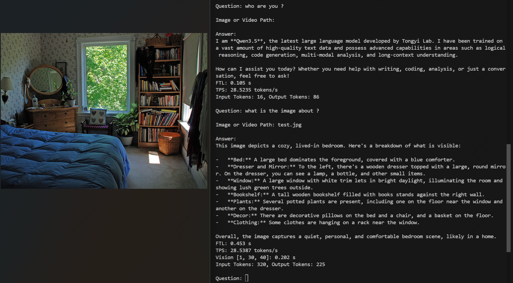
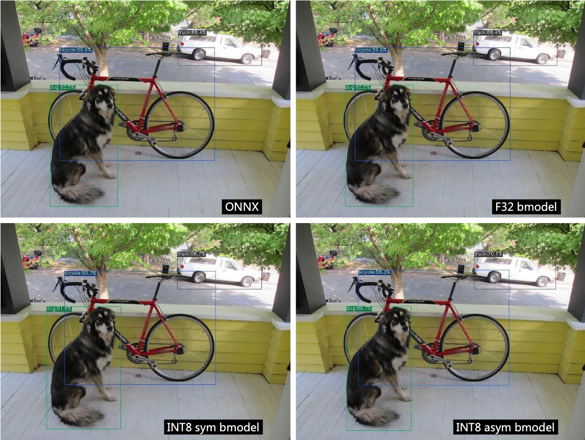

<p align="center">
  
</p>

<h1 align="center">TPU-MLIR</h1>

<p align="center">
  <em>An open-source, MLIR-based machine-learning compiler for TPUs.</em>
</p>

<p align="center">
  <a href="https://github.com/sophgo/tpu-mlir/blob/master/LICENSE"></a>
  <a href="https://pypi.org/project/tpu_mlir/"></a>
  <a href="https://pypi.org/project/tpu_mlir/"></a>
  <a href="https://github.com/sophgo/tpu-mlir/stargazers"></a>
  <a href="https://github.com/sophgo/tpu-mlir/issues"></a>
  <a href="https://arxiv.org/abs/2210.15016"></a>
</p>

<p align="center">
  <a href="./README.md">English</a> · <a href="./README_cn.md">简体中文</a> ·
  <a href="https://tpumlir.org/quick_start_en/index.html">Quick Start</a> ·
  <a href="https://tpumlir.org/developer_manual_en/index.html">Docs</a> ·
  <a href="https://github.com/sophgo/tpu-mlir/issues">Issues</a>
</p>

---

## ✨ Overview

**TPU-MLIR** converts pre-trained neural networks from mainstream frameworks into `bmodel` files that run efficiently on TPUs. Built on top of [MLIR](https://mlir.llvm.org/), it provides a unified IR, a clean lowering pipeline, and a rich set of tools for quantization, calibration, and deployment.

```
┌──────────────────┐    model_transform.py    ┌──────────┐    model_deploy.py    ┌──────────┐
│ ONNX / PyTorch / │ ───────────────────────► │   MLIR   │ ────────────────────► │  bmodel  │
│  TFLite / Caffe  │     (front-end import)   │  (TOP →  │  (lowering, quant,    │  on TPU  │
│   HuggingFace    │                          │   TPU)   │   layer-group, …)     │          │
└──────────────────┘                          └──────────┘                       └──────────┘
```

## 🚀 Highlights

- **Multi-framework front-ends** — PyTorch, ONNX, TFLite, Caffe (other frameworks via ONNX).
- **LLM-ready** — one-shot conversion of HuggingFace LLMs (Qwen, MiniCPM-V, …) via `llm_convert.py`.
- **Full quantization toolchain** — F32 / BF16 / F16 / INT8 (symmetric & asymmetric), AWQ / GPTQ / AutoRound passthrough, calibration, QAT.
- **MLIR-based pipeline** — clean dialects (Top / Tpu), pattern rewrites, layer-group memory planning.
- **Production tooling** — `model_runner`, `model_tool`, accuracy validation, simulator, visualizer.
- **Bilingual docs & active community** — English / 中文 manuals, papers, and video tutorials.


## 📚 Table of Contents

- [Installation](#-installation)
- [Quick Start (LLM — Qwen)](#-quick-start--llm--qwen)
- [Quick Start (Vision — YOLOv5)](#-quick-start--vision--yolov5)
- [Auxiliary Tools](#-auxiliary-tools)
- [Resources](#-resources)
- [Citation](#-citation)
- [Contributing](#-contributing)
- [License](#-license)

---

## 🔧 Installation

TPU-MLIR runs inside a prebuilt Docker image. After the container is running you can either install the Python wheel or build from source.

### 1. Pull the Docker image

```shell
docker pull sophgo/tpuc_dev:latest
```

If the pull fails, download the tarball and load it manually:

```shell
wget https://sophon-assets.sophon.cn/sophon-prod-s3/drive/25/04/15/16/tpuc_dev_v3.4.tar.gz
docker load -i tpuc_dev_v3.4.tar.gz
```

Create and enter the container:

```shell
docker run --privileged --name tpu-mlir -v $PWD:/workspace -it sophgo/tpuc_dev:latest
```

### 2a. Install the prebuilt wheel (recommended)

> Requires Python ≥ 3.10 on Ubuntu 22.04 (already satisfied inside the Docker image).

```shell
pip install tpu_mlir
```

### 2b. Build from source

```shell
cd /workspace/tpu-mlir
pip install -r requirements.txt
source ./envsetup.sh
./build.sh
```

---

## 🤖 Quick Start — LLM (Qwen)

Convert and run a HuggingFace LLM (here: Qwen) on a TPU.

<details>
<summary><b>Click to expand the full LLM walkthrough</b></summary>

### 1. Download the model

A pre-quantized AWQ / GPTQ / AutoRound build is recommended.

```shell
git lfs install
git clone https://huggingface.co/Intel/Qwen3.5-2B-int4-AutoRound
```

### 2. Compile to bmodel

```shell
# If you encounter transformers/torch version issues:
#   pip3 install transformers torchvision -U
# --max_input_length sets the max prefill length; if omitted it defaults to -s.
llm_convert.py \
  -m /workspace/Qwen3.5-2B-int4-AutoRound \
  --max_input_length 1024 \
  -s 2048 \
  -c bm1684x \
  --max_pixels 768,768 \
  -o qwen3.5_2b
```

Main arguments of `llm_convert.py`:

| Parameter      | Short | Required | Description                                                                                                                                    |
| -------------- | :---: | :------: | ---------------------------------------------------------------------------------------------------------------------------------------------- |
| `model_path`   |  `m`  |    ✅    | Path to the model weights                                                                                                                      |
| `seq_length`   |  `s`  |    ✅    | Maximum sequence length                                                                                                                        |
| `max_input_length` |  —  |    —    | Maximum input length; defaults to `seq_length` (`-s`) when omitted                                                                        |
| `quantize`     |  `q`  |    ✅    | Quantization type: `auto` / `w4bf16` / `w4f16` / `bf16` / `f16`, etc. (omit if the source model is already quantized)                          |
| `q_group_size` |  `g`  |    —    | Group size for quantization (default `64`)                                                                                                     |
| `chip`         |  `c`  |    ✅    | Target platform: `bm1684x` / `bm1688` / `cv186ah`                                                                                              |
| `max_pixels`   |   —   |    —    | Multi-modal max resolution `width,height`. Defaults vary by `model_type` (qwen2_5_vl: `672,896`; minicpmv: `980,980`; otherwise `768,768`)     |
| `out_dir`      |  `o`  |    ✅    | Output directory                                                                                                                               |

### 3. Run on PCIe / SoC

Copy the [`python_demo`](https://github.com/sophgo/LLM-TPU/tree/main/models/Qwen3_5/python_demo) folder onto your device and build it:

```shell
mkdir build && cd build
cmake ..
make
cp *cpython*.so ..
cd ..
```

Then run the bmodel:

```shell
python3 pipeline.py -m xxxx.bmodel -c config
```

Sample output:



</details>

---

## 🖼️ Quick Start — Vision (YOLOv5)

Compile and run [`yolov5s.onnx`](https://github.com/ultralytics/yolov5/releases/download/v6.0/yolov5s.onnx) on the BM1684X TPU. The model is bundled in `regression/model/yolov5s.onnx`.

<details>
<summary><b>Click to expand the full YOLOv5 walkthrough</b></summary>

### 1. Prepare the working directory

```shell
mkdir model_yolov5s && cd model_yolov5s
cp ${REGRESSION_PATH}/model/yolov5s.onnx .
cp -rf ${REGRESSION_PATH}/dataset/COCO2017 .
cp -rf ${REGRESSION_PATH}/image .
mkdir workspace && cd workspace
```

### 2. Convert the model to MLIR

If the model takes images as input, the preprocessing must be specified. The preprocessing formula is:

$$y = (x - \text{mean}) \times \text{scale}$$

YOLOv5's official input is RGB scaled by `1/255`, so `mean = 0,0,0` and `scale = 0.0039216,0.0039216,0.0039216`.

```shell
model_transform.py \
  --model_name yolov5s \
  --model_def ../yolov5s.onnx \
  --input_shapes [[1,3,640,640]] \
  --mean 0.0,0.0,0.0 \
  --scale 0.0039216,0.0039216,0.0039216 \
  --keep_aspect_ratio \
  --pixel_format rgb \
  --output_names 350,498,646 \
  --test_input ../image/dog.jpg \
  --test_result yolov5s_top_outputs.npz \
  --mlir yolov5s.mlir
```

Main arguments of `model_transform.py`:

| Argument             | Required | Description                                                                                              |
| -------------------- | :------: | -------------------------------------------------------------------------------------------------------- |
| `model_name`         |    ✅    | Model name                                                                                               |
| `model_def`          |    ✅    | Model definition file (`.onnx`, `.pt`, `.tflite`, `.prototxt`)                                           |
| `model_data`         |    —    | Caffe weight file (`.caffemodel`)                                                                        |
| `input_shapes`       |    —    | Input shape, e.g. `[[1,3,640,640]]` — supports multiple inputs                                           |
| `resize_dims`        |    —    | Image resize size before feeding into the model                                                          |
| `keep_aspect_ratio`  |    —    | Keep aspect ratio (pads with 0). Off by default                                                          |
| `mean`               |    —    | Per-channel mean (default `0,0,0`)                                                                       |
| `scale`              |    —    | Per-channel scale (default `1,1,1`)                                                                      |
| `pixel_format`       |    —    | `rgb` / `bgr` / `gray` / `rgbd`                                                                          |
| `output_names`       |    —    | Output tensor names. Defaults to model outputs                                                           |
| `test_input`         |    —    | Validation input (image / npy / npz). Skipped if not specified                                            |
| `test_result`        |    —    | Output file for validation                                                                               |
| `excepts`            |    —    | Comma-separated list of layers excluded from validation                                                  |
| `debug`              |    —    | Keep intermediate files                                                                                   |
| `mlir`               |    ✅    | Output MLIR file path                                                                                    |

A `${model_name}_in_f32.npz` file containing the preprocessed input is generated after this step.

### 3. MLIR → F16 bmodel

```shell
model_deploy.py \
  --mlir yolov5s.mlir \
  --quantize F16 \
  --processor bm1684x \
  --test_input yolov5s_in_f32.npz \
  --test_reference yolov5s_top_outputs.npz \
  --model yolov5s_1684x_f16.bmodel
```

Main arguments of `model_deploy.py`:

| Argument             | Required | Description                                                                                       |
| -------------------- | :------: | ------------------------------------------------------------------------------------------------- |
| `mlir`               |    ✅    | Input MLIR file                                                                                   |
| `quantize`           |    ✅    | `F32` / `BF16` / `F16` / `INT8`                                                                   |
| `processor`          |    ✅    | Target chip                                                                                       |
| `calibration_table`  |    —    | Calibration table (required for INT8)                                                             |
| `tolerance`          |    —    | Min similarity between MLIR-quantized and MLIR-fp32 inference                                     |
| `correctness`        |    —    | Min similarity between simulator and MLIR-quantized inference (default `0.99,0.90`)               |
| `excepts`            |    —    | Comma-separated layers excluded from validation                                                   |
| `debug`              |    —    | Keep intermediate files                                                                           |
| `model`              |    ✅    | Output bmodel path                                                                                |
| `dynamic`            |    —    | Dynamic codegen for dynamic shapes                                                                |

### 4. MLIR → INT8 bmodel

Run calibration first (typically 100–1000 images). Prefer symmetric quantization unless accuracy demands asymmetric.

```shell
run_calibration.py yolov5s.mlir \
  --dataset ../COCO2017 \
  --input_num 100 \
  -o yolov5s_cali_table

model_deploy.py \
  --mlir yolov5s.mlir \
  --quantize INT8 \
  --calibration_table yolov5s_cali_table \
  --processor bm1684x \
  --test_input yolov5s_in_f32.npz \
  --test_reference yolov5s_top_outputs.npz \
  --tolerance 0.85,0.45 \
  --model yolov5s_1684x_int8.bmodel
```

### 5. Verify the results

The sample script lives at `python/samples/detect_yolov5.py`.

```shell
# ONNX
detect_yolov5.py --input ../image/dog.jpg --model ../yolov5s.onnx          --output dog_origin.jpg
# F16 bmodel
detect_yolov5.py --input ../image/dog.jpg --model yolov5s_1684x_f16.bmodel --output dog_f16.jpg
# INT8 bmodel
detect_yolov5.py --input ../image/dog.jpg --model yolov5s_1684x_int8.bmodel --output dog_int8.jpg
```

Comparison of outputs:



</details>

---

## 🛠️ Auxiliary Tools

### `model_runner.py` — universal inference runner

Supports `bmodel` / `mlir` / PyTorch / ONNX / TFLite / Caffe.

```shell
model_runner.py \
  --input  resnet18_in_f32.npz \
  --model  resnet18_1684x_f32.bmodel \
  --output resnet18_output.npz
```

### `model_tool` — inspect & edit bmodel

```text
model_tool
  --info     model_file                                : show brief model info
  --print    model_file                                : show detailed model info
  --extract  model_file                                : split a multi-net bmodel into single-net bmodels
  --combine  file1 .. fileN -o new_file                : merge bmodels by file path
  --combine_dir dir1 .. dirN -o new_dir                : merge bmodels by directory
  --dump     model_file start_offset byte_size out_file: dump raw bytes from a bmodel
```

```shell
model_tool --info resnet18_1684x_f32.bmodel
```

---

## 📖 Resources

### Documentation & Papers

| Type   | Link                                                                                       |
| ------ | ------------------------------------------------------------------------------------------ |
| Paper  | [TPU-MLIR (arXiv 2210.15016)](https://arxiv.org/abs/2210.15016)                            |
| Manual | [Technical Reference Manual](https://tpumlir.org/developer_manual_en/index.html)           |
| Guide  | [Quick Start](https://tpumlir.org/quick_start_en/index.html)                               |

### Talks

- [TPU-MLIR Paper Walkthrough](https://www.bilibili.com/video/BV1My4y1o73Q/)
- [LayerGroup](https://www.bilibili.com/video/BV1wo4y1z7AG/)

### Video tutorials

<details>
<summary><b>Click to expand video index</b></summary>

| # | Topic | Links |
|:-:|-------|-------|
| 01 | What is a Deep Learning Compiler?         | [Intro](https://www.bilibili.com/video/BV1yP4y1d7gz/) |
| 02 | MLIR Intro                                | [Syntax 1](https://www.bilibili.com/video/BV1CP411n7fj/) · [Syntax 2](https://www.bilibili.com/video/BV1Gt4y1F7mt/) · [Syntax 3](https://www.bilibili.com/video/BV1UN4y1w72r/) · [Dialect Conversion](https://www.bilibili.com/video/BV1UG411c7nm/) · [Pattern Rewriting](https://www.bilibili.com/video/BV1R44y1d7xv/) |
| 03 | TPU-MLIR Intro                            | [Overview](https://www.bilibili.com/video/BV19d4y1B7eR/) · [Front-end](https://www.bilibili.com/video/BV1yv4y1S7WT/) · [Lowering](https://www.bilibili.com/video/BV1gg411z7mC/) |
| 04 | Quantization                              | [Overview](https://www.bilibili.com/video/BV1d8411j7t4/) · [Formula](https://www.bilibili.com/video/BV1SW4y1H7Uu/) · [Calibration](https://www.bilibili.com/video/BV1qK411R75k/) · [QAT](https://www.bilibili.com/video/BV12g411J7WQ/) |
| 05 | TPU Memory                                | [Ep1](https://www.bilibili.com/video/BV1T24y1G7pu/) · [Ep2](https://www.bilibili.com/video/BV1VY4y1y7ET/) |
| 06 | TPU-MLIR Practice                         | [To ONNX](https://www.bilibili.com/video/BV1FD4y1H7pT/) · [Graph Optimization](https://www.bilibili.com/video/BV1AR4y1U7D6/) · [Operator Support](https://www.bilibili.com/video/BV1tL411r71p/) · [Model Support](https://www.bilibili.com/video/BV1mM411y7Ep/) · [Fuse Preprocess](https://www.bilibili.com/video/BV1ao4y1H7m8/) · [Accuracy Validation](https://www.bilibili.com/video/BV14e4y1M79d/) |

</details>

---

## 📝 Citation

If TPU-MLIR helps your research, please cite:

```bibtex
@misc{tpumlir2022,
  title         = {TPU-MLIR: A Compiler For TPU Using MLIR},
  author        = {HuPengchao and LuMan and WangLei and JiangGuoyue},
  year          = {2022},
  eprint        = {2210.15016},
  archivePrefix = {arXiv},
  primaryClass  = {cs.PL}
}
```

---

## 🤝 Contributing

Bug reports, feature requests and pull requests are welcome! Before you start:

1. Search [existing issues](https://github.com/sophgo/tpu-mlir/issues) to avoid duplicates.
2. For non-trivial changes, open an issue first to discuss the design.
3. Run the regression tests under `regression/` before sending a PR.

---

## 📄 License

This project is licensed under the terms of the [LICENSE](./LICENSE) file in the root of this repository.
