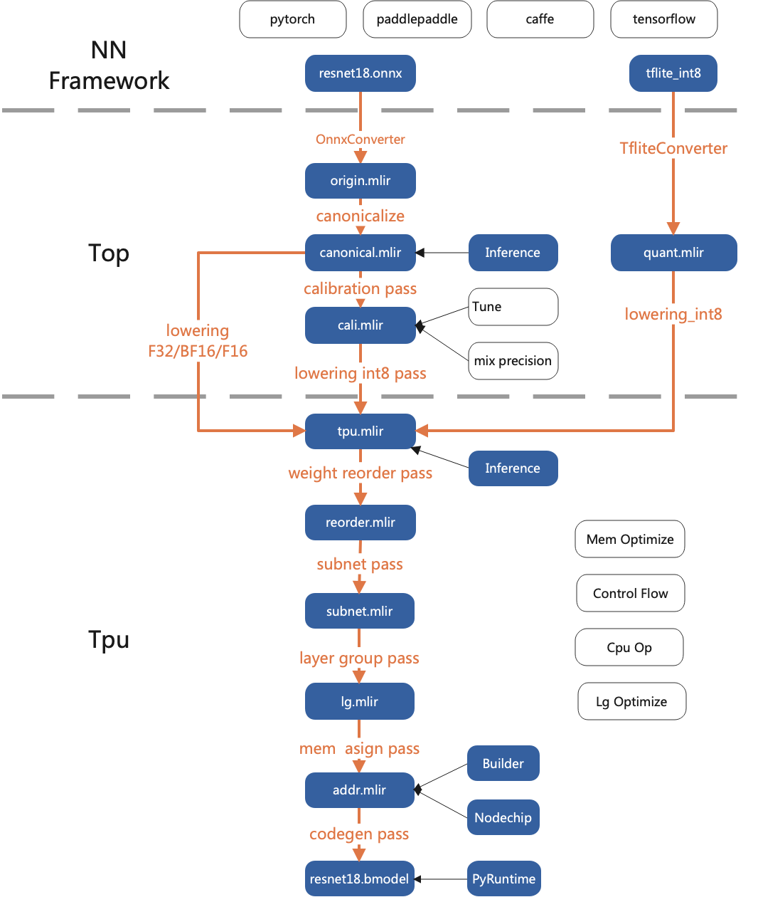

# 架构图

* content
{:toc}

## 整体架构

## Pass介绍

### Top Pass

#### Canonicalize

做算子的优化，比如relu合并到conv

#### Calibration

按照calibration table的信息，给每个算子插入阈值，非对称量化则插入min和max

#### Lowering

将算子根据类型下层到tpu层，支持的类型有F32/F16/BF16/INT8对称/INT8非对称

### Tpu Pass

#### Weight Reorder

对个别需要重排的权重进行重排，比如卷积，参考[Weight摆放](weight.md)

#### Subnet

将网络按照TPU/CPU切分成不同的子网络，如果所有算子都是TPU，则子网络只有一个

#### LayerGroup

对网络进行layer group切分，参考[LayerGroup](layer_group.md)

#### MemAssign

分配Global Mem地址

#### CodeGen

生成bmodel文件