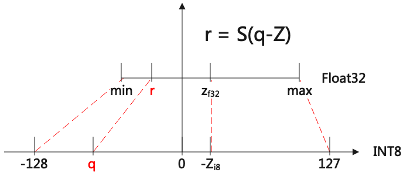

# Quantization

## 量化公式

#### 对称量化

用于cv183x/cv182x/mars/bm1684
$$
\begin{align}
Quant:\quad & i8\_value = f32\_value \times \frac{128}{threshold}\\
Dequant:\quad &f32\_value = i8\_value \times \frac{threshold}{128}
\end{align}
$$

#### 非对称量化

用于BM1686

* Dequant
  $$
  \begin{align}
  公式:\quad & r = S(q-Z) \\
  S:\quad & \frac{max-min}{256} \\
  Z:\quad & -128\times \frac{max+min}{max-min}
  \end{align}
  $$
  

* Quant

$$
\begin{align}
公式:\quad & q = \frac{r}{S} + Z
\end{align}
$$

## 算子实现

#### InnerProduct

* Float

$$
Y = X\times W + B
$$

* INT8 (cv183x/cv182x/mars)

$$
y_{i8} = ((x_{i8}\times w_{i8})_{i32} + b_{i32}) * M_{i32} >> rshift_{i8}
$$

* INT8(bm1684)

$$
y_{i8} = ((x_{i8}\times w_{i8})_{i16} + b_{i16}) >> rshift_{i8}
$$

* INT8 (bm1686)

$$
\begin{align}
y_{i8} = & ((x_{i8}\times (w_{i8} -Z_w))_{i32} + b_{i32})_{i32} * M_{i32} >> rshift_{i8} + z_{i8} \\
分两个算子实现:\quad& \\
算子1:\quad &((x_{i8}\times (w_{i8} -Z_w))_{i32} + b_{i32})_{i32} \\
算子2:\quad & * M_{i32} >> rshift_{i8} + z_{i8}
\end{align}
$$

#### 推导过程

$$
\begin{align}
float:\quad & Y = X\times W + B \\
step 0\quad & => S_y(q_y-Z_y) = S_x(q_x-Z_x)\times S_w(q_w-Z_w) + B \\
step 1\quad & => q_y - Z_y = S_1(q_x-Z_x)\times (q_w-Z_w) + B_1 \\
step 2\quad & => q_y - Z_y = S_1 q_x\times (q_w - Z_w)  + B_2 \\
step 3\quad & => q_y = S_3 (q_x \times (q_w - Z_w) + B_3) + Z_{y} \\
step 4\quad & => q_y = (q_x \times (q_w - Z_w) + b_{i32}) * M_{i32} >> rshift_{i8} + Z_{y}

\end{align}
$$

## Convolution

* Float

$$
Y = X_{(n,ic,ih,iw)}\times K_{(oc,ic,kh,kw)} + B_{(1,oc,1,1)}
$$

* INT8 (cv183x/cv182x/mars)

perchannel量化，其中Multiplier/Rshift/Bias会合并到一个operand里面，按照(1,oc,1,9)格式摆放，4字节bias + 4字节multiplier + 1字节rshift
$$
y_{i8} = ((x_{i8}\times k_{i8})_{i32}+b_{i32})\times M_{i32}^{oc} >> rshift_{i8}^{oc}
$$

* INT8(bm1684)

$$
y_{i8} = ((x_{i8}\times k_{i8})_{i32}+b_{i32})>> rshift_{i8}^{oc}
$$

* INT8(bm1686)

weight当前采用perchannel对称量化，activation用perlayer非对称量化
$$
y_{i8} = (x_{i8}\times (k_{i8}+z_{k}^{oc}))_{i32}+b_{i32})\times M_{i32}^{oc} >> rshift_{i8}^{oc} + z_{yi8}
$$

