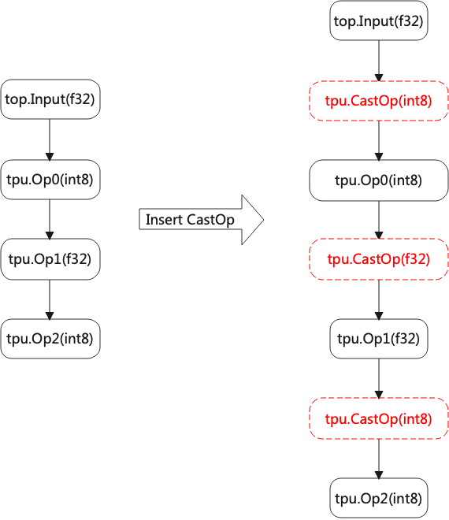

Lowering
============

Lower Top layer op to Tpu layer op, it supports types of F32/F16/BF16/INT8 symmetric/INT8 asymmetric.

When converting to INT8, it involves the quantization algorithm; for different chips, the quantization algorithm is different, for example, some support per-channel, some do not, some support 32-bit Multiplier and some only support 8-bit, etc.

Lowering converts op from the chip-independent layer (TOP), to the chip-related layer (TPU).

Basic Process
-------------

.. _lowering:
.. figure:: ../assets/lowering.png
   :height: 5cm
   :align: center

   Lowering process

The process of lowering is shown in the figure (:ref:`lowering`).

* Top op can be divided into f32 and int8, the former is the case of most networks and the latter is the case of quantized networks such as tflite.
* f32 operator can be directly converted to f32/f16/bf16 tpu layer operator. If it is to be converted to int8, the type should be calibrated_type.
* int8 op can only be directly converted to tpu layer int8 op.

Mixed precision
---------------

.. _mix_prec:

   Mixed precision

When the type is not the same between OPs, CastOp is inserted as shown in the figure (:ref:`mix_prec`).

It is assumed that the type of output is the same as the input. Otherwise, special treatment is needed. For example, no matter what the type of embedding output is, the input is of type uint.
