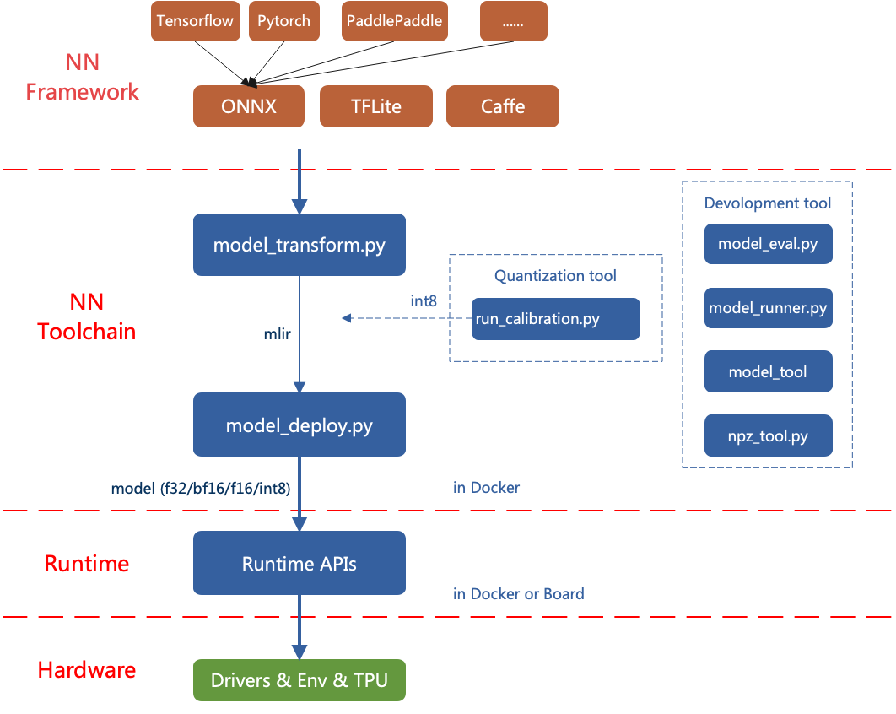

TPU-MLIR简介
============

TPU-MLIR是AI芯片的TPU编译器工程。该工程提供了一套完整的工具链，其可以将
不同框架下预训练的神经网络，转化为可以在算能TPU上高效运算的二进制文件 ``bmodel``
。
代码已经开源到github: https://github.com/sophgo/tpu-mlir 。

TPU-MLIR的整体架构如下：

   TPU-MLIR整体架构

目前直接支持的框架有tflite和onnx。其他框架的模型需要转换成onnx模型。如何将其他深
度学习架构的网络模型转换成onnx，可以参考onnx官网:
https://github.com/onnx/tutorials。

转模型需要在指定的docker执行，主要分两步，一是通过 ``model_transform.py`` 将原始模型
转换成mlir文件，二是通过 ``model_deploy.py`` 将mlir文件转换成bmodel。如果要转INT8模
型，则需要调用 ``run_calibration.py`` 生成量化表传给 ``model_deploy.py`` 。

本文详细描述实现细节，用于指导开发。
