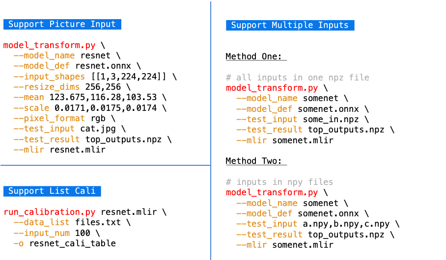

用户界面
========

本章介绍用户的使用界面。

基本操作过程是用 ``model_transform.py`` 将模型转成mlir文件，然后用
``model_deploy.py`` 将mlir转成对应的model。如果需要转INT8模型，则
需要进行calibration。大致过程如下：

   用户界面1

另外支持一下复杂的情况，支持图片输入带预处理，支持多输入情景，如下：

   用户界面2

.. _model_transform:

model_transform.py
--------------------

用于将各种神经网络模型转换成MLIR文件，支持的参数如下:

.. list-table:: model_transform 参数功能
   :widths: 20 10 50
   :header-rows: 1

   * - 参数名
     - 必选？
     - 说明
   * - model_name
     - 是
     - 指定模型名称
   * - model_def
     - 是
     - 指定输入文件用于验证，可以是图片或npy或npz；可以不指定，则不会正确性验证
   * - input_shapes
     - 否
     - 指定输入的shape，例如[[1,3,640,640]]；二维数组，可以支持多输入情况
   * - resize_dims
     - 否
     - 原始图片需要resize之后的尺寸；如果不指定，则resize成模型的输入尺寸
   * - keep_aspect_ratio
     - 否
     - 在Resize时是否保持长宽比，默认为false；设置时会对不足部分补0
   * - mean
     - 否
     - 图像每个通道的均值，默认为0.0,0.0,0.0
   * - scale
     - 否
     - 图片每个通道的比值，默认为1.0,1.0,1.0
   * - pixel_format
     - 否
     - 图片类型，可以是rgb、bgr、gray、rgbd四种情况
   * - output_names
     - 否
     - 指定输出的名称，如果不指定，则用模型的输出；指定后用该指定名称做输出
   * - test_input
     - 否
     - 指定输入文件用于验证，可以是图片或npy或npz；可以不指定，则不会正确性验证
   * - test_result
     - 否
     - 指定验证后的输出文件
   * - excepts
     - 否
     - 指定需要排除验证的网络层的名称，多个用,隔开
   * - mlir
     - 是
     - 指定输出的mlir文件名称和路径

转成mlir文件后，会生成一个 ``${model_name}_in_f32.npz`` 文件，该文件是后续模型的输入文件。

.. _run_calibration:

run_calibration.py
--------------------

用少量的样本做calibration，得到网络的量化表，即每一层op的threshold/min/max。

支持的参数如下：

.. list-table:: run_calibration 参数功能
   :widths: 20 10 50
   :header-rows: 1

   * - 参数名
     - 必选？
     - 说明
   * - 无
     - 是
     - 指定mlir文件
   * - dataset
     - 否
     - 指定输入样本的目录，该路径放对应的图片，或npz，或npy
   * - data_list
     - 否
     - 指定样本列表，与dataset必须二选一
   * - input_num
     - 否
     - 指定校准数量，如果为0，则使用全部样本
   * - tune_num
     - 否
     - 指定微调样本数量，默认为10
   * - histogram_bin_num
     - 否
     - 直方图bin数量，默认2048
   * - o
     - 是
     - 输出calibration table文件

.. _model_deploy:

model_deploy.py
--------------------

将mlir文件转换成相应的model，参数说明如下：

.. list-table:: model_deploy 参数功能
   :widths: 18 10 50
   :header-rows: 1

   * - 参数名
     - 必选？
     - 说明
   * - mlir
     - 是
     - 指定mlir文件
   * - quantize
     - 是
     - 指定默认量化类型，支持F32/F16/BF16/INT8
   * - chip
     - 是
     - 指定模型将要用到的平台，支持bm1684x（目前只支持这一种，后续会支持多款TPU
       平台）
   * - calibration_table
     - 否
     - 指定量化表路径，当存在INT8量化的时候需要量化表
   * - tolerance
     - 否
     - 表示 MLIR 量化后的结果与 MLIR fp32推理结果相似度的误差容忍度
   * - correctness
     - 否
     - 表示仿真器运行的结果与MLIR量化后的结果相似度的误差容忍度，默认0.99,0.90
   * - test_input
     - 否
     - 指定输入文件用于验证，可以是图片或npy或npz；可以不指定，则不会正确性验证
   * - test_reference
     - 否
     - 用于验证模型正确性的参考数据（使用npz格式）。其为各算子的计算结果
   * - excepts
     - 否
     - 指定需要排除验证的网络层的名称，多个用,隔开
   * - model
     - 是
     - 指定输出的model文件名称和路径

.. _tools:

其他工具
--------------------

model_runner.py
~~~~~~~~~~~~~~~~

对模型进行推理，支持bmodel/mlir/onnx/tflite。

执行参考如下：

.. code-block:: console

   $ model_runner.py \
      --input sample_in_f32.npz \
      --model sample.bmodel \
      --output sample_output.npz

支持的参数如下：

.. list-table:: model_runner 参数功能
   :widths: 18 10 50
   :header-rows: 1

   * - 参数名
     - 必选？
     - 说明
   * - input
     - 是
     - 指定模型输入，npz文件
   * - model
     - 是
     - 指定模型文件，支持bmodel/mlir/onnx/tflite
   * - dump_all_tensors
     - 否
     - 开启后对导出所有的结果，包括中间tensor的结果

npz_tool.py
~~~~~~~~~~~~~~~~

npz在TPU-MLIR工程中会大量用到，包括输入输出的结果等等。npz_tool.py用于处理npz文件。

执行参考如下：

.. code-block:: console

   # 查看sample_out.npz中output的数据
   $ npz_tool.py dump sample_out.npz output

支持的功能如下：

.. list-table:: npz_tool 功能
   :widths: 18 60
   :header-rows: 1

   * - 功能
     - 描述
   * - dump
     - 得到npz的所有tensor信息
   * - compare
     - 比较2个npz文件的差异
   * - to_dat
     - 将npz导出为dat文件，连续的二进制存储

