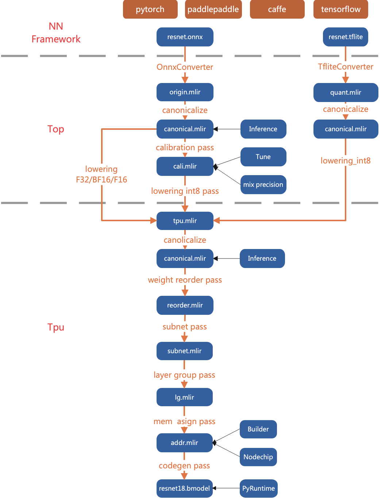

整体设计
============

.. _dialect:

分层
------------

TPU-MLIR将网路模型的编译过程分两层处理：

Top Dialect
   与芯片无关层，包括图优化、量化、推理等等
Tpu Dialect
   与芯片相关层，包括权重重排、算子切分、地址分配、推理等等

整体的流程如(:ref:`main_flow`)图中所示，通过Pass将模型逐渐转换成最终的指令，这里具体说明Top层和Tpu层每个Pass做的什么功能。
后面章节会对每个Pass的关键点做详细说明。

.. _main_flow:

   TPU-MLIR整体流程

.. _top pass:

Top Pass
------------

Canonicalize
   与具体OP有关的图优化，比如relu合并到conv、shape合并等等
Calibration
   按照calibration table，给每个OP插入min和max，用于后续量化；对应对称量化则插入threshold
Lowering
   将OP根据类型下沉到tpu层，支持的类型有F32/F16/BF16/INT8对称/INT8非对称。

.. _tpu pass:

Tpu Pass
------------

Canonicalize
   与具体OP有关的图优化，比如连续Requant的合并等等
WeightReorder
   根据芯片特征对个别OP的权重进行重新排列，比如卷积的filter和bias
Subnet
   将网络按照TPU/CPU切分成不同的子网络，如果所有算子都是TPU，则子网络只有一个
LayerGroup
   对网络进行切分，使尽可能多的OP在local mem中连续计算
MemAssign
   给需要global mem的op分配地址
CodeGen
   用Builder模块采用flatbuffers格式生成最终的模型
