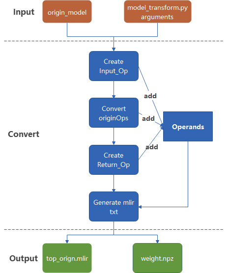
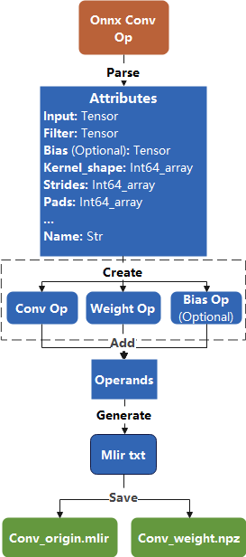

前端转换
============

本章以onnx为例介绍模型/算子在本工程中的前端转换流程。

主要工作
----------------
前端主要负责将原始模型转换为Top层（芯片无关层）mlir模型的工作（不包含Canonicalize部分，因此生成的文件名为“\*_origin.mlir”），这个过程会根据原始模型与运行model_transform.py时输入的参数逐一创建并添加对应的算子（Op），最终生成mlir文件。

工作流程
----------------
1. Input ops 创建

  根据输入数据信息，预处理信息与原始模型的input names创建input_ops，将ops添加进operands列表中。

2. Origin model ops 转换

  获取原模型文件中每个op的属性，根据这些属性创建相应的op，将op逐个添加进operands。

3. Output ops 创建

  根据arguments中的output_names获取特定ops的输出，创建output ops，将Op添加进operands。

4. Mlir生成

  根据arguments与operands生成mlir_txt。

5. 结果保存

  将结果保存为mlir文件，模型的权重单独保存为npz文件。

模型的mlir转换过程如图所示(:ref:`mlir_convert`)。

.. _mlir_convert:

   MLIR模型转换过程

算子转换样例
----------------

以onnx格式的Conv op转换为例，转换的过程如图所示(:ref:`conv_example`)。

.. _conv_example:

   Conv op转换过程

补充说明

1. 对于卷积这样带有权重的算子，前端会为其权重额外创建Op。

2. 转换Conv op前，应当先在tablegen文件中（即TopOps.td）对Top层的Conv算子进行定义，后续会依据该定义与输入的onnx算子来生成对应的mlir txt，如图所示(:ref:`conv_def`)。

.. _conv_def:
.. figure:: ../assets/conv_defnmlir.png
  :align: center

  Top::ConvOp定义(上)与conv mlir txt(下)

