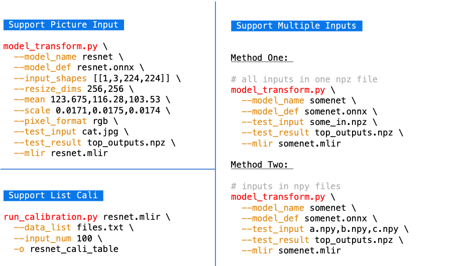

User Interface
==============

This chapter introduces the user interface.

Introduction
--------------------

The basic procedure is transforming the model into a mlir file with ``model_transform.py``, and then transforming the mlir into the corresponding model with ``model_deploy.py``.
Calibration is required if you need to get the INT8 model.
The general process is shown in the figure (:ref:`ui_0`).

Other complex cases such as image input with preprocessing and multiple inputs are also supported, as shown in the figure (:ref:`ui_1`).

TFLite model conversion is also supported, with the following command:

.. code-block:: shell

    # TFLite conversion example
    $ model_transform.py \
        --model_name resnet50_tf \
        --model_def  ../resnet50_int8.tflite \
        --input_shapes [[1,3,224,224]] \
        --mean 103.939,116.779,123.68 \
        --scale 1.0,1.0,1.0 \
        --pixel_format bgr \
        --test_input ../image/dog.jpg \
        --test_result resnet50_tf_top_outputs.npz \
        --mlir resnet50_tf.mlir
   $ model_deploy.py \
       --mlir resnet50_tf.mlir \
       --quantize INT8 \
       --chip bm1684x \
       --test_input resnet50_tf_in_f32.npz \
       --test_reference resnet50_tf_top_outputs.npz \
       --tolerance 0.95,0.85 \
       --model resnet50_tf_1684x.bmodel

Supporting the conversion of Caffe models, the commands are as follows:

.. code-block:: shell

    # Caffe conversion example
    $ model_transform.py \
        --model_name resnet18_cf \
        --model_def  ../resnet18.prototxt \
        --model_data ../resnet18.caffemodel \
        --input_shapes [[1,3,224,224]] \
        --mean 104,117,123 \
        --scale 1.0,1.0,1.0 \
        --pixel_format bgr \
        --test_input ../image/dog.jpg \
        --test_result resnet50_cf_top_outputs.npz \
        --mlir resnet50_cf.mlir
    # The call of model_deploy is consistent with onnx
    # ......

.. _ui_0:
.. figure:: ../assets/ui_0.png
   :height: 9.5cm
   :align: center

   User interface 1

.. _ui_1:

   User interface 2

.. _model_transform:

model_transform.py
--------------------

Used to convert various neural network models into MLIR files, the supported parameters are shown below:

.. list-table:: Function of model_transform parameters
   :widths: 20 12 50
   :header-rows: 1

   * - Name
     - Required?
     - Explanation
   * - model_name
     - Y
     - Model name
   * - model_def
     - Y
     - Model definition file (e.g., '.onnx', '.tflite' or '.prototxt' files)
   * - model_data
     - N
     - Specify the model weight file, required when it is caffe model (corresponding to the '.caffemodel' file)
   * - input_shapes
     - N
     - The shape of the input, such as [[1,3,640,640]] (a two-dimensional array), which can support multiple inputs
   * - input_types
     - N
     - Type of the inputs, such int32; separate by ',' for multi inputs; float32 as default
   * - resize_dims
     - N
     - The size of the original image to be adjusted to. If not specified, it will be resized to the input size of the model
   * - keep_aspect_ratio
     - N
     - Whether to maintain the aspect ratio when resize. False by default. It will pad 0 to the insufficient part when setting
   * - mean
     - N
     - The mean of each channel of the image. The default is 0.0,0.0,0.0
   * - scale
     - N
     - The scale of each channel of the image. The default is 1.0,1.0,1.0
   * - pixel_format
     - N
     - Image type, can be rgb, bgr, gray or rgbd. The default is bgr
   * - channel_format
     - N
     - Channel type, can be nhwc or nchw for image input, otherwise it is none. The default is nchw
   * - output_names
     - N
     - The names of the output. Use the output of the model if not specified, otherwise use the specified names as the output
   * - add_postprocess
     - N
     - add postprocess op into bmodel, set the type of post handle op such as yolov3/yolov3_tiny/yolov5/ssd
   * - test_input
     - N
     - The input file for validation, which can be an image, npy or npz. No validation will be carried out if it is not specified
   * - test_result
     - N
     - Output file to save validation result
   * - excepts
     - N
     - Names of network layers that need to be excluded from validation. Separated by comma
   * - onnx_sim
     - N
     - option for onnx-sim, currently only support 'skip_fuse_bn' args
   * - mlir
     - Y
     - The output mlir file name (including path)

After converting to an mlir file, a ``${model_name}_in_f32.npz`` file will be generated, which is the input file for the subsequent models.

.. _run_calibration:

run_calibration.py
--------------------

Use a small number of samples for calibration to get the quantization table of the network (i.e., the threshold/min/max of each layer of op).

Supported parameters:

.. list-table:: Function of run_calibration parameters
   :widths: 20 12 50
   :header-rows: 1

   * - Name
     - Required?
     - Explanation
   * - (None)
     - Y
     - Mlir file
   * - dataset
     - N
     - Directory of input samples. Images, npz or npy files are placed in this directory
   * - data_list
     - N
     - The sample list (cannot be used together with "dataset")
   * - input_num
     - N
     - The number of input for calibration. Use all samples if it is 0
   * - tune_num
     - N
     - The number of fine-tuning samples. 10 by default
   * - histogram_bin_num
     - N
     - The number of histogram bins. 2048 by default
   * - o
     - Y
     - Name of output calibration table file

.. _model_deploy:

model_deploy.py
--------------------

Convert the mlir file into the corresponding model, the parameters are as follows:

.. list-table:: Function of model_deploy parameters
   :widths: 18 12 50
   :header-rows: 1

   * - Name
     - Required?
     - Explanation
   * - mlir
     - Y
     - Mlir file
   * - quantize
     - Y
     - Quantization type (F32/F16/BF16/INT8)
   * - chip
     - Y
     - The platform that the model will use. Support bm1686/bm1684x/bm1684/cv186x/cv183x/cv182x/cv181x/cv180x.
   * - calibration_table
     - N
     - The quantization table path. Required when it is INT8 quantization
   * - ignore_f16_overflow
     - N
     - Operators with F16 overflow risk are still implemented according to F16; otherwise, F32 will be implemented by default, such as LayerNorm
   * - tolerance
     - N
     - Tolerance for the minimum similarity between MLIR quantized and MLIR fp32 inference results
   * - test_input
     - N
     - The input file for validation, which can be an image, npy or npz. No validation will be carried out if it is not specified
   * - test_reference
     - N
     - Reference data for validating mlir tolerance (in npz format). It is the result of each operator
   * - excepts
     - N
     - Names of network layers that need to be excluded from validation. Separated by comma
   * - op_divide
     - N
     - cv183x/cv182x/cv181x/cv180x only, Try to split the larger op into multiple smaller op to achieve the purpose of ion memory saving, suitable for a few specific models
   * - model
     - Y
     - Name of output model file (including path)
   * - debug
     - N
     - to keep all intermediate files for debug
   * - core
     - N
     - When the target is selected as bm1686 or cv186x, it is used to select the number of tpu cores for parallel computing, and the default setting is 1 tpu core

.. _tools:

Other Tools
--------------------

model_runner.py
~~~~~~~~~~~~~~~~

Model inference. bmodel/mlir/onnx/tflite supported.

Example:

.. code-block:: shell

   $ model_runner.py \
      --input sample_in_f32.npz \
      --model sample.bmodel \
      --output sample_output.npz

Supported parameters:

.. list-table:: Function of model_runner parameters
   :widths: 18 12 50
   :header-rows: 1

   * - Name
     - Required?
     - Explanation
   * - input
     - Y
     - Input npz file
   * - model
     - Y
     - Model file (bmodel/mlir/onnx/tflite)
   * - dump_all_tensors
     - N
     - Export all the results, including intermediate ones, when specified

npz_tool.py
~~~~~~~~~~~~~~~~

npz will be widely used in TPU-MLIR project for saving input and output results, etc. npz_tool.py is used to process npz files.

Example:

.. code-block:: shell

   # Check the output data in sample_out.npz
   $ npz_tool.py dump sample_out.npz output

Supported functions:

.. list-table:: npz_tool functions
   :widths: 18 60
   :header-rows: 1

   * - Function
     - Description
   * - dump
     - Get all tensor information of npz
   * - compare
     - Compare difference of two npz files
   * - to_dat
     - Export npz as dat file, contiguous binary storage

visual.py
~~~~~~~~~~~~~~~~

visual.py is an visualized network/tensor compare application with interface in web browser, if accuracy of quantized network is not
as good as expected, this tool can be used to investigate the accuracy in every layer.

Example:

.. code-block:: shell

   # use TCP port 9999 in this example
   $ visual.py \
     --f32_mlir netname.mlir \
     --quant_mlir netname_int8_sym_tpu.mlir \
     --input top_input_f32.npz --port 9999

Supported functions:

.. list-table:: visual 功能
   :widths: 18 60
   :header-rows: 1

   * - Function
     - Description
   * - f32_mlir
     - fp32 mlir file
   * - quant_mlir
     - quantized mlir file
   * - input
     - test input data for networks, can be in jpeg or npz format.
   * - port
     - TCP port used for UI, default port is 10000，the port should be mapped when starting docker
   * - manual_run
     - if net will be automaticall inferenced when UI is opened, default is false for auto inference

Notice: ``--debug`` flag should be opened during model_deploy.py to save intermediate files for visual.py. More details refer to (:ref:`visual-usage`)
