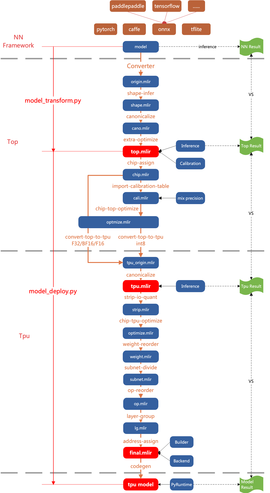

Overall Design
==============

.. _dialect:

Layered
------------

TPU-MLIR treats the compilation process of the network model in two layers.

Top Dialect
   Hardware-independent layer, including graph optimization, quantization and inference, etc.
Tpu Dialect
   Hardware-related layer, including weight reordering, operator slicing, address assignment, inference, etc.

The overall flow is shown in the (:ref:`main_flow`) diagram, where the model is gradually converted into final instructions by Passes. Here is a detailed description of what functions each Pass does in the Top layer and the Tpu layer. The following chapters will explain the key points of each Pass in detail.

.. _main_flow:

   TPU-MLIR overall process

.. _top pass:

Top Pass
------------

shape-infer
   Do shape inference, and constant folder
canonicalize
   Graph optimization related to specific OP, such as merging relu into conv, shape merge, etc.
extra-optimize
   Do extra patterns, such as get FLOPs, remove unuse output, etc.
processor-assign
   Assign processor, such as BM1684X, CV183X, etc; and adjust top mlir by processor, for example, make all CV18XX input types as F32.
import-calibration-table
   Import calibration table, assign min and max for all ops, for quantization later.
processor-top-optimize
   Do top ops optimization by processor.
convert-top-to-tpu
   Lower top ops to tpu ops; if for mode F32/F16/BF16, top op normally convert to tpu op directly; if INT8, quantization is needed.

.. _tpu pass:

Tpu Pass
------------

canonicalize
   Graph optimization related to specific OP, such as merging of consecutive Requants, etc.
strip-io-quant
   Input and output types will be quantized if true; or be F32
processor-tpu-optimize
   Do tpu ops optimization by processor.
weight-reorder
   Reorder the weights of individual OP based on processor characteristics, such as filter and bias for convolution.
subnet-divide
   Divide the network into various subnets based on the processor type. If the
   Tensor Competing Processor can compute all operators, then it forms a single
   subnet.
op-reorder
   Reorder op to make sure ops are close to their users.
layer-group
   Slice the network so that as many OPs as possible are computed consecutively in the local mem.
address-assign
   Assign addresses to the OPs that need global mem.
codegen
   Use Builder module to generate the final model in flatbuffers format.

.. _other pass:

Other Passes
------------

There are some optional passes, not in the diagram, used for special functions.

fuse-preprocess
   Fuse image preprocess to model.
add-postprocess
   add postprocess to model, only support ssd/yolov3/yolov5.
