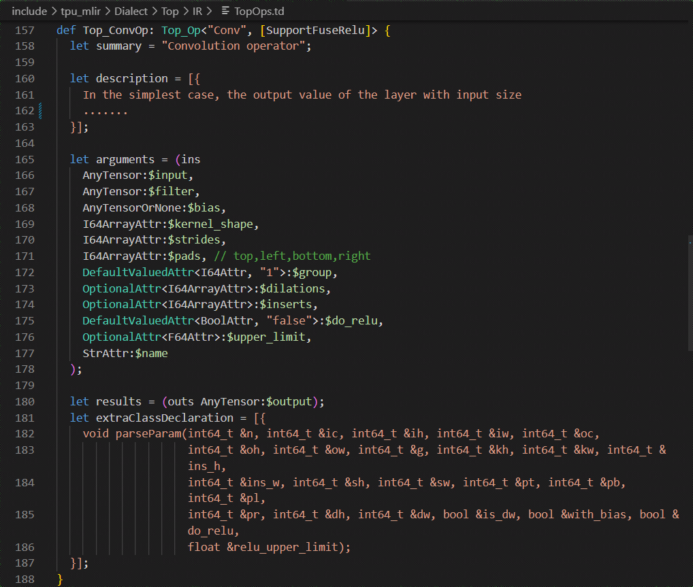
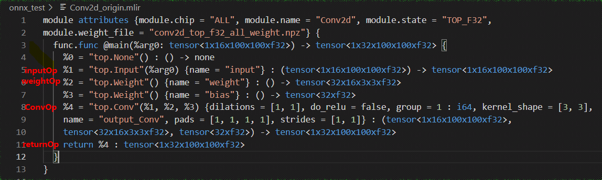

Front-end Conversion
====================

This chapter takes the onnx model as an example to introduce the front-end conversion process of models/operators in this project.

Main Work
----------------
The front-end is mainly responsible for transforming the original model into a Top (hardware-independent) mlir model (without the Canonicalize part, so the generated file is named "\*_origin.mlir"). This process creates and adds the corresponding operators (Op) based on the original model and the input arguments when running model_transform.py. The transformed model and weights will be saved in mlir and npz file respectively.

Workflow
----------------
1. Prereq: definition of the Top layer operator in TopOps.td.

2. Input: input the original onnx model and arguments (preprocessing arguments mainly).

3. Initialize OnnxConverter (load_onnx_model + initMLIRImporter).

    * load_onnx_model part is mainly to refine the model, intercept the model according to the output_names in arguments, and extract the relevant information from the refined model.

    * The init_MLIRImporter part generates the initial mlir text.

4. generate_mlir

    * Create the input op, the model intermediate nodes op and the return op in turn and add them to the mlir text (if the op has tensors, additional weight op will be created).

5. Output

    * Save the simplified model as a "\*_opt.onnx" file

    * Generate a ".prototxt" file to save the model information except the weights

    * Convert the generated text to str and save it as a ".mlir" file

    * Save model weights (tensors) in ".npz" file

The workflow of the front-end conversion is shown in the figure (:ref:`mlir_convert`).

.. _mlir_convert:
.. figure:: ../assets/mlir_convert.png
   :align: center

   Front-end conversion workflow

Additional Notes:
  * Build input op requires:

     1. ``input_names``.

     2. index for each input.

     3. preprocessing arguments (if the input is an image).

  * Convert nodes op requires:

     1. former ops.

     2. the output_shape from ``shapes``.

     3. attrs extracted from the onnx node. Attrs are set by MLIRImporter according to definition in TopOps.td.

  * Build return op requires:

      output ops according to ``output_names``.

  * Insertion operation is performed for each op conversion or creation. The operator is inserted into the mlir text so that the final generated text can one-to-one correspond with the original onnx model.

Example
----------------

This section takes the Conv onnx operator as an example for Top mlir conversion. The original model is shown in the figure (:ref:`conv_op`).

.. _conv_op:
.. figure:: ../assets/conv_op.png
   :align: center
   :height: 15cm

   Conv onnx model

The conversion process:

1. Conv op definition

  Define the Top.Conv operator in TopOps.td. The definition is shown in the figure (:ref:`convop_def`).

.. _convop_def:

   Top.Conv definition

2. Initialize OnnxConverter

  load_onnx_model:

  * Since this example uses the simplest model, the resulting Conv_opt.onnx model is the same as the original one.

  * ``input_names`` for saving input name "input" of Conv op.

  * The weight and bias of the Conv op are stored in ``tensors``.

  * ``shapes`` saves input_shape and output_shape of conv op.

  * ``output_names`` holds the output name of the Conv op "output".

  init_MLIRImporter:

  The initial mlir text MLIRImporter.mlir_module is generated based on model name, input shape and output shape from ``shapes``, as shown in the figure (:ref:`origin_mlir`).

.. _origin_mlir:
.. figure:: ../assets/origin_mlir.png
   :align: center

   Initial mlir text

3. generate_mlir

   * build input op, the generated Top.inputOp will be inserted into MLIRImporter.mlir_module.

   * call convert_conv_op(), which calls MLIRImporter.create_conv_op to create a ConvOp, and the create function takes the following arguments.

      1) inputOp: from (:ref:`conv_op`), we can see that inputs of the Conv operator contain input, weight and bias. inputOp has been created, and the op of weight and bias will be created by getWeightOp().

      2) output_shape: use onnx_node.name to get the output shape of the Conv operator from ``shapes``.

      3) Attributes: get attributes such as (:ref:`conv_op`) from the onnx Conv operator.

         The attributes of the Top.Conv operator are set according to the definition in (:ref:`convop_def`). Top.ConvOp will be inserted into the MLIR text after it is created.

   * Get the output op from ``operands`` based on ``output_names`` to create return_op and insert it into the mlir text. Up to this point, the generated mlir text is shown (:ref:`mlir_txt`).

.. _mlir_txt:

   Complete mlir text

4. Output

  Save the mlir text as Conv_origin.mlir and the weights in the ``tensors`` as Conv_TOP_F32_all_weight.npz.
