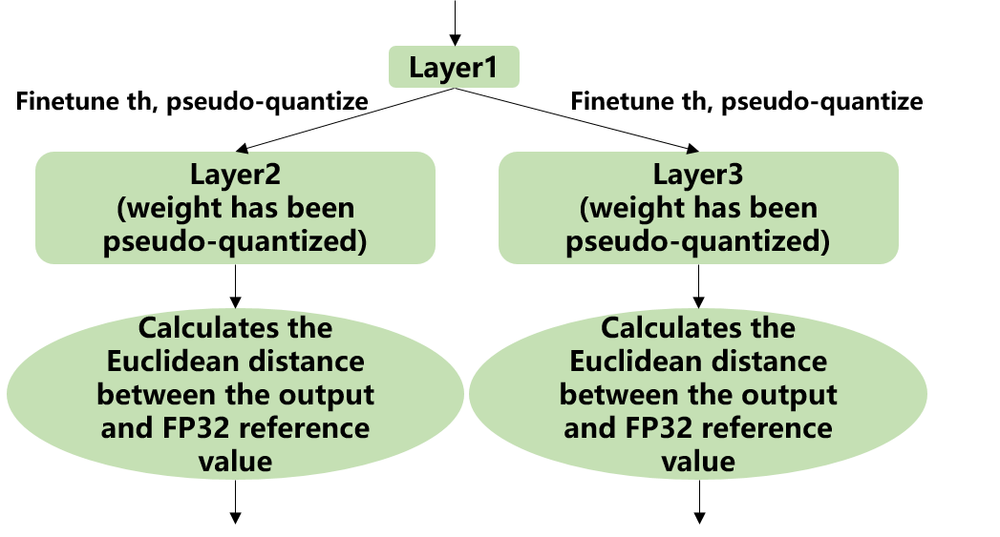

Calibration
============

General introduction
--------------------

Calibration is the use of real scene data to tune the proper quantization parameters. Why do we need calibration? When we perform asymmetric quantization of the activation, we need to know the overall dynamic range, i.e., the minmax value, in advance. When applying symmetric quantization to activations, we need to use a suitable quantization threshold algorithm to calculate the quantization threshold based on the overall data distribution of the activation. However, the general trained model does not have the activation statistics. Therefore, both of them need to inference on a miniature sub-training set to collect the output activation of each layer.

The calibration process in tpu-mlir includes automatic threshold search method (search_threshold), SmoothQuant(sq), cross-layer weight equalization (we), bias correction (bc), and an automatic mixed precision feature (search_qtable), among other methods. The overall process is shown in(:ref:`quantization_process`). Among these, sq, we, bc, search_qtable, and search_threshold are optional and can be combined according to the actual situation of the model to be quantized. Subsequent sections will also provide specific instructions for the use of each method.
The above processes are integrated and executed collectively, and the optimized thresholds and min/max values of each operation are output to a quantization calibration parameter file called "cali_table." Subsequently, in the "model_deploy.py" script, these parameters can be used for further int8 quantization. If you have utilized the automatic mixed-precision feature, along with generating the "cali_table," a mixed-precision table "qtable" will also be produced. In the following "model_deploy.py" script, both of these files are required for subsequent int8 mixed-precision quantization.

.. _quantization_process:
.. figure:: ../assets/quant.png
   :height: 22cm
   :align: center

   Overall process of quantization

Introduction to the Default Process
-----------------------------------

The current calibration process encompasses multiple methods and also provides a default calibration workflow, as illustrated in the figure referred to as (:ref:`cali_process_flow`).

.. _cali_process_flow:
.. figure:: ../assets/cali_process_cn.png
   :align: center

   Default Process

As shown in the following figure (:ref:`cali_table`), the final output of the calibration is the cali_table.

.. _cali_table:
.. figure:: ../assets/cali_table.png
   :align: center

   cali_table

If you use the search_qtable feature, it will also generate the mixed precision table qtable as shown in the following figure.

.. _qtable:
.. figure:: ../assets/qtable.png
   :align: center

.. _calibration_doc:

Calibration data screening and preprocessing
---------------------------------------------

Screening Principles
~~~~~~~~~~~~~~~~~~~~

Selecting about 100 to 200 images covering each typical scene style in the training set for calibration. Using a approach similar to training data cleaning to exclude some anomalous samples.

Input format and preprocessing
~~~~~~~~~~~~~~~~~~~~~~~~~~~~~~

.. list-table:: Input format
   :widths: 18 60
   :header-rows: 1

   * - Format
     - Description
   * - Original Image
     - For CNN-like vision networks, image input is supported. Image preprocessing arguments must be the same as in training step when generating the mlir file by model_transform.py.
   * - npz or npy file
     - For cases where non-image inputs or image preprocessing types are not supported at the moment, it is recommended to write an additional script to save the preprocessed input data into npz/npy files (npz file saves multiple tensors in the dictionary, and npy file only contains one tensor). run_calibration.py supports direct input of npz/npy files.

There is no need to specify the preprocessing parameters for the above two formats when calling run_calibration.py to call the mlir file for inference.

.. list-table:: Methods of speciying parameters
   :widths: 18 60
   :header-rows: 1

   * - Method
     - Description
   * - --dataset
     - For single-input networks, place images or preprocessed input npy/npz files (no order required). For multi-input networks, place the pre-processed npz files of each sample.
   * - --data_list
     - Place the path of the image, npz or npy file of each sample (one sample per line) in a text file. If the network has more than one input file, separate them by commas (note that the npz file should have only 1 input path).

.. _data_list:
.. figure:: ../assets/data_list.png
   :align: center

   Example of data_list required format

.. _calibration_doc2:

Quantization Threshold Algorithm Implementation
------------------------------------------------

tpu-mlir currently implements seven quantization threshold calculation methods: Kullback-Leibler divergence with auto-tuning (kld+auto-tune), Octav (octav), MinMax, Percentile (percentile9999), ACIQ with Gaussian assumption and auto-tuning (aciq_gauss+auto-tune), ACIQ with Laplace assumption and auto-tuning (aciq_laplace+auto-tune), and a histogram-based algorithm derived from Torch. Below, we will introduce the KLD, Octav, ACIQ, and auto-tune algorithms.

KLD Algorithm
~~~~~~~~~~~~~~~~

The KLD algorithm implemented by tpu-mlir refers to the implementation of tensorRT. In essence, it cuts off some high-order outliers (the intercepted position is fixed at 128 bin, 256bin ... until 2048 bin) from the distribution of abs (fp32_tensor) (represented by the histogram of 2048 fp32 bins) to get the fp32 reference probability distribution P. This fp32 distribution is expressed in terms of 128 ranks of int8 type. By merging multiple adjacent bins (e.g., 256 bins are 2 adjacent fp32 bins) into 1 rank of int8 values, calculating the distribution probability, and then expanding bins to ensure the same length as P, the probability distribution Q of the quantized int8 values can be got. The KL divergences of P and Q are calculated for the interception positions of 128bin, 256bin, ..., and 2048 bin, respectively in each loop until the interception with the smallest divergence is found. Interception here means the probability distribution of fp32 can be best simulated with the 128 quantization levels of int8. Therefore, it is most appropriate to set the quantization threshold here. The pseudo-code for the implementation of the KLD algorithm is shown below:

.. code-block:: shell
   :linenos:

   the pseudocode of computing int8 quantize threshold by kld:
       Prepare fp32 histogram H with 2048 bins
       compute the absmax of fp32 value

       for i in range(128,2048,128):
         Outliers_num=sum(bin[i], bin[i+1],…, bin[2047])
         Fp32_distribution=[bin[0], bin[1],…, bin[i-1]+Outliers_num]
         Fp32_distribution/= sum(Fp32_distribution)

         int8_distribution = quantize [bin[0], bin[1],…, bin[i]] into 128 quant level
         expand int8_distribution to i bins
         int8_distribution /= sum(int8_distribution)
         kld[i] = KLD(Fp32_distribution, int8_distribution)
       end for

       find i which kld[i] is minimal
       int8 quantize threshold = (i + 0.5)*fp32 absmax/2048

Auto-tune Algorithm
~~~~~~~~~~~~~~~~~~~

From the actual performance of the KLD algorithm, its candidate threshold is relatively coarse and does not take into account the characteristics of different scenarios, such as object detection and key point detection, in which tensor outliers may be more important to the performance. In these cases, a larger quantization threshold is required to avoid saturation which will affect the expression of distribution features. In addition, the KLD algorithm calculates the quantization threshold based on the similarity between the quantized int8 and the fp32 probability distribution, while there are other methods to evaluate the distribution similarity such as Euclidean distance, cos similarity, etc. These metrics evaluate the tensor numerical distribution similarity directly without the need for a coarse interception threshold, which most of the time has better performance. Therefore, with the basis of efficient KLD quantization threshold, tpu-mlir proposes the auto-tune algorithm to fine-tune these activations quantization thresholds based on Euclidean distance metric, which ensures a better accuracy performance of its int8 quantization.

Implementation: firstly, uniformly pseudo-quantize layers with weights in the network, i.e., quantize their weights from fp32 to int8, and then de-quantize to fp32 for introducing quantization error. After that, tune the input activation quantization threshold of op one by one (i.e., uniformly select 20 candidates among the initial KLD quantization threshold and maximum absolute values of activations. Use these candidates to quantize fp32 reference activation values for introducing quantization error. Input op for fp32 calculation, calculating the Euclidean distance between the output and the fp32 reference activations. The candidate with a minimum Euclidean distance will be selected as the tuning threshold). For the case where the output of one op is connected to multiple subsequent ones, the quantization thresholds are calculated for the multiple branches according to the above method, and then the larger one is taken. For instance, the output of layer1 will be adjusted for layer2 and layer3 respectively as shown in the figure (:ref:`auto_tune_flow`).

.. _auto_tune_flow:

   Implementation of auto-tune

Octav Algorithm
~~~~~~~~~~~~~~~~

The OCTAV algorithm implemented by tpu-mlir is based on the paper "Optimal Clipping and Magnitude-aware Differentiation for Improved Quantization-aware Training." It is commonly believed that quantization error stems from rounding error and truncation error. Computing the optimal truncation (threshold) for each tensor can minimize the quantization error. OCTAV uses mean squared error (MSE) to measure quantization error and employs a recursive approach based on the fast Newton-Raphson method to dynamically determine the optimal threshold that minimizes MSE. Below is the iterative formula for computing the optimal threshold using this method, as illustrated in figure (:ref:`octav`).

.. _octav:
.. figure:: ../assets/octav.png
   :align: center

   octav迭代公式

It was initially designed for use in Quantization-Aware Training (QAT), but it is also effective in Post-Training Quantization (PTQ). Below is the pseudocode for its implementation:

.. code-block:: shell
   :linenos:

   the pseudocode of computing int8 quantize threshold by octav:
       Prepare T: Tensor to be quantized,
               B: Number of quantization bits,
               epsilon: Convergence threshold (e.g., 1e-5),
               s_0: Initial guess for the clipping scalar (e.g., max absolute value in tensor T)
       compute s_star: Optimal clipping scalar

       for n in range(20):
          Compute the indicator functions for the current clipping scalar:
          I_clip = 1{|T| > s_n}  (applied element-wise to tensor T)
          I_disc = 1{0 < |T| ≤ s_n}

          Update the clipping scalar s_n to the next one s_(n+1) using:
          s_(n+1) = (Σ|x| * I_clip) / ((4^{-B} / 3) * ΣI_disc + ΣI_clip)
          where Σ denotes the summation over the corresponding elements

          If |s_(n+1) - s_n| < epsilon, the algorithm is considered to have converged
       end for
       s_star = s_n

Aciq Algorithm
~~~~~~~~~~~~~~~~

The ACIQ algorithm implemented in TPU-MLIR is based on the paper "ACIQ: Analytical Clipping for Integer Quantization of Neural Networks." This method assumes that the activation values follow a fixed distribution, then calculates the statistical measures of the corresponding distribution of the activation values, and derives the optimal threshold based on the theoretically calculated optimal clipping quantile.

Implementation approach: TPU-MLIR provides two variants of the algorithm, aciq_gauss and aciq_laplace, which assume Gaussian and Laplace distributions for the activation values. Then, based on the optimal clipping quantile corresponding to 8-bit theoretically, the optimal threshold is calculated.

optimization algorithms Implementation
------------------------------------------------

During the calibration process, to further enhance the precision of the quantized model, TPU-MLIR offers a variety of optimization algorithms, including SmoothQuant (SQ), Cross-Layer Weight Equalization (WE), Bias Correction (BC), search_qtable, and search_threshold. Below is an introduction to the aforementioned optimization algorithms.

sq Algorithm
~~~~~~~~~~~~~~~~~~~~~~
The SmoothQuant algorithm implemented in TPU-MLIR is based on the paper "SmoothQuant: Accurate and Efficient Post-Training Quantisation for Large Language Models".
This method improves the accuracy of the quantised model by smoothly assigning the tensor scales of the model and adjusting the range of inputs and weights of the model to a more suitable range for quantization, thus improving the accuracy of the quantised model.
It solves the problem of accuracy degradation of large-scale pre-trained models (e.g., language models and visual models) during the quantisation process.

SmoothQuant redistributes the range of activations and weights by adjusting the tensor ratio of the model, which makes the quantisation process more stable.
Specifically, SmoothQuant introduces a smoothing factor before quantisation, which partially transfers the range of the activation values to the weights, adjusts the model weights with a mathematically equivalent transformation, thus reducing the quantisation error of the activation values. The technical principle is illustrated in the figure (:ref:`sq`).

.. _sq:
.. figure:: ../assets/sq.png
   :align: center

   SmoothQuant

we Algorithm
~~~~~~~~~~~~~~~~~~~~~~

The cross-layer weight equalization algorithm implemented in TPU-MLIR is based on the paper "Data-Free Quantization Through Weight Equalization and Bias Correction." This method primarily targets model weights and equalizes weights that fit the patterns of conv-conv and conv-relu-conv, aiming to make the distribution of two adjacent weights as uniform as possible.

Previous studies have found that in networks with a high number of depthwise separable convolutions, such as MobileNet, there is a significant variation in the data distribution across channels. This variation can lead to substantial quantization errors when per-layer quantization is used. The WE algorithm effectively addresses this issue by leveraging the linear characteristics of the ReLU function, allowing for the equalization of adjacent convolutional weights.
This equalization reduces the distribution disparity between convolutional channels, enabling per-layer quantization to achieve results comparable to per-channel quantization. The technical principle is illustrated in the figure (:ref:`we`).

.. _we:
.. figure:: ../assets/weq.png
   :align: center

   weight_equalization

bc Algorithm
~~~~~~~~~~~~~~~~~~~~~~

The bias correction algorithm implemented in TPU-MLIR is referenced from the paper "Data-Free Quantization Through Weight Equalization and Bias Correction." It's commonly assumed that the output error of a quantized model is unbiased, meaning its expected value is zero. However, in many practical scenarios, the output error of a quantized model is biased, indicating a deviation in the expected value between the outputs of the quantized model and the floating-point model. This deviation can impact the accuracy of the quantized model.

The bias correction algorithm calculates the statistical deviation between the quantized model and the floating-point model on calibration data. It then compensates for this deviation by adjusting the bias term of Conv/Gemm operators in the model, aiming to minimize the expected value deviation between their outputs as much as possible. The effect is illustrated in the figure(:ref:`bc`).

.. _bc:
.. figure:: ../assets/bias.png
   :align: center

   bias_correction

search_threshold Algorithm
~~~~~~~~~~~~~~~~~~~~~~~~~~~

TPU-MLIR offers seven independent threshold calculation methods, and when we have a model that needs to be quantized, choosing the best threshold calculation method becomes an issue. search_threshold provides a solution for this problem.

Implementation: search_threshold initially computes the threshold values using four methods: kld+tune, octav, max, and percentile9999. It then calculates the similarity between the outputs of the quantized model generated by different threshold values and the floating-point model. By comparing the similarity of the four threshold methods, the threshold value corresponding to the highest similarity is selected as the quantization parameter for the current model.
During the use of search_threshold, the following points need to be noted: 1. search_threshold currently offers two similarity calculation methods, cos and snr, with cos being the default method. 2. If the cos similarity between the quantized model and the floating-point model is below 0.9, the accuracy of the quantized model may be significantly reduced. Search_threshold results may not be accurate. After performing actual accuracy validation, it is recommended to try mixed precision with search_qtable.

search_qtable Algorithm
~~~~~~~~~~~~~~~~~~~~~~~~

search_qtable is an automatic mixed-precision functionality integrated into the calibration process. When the accuracy of a fully int8 quantized model does not meet the requirements, you can try enabling the search_qtable algorithm. This algorithm is faster compared to run_sensitive_lyer. It also offers the ability to mix custom threshold algorithms and automatically generate a qtable.

Implementation: The output of search_qtable will generate mixed thresholds, meaning it performs optimal selection for the threshold of each layer of the model. That is, it chooses the best result from multiple threshold calculation methods specified by the user for each layer. This choice is based on the comparison of the similarity between the quantized model's current layer output and the original model's current layer output. In addition to generating mixed thresholds, search_qtable will also output the layers of the model that are mixed precision.
When the user specifies the desired similarity between the mixed precision model and the original model's output, search_qtable will automatically output the minimum number of mixed precision layers required to achieve that similarity level.

.. _calibration_doc3:

Example: yolov5s calibration
----------------------------

In the docker environment of tpu-mlir, execute ``source envsetup.sh`` in the tpu-mlir directory to initialize the environment, then enter any new directory and execute the following command to complete the calibration process for yolov5s.

.. code-block:: shell
   :linenos:

   $ model_transform.py \
      --model_name yolov5s \
      --model_def  ${REGRESSION_PATH}/model/yolov5s.onnx \
      --input_shapes [[1,3,640,640]] \
      --keep_aspect_ratio \  #keep_aspect_ratio、mean、scale、pixel_format are preprocessing arguments
      --mean 0.0,0.0,0.0 \
      --scale 0.0039216,0.0039216,0.0039216 \
      --pixel_format rgb \
      --output_names 350,498,646 \
      --test_input ${REGRESSION_PATH}/image/dog.jpg \
      --test_result yolov5s_top_outputs.npz \
      --mlir yolov5s.mlir

.. list-table:: The arguments of model_transform.py
   :widths: 18 60
   :header-rows: 1

   * - Argument
     - Description
   * - model_name
     - Model name
   * - --model_def
     - Model definition file (.onnx,.pt,.tflite or .prototxt)
   * - --model_data
     - Specify the model weight file, required when it is caffe model (corresponding to the '.caffemodel' file)
   * - --input_shapes
     - The shape of the input, such as [[1,3,640,640]] (a two-dimensional array), which can support multiple inputs
   * - --resize_dims
     - The size of the original image to be adjusted to. If not specified, it will be resized to the input size of the model
   * - --keep_aspect_ratio
     - Whether to maintain the aspect ratio when resize. False by default. It will pad 0 to the insufficient part when setting
   * - --mean
     - The mean of each channel of the image. The default is 0.0,0.0,0.0
   * - --scale
     - The scale of each channel of the image. The default is 1.0,1.0,1.0
   * - --pixel_format
     - Image type, can be rgb, bgr, gray or rgbd
   * - --output_names
     - The names of the output. Use the output of the model if not specified, otherwise use the specified names as the output
   * - --test_input
     - The input file for validation, which can be an image, npy or npz. No validation will be carried out if it is not specified
   * - --test_result
     - Output file to save validation result
   * - --excepts
     - Names of network layers that need to be excluded from validation. Separated by comma
   * - --debug
     - if open debug, immediate model file will keep; or will remove after conversion done
   * - --mlir
     - The output mlir file name (including path)

Default process

.. code-block:: shell
   :linenos:

   $ run_calibration.py yolov5s.mlir \
      --dataset $REGRESSION_PATH/dataset/COCO2017 \
      --input_num 100 \
      --tune_num 10 \
      -o yolov5s_cali_table

Using different quantization threshold calculation methods.

octav:

.. code-block:: shell
   :linenos:

   $ run_calibration.py yolov5s.mlir \
      --dataset $REGRESSION_PATH/dataset/COCO2017 \
      --input_num 100 \
      --cali_method use_mse \
      -o yolov5s_cali_table

minmax:

.. code-block:: shell
   :linenos:

   $ run_calibration.py yolov5s.mlir \
      --dataset $REGRESSION_PATH/dataset/COCO2017 \
      --input_num 100 \
      --cali_method use_max \
      -o yolov5s_cali_table

percentile9999:

.. code-block:: shell
   :linenos:

   $ run_calibration.py yolov5s.mlir \
      --dataset $REGRESSION_PATH/dataset/COCO2017 \
      --input_num 100 \
      --cali_method use_percentile9999 \
      -o yolov5s_cali_table

aciq_gauss:

.. code-block:: shell
   :linenos:

   $ run_calibration.py yolov5s.mlir \
      --dataset $REGRESSION_PATH/dataset/COCO2017 \
      --input_num 100 \
      --cali_method use_aciq_gauss \
      -o yolov5s_cali_table

aciq_laplace:

.. code-block:: shell
   :linenos:

   $ run_calibration.py yolov5s.mlir \
      --dataset $REGRESSION_PATH/dataset/COCO2017 \
      --input_num 100 \
      --cali_method use_aciq_laplace \
      -o yolov5s_cali_table

Using optimization methods:

sq:

.. code-block:: shell
   :linenos:

   $ run_calibration.py yolov5s.mlir \
      --sq \
      --dataset $REGRESSION_PATH/dataset/COCO2017 \
      --input_num 100 \
      --cali_method use_mse \
      -o yolov5s_cali_table

we:

.. code-block:: shell
   :linenos:

   $ run_calibration.py yolov5s.mlir \
      --we \
      --dataset $REGRESSION_PATH/dataset/COCO2017 \
      --input_num 100 \
      --cali_method use_mse \
      -o yolov5s_cali_table

we+bc:

.. code-block:: shell
   :linenos:

   $ run_calibration.py yolov5s.mlir \
      --we \
      --bc \
      --dataset $REGRESSION_PATH/dataset/COCO2017 \
      --input_num 100 \
      --processor bm1684x \
      --bc_inference_num 200 \
      --cali_method use_mse \
      -o yolov5s_cali_table

we+bc+search_threshold:

.. code-block:: shell
   :linenos:

   $ run_calibration.py yolov5s.mlir \
      --we \
      --bc \
      --dataset $REGRESSION_PATH/dataset/COCO2017 \
      --input_num 100 \
      --processor bm1684x \
      --bc_inference_num 200 \
      --search search_threshold \
      -o yolov5s_cali_table

search_qtable:

.. code-block:: shell
   :linenos:

   $ run_calibration.py yolov5s.mlir \
      --dataset $REGRESSION_PATH/dataset/COCO2017 \
      --input_num 100 \
      --processor bm1684x \
      --max_float_layers 5 \
      --expected_cos 0.99 \
      --transformer False \
      --quantize_method_list KL,MSE \
      --search search_qtable \
      --quantize_table yolov5s_qtable \
      -o yolov5s_cali_table

.. list-table:: The arguments of run_calibration.py
   :widths: 25 60
   :header-rows: 1

   * - Argument
     - Description
   * - mlir_file
     - mlir file
   * - --sq
     - open SmoothQuant
   * - --we
     - open weight_equalization
   * - --bc
     - open bias_correction
   * - --dataset
     - dataset for calibration
   * - --data_list
     - Input list file contain all input
   * - --input_num
     - num of images for calibration
   * - --inference_num
     - The number of images required for the inference process of search_qtable and search_threshold
   * - --bc_inference_num
     - The number of images required for the inference process of bias_correction
   * - --tune_list
     - Tune list file contain all input for tune
   * - --tune_num
     - num of images for tune
   * - --histogram_bin_num
     - Specify histogram bin numer for kld calculate
   * - --expected_cos
     - The expected similarity between the mixed-precision model output and the floating-point model output in search_qtable, with a value range of [0,1]
   * - --min_layer_cos
     - The minimum similarity between the quantized output and the floating-point output of a layer in bias_correction. Compensation is required for the layer when the similarity is below this threshold, with a value range of [0,1]
   * - --max_float_layers
     - The number of floating-point layers in search_qtable
   * - --processor
     - processor type
   * - --cali_method
     - Choose quantization threshold calculation method, Options include use_kl, use_mse, use_percentile9999, use_max, with the default being use_kl
   * - --fp_type
     - The data type of floating-point layers in search_qtable
   * - --post_process
     - The path for post-processing
   * - --global_compare_layers
     - Specifies the global comparison layers, for example, layer1,layer2 or layer1:0.3,layer2:0.7
   * - --search
     - Specifies the type of search, including search_qtable, search_threshold, false. The default is false, which means search is not enabled
   * - --transformer
     - Whether it is a transformer model, if it is, search_qtable can allocate specific acceleration strategies
   * - --quantize_method_list
     - The threshold methods used for searching in search_qtable, The default is only MSE, but it supports free selection among KL, MSE, MAX, and Percentile9999
   * - --benchmark_method
     - Specifies the method for calculating similarity in search_threshold
   * - --kurtosis_analysis
     - Specify the generation of the kurtosis of the activation values for each layer
   * - --part_quantize
     - Specify partial quantization of the model. The calibration table (cali_table) will be automatically generated alongside the quantization table (qtable). Available modes include N_mode, H_mode, or custom_mode, with H_mode generally delivering higher accuracy
   * - --custom_operator
     - Specify the operators to be quantized, which should be used in conjunction with the aforementioned custom_mode
   * - --part_asymmetric
     - When symmetric quantization is enabled, if specific subnets in the model match a defined pattern, the corresponding operators will automatically switch to asymmetric quantization
   * - --mix_mode
     - Specify the mixed-precision types for the search_qtable. Currently supported options are 8_16 and 4_8
   * - --cluster
     - Specify that a clustering algorithm is used to detect sensitive layers during the search_qtable process
   * - --quantize_table
     - The mixed-precision quantization table output by search_qtable
   * - -o
     - output threshold table
   * - --debug_cmd
     - debug command to specify calibration mode; “percentile9999” initialize the threshold via percentile function, “use_max” specifies the maximum of absolute value to be the threshold, “use_torch_observer_for_cali” adopts Torch observer for calibration. "use_mse" adopts Octav for calibration.
   * - --debug_log
     - Log output level

The result is shown in the following figure (:ref:`yolov5s_cali`).

.. _yolov5s_cali:
.. figure:: ../assets/yolov5s_cali.jpg
   :align: center

   yolov5s_cali calibration result

.. _visual-usage:

visual tool introduction
------------------------------

visual.py is an visualized net/tensor compare tool with UI in web browser. When quantized net encounters great accuracy decrease, this tool
can be used to investigate the accuracy loss layer by layer. This tool is started in docker as an server listening to TCP port 10000 (default),
and by input localhost:10000 in url of browser in host computer, the tool UI will be displayed in it, the port must be mapped to host in advance
when starting the docker, and the tool must be start in the same directory where the mlir files located, start command is as following:

.. figure:: ../assets/visual_cmd.png
   :width: 800px
   :align: center

.. list-table:: visual tool parameters
   :widths: 18 60
   :header-rows: 1

   * - Param
     - Description
   * - --port
     - the TCP port used to listen to browser as server, default value is 10000
   * - --f32_mlir
     - the float mlir net to compare to， this file is produced by model_transform, and usually with the name of netname.mlir, it is the base  float32 mlir net.
   * - --quant_mlir
     - the quantized mlir net to compare with float net, this file is generated in model_deploy, usually with netname_int8_sym_tpu.mlir, _final.mlir to generate bmodel can't be used here.
   * - --input
     - input data to run the float net and quantized net for data compare, can be image or npy/npz file, can be the test_input when graph_transform
   * - --manual_run
     - if run the nets when browser connected to server, default is true, if set false, only the net structure will be displayed

Open browser in host computer and input localhost:9999, the tool UI will be displayed. The float and quantized net will automatically inference
to get output of every layer, if the nets are huge, it would took a long time to wait! UI is as following:

.. figure:: ../assets/visual_interface1.png
   :width: 800px
   :align: center

Areas of the UI is marked with light blue rectangle for reference, dark green comments on the areas, includeing:
   1. working directory and net file indication
   2. accuracy summary area
   3. layer information area
   4. graph display area
   5. tensor data compare figure area
   6. infomation summary and tensor distribution area (by switching tabs)

With scroll wheel over graph display area, the displayed net graph can be zoomed in and out, and hover or click on the nodes (layer), the attributes of
it will be displayed in the layer information card, by clicking on the edges (tensor), the compare of tensor data in float and quantized net is displayed
in tensor data compare figure, and by clicking on the dot in accuracy summary or information list cells, the layer/tensor will be located in graph display
area.

**Notice: the net graph is displayed according to quantized net, and there may be difference in it comparing to float net, some layer/tensor may not exist in
float net, but the data is copied from quantized net for compare, so the accuracy may seem perfect, but in fact, it should be ignored. Typical layer is Cast
layer in quantized net, in following picture, the non-exist tensor data type will be NA.**
**Notice: without --debug parameter in deployment of the net, some essential intermediate files needed by visual tool would have been deleted by default,
please re-deploy with --debug parameter.**

information displayed on edge (tensor) is illustrated as following:

.. figure:: ../assets/visual_tensor.png
   :width: 400px
   :align: center
