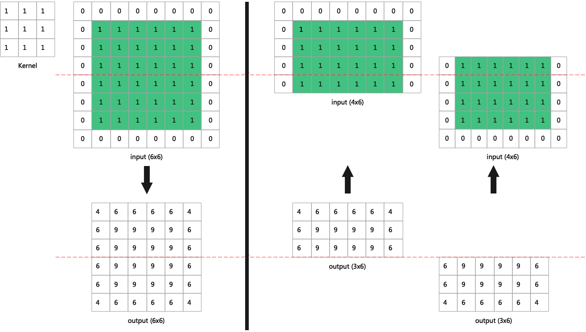
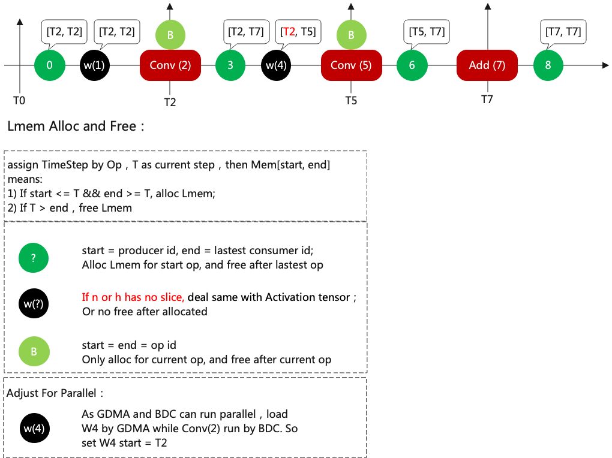
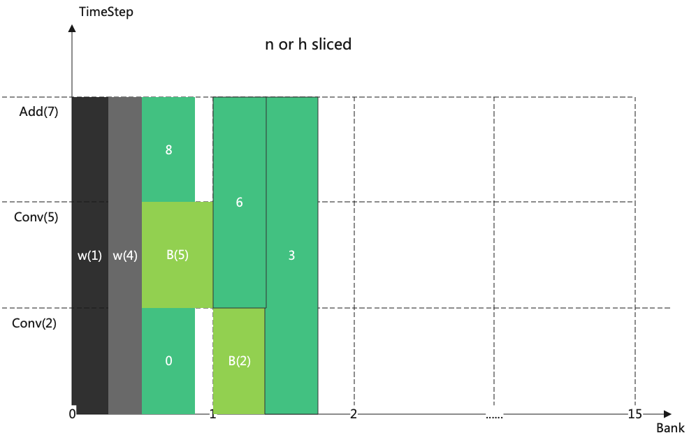

LayerGroup
============

Basic Concepts
--------------

The memory in a Tensor Computing Processor can be categorized into global memory (GMEM) and local memory (LMEM).

Usually the global memory is very large (e.g., 4GB) while the local memory is quite limited (e.g., 16MB).

In general, the amount of data and computation of neural network model is very large, so the OP of each layer usually needs to be sliced and put into local memory for operation, and then the result is saved to global memory.

LayerGroup enables as many OPs as possible to be executed in local memory after being sliced, so that it can avoid too many copy operations between local and global memory.

Problem to be solved:
   How to keep Layer data in the limited local memory for computing, instead of repeatedly making copies between local and global memory.
Basic idea:
   Slicing the N and H of activation, make the operation of each layer always in local memory, as shown in the figure (:ref:`lg_slice`).

.. _lg_slice:
.. figure:: ../assets/lg_slice.png
   :height: 9.5cm
   :align: center

   Network slicing example

BackwardH
--------------

When slicing along the axis of H, the input and output H of most layers are consistent. But for Conv, Pool, etc., additional calculations are needed.

Take Conv for example, as shown in the figure (:ref:`backward_h`).

.. _backward_h:

   Convolutional BackwardH example

Dividing the Mem Cycle
----------------------

How to divide the group? First of all, list the lmem needed for each layer, which can be broadly classified into three categories:

1. Activation Tensor, which is used to save the input and output results, and is released directly after there is no user.
2. Weight, used to save the weights, released when there is no slice. Otherwise, always resides in the lmem.
3. Buffer, used for Layer operation to save intermediate results, released after use.

Then configure the ids in a breadth-first manner, for example, as shown in the figure (:ref:`lg_lmem`).

.. _lg_lmem:
.. figure:: ../assets/lg_lmem.png
   :height: 9.5cm
   :align: center

   LMEM's ID assignment

Then configure the period as shown in (:ref:`lg_timestep`).

.. _lg_timestep:

   TimeStep assignment

Details of configuring period are as follows:

- [T2,T7], which means that lmem should be requested at the beginning of T2 and released at the end of T7.
- The original period of w4 should be [T5,T5], but it is corrected to [T2,T5], because w4 can be loaded at the same time when T2 does the convolution operation.
- When N or H is sliced, weight does not need to be reloaded and its end point will be corrected to positive infinity.

LMEM Allocation
---------------

When the slice exists in N or H, weight is resident in LMEM so that each slice can use it.

At this point weight will be allocated first, as shown in the figure (:ref:`lg_nh_alloc`)

.. _lg_nh_alloc:

   Allocation in the case of slice

When there is no slice, weight and activation are handled the same way, and released when not in use.

The allocation process at this point is shown in the figure (:ref:`lg_alloc`).

.. _lg_alloc:
.. figure:: ../assets/lg_alloc.png
   :height: 9.5cm
   :align: center

   Allocation in the case of no slice

Then the LMEM allocation problem can be converted into a problem of how to place these squares (note that these squares can only be moved left and right, not up and down).

In addition, LMEM allocation is better not to cross the bank.

The current strategy is to allocate them in order of op, giving priority to those with long timestep, followed by those with large LMEM.

Divide the optimal Group
------------------------

.. figure:: ../assets/lg_step.png
   :align: center

   Group process

At present, the group is divided from the tail to the head. N will be sliced first till the smallest unit, then H when it is needed.

When the network is very deep, because Conv, Pool and other operators have duplicate computation parts, too much H slice leads to too many duplicate parts.

In order to avoid too much duplication, it is considered as failed when the input of layer after backward has duplicated part of h_slice > h/2.

Example: if the input has h = 100, and it is sliced into two inputs, h[0, 80) and h[20, 100), then the duplicate part is 60. It is considered as failed. The repeated part is 40 when two inputs are h[0, 60) and h[20, 100), which is considered as success.
