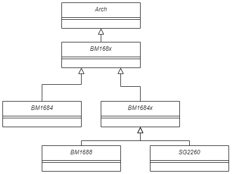

CodeGen
============

The code generation (CodeGen) in TPU-MLIR is the final step of BModel creation. Its purpose is to convert MLIR files into the final BModel. This chapter introduces the CodeGen of models/operators in this project.

Main Work
----------------
The purpose of CodeGen is to convert the MLIR file into the BModel file.
This process will execute the CodeGen interface of each op to generate cmdbuf, and use the Builder module to generate the final BModel in flatbuffers format.

Workflow
----------------
The general process of CodeGen can be divided into three parts: instruction generation, instruction storage and instruction retrieval.

  Instruction generation: Encapsulate the back-end functions of different processors into classes, execute the op's CodeGen interface, and generate corresponding instructions (binary code);

  Instruction storage: Store the instruction (binary code) in the specified data structure through store_cmd;

  Instruction retrieval: After the binary codes of all ops are generated, the compiler will call the function encapsulated in the BM168X series class to retrieve the instructions, and finally generate the Bmodel.

The workflow is as follows:

.. raw:: latex

   \newpage

.. figure:: ../assets/codegen_3.png
   :height: 4cm
   :align: center

   CodeGen Workflow

The following introduces the data structures required in the CodeGen process:

The instructions differ based on the processor's engine, e.g., 1684 has GDMA and TIU, while new architecture processors like bm1690 have sdma, cdma, etc. Using the most common engines, BDC (later renamed to TIU) and GDMA, as examples:

.. code-block:: shell

    std::vector<uint32_t> bdc_buffer;
    std::vector<uint32_t> gdma_buffer;
    uint32_t gdma_total_id = 0;
    uint32_t bdc_total_id = 0;
    std::vector<uint32_t> gdma_group_id;
    std::vector<uint32_t> bdc_group_id;
    std::vector<uint32_t> gdma_bytes;
    std::vector<uint32_t> bdc_bytes;
    int cmdid_groupnum = 0;
    CMD_ID_NODE *cmdid_node;
    CMD_ID_NODE *bdc_node;
    CMD_ID_NODE *gdma_node;

bdc_buffer: stores bdc instructions

gdma_buffer: stores gdma instructions

gdma_total_id: The total number of gdma instructions stored

bdc_total_id: The total number of bdc instructions stored

gdma_bytes: number of gdma instruction bytes

bdc_bytes: bdc instruction byte number

BM168X and Related classes in TPU-MLIR
------------------------------------------------
These related classes are defined in the folder `tpu-mlir/include/tpu_mlir/Backend`. Their purpose is to encapsulate different processor backends, thereby isolating the backend from the CodeGen process.

The inheritance relationship is as follows:

.. raw:: latex

   \newpage

   BM168X and its related class inheritance relationships in TPU-MLIR

Only one class exists during a single run (singleton design pattern). When this class is initialized, it undergoes: reading the backend dynamic link library, loading functions (setting backend function pointers), initializing instruction data structures, and setting some hardware-related parameters like NPU_NUM, L2_SRAM starting address, etc.

Backend Function Loading
--------------------------------
The backend is placed as a dynamic library in the TPU-MLIR project, specifically at `third_party/nntoolchain/lib/libbackend_xxx.so`.
The loading method of the backend function is: first define the function pointer, and then load the dynamic library so that the function pointer points to the function in the dynamic library.

Take the synchronization function tpu_sync_all as an example, as we will add multi-core support later, it needs to be well-defined in the relevant backend cmodel library.
  1. Make sure to keep the function name and parameters consistent: `typedef void (*tpu_sync_all)();
  2. Add this function member within the class: `tpu_sync_all, dl_tpu_sync_all;
  3. Add the macro, CAST_FUNCTION(tpu_sync_all), to the implementation of this type of load_functions function; This macro can point dl_tpu_sync_all to the function in the dynamic library.
After obtaining an instance of this class, we can use the functions in the dynamic library.

Backend `store_cmd`
--------------------

The function `store_cmd` in the backend refers to the process where the compiler calls the operators and saves the configured instructions to the designated space.
The key function in the backend is in `store_cmd.cpp`; for example, `cmodel/src/store_cmd.cpp`; `cmodel/include/store_cmd.h`.
`store_cmd` has a series of EngineStorer and CmdStorer classes:

  1. EngineStoreInterface (interface class), GDMAEngineStorer, BDEngineStorer and other specific classes that inherit from the EngineStoreInterface interface, EngineStorerDecorator (decoration class interface),
  VectorDumpEngineStorerDecorator and other specific decoration classes that inherit from EngineStorerDecorator
  2. CmdStorerInterface (interface), ConcretCmdStorer inherited from the interface, StorerDecorator: decoration interface, VectorDumpStorerDecorator specific decoration class.

Relationship and Logic Among the Classes:
  1. Using the singleton design pattern, there is only one 'ConcretCmdStorer' class in 'store_cmd', which will store all 'EngineStorer' classes. When different engines are called, different 'EengineStorers' will be called, as shown in the code below.

    .. code-block:: cpp

        virtual void store_cmd(int engine_id, void *cmd, CMD_ID_NODE *cur_id_node, int port) override
        {
            switch (engine_id)
            {
            case ENGINE_BD:
            case ENGINE_GDMA:
            case ENGINE_HAU:
            case ENGINE_SDMA:
                port = 0;
                break;
            case ENGINE_CDMA:
                ASSERT(port < CDMA_NUM);
                break;
            case ENGINE_VSDMA:
                engine_id = ENGINE_SDMA;
                break;
            default:
                ASSERT(0);
                break;
            }
            return this->get(engine_id, port)->store(cmd, cur_id_node);
        }

  2. The function of 'EngineStorer' is to parse commands. 'VectorDumpEngineStorerDecorator' executes the 'store' function and 'take_cmds' function in the 'EngineStorer' class to store all instructions in `output_`.

    .. code-block:: cpp

        class VectorDumpEngineStorerDecorator : public EngineStorerDecorator
        {
        private:
            std::vector<uint32_t> *&output_;

            void take_cmds()
            {
                auto cmds = EngineStorerDecorator::get_cmds();
                (*output_).insert((*output_).end(), cmds.begin(), cmds.end());
            }

        public:
            VectorDumpEngineStorerDecorator(ComponentPtr component, std::vector<uint32_t> **output)
                : EngineStorerDecorator(component), output_(*output) {}

            virtual void store(void *cmd, CMD_ID_NODE *cur_id_node) override
            {
                EngineStorerDecorator::store(cmd, cur_id_node);
                if (!enabled_)
                    return;
                this->take_cmds();
            }

            virtual void store_cmd_end(unsigned dep) override
            {
                EngineStorerDecorator::store_cmd_end(dep);
                this->take_cmds();
            }
        };

