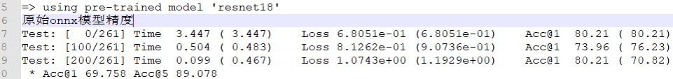
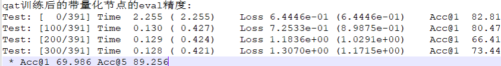
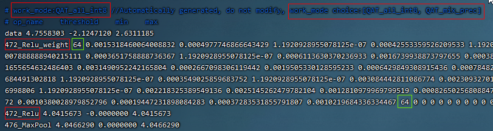
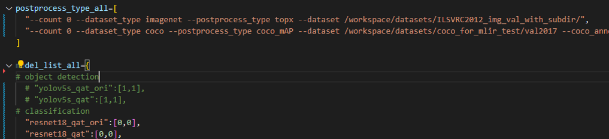

Quantzation aware training
============================

Basic Principles
--------------------
Compared with the precision loss caused by post-training quantization because it is not the global optimal, QAT quantization perception training can achieve the global optimal based on loss optimization and reduce the quantization precision loss as far as possible. The basic principle is as follows:In fp32 model training, weight and activation errors caused by inference quantization are introduced in advance, and task loss is used to optimize learnable weight and quantized scale and zp values on the training set. Even under the influence of this quantization error, task loss can reach relatively low loss value through learning.In this way, when the real inference deployment of quantization later, because the error introduced by quantization has already been well adapted in the training, as long as the inference and the calculation of training can be guaranteed to be completely aligned, theoretically, there will be no precision loss in the inference quantization.

tpu-mlir QAT implementation scheme and characteristics
-------------------------------------------------------
Main body flow
~~~~~~~~~~~~~~~~~~~~~~~~~~~~~~~~~~~~~~~~~~~~~~~~~~
During user training, model QAT quantization API is called to modify the training model:In reasoning, after op fusion, a pseudo-quantization node is inserted before the input (including weight and bias) of the op that needs to be quantized (the quantization parameters of this node can be configured, such as per-chan/layer, symmetry or not, number of quantization bits, etc.), and then the user uses the modified model for normal training process. After completing a few rounds of training,Call the transformation deployment API interface to convert the trained model into the FP32-weighted onnx model, extract the parameters from the pseudo-quantization node and export them to the quantization parameter text file. Finally, input the optimized onnx model and the quantization parameter file into the tpu-mlir tool chain, and convert and deploy according to the post-training quantization method mentioned above.

Features of the Scheme
~~~~~~~~~~~~~~~~~~~~~~~~~~~~~~~~~~~~~~~~~~~~~~~~~~~
Feature 1: Based on pytorch;QAT is an additional finetune part of the training pipeline, and only deep integration with the training environment can facilitate users to use various scenarios. Considering pytorch has the most extensive usage rate, the current scheme is based on pytorch only. If qat supports other frameworks in the future, the scheme will be very different.Its trace and module replacement mechanisms are deeply dependent on the support of the native training platform.

Feature 2: Users basically have no sense;Different from earlier schemes that require deep manual intervention in model transformation, this scheme is based on pytorch fx which helps automatically model tracing, pseudo-quantization node insertion, custom module replacement and other operations. In most cases, users can complete model transformation with minus change of the default configuration.

Feature 3: Based on the open-sourced mqbench training framework by SenseTime, SOPHGO-mq include particular quantization configuration for SOPHGO ASICs.

Installation Method
---------------------------------------------------

SOPHGO-mq is recommanded to be used in docker container, the docker image can be pulled by:

.. code-block:: shell

    docker pull sophgo/tpuc_dev:v3.3-cuda

The docker image includes pytorch 2.3.0 and cuda 12.1, and intergrated the environment for tpu-mlir.

Install with setup package
~~~~~~~~~~~~~~~~~~~~~~~~~~~~~~~~~~~~~~~~~~~~~~~~~~~
Download setup package from download area of open-source project https://github.com/sophgo/sophgo-mq.git, for example, sophgo_mq-1.0.1-cp310-cp310-linux_x86_64.whl, install with:

.. code-block:: shell

    pip3 install sophgo_mq-1.0.1-cp310-cp310-linux_x86_64.whl

Install from source
~~~~~~~~~~~~~~~~~~~~~~~~~~~~~~~~~~~~~~~~~~~~~~~~~~~
1、Run the command to get the latest code on github: git clone https://github.com/sophgo/sophgo-mq.git

2、Execute after entering the SOPHGO-mq directory:

.. code-block:: shell

       pip install -r requirements.txt  #Note: torch version 2.3.0 is currently required
       python setup.py install

3、Execute python -c 'import sophgo_mq' and if it does not return any errors, it indicates that the installation is correct. If there is an error with the installation, execute pip uninstall sophgo_mq to uninstall it and then try again.

Basic Steps
------------------------------------------------
Step 1: Interface import and model prepare
~~~~~~~~~~~~~~~~~~~~~~~~~~~~~~~~~~~~~~~~~~~~~~~~

Add the following python module import interface to the training file:

.. code-block:: python

    import torch
    import torchvision.models as models
    from sophgo_mq.prepare_by_platform import prepare_by_platform   # init module
    from sophgo_mq.utils.state import enable_quantization, enable_calibration    #calibration and quantization switch
    from sophgo_mq.convert_deploy import convert_deploy                          #deploy interface
	import tpu_mlir			# with tpu-mlir introduced, bmodel can be generated in SOPHGO-mq environment
	from tools.model_runner import mlir_inference  #tpu-mlir inference module, accuracy can be checked by tpu-mlir inference module

    #Use the pre-trained ResNet18 model from the torchvision model zoo.
    model = models.__dict__['resnet18'](pretrained=True)

    #1.Trace the model, using a dictionary to specify the processor type as BM1690 and the quantization mode as weight_activation. In this quantization mode, both weights and activations are quantized. Specify the quantization strategy for CNN type.
    extra_prepare_dict = {
    'quant_dict': {
                    'chip': 'BM1690',
                    'quantmode': 'weight_activation',
                    'strategy': 'CNN',
                    },
    }
    model_quantized = prepare_by_platform(model, prepare_custom_config_dict=extra_prepare_dict)

When the above interface selects the BM1690 processor, the default quantization configuration is as shown in the following figure:

.. figure:: ../assets/bm1690_default_para.png
   :align: center

The meanings of the quantization configuration items in the above figure, from top to bottom, are as follows:

1、The weight quantization scheme is: per-chan symmetric 8bit quantization, the scale coefficient is not power-of-2, but arbitrary

2、The activation quantization scheme is per-layer symmetric 8bit quantization

3/4、The weights and activation pseudo-quantization schemes are: LearnableFakeQuantize, namely LSQ algorithm

5/6、The dynamic range statistics and scale calculation scheme of weights are as follows: MinMaxObserver, and the activation is EMAMinMaxObserver with moving average

Step 2: Calibration and quantization training
~~~~~~~~~~~~~~~~~~~~~~~~~~~~~~~~~~~~~~~~~~~~~~~~~~~~

.. code-block:: python

    #1.Turn on the calibration switch to allow the pytorch observer object to collect the activation distribution and calculate the initial scale and zp when reasoning on the model
    enable_calibration(model_quantized)
    # iterations of calibration
    for i, (images, _) in enumerate(cali_loader):
        model_quantized(images)   #All you need is forward reasoning
    #3.After the pseudo-quantization switch is turned on, the quantization error will be introduced by invoking the QuantizeBase subobject to conduct the pseudo-quantization operation when reasoning on the model
    enable_quantization(model_quantized)
    # iterations of training
    for i, (images, target) in enumerate(train_loader):
        #Forward reasoning and calculation loss
        output = model_quantized(images)
        loss = criterion(output, target)
        #Back to back propagation gradient
        loss.backward()
        #Update weights and pseudo-quantization parameters
        optimizer.step()

Step 3: Export tuned fp32 model
~~~~~~~~~~~~~~~~~~~~~~~~~~~~~~~~~

Set reasonable training hyperparameters. The suggestions are as follows:
      --epochs=1:About 1~3 can be；

      --lr=1e-4:The learning rate should be the learning rate when fp32 converges, or even lower；

      --optim=sgd:The default is sgd；

.. code-block:: python

    #Here the batch-size can be adjusted according to the need, do not have to be consistent with the training batch-size
    input_shape={'input': [4, 3, 224, 224]}
    # Specify the exported model type as CNN.
    net_type='CNN'
    #4. Before export, the conv+bn layer is fused (conv+bn is true fusion when train is used in the front), and the parameters in the pseudo-quantization node are saved to the parameter file, and then removed。
    convert_deploy(model_quantized, net_type, input_shape)

Step 4: Initiate the training
~~~~~~~~~~~~~~~~~~~~~~~~~~~~~~~~
The transformation deployment to sophg-tpu hardware was completed using the model_transform.py and model_deploy.py scripts of tpu-mlir；

By introducing tpu-mlir in SOPHGO-mq, user can use tpu-mlir inference interface to simulate the running of model on ASIC. By using this interface, model is generated and while trainning. User can replace traditional evaluation module with tpu-mlir inference, input and output to this interface are in numpy format, example code is as following:

.. code-block:: python

    import tpu_mlir
    from tools.model_runner import mlir_inference
    ...
    for i, (images, target) in enumerate(bmodel_test_loader):
        images = images.cpu()
        target = target.cpu()
        inputs['data'] = images.numpy()
        output = mlir_inference(inputs, mlir_model_path, dump_all = False)
        output = torch.from_numpy(list(output.values())[0])
        loss = criterion(output, target)

Use Examples-resnet18
------------------------------
Run application/imagenet_example/main.py to qat train resent18 as follows:

.. code-block:: shell

    CUDA_VISIBLE_DEVICES=0 python application/imagenet_example/main.py \
        --arch=resnet18 \
        --batch-size=128 \
        --lr=1e-4 \
        --epochs=1 \
        --optim=sgd \
        --cuda=0 \
        --pretrained \
        --evaluate \
        --train_data=/home/data/imagenet \
        --val_data=/home/data/imagenet \
        --chip=BM1690 \
        --quantmode=weight_activation \
        --deploy_batch_size=10 \
        --pre_eval_and_export \
        --output_path=./

The command output log above contains the following(:ref:`ori_onnx_acc`) accuracy information of the original model (it can be compared with the accuracy on the official webpage to confirm the correct training environment, such as the official nominal name:Acc@1 69.76 Acc@5 89.08,The link is:https://pytorch.apachecn.org/#/docs/1.0/torchvision_models）:

.. _ori_onnx_acc:

   Original onnx model accuracy

After completing the qat training, the eval accuracy of the running band quantization node, theoretically the int8 accuracy of the tpu-mlir should be exactly aligned with this, as shown in the figure(:ref:`r18_qat_train_acc`) below:

.. _r18_qat_train_acc:

   resnet18 qat training accuracy

The final output directory is as follows(:ref:`r18_qat_output_dir`):

.. _r18_qat_output_dir:
.. figure:: ../assets/r18_qat_output_dir.png
   :align: center

   resnet18 qat training output model directory

The resnet18_ori.onnx in the figure above is the original pytorch model transferred onnx file. This resnet18_ori.onnx is quantified by PTQ with the tpu-mlir tool chain, and its symmetry and asymmetry quantization accuracy are measured as the baseline and resnet18_cali_table_from_sophgo_mq is the exported quantization parameter file with the following contents(:ref:`r18_qat_cali_table`):

.. _r18_qat_cali_table:

   resnet18 Sample qat quantization parameter table

a、In the red box of the first row in the figure above, work_mode is QAT_all_int8, indicating int8 quantization of the whole network. It can be selected from [QAT_all_int8, QAT_mix_prec], and quantization parameters such as symmetry and asymmetry will also be included。

b、In the figure above, 472_Relu_weight represents the QAT-tuned scale and zp parameters of conv weight. The first 64 represents the scale followed by 64, and the second 64 represents the zp followed by 64.tpu-mlir imports the weight_scale attribute of the top weight. If this attribute exists in the int8 lowering time, it is directly used. When it does not, it is recalculated according to the maximum lowering value。

c、In the case of asymmetric quantization, min and max above are calculated according to the scale, zp, qmin and qmax tuned by the activated qat. threshold is calculated according to the activated scale in the case of symmetric quantization, and both are not valid at the same time。

Tpu-mlir QAT test environment
--------------------------------
QAT model is targeted to SOPHGO ASIC, accuracy of the model can be verified with end to end verification program, usually it is deployed on processor. Within development environment, accuracy can be evaluated by tpu-mlir inference interface for convinence, sample code as following:

Adding a cfg File
~~~~~~~~~~~~~~~~~~~~~~~~~~~~~~~~
Go to the tpu-mlir/regression/eval directory and add {model_name}_qat.cfg to the qat_config subdirectory. For example, the contents of the resnet18_qat.cfg file are as follows:

.. code-block:: shell

    dataset=${REGRESSION_PATH}/dataset/ILSVRC2012
    test_input=${REGRESSION_PATH}/image/cat.jpg
    input_shapes=[[1,3,224,224]]  #Modified according to the actual shape
    #The following is the image preprocessing parameters, fill in according to the actual situation
    resize_dims=256,256
    mean=123.675,116.28,103.53
    scale=0.0171,0.0175,0.0174
    pixel_format=rgb
    int8_sym_tolerance=0.97,0.80
    int8_asym_tolerance=0.98,0.80
    debug_cmd=use_pil_resize

You can also add {model_name}_qat_ori.cfg file: Quantify the original pytorch model as baseline, which can be exactly the same as {model_name}_qat.cfg above；

Modify and execute run_eval.py
~~~~~~~~~~~~~~~~~~~~~~~~~~~~~~~
In the following figure, fill in more command strings of different precision evaluation methods in postprocess_type_all, such as the existing imagenet classification and coco detection precision calculation strings in the figure;In the following figure, model_list_all fills in the mapping of the model name to the parameter, for example:resnet18_qat's [0,0], where the first parameter represents the first command string in postprocess_type_all, and the second parameter represents the first directory in qat_model_path (separated by commas):

After configuring the postprocess_type_all and model_list_all arrays as needed, execute the following run_eval.py command:

.. code-block:: shell

    python3 run_eval.py
        --qat_eval        #In qat validation mode, the default is to perform regular model accuracy testing using the configuration in the tpu-mlir/regression/config
        --fast_test       #Quick test before the official test (only test the accuracy of 30 graphs) to confirm that all cases can run
        --pool_size 20    #By default, 10 processes run. If the machine has many idle resources, you can configure more
        --batch_size 10   #qat exports the batch-size of the model. The default is 1
        --qat_model_path '/workspace/classify_models/,/workspace/yolov5/qat_models'  #Directory of the qat model,For example, the value of model_list_all[' resnet18_qat '][1] is 0, indicating the first directory address of the model target in the qat_model_path:/workspace/classify_models/
        --debug_cmd use_pil_resize      #Use pil resize

After or during the test, view the model_eval script output log file starting with log\_ in the subdirectory named {model_name}_qat,For example, log_resnet18_qat.mlir indicates the log of testing resnet18_qat.mlir in the directory.log_resnet18_qat_bm1684x_tpu_int8_sym.mlir Indicates the test log of resnet18_qat_bm1684x_tpu_int8_sym.mlir in this directory.

Use Examples-yolov5s
------------------------
Execute the following command in application/yolov5_example to start QAT Training:

.. code-block:: shell

    CUDA_VISIBLE_DEVICES=0 python train.py \
        --cfg=yolov5s.yaml \
        --weights=yolov5s.pt \
        --data=coco.yaml \
        --epochs=5 \
        --output_path=./ \
        --batch-size=8 \
        --quantize \

After the training is completed, the same test and transformation deployment process as resnet18 before can be adopted。

Use Examples-bert
-------------------------
Execute the following command in application/nlp_example to start QAT Training:

.. code-block:: shell

    CUDA_VISIBLE_DEVICES=0 python qat_bertbase_questionanswer.py
