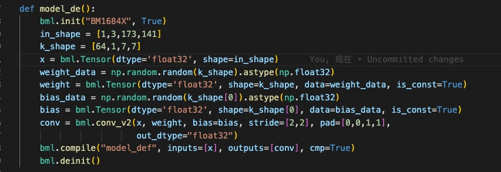

TpuLang Interface
==================

This chapter mainly introduces the process of converting models using TpuLang.

Main Work
-----------

TpuLang provides mlir external interface functions. Users can directly build their own network through Tpulang, and convert the model to the Top layer (chip-independent layer) mlir model (the Canonicalize part is not included, so the generated file name is "\*_origin.mlir"). This process will create and add operators (Op) one by one according to the input interface functions. Finally, a mlir model file and a corresponding weight npz file will be generated.

Work Process
--------------------

1. Initialization: Set up the platform and create the graph.

2. Add OPs: cyclically add OPs of the model

    * The input parameters are converted to dict format;

    * Inference output shape, and create output tensor;

    * Set the quantization parameters of the tensor (scale, zero_point);

    * Create op(op_type, inputs, outputs, params) and insert it into the graph.

3. Set the input and output tensor of the model. Get all model information.

4. Initialize TpuLangConverter (initMLIRImporter)

5. generate_mlir

    * Create the input op, the nodes op in the middle of the model and the return op in turn, and add them to the mlir text (if the op has weight, an additional weight op will be created)

6. Output

    * Convert the generated text to str and save it as ".mlir" file

    * Save model weights (tensors) as ".npz" files

7. End: Release the graph.

The workflow of TpuLang conversion is shown in the figure (:ref:`tpulang_convert`)。

.. _tpulang_convert:
.. figure:: ../assets/tpulang_convert.png
   :align: center

   TpuLang conversion process

Supplementary Note:
   * The op interface requires:

      - The input tensor of the op (i.e., the output tensor of the previous operator or the graph input tensor and coeff);

      - According to the parameters extracted by the interface, the output_shape is obtained by inference (i.e., shape_inference is required);

      - attrs extracted from the interface. Attrs will be set by MLIRImporter as attributes corresponding to the ones defined in TopOps.td;

      - If the interface includes quantization parameters (i.e., scale and zero_point), the tensor corresponding to this parameter needs to set (or check) the quantization parameters.

      - Return the output tensor(tensors) of the op.

   * After all operators are inserted into the graph and the input/output tensors of the graph are set, the conversion to mlir text will start. This part is implemented by TpuLangConverter.

   * The conversion process of TpuLang Converter is the same as onnx front-end part. Please refer to (:doc:`../05_frontend`).

Operator Conversion Example
---------------------------

This section takes the Conv operator as an example to convert a single Conv operator model to Top mlir. The original model definition is shown in the figure (:ref:`tpulang_conv_op`)

.. _tpulang_conv_op:

   Single Conv Model

The conversion process:

1. Interface definition

   The conv_v2 interface is defined as follows:

      .. code-block:: python

         def conv_v2(tensor_i,
                     weight,
                     bias = None,
                     stride = None,
                     dilation = None,
                     pad = None,
                     group = 1,
                     input_zp = None,
                     weight_zp = None,
                     out_dtype = None,
                     out_name = None):
            # pass

   Parameter Description

   * tensor_i: Tensor type, indicating the input Tensor with 4-dimensional NCHW format.
   * weight: Tensor type, representing the convolution kernel Tensor with 4-dimensional [oc, ic, kh, kw] format. oc indicates the number of output channels, ic indicates the number of input channels, kh is kernel_h, and kw is kernel_w.
   * bias: Tensor type, indicating the bias Tensor. There is no bias when it is None. Otherwise, the shape is required to be [1, oc, 1, 1].
   * dilation: List[int], indicating the size of holes. None means dilation equals [1,1]. Otherwise, the length is required to be 2 and the order of List is [length, width].
   * pad: List[int], indicating the padding size, if it is None, no padding is applied. Otherwise, the length is required to be 4. The order in the List is [Up, Down, Left, Right].
   * stride: List[int], indicating the step size, [1,1] when it is None. Otherwise, the length is required to be 2 and the order in the List is [length, width].
   * groups: int type, indicating the number of groups in the convolutional layer. If ic=oc=groups, the convolution is depthwise conv
   * input_zp: List[int] type or int type, indicating the input offset. If None, input_zp equals 0. Otherwise, the length of List is required to be ic.
   * weight_zp: List[int] type or int type, indicating the convolution kernel offset. If None, weight_zp equals 0. Otherwise, the length of list is required to be ic, where ic represents the number of input channels.
   * out_dtype: string type or None, indicating the type of the output Tensor. When the input tensor type is float16/float32, None indicates that the output tensor type is consistent with the input. Otherwise,  None means int32. Value range: /int32/uint32/float32/float16.
   * out_name: string type or None, indicating the name of the output Tensor. When it is None, the name will be automatically generated.

  Define the Top.Conv operator in TopOps.td, the operator definition is as shown in the figure (:ref:`conv_top_def`)

.. _conv_top_def:
.. figure:: ../assets/convop_def.png
   :align: center
   :height: 15cm

   Conv Operator Definition

1. Build Graph

  * Initialize the model: create an empty Graph.

  * Model input: Create input tensor x given shape and data type. A tensor name can also be specified here.

  * conv_v2 interface:

      - Call the conv_v2 interface with specified input tensor and input parameters.

      - Inference output shape, and generate output tensor

         .. code-block:: python

            def _shape_inference():
               kh_ext = dilation[0] * (weight.shape[2] - 1) + 1
               kw_ext = dilation[1] * (weight.shape[3] - 1) + 1
               oh = (input.shape[2] + pad[0] + pad[1] - kh_ext) // stride[0] + 1
               ow = (input.shape[3] + pad[2] + pad[3] - kw_ext) // stride[1] + 1
               return [input.shape[0], weight.shape[0], oh, ow]
            output = Tensor(_shape_inference(), dtype=out_dtype, name=out_name)

      - attributes, pack the input parameters into attributes defined by (:ref:`conv_top_def`)

         .. code-block:: python

            attr = {
               "kernel_shape": ArrayAttr(weight.shape[2:]),
               "strides": ArrayAttr(stride),
               "dilations": ArrayAttr(dilation),
               "pads": ArrayAttr(pad),
               "do_relu": Attr(False, "bool"),
               "group": Attr(group)
            }

      - Insert conv op. Insert Top.ConvOp into Graph.

      - return the output tensor

  * Set the input of Graph and output tensors.

3. init_MLIRImporter:

  Get the corresponding input_shape and output_shape from shapes according to input_names and output_names. Add model_name, and generate the initial mlir text MLIRImporter.mlir_module, as shown in the figure (:ref:`origin_mlir`).

.. _origin_top_mlir:
.. figure:: ../assets/origin_mlir.png
   :align: center

   Initial Mlir Text

3. generate_mlir

   * Build input op, the generated Top.inputOp will be inserted into MLIRImporter.mlir_module.

   * Call Operation.create to create Top.ConvOp, and the parameters required by the create function are:

      - Input op: According to the interface definition, the inputs of the Conv operator include input, weight and bias. The inputOp has been created, and the op of weight and bias is created through getWeightOp().

      - output_shape: get output shape from the output tensor stored in the Operator.

      - Attributes: Get attributes from Operator, and convert attributes to Attributes that can be recognized by MLIRImporter

      After Top.ConvOp is created, it will be inserted into the mlir text

   * Get the corresponding op from operands according to output_names, create return_op and insert it into the mlir text. By this point, the generated mlir text is as shown (:ref:`tpulang_mlir_txt`).

.. _tpulang_mlir_txt:
.. figure:: ../assets/tpulang_mlir_txt.jpeg
   :align: center

   Full Mlir Text

4. Output

  Save the mlir text as Conv_origin.mlir and the weights in tensors as Conv_TOP_F32_all_weight.npz.
