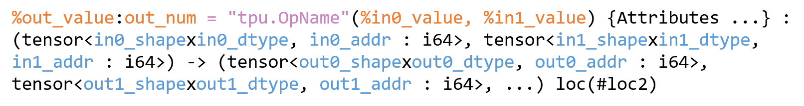
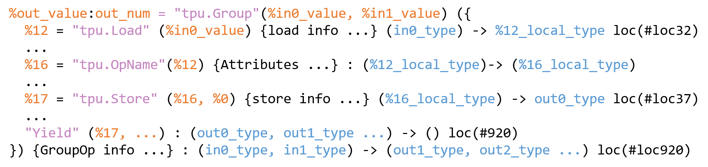
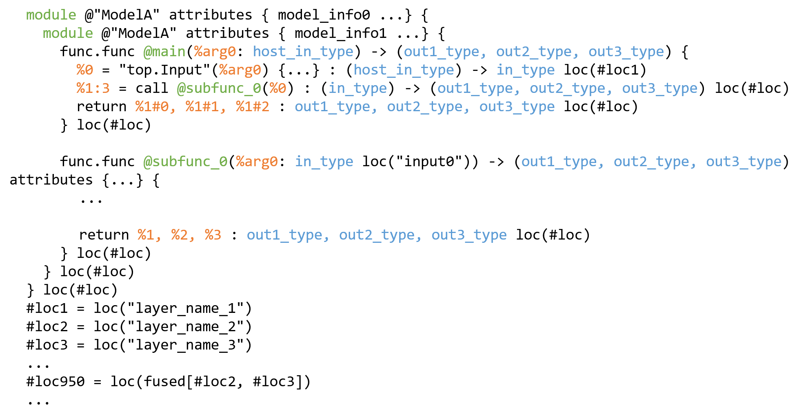
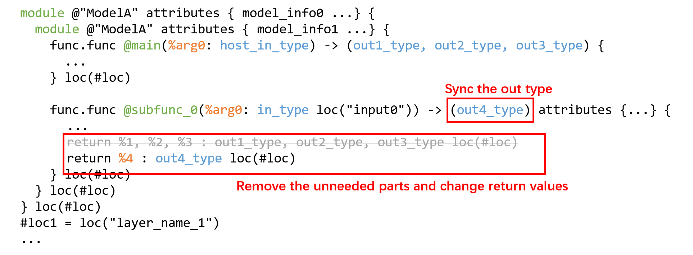
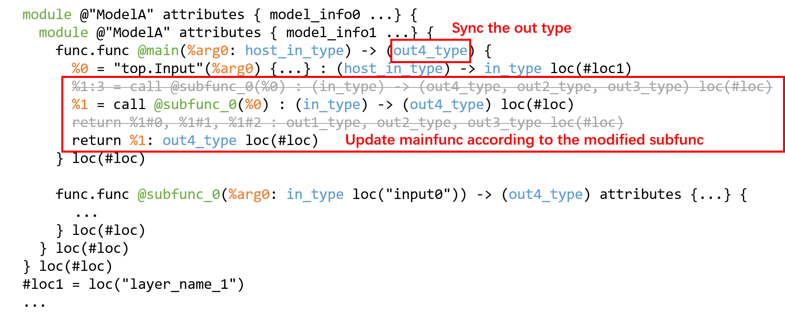
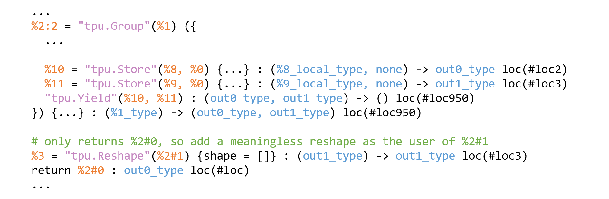

final.mlir Truncation Method
=================================

`final.mlir`, as the input file of `codegen`, is the final intermediate expression (`IR`) generated by the model after all hardware-independent and hardware-related optimizations. Because it contains hardware-related information, the structure is much more complicated than the previous `IR`.

When adapting the model, sometimes the `MLIR` file of the `Tpu` layer is inconsistent with the `cmodel` inference result of `bmodel`. In order to quickly locate the problem, in addition to using the `bmodel_checker.py` tool to compare the output of each layer, you can also manually truncate the `final.mlir` file to generate a truncated model.

Therefore, this chapter will analyze the structure of `final.mlir` and explain how to truncate the model based on `final.mlir` to facilitate subsequent problem location.

* Recommended `IDE`: VSCode.
* Plugin: MLIR.

`final.mlir` structure introduction
-------------------
The components of a single operator in `final.mlir` are as follows:

  `final.mlir` single operator example

Note:

* `value` represents the input/output of the operator in `SSA` form

* out_num: represents the number of outputs. If it is a single-output operator, `:out_num` will not be displayed.

* For the value of a multi-output operator, the user will refer to it in the `%value#in_index` way (`index` starts from 0)

* Each input/output value has a corresponding `Tensor type`.

* A complete `Tensor type` contains shape, data type, and global memory address (`Gmem addr`).

In addition to the single operator, `final.mlir` also contains `tpu.Group` operators generated after `LayerGroup`, which contain multiple intermediate operators. These operators all complete calculations on `Lmem`. `tpu.Group` controls input data loading and output data storage through `tpu.Load` and `tpu.Store`, so the `Tensor type` of the intermediate operator does not have `Gmem addr`:

  `tpu.Group` example

* `local_type` refers to `Tensor type` without `Gmem addr`.

* `loc(#loc32)` at the end of the operator refers to the `location` of a layer output of the model, that is, the number of the output. The corresponding output name can be found at the end of the `final.mlir` file according to the number.
* `Yield` represents the output set of `tpu.Group`.

The structure of the complete `final.mlir` file is as follows:

  `final.mlir` structure example

* The double-layer `module` contains `mainfunc` and `subfunc`, and `mainfunc` and `subfunc` have a calling relationship.

* `arg0` in mainfunc refers to the input of the `host` side, so `host_in_type` does not have `Gmem addr`.

* The `location` of multiple outputs will be added to the end of the `final.mlir` file, and the inclusion relationship with each specific output `location` will be expressed, such as `#loc950 = loc(fused[#loc2, #loc3])`.

`final.mlir` Truncation Process
--------------------------------

1. Modify `subfunc`. Delete the internal structure of `subfunc`, and match the return value `value` with the corresponding `type`:

  Truncation process Step1

2. Synchronize the calling method of `subfunc` in `mainfunc` (`value` and `type`):

  Truncation process Step2

3. Check whether `bmodel` is modified successfully. First, you can execute the `codegen` step to see if `bmodel` can be generated normally (please replace `<...>` with the actual file or parameter):

.. code-block:: shell

  $ tpuc-opt <final.mlir> --codegen="model_file=<bmodel_file> embed_debug_info=<true/false> model_version=latest" -o /dev/null

When profile is needed for performance analysis, `embed_debug_info` is set to `true`.

4. Use `model_tool` to check whether the input and output information of the `bmodel` meets expectations:

.. code-block:: shell

  $ model_tool --info <bmodel_file>

Note:

1. When truncating, the model structure is deleted in units of operators, and each `tpu.Group` should be regarded as an operator.

2. Modifying only the function return value without deleting the redundant model structure may cause the output result to be wrong. This is because each activated `Gmem addr` allocation will be reused according to the activation life cycle. Once the life cycle ends, it will be allocated to the next appropriate activation, causing the data at the address to be overwritten by subsequent operations.

3. It is necessary to ensure that each output of `tpu.Group` has `user`, otherwise the `codegen` step may report an error. If you do not want to output a certain result of `tpu.Group` and it is inconvenient to delete it completely, you can add a meaningless `tpu.Reshape` operator to the output without user, and match it with the same `Gmem addr` and `location`, for example:

    `reshape` example

4. After truncating the model, you can update the `module.coeff_size` information in the `module` module to reduce the size of the `bmodel` generated after truncation. The formula is as follows:

.. math::

    CoeffSize = NumElement_{weight} * DtypeBytes_{weight} + Addr_{weight} - CoeffAddr

In the above formula, `weight` refers to the last `top.Weight` in `final.mlir` after truncation. `neuron` (i.e., activation) is not recommended to modify because the address will be reused.
