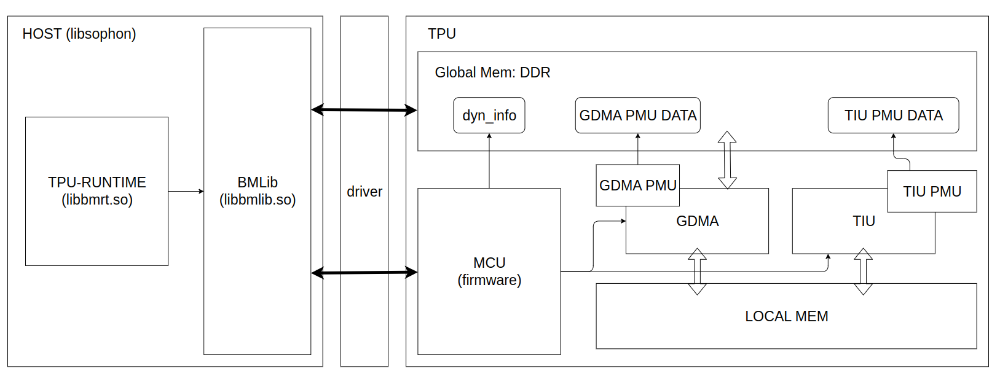
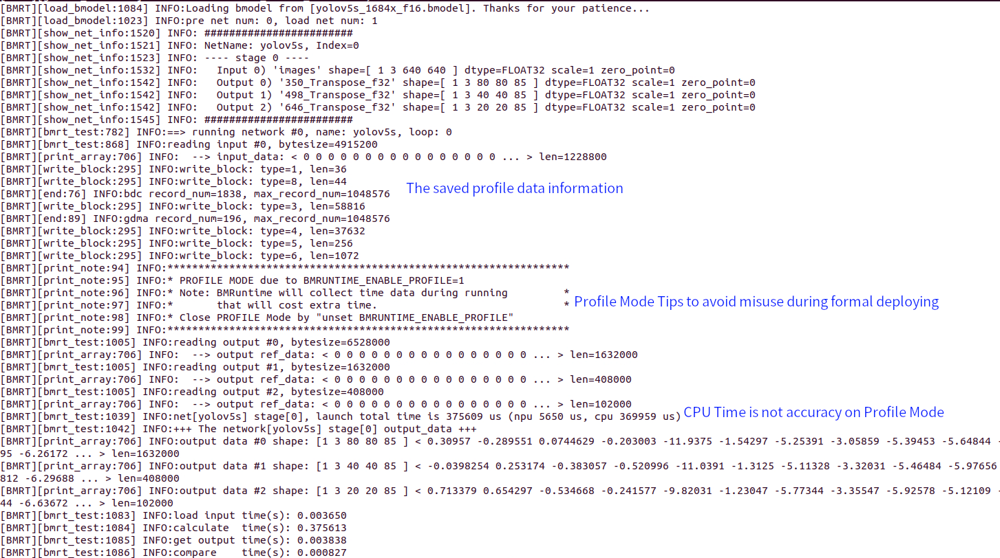
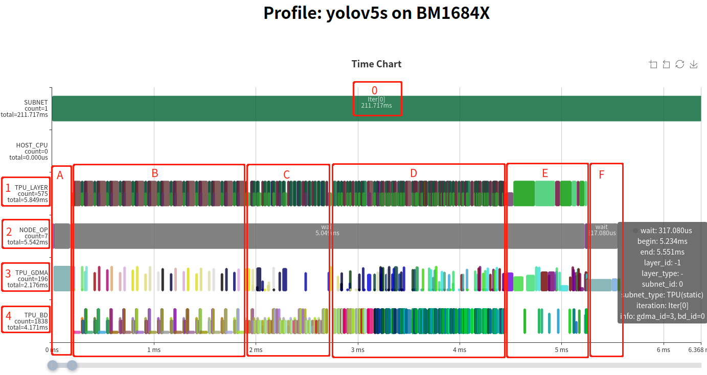
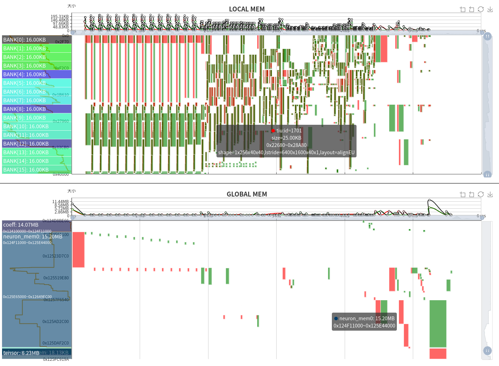
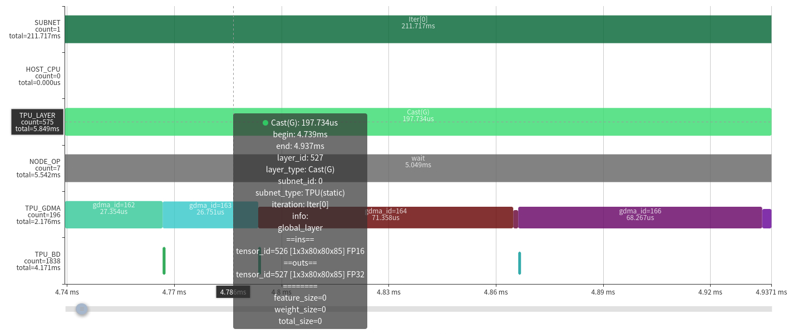
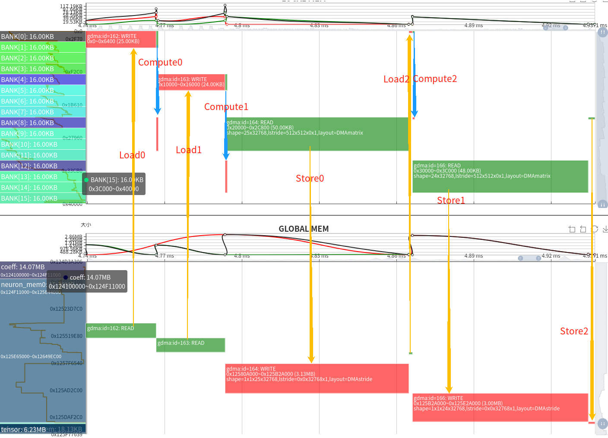

Analyse TPU Performance with TPU Profile
============================================

1. Software and Hardware Framework of TPU
---------------------------------------------

As the following figure shows, a whole TPU application depends on the cooperation of software and hardware:

**Software**
Host provides **libsophon**, driver software packs. Driver abstracts the mechanism of basic communication and resource management, defines function interfaces. **Libsophon** implements various concrete functions for TPU inference, such as BMLib and TPU-RUNTIME.

- **BMLib** (``libbmlib.so``) wraps the driver interfaces for compatibility and portability of applications, improving performance and simplicity of programming.
- **TPU-RUNTIME** (``libbmrt.so``) implements loading, management, execution, and so on.

**Hardware**
TPU mainly consists of three engines: MCU, GDMA, TIU.

- An A53 processor is used as MCU on BM1684X, which implements concrete operators by sending commands, communicating with driver, simple computation with firmware program.
- **GDMA** engine is used for transmitting data between Global Mem and Local Mem, moving data as 1D, matrix, 4D formats.
- **TIU** engine performs computing operations, including Convolution, Matrix Multiplication, Arithmetic Operations.

TPU Profile is a tool for visualizing the profile binary data in HTML formats, which comes from the time information recorded by the hardware modules called GDMA PMU and TPU PMU, the running time of key functions and the metadata in the bmodel. The profile data generation is done during compiling the bmodel and executing the inference application; it is disabled by default and can be enabled by setting environment variables.

This article uses Profile data and TPU Profile tools to visualize the complete running process of the model, providing an intuitive understanding of the internal TPU.

2. Compile Bmodel
---------------------

(This operation and the following operations will use `TPU MLIR <https://github.com/sophgo/tpu-mlir>`_)

Due to the fact that the profile data will save some layer information during compilation to the BModel (resulting in a larger BModel size), it is disabled by default. To enable it, call `model_deploy.py` with the ``--debug`` option. If this option is not used during compilation, some data obtained by enabling profile during visualization may be missing.

Below, we demonstrate the **yolov5s** model in the TPU MLIR project.

Generate top MLIR:

::

  model_transform.py \
      --model_name yolov5s \
      --model_def ../yolov5s.onnx \
      --input_shapes [[1,3,640,640]] \
      --mean 0.0,0.0,0.0 \
      --scale 0.0039216,0.0039216,0.0039216 \
      --keep_aspect_ratio \
      --pixel_format rgb \
      --output_names 350,498,646 \
      --test_input ../image/dog.jpg \
      --test_result yolov5s_top_outputs.npz \
      --mlir yolov5s.mlir

Convert top MLIR to BModel with FP16 precision:

::

  model_deploy.py \
    --mlir yolov5s.mlir \
    --quantize F16 \
    --chip bm1684x \
    --test_input yolov5s_in_f32.npz \
    --test_reference yolov5s_top_outputs.npz \
    --model yolov5s_1684x_f16.bmodel \
    --debug  # Record profile data

Using the above commands, compile `yolov5s.onnx` into `yolov5s_bm1684x_f16.bmodel`. For more usage, please refer to the `TPU MLIR <https://github.com/sophgo/tpu-mlir>`_ repository.

3. Generate Profile Binary Data
-----------------------------------

Similar to the compilation process, the profile function at runtime is disabled by default to prevent additional time consumption during profile saving and transmission. To enable it, set the environment variable:

::

  export BMRUNTIME_ENABLE_PROFILE=1

Below, use the model testing tool provided in libsophon, ``bmrt_test``, as an application to generate profile data:

::

  BMRUNTIME_ENABLE_PROFILE=1 bmrt_test --bmodel resnet50_fix8b.bmodel

The following is the output log after enabling profile mode:

Meanwhile, a directory named ``bmprofile_data-1`` will be generated, containing all the profile data.

4. Visualize Profile Data
------------------------------

TPU-MLIR provides the script ``tpu_profile.py``, which converts the raw profile data to a web page for visualization.

Convert the data in `bmprofile_data-1` to HTML in `bmprofile_out`:

::

  tpu_profile.py bmprofile_data-1 bmprofile_out

Then list the output:

::

  ls bmprofile_out
  # echarts.min.js  profile_data.js  result.html

Open ``bmprofile_out/result.html`` in a web browser to view the profile chart.

For more options:

::

  tpu_profile.py --help

5. Analyse the Result
-------------------------

5.1 Overall Introduction
^^^^^^^^^^^^^^^^^^^^^^^^^^^^^

The complete result page is divided into:

- **Instruction timing chart**
- **Memory space–timing chart** (collapsed by default; expand via the "Show LOCALMEM" and "Show GLOBAL MEM" checkboxes)

The instruction timing chart components:

0. Host time marker (may not be accurate; used as subnet separation markers)
1. **NODE_OP**: Timing of each layer in the network, derived from TPU_GDMA and TPU_BD (TIU) operations. A **Layer Group** divides an operator into data transmission (half-height blocks) and computation (full-height blocks) that run in parallel.
2. **MCU**: Key functions recorded include setting GDMA, TIU instructions, and waiting for completion. The sum time equals the actual run time of the host-side management.
3. **GDMA**: Timing of GDMA operations on TPU; block height indicates actual data transmission bandwidth.
4. **TIU**: Timing of TIU operations on TPU; block height indicates effective compute utilization.

In the NODE_OP line, the statistic ``total=5.542ms`` indicates the entire network runs in 5.542 ms. Instruction configuration time is short; most time is spent waiting during the network execution.

The overall operation splits into three parts: section A, sections B–E, and section F:

- **A**: MCU moves input data from user space to computational instruction space.
- **B–E**: Fused Layer Groups (multiple layers fused, sliced, and pipelined).
- **F**: MCU moves output data from instruction space back to user space.

Layers in B, C, and D form three fused Layer Groups (periodic half-height loads/saves). Section E contains unfused global layers.

The memory space–timing chart shows LOCAL MEM (top) and GLOBAL MEM (bottom):

- **X axis**: Time (aligned with the instruction timing chart)
- **Y axis**: Memory address space
- Green blocks: Occupied space (width = time, height = size)
- Red: GDMA write or TIU output
- Green: GDMA read or TIU input

LOCAL MEM is the TPU’s internal compute space. On BM1684X, TIU has 64 lanes × 128 KB each, divided into 16 banks. Only Lane 0 is shown. Inputs and outputs must avoid the same bank to prevent conflicts.

GLOBAL MEM is larger (4 GB–12 GB); only used regions are displayed. Green = GDMA read; Red = GDMA write.

Observations:

- Layer Groups use LOCAL MEM periodically; TIU I/O aligns with bank boundaries.
- GLOBAL MEM shows fewer writes during fused groups and alternating write/read during global layers.
- Total GLOBAL MEM usage: 14.07 MB (Coeff), 15.20 MB (Runtime), 6.23 MB (Tensor).

5.2 Global Layer
^^^^^^^^^^^^^^^^^^^^^

Analyze a simple global layer (previous Cast layer cannot fuse due to a Permute).

The layer casts a float16 tensor of shape 1×3×80×80×85 to float32.

Execution timeline:

  time ────────────────────────────────────────>

  Load0 | Compute0 | Store0   |          |
        | Load1    | Compute1 | Store1   |
        |          | Load2    | Compute2 | Store2

Since only one GDMA device handles loads and stores serially, the pipeline becomes:

  time ────────────────────────────────────────>

  GDMA: Load0 | Load1    | Store0, Load2  | Store1   | Store2
  TIU :        | Compute0 | Compute1       | Compute2 |

The memory chart confirms this flow. Casting doubles memory, so transmission time doubles. The run time is bandwidth-bound, illustrating the necessity of layer fusion.

5.3 Local Layer Group
^^^^^^^^^^^^^^^^^^^^^^^^^

Two cases:

1. **High efficiency**:

   .. image:: ../assets/layer_group_time_chart.png
      :alt: Good Case Time Chart

   - Few GDMA ops in the middle, reducing data movement.
   - High TIU efficiency; compute power is fully utilized.
   - No gaps between TIU ops.

   Optimization space is limited; improvements must come from network structure or other aspects.

2. **Low compute utilization**:

   .. image:: ../assets/bad_case_whole_chart.png
      :alt: Bad Case Time Chart

   Caused by unfriendly operator parameters. BM1684X TIU has 64 lanes; ideal input channels (IC) are multiples of 64. Here IC=3 → only 3/64 utilization.

   Solutions:

   - Use LOCAL MEM to increase slices and reduce instructions.
   - Apply data transformations (e.g., permutations). For the first layer IC=3, we introduced a “3IC” technique.
   - Modify the network or adjust computations.

   Some inefficiencies are unavoidable without changes to TPU architecture or instructions.

6. Summary
--------------

This article demonstrates the complete TPU profiling process and how to use the visualization charts to analyze TPU runtime behavior and bottlenecks.

The Profile tool is essential for AI compiler development, providing deep insights for software and hardware design. It also aids debugging by visually detecting errors such as memory overlaps and synchronization issues.

TPU Profile’s display capabilities are continuously improving.
