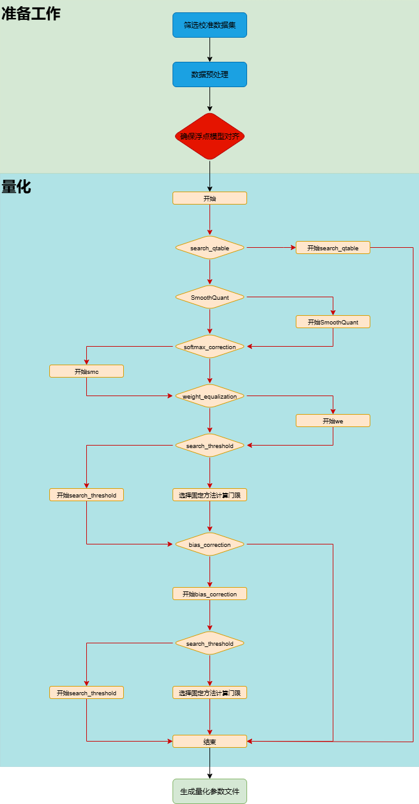
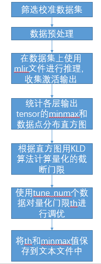
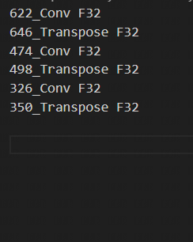
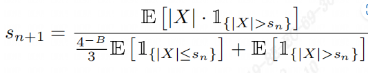
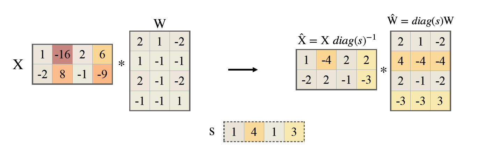
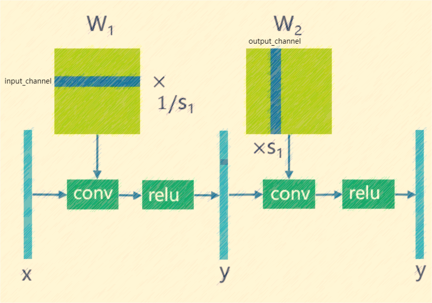
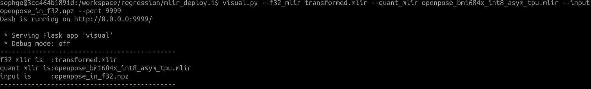
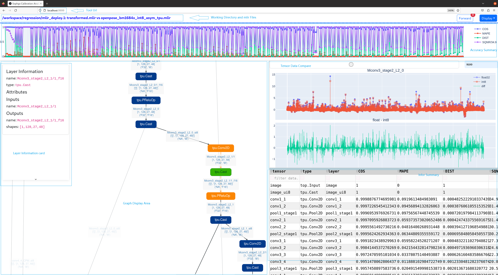

Calibration
============

总体介绍
--------------------
所谓校准, 就是用真实场景数据来调校出恰当的量化参数, 为何需要校准？当我们对激活进行非对称量化时,
需要预先知道其总体的动态范围, 即min/max值,对激活进行对称量化时, 需要预先使用合适的量化门限算法
在激活总体数据分布的基础上计算得到其量化门限, 而一般训练输出的模型是不带有激活这些数据统计
信息的, 因此这两者都要依赖于在一个微型的训练集子集上进行推理, 收集各个输入的各层输出激活。

tpu-mlir的校准过程包括了门限方法自动寻优(search_threshold),SmoothQuant(sq),跨层权重均衡(we),偏置修正(bc)以及自动
混精功能(search_qtable)等方法。总体过程如(:ref:`quantization_process`)所示。其中sq,we,bc,search_qtable
和search_threshold都是可选择的,可以根据当前要量化的模型的实际情况进行搭配，后面章节也会具体给出各个方法的使用说明。
上述过程整合在一起统一执行, 最后将各个op的优化后的threshold和
min/max值输出到一个量化校准参数文件cali_table中, 后续``model_deploy.py``时就可使用这个参数
文件来进行后续的int8量化。如果您使用了自动混精功能,在生成cali_table的同时,还会生成混合精度表qtable,后续``model_deploy.py``时需使用
这两个文件来进行后续的int8混合精度量化。

.. _quantization_process:

   量化流程图

默认流程介绍
--------------------

当前的校准流程囊括了多项方法，同时也提供了默认校准流程，具体过程如(:ref:`cali_process_flow`)图

.. _cali_process_flow:

   默认流程

如下图(:ref:`cali_table`)为校准最终输出的校准表

.. _cali_table:
.. figure:: ../assets/cali_table.png
   :align: center

   cali_table校准表

如若使用search_qtable,还会生成qtable混精表,如下图所示。

.. _calibration_doc:

校准数据筛选及预处理
--------------------

筛选原则
~~~~~~~~~~~~~~~~

在训练集中挑选约100~200张覆盖各个典型场景风格的图片来进行校准, 采用类似训练数据清洗的方式, 要排除掉一些异常样例;

输入格式及预处理
~~~~~~~~~~~~~~~~

.. list-table:: 输入格式
   :widths: 18 60
   :header-rows: 1

   * - 格式
     - 描述
   * - 原始图片
     - 对于CNN类图片输入网络, 支持直接输入图片, 要求在前面生成mlir文件时,
       model_transform.py命令要指定和训练时完全一致的图片预处理参数
   * - npz或npy文件
     - 对于非图片输入或图片预处理类型较复杂tpu-mlir暂不支持的情形, 建议额外编写
       脚本将完成预处理后的输入数据保存到npz/npy文件中(npz文件是多个输入tensor
       按字典的方式打包在一起, npy文件是1个文件包含1个tensor),
       run_calibration.py支持直接导入npz/npy文件

上面2种格式, 在调用run_calibration.py调用mlir文件进行推理时, 就无需再指定校准图片的预处理参数了

.. list-table:: 参数指定方式
   :widths: 18 60
   :header-rows: 1

   * - 方式
     - 描述
   * - --dataset
     - 对于单输入网络, 放置输入的各个图片或已预处理的输入npy/npz文件(无顺序要求); 对于多输入网络,
       放置各个样本的已预处理的npz文件
   * - --data_list
     - 将各个样本的图片文件地址, 或者npz文件地址, 或者npy文件地址, 一行放一个样本,
       放置在文本文件中, 若网络有多个输入文件, 文件间通过逗号分割(注意npz文件应该只有1个输入地址)

.. _data_list:
.. figure:: ../assets/data_list.png
   :align: center

   data_list要求的格式样例

.. _calibration_doc2:

量化门限算法实现
--------------------

tpu-mlir目前实现了七种量化门限计算方法,分别为kld+auto-tune,octav,minmax,percentile9999,
aciq_gauss+auto-tune,aciq_laplace+auto-tune和基于torch的histogram算法,下面将对kld,
octav,aciq和auto-tune算法进行介绍。

kld算法
~~~~~~~~~~~~~~~~

tpu-mlir实现的kld算法参考tensorRT的实现, 本质上是将abs(fp32_tensor)这个分布(用2048个fp32 bin的直方图表示),截掉一些高位
的离群点后(截取的位置固定在128bin、256bin...一直到2048bin)得到fp32参考概率分布P, 这个fp32分布
若用128个等级的int8类型来表达, 将相邻的多个bin(比如256bin是相邻的2个fp32 bin)合并成1个int8值等级计算分布
概率后, 再扩展到相同的bin数以保证和P具有相同的长度, 最终得到量化后int8值的概率分布Q, 计算P和Q的KL散度,
在一个循环中, 分别对128bin、256bin、...、2048bin这些截取位置计算KL散度, 找出具有最小散度的截取位置,
这说明在这里截取, 能用int8这128个量化等级最好的模拟fp32的概率分布, 故量化门限设在这里是最合适的。kld算法实现伪码
如下所示:

.. code-block:: shell
   :linenos:

   the pseudocode of computing int8 quantize threshold by kld:
       Prepare fp32 histogram H with 2048 bins
       compute the absmax of fp32 value

       for i in range(128,2048,128):
         Outliers_num=sum(bin[i], bin[i+1],…, bin[2047])
         Fp32_distribution=[bin[0], bin[1],…, bin[i-1]+Outliers_num]
         Fp32_distribution/= sum(Fp32_distribution)

         int8_distribution = quantize [bin[0], bin[1],…, bin[i]] into 128 quant level
         expand int8_distribution to i bins
         int8_distribution /= sum(int8_distribution)
         kld[i] = KLD(Fp32_distribution, int8_distribution)
       end for

       find i which kld[i] is minimal
       int8 quantize threshold = (i + 0.5)*fp32 absmax/2048

auto-tune算法
~~~~~~~~~~~~~~~~

从KLD算法的实际表现来看, 其候选门限相对较粗, 也没有考虑到不同业务的特性, 比如: 对于目标检测、关键点检测等业务, tensor的离群点
可能对最终的结果的表现更加重要, 此时要求量化门限更大, 以避免对这些离群点进行饱和而影响到这些分布
特征的表达; 另外, KLD算法是基于量化后int8概率分布与fp32概率分布的相似性来计算量化门限, 而评估分布相似性的方法
还有其他比如欧式距离、cos相似度等方法, 这些度量方法不用考虑粗略的截取门限直接来评估tensor数值分布相似性, 很多时候
能有更好的表现; 因此, 在高效的KLD量化门限的基础上, tpu-mlir提出了auto-tune算法对这些激活的量化门限基于欧式距离
度量进行微调, 从而保证其int8量化具有更好的精度表现;

实现方案: 首先统一对网络中带权重layer的权重进行伪量化, 即从fp32量化为int8, 再反量化为fp32, 引入量化误差; 然后
逐个对op的输入激活量化门限进行调优: 在初始KLD量化门限和激活的最大绝对值之间, 均匀选择20个候选值, 用这些候选值
对fp32参考激活值进行量化加扰, 引入量化误差, 然后输入op进行fp32计算, 将输出的结果与fp32参考激活进行欧式距离计算,
选择20个候选值中具有最小欧式距离的值作为调优门限; 对于1个op输出连接到后面多个分支的情形, 多个分支分别按上述方法
计算量化门限, 然后取其中较大者, 比如(:ref:`auto_tune_flow`)图中layer1的输出会分别针对layer2、layer3调节一次, 两次调节独立进行,
根据实验证明, 取最大值能兼顾两者;

.. _auto_tune_flow:
.. figure:: ../assets/auto_tune_cn.png
   :align: center

   auto-tune调优实现方案

octav算法
~~~~~~~~~~~~~~~~

tpu-mlir实现的octav算法参考了文章《Optimal Clipping and Magnitude-aware Differentiation for Improved Quantization-aware Training》。
通常人们认为量化误差来源于舍入误差和截断误差,计算每个张量的最优截断(门限)可以最小化量化误差,ovtav采用了均方误差来衡量量化误差,采用递归方式并基于
快速的牛顿-拉夫森(Newton-Raphson)方法用于动态确定最小化均方误差(MSE)的最优门限。下面给出了该方法最优门限迭代计算公式,如图(:ref:`octav`)所示。

.. _octav:

   octav迭代公式

其设计之初用于QAT量化中,但在PTQ量化中同样有效。下面是其实现伪码:

.. code-block:: shell
   :linenos:

   the pseudocode of computing int8 quantize threshold by octav:
       Prepare T: Tensor to be quantized,
               B: Number of quantization bits,
               epsilon: Convergence threshold (e.g., 1e-5),
               s_0: Initial guess for the clipping scalar (e.g., max absolute value in tensor T)
       compute s_star: Optimal clipping scalar

       for n in range(20):
          Compute the indicator functions for the current clipping scalar:
          I_clip = 1{|T| > s_n}  (applied element-wise to tensor T)
          I_disc = 1{0 < |T| ≤ s_n}

          Update the clipping scalar s_n to the next one s_(n+1) using:
          s_(n+1) = (Σ|x| * I_clip) / ((4^{-B} / 3) * ΣI_disc + ΣI_clip)
          where Σ denotes the summation over the corresponding elements

          If |s_(n+1) - s_n| < epsilon, the algorithm is considered to have converged
       end for
       s_star = s_n

aciq算法
~~~~~~~~~~~~~~~~

tpu-mlir实现的aciq算法参考了文章《ACIQ:ANALYTICAL CLIPPING FOR INTEGER QUANTIZATION OF NEURAL NETWORKS》。该方法假设激活值满足固定分布,然后计算
该激活值对应分布的统计量,并根据理论计算获得的最优截断分位来得到最优门限。

实现方案:tpu-mlir中提供了aciq_guass和aciq_laplace两种算法,分别假设激活值满足gauss分布和laplace分布,然后根据理论上8bit对应的最优截断分位来计算获得最优门限。

优化算法实现
--------------------

在校准过程中,为了进一步提升量化模型的精度,tpu-mlir提供了多种优化算法,其中包括SmoothQuant(sq),跨层权重均衡(we),偏置修正(bc),search_qtable和search_threshold,下面是上述优化
算法的介绍。

sq算法
~~~~~~~~~~~~~~~~~~~~~~
tpu-mlir实现的SmoothQuant算法参考了文章《SmoothQuant: Accurate and Efficient Post-Training Quantization for Large Language Models》,
该方法通过平滑地分配模型的张量比例,将模型的输入和权重的范围调整到一个更适合量化的范围,从而提高量化后的模型精度,
解决大规模预训练模型（如语言模型和视觉模型）在量化过程中精度下降的问题。

SmoothQuant通过调整模型的张量比例,将激活和权重的范围进行重新分配,使得量化过程更加稳定。具体来说,SmoothQuant在量化前引入一个平滑因子,
将激活值的范围部分转移到权重中,通过数学等价转换来调整模型权重,从而降低激活值的量化误差。技术原理如图(:ref:`sq`)所示。

.. _sq:

   SmoothQuant

we算法
~~~~~~~~~~~~~~~~~~~~~~

tpu-mlir实现的跨层权重均衡算法参考了文章《Data-Free Quantization Through Weight Equalization and Bias Correction》,该方法主要针对模型权重,通过对
符合conv-conv和conv-relu-conv这两种pattern的权重进行均衡,使两个相邻权重分布尽可能均匀。

之前研究发现在mobilenet这类可分离卷积较多的网络中,由于可分离卷积的channel间数据分布差异较大,如果采用per-layer的量化,会造成较大的量化误差。we算法很好的解决了
这一问题,其利用了relu函数的线性特性,可以对相邻卷积权重进行均衡,使得卷积channel间的分布差距缩小,此时采用per-layer的效果可以与per-channel相当,技术原理如图(:ref:`we`)所示。

.. _we:

   weight_equalization

bc算法
~~~~~~~~~~~~~~~~~~~~~~

tpu-mlir实现的偏置修正算法参考了文章《Data-Free Quantization Through Weight Equalization and Bias Correction》。通常人们认为量化模型输出误差是无偏的,
也就是其满足期望值为0,但在很多实际场景下,量化模型的输出误差是有偏的,也就是量化模型的输出与浮点模型的输出存在期望值上的偏离，这会对量化模型的精度造成影响。

偏置修正算法通过计算量化模型在校准数据上与浮点模型的统计偏差,然后对模型中Conv/Gemm算子的bias项进行补偿,从而尽可能减小二者输出的期望值偏差。效果如图(:ref:`bc`)所示。

.. _bc:
.. figure:: ../assets/bias.png
   :align: center

   bias_correction

search_threshold算法
~~~~~~~~~~~~~~~~~~~~~~

tpu-mlir提供了七种独立的门限计算方法,当我们拿到一个需要做量化的模型时,该如何择优选择门限计算方法成为一个问题。search_threshold针对上述问题提供了
一个解决方案。

实现方案:search_threshold首先会同时计算kld+tune,octav,max和percentile9999四种方法的门限值,然后计算不同方法门限值生成的量化模型输出与浮点模型
输出的相似度,通过比较四种门限方法的相似度,选择最大相似度对应的门限方法的门限值作为当前模型量化参数。在使用过程中,需要注意以下几点:1.search_threshold
目前提供了cos和snr两种相似度计算方法,默认采用cos相似度计算方法2.如果量化模型与浮点模型cos相似度低于0.9,该量化模型的精度下降可能比较严重,search_threshold
搜索结果可能存在偏差,在进行实际精度验证后建议采用search_qtable进行混精尝试。

search_qtable算法
~~~~~~~~~~~~~~~~~~~~~~

search_qtable是集成于校准过程中的自动混精功能,当全int8量化的模型精度无法满足需求时,可以尝试开启search_qtable算法,该算法相比run_sensitive_lyer,
速度更快,同时提供了自定义门限算法混合以及自动生成qtable功能。

实现方案:search_qtable的输出会生成混合门限,混合门限是指对模型每一层门限都进行择优选择，也就是从用户所指定的多种门限计算方法结果中选择效果最好的一个,这种选择的依据是
量化模型当前层输出与原始模型当前层输出的相似度比较。除了输出混合门限,search_qtable还会输出模型的混精层,当用户指定混精模型与原始模型的输出相似度后,search_qtable
会自动输出满足该相似度所需的最少混精层。

.. _calibration_doc3:

示例-yolov5s校准
--------------------

在tpu-mlir的docker环境中, 在tpu-mlir目录执行source envsetup.sh初始化环境后, 任意新建目录进入执行如下命令可以完成对yolov5s的校准过程:

.. code-block:: shell
   :linenos:

   $ model_transform.py \
      --model_name yolov5s \
      --model_def  ${REGRESSION_PATH}/model/yolov5s.onnx \
      --input_shapes [[1,3,640,640]] \
      --keep_aspect_ratio \  #keep_aspect_ratio、mean、scale、pixel_format均为预处理参数
      --mean 0.0,0.0,0.0 \
      --scale 0.0039216,0.0039216,0.0039216 \
      --pixel_format rgb \
      --output_names 350,498,646 \
      --test_input ${REGRESSION_PATH}/image/dog.jpg \
      --test_result yolov5s_top_outputs.npz \
      --mlir yolov5s.mlir

.. list-table:: model_transform.py参数
   :widths: 18 60
   :header-rows: 1

   * - 参数
     - 描述
   * - model_name
     - 模型名
   * - --model_def
     - 模型类型文件(.onnx,.pt,.tflite or .prototxt)
   * - --model_data
     - 指定模型权重文件，为caffe模型时需要（对应'.caffemodel'文件）
   * - --input_shapes
     - 输入的形状，例如[[1,3,640,640]]（二维数组），可以支持多个输入
   * - --resize_dims
     - 要调整到的原始图像的大小。 如果未指定，它将调整为模型的输入大小
   * - --keep_aspect_ratio
     - 调整大小时是否保持纵横比。 默认为False。 设置时不足的部分会补0
   * - --mean
     - 图像每个通道的平均值。 默认为 0.0,0.0,0.0
   * - --scale
     - 图像每个通道的scale。 默认为 1.0,1.0,1.0
   * - --pixel_format
     - 图像类型，可以是 rgb、bgr、gray 或 rgbd
   * - --output_names
     - 输出的名称。 如果未指定，则使用模型的输出，否则使用指定的名称作为输出
   * - --test_input
     - 用于验证的输入文件，可以是图像、npy 或 npz。 如果不指定则不会进行验证
   * - --test_result
     - 输出文件保存验证结果
   * - --excepts
     - 验证过程中要排除的网络层名称。 用逗号分隔
   * - --debug
     - 如果打开调试，则立即模型文件将保留； 或将在转换完成后删除
   * - --mlir
     - 输出mlir文件名（包括路径）

默认流程

.. code-block:: shell
   :linenos:

   $ run_calibration.py yolov5s.mlir \
      --dataset $REGRESSION_PATH/dataset/COCO2017 \
      --input_num 100 \
      --tune_num 10 \
      -o yolov5s_cali_table

使用不同量化门限计算方法

octav:

.. code-block:: shell
   :linenos:

   $ run_calibration.py yolov5s.mlir \
      --dataset $REGRESSION_PATH/dataset/COCO2017 \
      --input_num 100 \
      --cali_method use_mse \
      -o yolov5s_cali_table

minmax:

.. code-block:: shell
   :linenos:

   $ run_calibration.py yolov5s.mlir \
      --dataset $REGRESSION_PATH/dataset/COCO2017 \
      --input_num 100 \
      --cali_method use_max \
      -o yolov5s_cali_table

percentile9999:

.. code-block:: shell
   :linenos:

   $ run_calibration.py yolov5s.mlir \
      --dataset $REGRESSION_PATH/dataset/COCO2017 \
      --input_num 100 \
      --cali_method use_percentile9999 \
      -o yolov5s_cali_table

aciq_gauss:

.. code-block:: shell
   :linenos:

   $ run_calibration.py yolov5s.mlir \
      --dataset $REGRESSION_PATH/dataset/COCO2017 \
      --input_num 100 \
      --cali_method use_aciq_gauss \
      -o yolov5s_cali_table

aciq_laplace:

.. code-block:: shell
   :linenos:

   $ run_calibration.py yolov5s.mlir \
      --dataset $REGRESSION_PATH/dataset/COCO2017 \
      --input_num 100 \
      --cali_method use_aciq_laplace \
      -o yolov5s_cali_table

使用优化方法：

sq:

.. code-block:: shell
   :linenos:

   $ run_calibration.py yolov5s.mlir \
      --sq \
      --dataset $REGRESSION_PATH/dataset/COCO2017 \
      --input_num 100 \
      --cali_method use_mse \
      -o yolov5s_cali_table

we:

.. code-block:: shell
   :linenos:

   $ run_calibration.py yolov5s.mlir \
      --we \
      --dataset $REGRESSION_PATH/dataset/COCO2017 \
      --input_num 100 \
      --cali_method use_mse \
      -o yolov5s_cali_table

we+bc:

.. code-block:: shell
   :linenos:

   $ run_calibration.py yolov5s.mlir \
      --we \
      --bc \
      --dataset $REGRESSION_PATH/dataset/COCO2017 \
      --input_num 100 \
      --processor bm1684x \
      --bc_inference_num 200 \
      --cali_method use_mse \
      -o yolov5s_cali_table

we+bc+search_threshold:

.. code-block:: shell
   :linenos:

   $ run_calibration.py yolov5s.mlir \
      --we \
      --bc \
      --dataset $REGRESSION_PATH/dataset/COCO2017 \
      --input_num 100 \
      --processor bm1684x \
      --bc_inference_num 200 \
      --search search_threshold \
      -o yolov5s_cali_table

search_qtable:

.. code-block:: shell
   :linenos:

   $ run_calibration.py yolov5s.mlir \
      --dataset $REGRESSION_PATH/dataset/COCO2017 \
      --input_num 100 \
      --processor bm1684x \
      --max_float_layers 5 \
      --expected_cos 0.99 \
      --transformer False \
      --quantize_method_list KL,MSE \
      --search search_qtable \
      --quantize_table yolov5s_qtable \
      -o yolov5s_cali_table

.. list-table:: run_calibration.py参数
   :widths: 25 60
   :header-rows: 1

   * - 参数
     - 描述
   * - mlir_file
     - mlir文件
   * - --sq
     - 开启SmoothQuant
   * - --we
     - 开启weight_equalization
   * - --bc
     - 开启bias_correction
   * - --dataset
     - 校准数据集
   * - --data_list
     - input列表
   * - --input_num
     - 校准图像数量
   * - --inference_num
     - search_qtable 和 search_threshold 推理过程所需图片数量
   * - --bc_inference_num
     - bias_correction 推理过程所需图片数量
   * - --tune_list
     - tuning用到的input列表
   * - --tune_num
     - tuning的图像数量
   * - --histogram_bin_num
     - 指定 kld 计算的直方图 bin 数量
   * - --expected_cos
     - 期望search_qtable混精模型输出与浮点模型输出的相似度,取值范围[0,1]
   * - --min_layer_cos
     - bias_correction中该层量化输出与浮点输出的相似度下限,当低于该下限时需要对该层进行补偿,取值范围[0,1]
   * - --max_float_layers
     - search_qtable 浮点层数量
   * - --processor
     - 处理器类型
   * - --cali_method
     - 量化门限计算方法选择,可选择use_kl,use_mse,use_percentile9999,use_max,默认为use_kl
   * - --fp_type
     - search_qtable浮点层数据类型
   * - --post_process
     - 后处理路径
   * - --global_compare_layers
     - 指定全局对比层，例如 layer1,layer2 或 layer1:0.3,layer2:0.7
   * - --search
     - 指定搜索类型,其中包括search_qtable,search_threshold,false。其中默认为false,不开启搜索
   * - --transformer
     - 是否是transformer模型,search_qtable中如果是transformer模型可分配指定加速策略
   * - --quantize_method_list
     - search_qtable用来搜索的门限方法,默认仅MSE,支持KL,MSE,MAX,Percentile9999自由选择
   * - --benchmark_method
     - 指定search_threshold中相似度计算方法
   * - --kurtosis_analysis
     - 指定生成各层激活值的kurtosis
   * - --part_quantize
     - 指定模型部分量化,获得cali_table同时会自动生成qtable。可选择N_mode,H_mode,custom_mode,H_mode通常精度较好
   * - --custom_operator
     - 指定需要量化的算子,配合开启上述custom_mode后使用
   * - --part_asymmetric
     - 指定当开启对称量化后,模型某些子网符合特定pattern时,将对应位置算子改为非对称量化
   * - --mix_mode
     - 指定search_qtable特定的混精类型,目前支持8_16和4_8两种
   * - --cluster
     - 指定search_qtable寻找敏感层时采用聚类算法
   * - --quantize_table
     - search_qtable输出的混精度量化表
   * - -o
     - 输出门限表
   * - --debug_cmd
     - debug命令,可以选择校准模式;“percentile9999”采用99.99分位作为初始门限。“use_max”采用绝对值最大值作为门限。“use_torch_observer_for_cali”采用torch的observer进行校准。"use_mse"采用octav进行校准。
   * - --debug_log
     - 日志输出级别

执行结果如下图(:ref:`yolov5s_cali`)所示

.. _yolov5s_cali:
.. figure:: ../assets/yolov5s_cali.jpg
   :align: center

   yolov5s_cali校准结果

.. _visual-usage:

可视化工具visual说明
--------------------

可视化工具visual.py可以用来比较量化网络与原始网络的数据相似性，有助于在量化后精度不够满意时候定位问题。此工具在docker中启动，可以在宿主机中启动浏览器打开界面。
工具默认使用tcp端口10000，需要在启动docker时候使用-p命令映射到宿主机，而工具的启动目录必须在网络所在目录。命令启动方式如下图所示：

.. list-table:: 可视化工具命令行参数
   :widths: 18 60
   :header-rows: 1

   * - 参数
     - 描述
   * - --port
     - 服务程序的TCP监听端口，默认值为10000
   * - --f32_mlir
     - 量化前的浮点mlir网络的文件名，此文件为model_transform生成，一般为netname.mlir，是初始float32网络
   * - --quant_mlir
     - 量化后的定点mlir网络的文件名，此文件为model_deploy生成，一般文件名为netname_int8_sym_tpu.mlir，生成bmodel用的_final.mlir不适用此工具。
   * - --input
     - 运行网络比较的输入样本数据，可以是jpeg图片文件或者npy/npz数据文件，一般可使用网络转换时的test_input
   * - --manual_run
     - 浏览器客户端打开时是否自动运行网络进行数据比较，默认为true，使用此参数则只显示网络结构

在浏览器地址栏输入localhost:9999可以打开程序界面，启动时候会自动进行浮点网络和量化后网络的推理，所以可能会有一定时间的等待。如下图所示：

上图中使用淡蓝色细线框出了界面的几个区域，除浏览器地址栏之外，程序界面主要显示了：
   1. 当前工作目录，指定的浮点网络和量化后网络；
   2. 精度数据总结区
   3. layer属性显示区域
   4. 网络图形化显示区
   5. tensor数据对比区
   6. tensor数据分布和信息总结显示区（切换tab页面）

鼠标在网络显示区滚动可以放大和缩小网络显示，鼠标悬停或者点击节点可以在layer属性显示区中显示此layer的属性列表，点击layer之间的连线（也就是tensor)，可以在tensor数据对比区显示此tensor的量化前后数据对比。
点击精度数据显示区中的点或者列表中的tensor或者layer，会在网络中定位到这个选中的layer或者tensor。
**需要注意的一点是由于网络是基于量化后网络显示，可能会相比浮点网络有变化，对于浮点网络中不存在的tensor会临时用量化后网络的数据替代，表现出来精度数据等都非常好，实际需要忽略
而只关注浮点和量化后网络都存在的tensor，不存在的tensor的数据类型一般是NA，shape也是[]这样的空值。**
**另外在deploy网络的时候如果没有使用 --debug 参数，一些可视化工具需要的中间数据和文件会被默认清除，造成可视化工具运行不正常，需要增加 --debug 选项重新生成。**

tensor上的信息解读如下：

.. figure:: ../assets/visual_tensor.png
   :width: 400px
   :align: center
