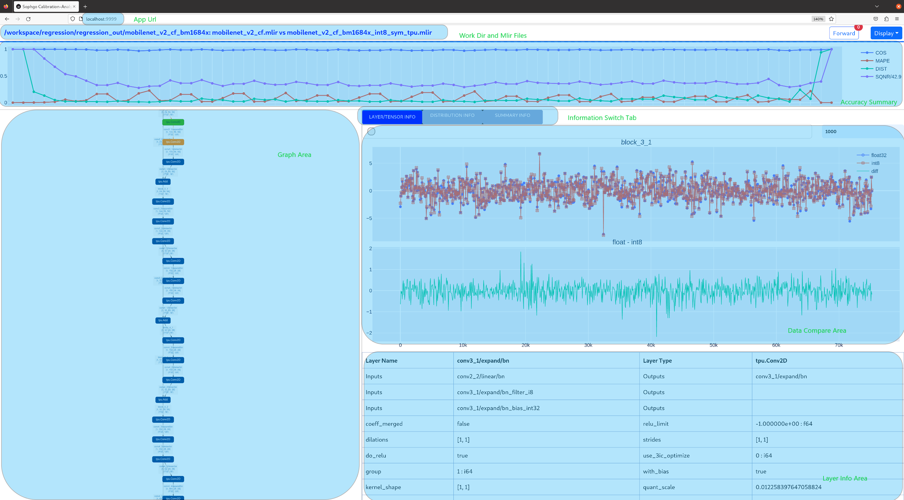

Calibration
============

总体介绍
--------------------

所谓校准, 就是用用真实场景数据来调校出恰当的量化参数, 为何需要校准？当我们对激活进行非对称量化时,
需要预先知道其总体的动态范围, 即minmax值,
对激活进行对称量化时, 需要预先使用合适的量化门限算法在激活总体数据分布
的基础上计算得到其量化门限, 而一般训练输出的模型是不带有激活这些数据统计
信息的, 因此这两者都要依赖于在一个微型的训练集子集上进行推理, 收集各个
输入的各层输出激活, 汇总得到总体minmax及数据点分布直方图, 并根据KLD等
算法得到合适的对称量化门限threshold, 最后会启用auto-tune算法使用各int8层
输出激活与fp32激活的欧式距离来对这些该int8层的输入激活量化门限进行调优;
上述过程整合在一起, 统一执行, 最后将各个op的优化后的threshold和min/max值
输出到一个量化参数文本文件中, 后续``model_deploy.py``时就可使用这个参数
文件来进行后续的int8量化, 总体过程如(:ref:`cali_process_flow`)图

.. _cali_process_flow:
.. figure:: ../assets/cali_process_cn.png
   :align: center

   量化总体过程

如下图(:ref:`cali_table`)为校准最终输出的量化参数文件

.. _cali_table:
.. figure:: ../assets/cali_table.png
   :align: center

   量化参数文件样例

.. _calibration_doc:

校准数据筛选及预处理
--------------------

筛选原则
~~~~~~~~~~~~~~~~

    在训练集中挑选约100~200张覆盖各个典型场景风格的图片来进行校准, 采用类似训练数据清洗的方式, 要排除掉一些异常样例;

输入格式及预处理
~~~~~~~~~~~~~~~~

.. list-table:: 输入格式
   :widths: 18 60
   :header-rows: 1

   * - 格式
     - 描述
   * - 原始图片
     - 对于CNN类图片输入网络, 支持直接输入图片, 要求在前面生成mlir文件时,
       model_transform.py命令要指定和训练时完全一致的图片预处理参数
   * - npz或npy文件
     - 对于非图片输入或图片预处理类型较复杂tpu-mlir暂不支持的情形, 建议额外编写
       脚本将完成预处理后的输入数据保存到npz/npy文件中(npz文件是多个输入tensor
       按字典的方式打包在一起, npy文件是1个文件包含1个tensor),
       run_calibration.py支持直接导入npz/npy文件

上面2种格式, 在调用run_calibration.py调用mlir文件进行推理时, 就无需再指定校准图片的预处理参数了

.. list-table:: 参数指定方式
   :widths: 18 60
   :header-rows: 1

   * - 方式
     - 描述
   * - --dataset
     - 对于单输入网络, 放置输入的各个图片或已预处理的输入npy/npz文件(无顺序要求); 对于多输入网络,
       放置各个样本的已预处理的npz文件
   * - --data_list
     - 将各个样本的图片文件地址, 或者npz文件地址, 或者npy文件地址, 一行放一个样本,
       放置在文本文件中, 若网络有多个输入文件, 文件间通过逗号分割(注意npz文件应该只有1个输入地址)

.. _data_list:
.. figure:: ../assets/data_list.png
   :align: center

   data_list要求的格式样例

.. _calibration_doc2:

算法实现
--------------------

kld算法
~~~~~~~~~~~~~~~~

tpu-mlir实现的kld算法参考tensorRT的实现, 本质上是将abs(fp32_tensor)这个波形(用2048个fp32 bin的直方图表示),截掉一些高位
的离群点后(截取的位置固定在128bin、256bin...一直到2048bin)得到fp32参考概率分布P, 这个fp32波形
若用128个等级的int8类型来表达, 将相邻的多个bin(比如256bin是相邻的2个fp32 bin)合并成1个int8值等级计算分布
概率后, 再扩展到相同的bin数以保证和P具有相同的长度, 最终得到量化后int8值的概率分布Q, 计算P和Q的KL散度,
在一个循环中, 分别对128bin、256bin、...、2048bin这些截取位置计算KL散度, 找出具有最小散度的截取位置,
这说明在这里截取, 能用int8这128个量化等级最好的模拟fp32的概率分布, 故量化门限设在这里是最合适的。kld算法实现伪码
如下所示:

.. code-block:: shell
   :linenos:

   the pseudocode of computing int8 quantize threshold by kld:
       Prepare fp32 histogram H with 2048 bins
       compute the absmax of fp32 value

       for i in range(128,2048,128):
         Outliers_num=sum(bin[i], bin[i+1],…, bin[2047])
         Fp32_distribution=[bin[0], bin[1],…, bin[i-1]+Outliers_num]
         Fp32_distribution/= sum(Fp32_distribution)

         int8_distribution = quantize [bin[0], bin[1],…, bin[i]] into 128 quant level
         expand int8_distribution to i bins
         int8_distribution /= sum(int8_distribution)
         kld[i] = KLD(Fp32_distribution, int8_distribution)
       end for

       find i which kld[i] is minimal
       int8 quantize threshold = (i + 0.5)*fp32 absmax/2048

auto-tune算法
~~~~~~~~~~~~~~~~

从KLD算法的实际表现来看, 其候选门限相对较粗, 也没有考虑到不同业务的特性, 比如: 对于目标检测、关键点检测等业务, tensor的离群点
可能对最终的结果的表现更加重要, 此时要求量化门限更大, 以避免对这些离群点进行饱和而影响到这些分布
特征的表达; 另外, KLD算法是基于量化后int8概率分布与fp32概率分布的相似性来计算量化门限, 而评估波形相似性的方法
还有其他比如欧式距离、cos相似度等方法, 这些度量方法不用考虑粗略的截取门限直接来评估tensor数值分布相似性, 很多时候
能有更好的表现; 因此, 在高效的KLD量化门限的基础上, tpu-mlir提出了auto-tune算法对这些激活的量化门限基于欧式距离
度量进行微调, 从而保证其int8量化具有更好的精度表现;

实现方案: 首先统一对网络中带权重layer的权重进行伪量化, 即从fp32量化为int8, 再反量化为fp32, 引入量化误差; 然后
逐个对op的输入激活量化门限进行调优: 在初始KLD量化门限和激活的最大绝对值之间, 均匀选择10个候选值, 用这些候选者
对fp32参考激活值进行量化加扰, 引入量化误差, 然后输入op进行fp32计算, 将输出的结果与fp32参考激活进行欧式距离计算,
选择10个候选值中具有最小欧式距离的值作为调优门限; 对于1个op输出连接到后面多个分支的情形, 多个分支分别按上述方法
计算量化门限, 然后取其中较大者, 比如(:ref:`auto_tune_flow`)图中layer1的输出会分别针对layer2、layer3调节一次, 两次调节独立进行,
根据实验证明, 取最大值能兼顾两者;

.. _auto_tune_flow:
.. figure:: ../assets/auto_tune_cn.png
   :align: center

   auto-tune调优实现方案

.. _calibration_doc3:

示例-yolov5s校准
--------------------

    在tpu-mlir的docker环境中, 在tpu-mlir目录执行source envsetup.sh初始化环境后, 任意新建目录进入执行如下命令可以完成对yolov5s的校准过程:

.. code-block:: shell
   :linenos:

   $ model_transform.py \
      --model_name yolov5s \
      --model_def  ${REGRESSION_PATH}/model/yolov5s.onnx \
      --input_shapes [[1,3,640,640]] \
      --keep_aspect_ratio \  #keep_aspect_ratio、mean、scale、pixel_format均为预处理参数
      --mean 0.0,0.0,0.0 \
      --scale 0.0039216,0.0039216,0.0039216 \
      --pixel_format rgb \
      --output_names 350,498,646 \
      --test_input ${REGRESSION_PATH}/image/dog.jpg \
      --test_result yolov5s_top_outputs.npz \
      --mlir yolov5s.mlir

.. list-table:: model_transform.py参数
   :widths: 18 60
   :header-rows: 1

   * - 参数
     - 描述
   * - model_name
     - 模型名
   * - --model_def
     - 模型类型文件(.onnx,.pt,.tflite or .prototxt)
   * - --model_data
     - 指定模型权重文件，为caffe模型时需要（对应'.caffemodel'文件）
   * - --input_shapes
     - 输入的形状，例如[[1,3,640,640]]（二维数组），可以支持多个输入
   * - --resize_dims
     - 要调整到的原始图像的大小。 如果未指定，它将调整为模型的输入大小
   * - --keep_aspect_ratio
     - 调整大小时是否保持纵横比。 默认为False。 设置时不足的部分会补0
   * - --mean
     - 图像每个通道的平均值。 默认为 0.0,0.0,0.0
   * - --scale
     - 图像每个通道的scale。 默认为 1.0,1.0,1.0
   * - --pixel_format
     - 图像类型，可以是 rgb、bgr、gray 或 rgbd
   * - --output_names
     - 输出的名称。 如果未指定，则使用模型的输出，否则使用指定的名称作为输出
   * - --test_input
     - 用于验证的输入文件，可以是图像、npy 或 npz。 如果不指定则不会进行验证
   * - --test_result
     - 输出文件保存验证结果
   * - --excepts
     - 验证过程中要排除的网络层名称。 用逗号分隔
   * - --debug
     - 如果打开调试，则立即模型文件将保留； 或将在转换完成后删除
   * - --mlir
     - 输出mlir文件名（包括路径）

.. code-block:: shell
   :linenos:

   $ run_calibration.py yolov5s.mlir \
      --dataset $REGRESSION_PATH/dataset/COCO2017 \
      --input_num 100 \
      --tune_num 10 \
      -o yolov5s_cali_table

.. list-table:: run_calibration.py参数
   :widths: 18 60
   :header-rows: 1

   * - 参数
     - 描述
   * - mlir_file
     - mlir文件
   * - --dataset
     - 校准数据集
   * - --data_list
     - input列表
   * - --input_num
     - 校准图像数量
   * - --tune_list
     - tuning用到的input列表
   * - --tune_num
     - tuning的图像数量
   * - --histogram_bin_num
     - 指定 kld 计算的直方图 bin 数量
   * - -o
     - 输出门限表
   * - --debug_cmd
     - debug命令,可以选择校准模式;“percentile9999”采用99.99分位作为初始门限。“use_max”采用绝对值最大值作为门限。“use_torch_observer_for_cali”采用torch的observer进行校准。         

执行结果如下图(:ref:`yolov5s_cali`)所示

.. _yolov5s_cali:
.. figure:: ../assets/yolov5s_cali.jpg
   :align: center

   yolov5s_cali校准结果

.. _visual-usage:

可视化工具visual说明
--------------------

可视化工具visual.py可以用来比较量化网络与原始网络的数据相似性，有助于在量化后精度不够满意时候定位问题。此工具在docker中启动，可以在宿主机中启动浏览器打开界面。
工具默认使用tcp端口10000，需要在启动docker时候使用-p命令映射到宿主机，而工具的启动目录必须在网络所在目录。命令启动方式如下图所示：

.. figure:: ../assets/visual_cmd.png
   :width: 800px
   :align: center

.. list-table:: 可视化工具命令行参数
   :widths: 18 60
   :header-rows: 1

   * - 参数
     - 描述
   * - --port
     - 服务程序的TCP监听端口，默认值为10000
   * - --f32_mlir
     - 量化前的浮点mlir网络的文件名, 此文件为model_transform生成，一般为netname.mlir，是初始float32网络
   * - --quant_mlir
     - 量化后的定点mlir网络的文件名，此文件为model_deploy生成，一般文件名为netname_int8_sym_tpu.mlir，生成bmodel用的_final.mlir不适用此工具。
   * - --input
     - 运行网络比较的输入样本数据，可以是jpeg图片文件或者npy/npz数据文件，一般可使用网络转换时的test_input
   * - --manual_run
     - 浏览器客户端打开时是否自动运行网络进行数据比较，默认为true，使用此参数则只显示网络结构

在浏览器地址栏输入localhost:9999可以打开程序界面，启动时候会自动进行浮点网络和量化后网络的推理，所以可能会有一定时间的等待。如下图所示：

上图中使用淡蓝色细线框出了界面的几个区域，除浏览器地址栏之外，程序界面主要显示了：
   1. 当前工作目录，指定的浮点网络和量化后网络；
   2. 精度数据总结区
   3. layer属性显示区域
   4. 网络图形化显示区
   5. tensor数据对比区
   6. tensor数据分布和信息总结显示区（切换tab页面）

鼠标在网络显示区滚动可以放大和缩小网络显示，鼠标悬停或者点击节点可以在layer属性显示区中显示此layer的属性列表，点击layer之间的连线（也就是tensor)，可以在tensor数据对比区显示此tensor的量化前后数据对比。
点击精度数据显示区中的点或者列表中的tensor或者layer，会在网络中定位到这个选中的layer或者tensor。
**需要注意的一点是由于网络是基于量化后网络显示，可能会相比浮点网络有变化，对于浮点网络中不存在的tensor会临时用量化后网络的数据替代，表现出来精度数据等都非常好，实际需要忽略
而只关注浮点和量化后网络都存在的tensor，不存在的tensor的数据类型一般是NA，shape也是[]这样的空值。**
**另外在deploy网络的时候如果没有使用 --debug 参数，一些可视化工具需要的中间数据和文件会被默认清除，造成可视化工具运行不正常，需要增加 --debug 选项重新生成。**

tensor上的信息解读如下：

.. figure:: ../assets/visual_tensor.png
   :width: 400px
   :align: center
