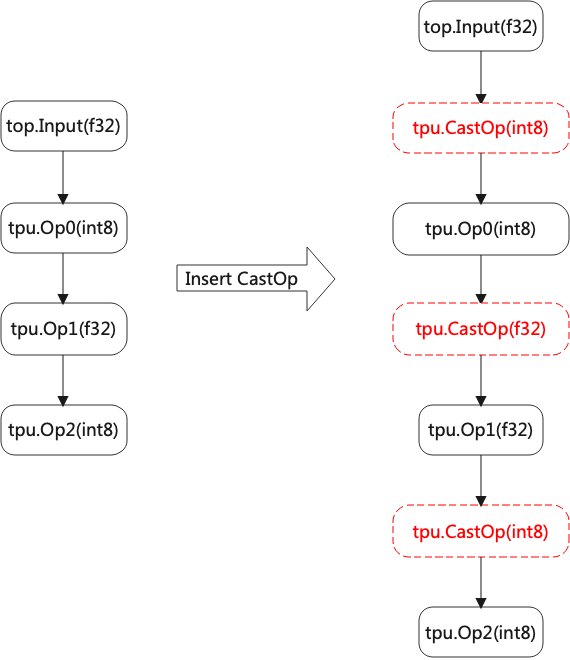

Lowering
============

Lowering将Top层OP下沉到Tpu层OP, 它支持的类型有F32/F16/BF16/INT8对称/INT8非对称。

当转换INT8时, 它涉及到量化算法; 针对不同硬件, 量化算法是不一样的, 比如有的支持perchannel, 有的不支持；有的支持32位Multiplier, 有的只支持8位, 等等。

所以Lowering将算子从硬件无关层(TOP), 转换到了硬件相关层(TPU)。

基本过程
------------

.. _lowering:
.. figure:: ../assets/lowering.png
   :height: 5cm
   :align: center

   Lowering过程

Lowering的过程, 如图所示(:ref:`lowering`)

* Top算子可以分f32和int8两种, 前者是大多数网络的情况; 后者是如tflite等量化过的网络的情况
* f32算子可以直接转换成f32/f16/bf16的tpu层算子, 如果要转int8, 则需要类型是calibrated_type
* int8算子只能直接转换成tpu层int8算子

混合精度
------------

.. _mix_prec:

   混合精度

当OP之间的类型不一致时, 则插入CastOp, 如图所示(:ref:`mix_prec`)。

这里假定输出的类型与输入的类型相同, 如果不同则需要特殊处理, 比如embedding无论输出是什么类型, 输入都是uint类型。
