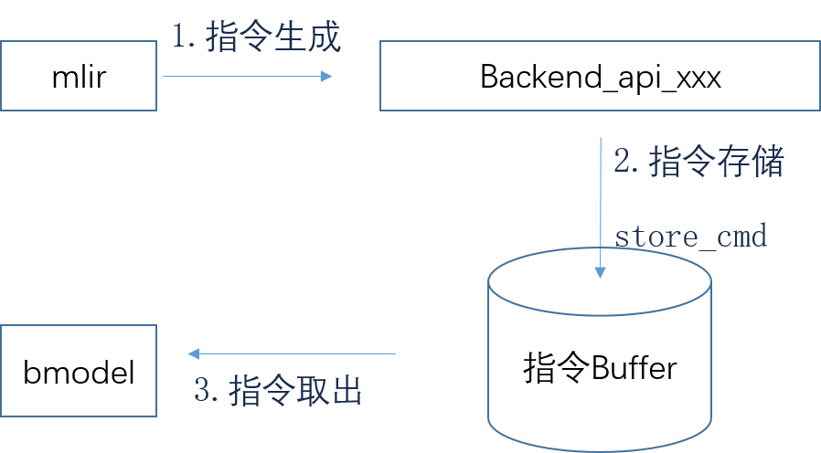
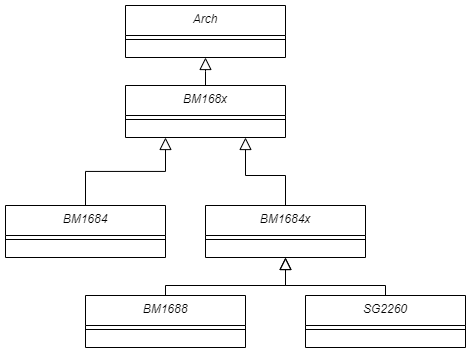

CodeGen
============
TPU-MLIR的CodeGen是BModel生成的最后一步，该过程目的是将mlir文件转换成最终的bmodel。本章主要介绍模型/算子在本工程中的CodeGen工作流程。

主要工作
----------------
CodeGen的目的在于将mlir文件转换成最终的bmodel文件输出，这个过程会执行各op的CodeGen接口，以生成cmdbuf，并用Builder模版生成采用flatbuffers格式的最终模型。

工作流程
----------------
CodeGen的大致工作流程可分为3个部分：指令生成、指令存储和指令取出以生成Bmodel。具体来说：

  指令生成：将不同硬件的后端函数封装到类，执行不同op的CodeGen接口，生成相应指令（二进制码；

  指令存储：通过store_cmd将指令（二进制码）存储在指定数据结构中；

  指令取出：所有op的二进制码全部生成完毕后，在编译器会调用BM168X系列类中封装的函数取走指令，最终生成Bmodel。

其工作流程图如下：

.. raw:: latex

   \newpage

   CodeGen工作流程

下面对CodeGen过程中所需的数据结构进行介绍:

指令依据硬件的engine不同而有所差别，比如1684有GDMA和TIU，而新架构的硬件bm1690会存在sdma、cdma等engine。这里拿最通用的两种engine即BDC(后更名为TIU)和GDMA为例：

.. code-block:: shell

    std::vector<uint32_t> bdc_buffer;
    std::vector<uint32_t> gdma_buffer;
    uint32_t gdma_total_id = 0;
    uint32_t bdc_total_id = 0;
    std::vector<uint32_t> gdma_group_id;
    std::vector<uint32_t> bdc_group_id;
    std::vector<uint32_t> gdma_bytes;
    std::vector<uint32_t> bdc_bytes;
    int cmdid_groupnum = 0;
    CMD_ID_NODE *cmdid_node;
    CMD_ID_NODE *bdc_node;
    CMD_ID_NODE *gdma_node;

bdc_buffer：存储bdc指令

gdma_buffer：存储gdma指令

gdma_total_id：gdma指令存储的总数目

bdc_total_id：bdc指令存储的总数目

gdma_bytes：gdma指令字节数

bdc_bytes：bdc指令字节数

TPU-MLIR中BM168X及其相关类
---------------------------
TPU-MLIR中BM168X及其相关类定义在include/tpu_mlir/Backend文件夹下，目的是将不同的硬件后端封装，以实现后端与Codegen过程的隔离。其继承关系如下：

.. raw:: latex

   \newpage

   TPU-MLIR中BM168X及其相关类继承关系

在一次运行中只存储一个类实例（设计模式中单例），该类初始化时候会经过：读取后端动态链接库、加载函数（设置后端的函数指针）、指令数据结构的初始化、设置一些硬件相关的参数例如NPU_NUM、L2_SRAM起始地址等。

后端函数的加载
----------------
后端作为一个动态库放入了TPU-MLIR工程里，具体的位置在third_party/nntoolchain/lib/libbackend_xxx.so。后端函数的加载方式为：首先定义函数指针，再将动态库加载，使函数指针指向动态库中的函数。

以同步函数tpu_sync_all为例，由于之后要加上多核支持的，所以需要在相关后端cmodel库中定义好，

  1.注意必须和后端的函数名和参数保持一致typedef void (*tpu_sync_all)();

  2.在类内部加入该函数成员tpu_sync_all dl_tpu_sync_all;

  3.在该类load_functions函数的实现中加入宏，CAST_FUNCTION(tpu_sync_all);该宏可以将dl_tpu_sync_all指向动态库中的函数。

获得到该类实例后即可使用动态库中的函数。

后端Store_cmd
----------------

后端store_cmd的功能是在编译器调用算子的过程中，把配置的指令保存到约定空间。后端的重点函数在store_cmd.cpp中，以cmodel/src/store_cmd.cpp；cmodel/include/store_cmd.h为例。

store_cmd分别有EngineStorer系列类和CmdStorer系列类：
  1. EngineStoreInterface（接口类）、继承于EngineStoreInterface接口的GDMAEngineStorer、BDEngineStorer等具体类、EngineStorerDecorator（装饰类接口）、继承于EngineStorerDecorator的VectorDumpEngineStorerDecorator等具体装饰类。
  2. CmdStorerInterface（接口）、继承于接口的ConcretCmdStorer、StorerDecorator、VectorDumpStorerDecorator具体装饰类。
关于类之间的关系与逻辑：
  1. 使用单例设计模式，在store_cmd中只存在一个ConcretCmdStorer类，该类中会存所有EngineStorer的类，当调用不同的engine时，会调用不同EengineStorer，如下代码。

    .. code-block:: cpp

        virtual void store_cmd(int engine_id, void *cmd, CMD_ID_NODE *cur_id_node,int port) override
        {
            switch (engine_id)
            {
            case ENGINE_BD:
            case ENGINE_GDMA:
            case ENGINE_HAU:
            case ENGINE_SDMA:
                port = 0;
                break;
            case ENGINE_CDMA:
                ASSERT(port < CDMA_NUM);
                break;
            case ENGINE_VSDMA:
                engine_id = ENGINE_SDMA;
                break;
            default:
                ASSERT(0);
                break;
            }
            return this->get(engine_id, port)->store(cmd, cur_id_node);
        }

  2. EngineStorer功能为解析命令，VectorDumpEngineStorerDecorator执行EngineStorer类中的store函数和take_cmds函数，可将所有指令存储到output_中。

    .. code-block:: cpp

        class VectorDumpEngineStorerDecorator : public EngineStorerDecorator
        {
        private:
            std::vector<uint32_t> *&output_;

            void take_cmds()
            {
                auto cmds = EngineStorerDecorator::get_cmds();
                (*output_).insert((*output_).end(), cmds.begin(), cmds.end());
            }

        public:
            VectorDumpEngineStorerDecorator(ComponentPtr component, std::vector<uint32_t> **output)
                : EngineStorerDecorator(component), output_(*output) {}

            virtual void store(void *cmd, CMD_ID_NODE *cur_id_node) override
            {
                EngineStorerDecorator::store(cmd, cur_id_node);
                if (!enabled_)
                    return;
                this->take_cmds();
            }

            virtual void store_cmd_end(unsigned dep) override
            {
                EngineStorerDecorator::store_cmd_end(dep);
                this->take_cmds();
            }
        };

