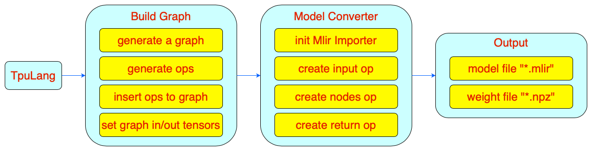
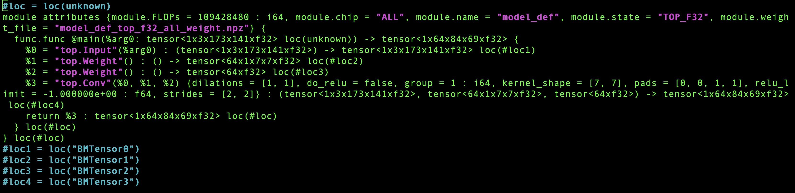

TpuLang接口
===============

本章节主要介绍使用TpuLang转换模型的流程。

主要工作
-----------
TpuLang提供了mlir对外的接口函数。用户通过TpuLang可以直接组建自己的网络，将模型转换为 Top 层(硬件无关层) mlir 模型
(不包含 Canonicalize 部分, 因此生成的文件名为“\*_origin.mlir”)。这个过程会根据输入的接口函数逐
一创建并添加算子(Op), 最终生成 mlir 文件与保存权重的 npz 文件。

工作流程
--------------------
1. 初始化：设置运行平台，创建模型Graph。

2. 添加OPS：循环添加模型的OP

   * 输入参数转为dict格式；

   * 创建输出tensor；

   * 设置tensor的量化参数(scale, zero_point)；

   * 创建op(op_type, inputs, outputs, params)并insert到graph中。

3. 设置模型的输入输出tensor。得到全部模型信息。

4. 初始化TpuLangConverter(initMLIRImporter)

5. generate_mlir

   * 依次创建 input op, 模型中间 nodes op 以及 return op, 并将其补充到 mlir 文本中(如果该 op 带有权重, 则会额外创建 weight op)

6. 输出(Output)

   * 将生成的文本转为 str 并保存为“.mlir”文件

   * 将模型权重(tensors)保存为“.npz”文件

7. 结束：释放 graph。

TpuLang转换的工作流程如图所示(:ref:`tpulang_convert`)。

.. _tpulang_convert:

   TpuLang转换流程

补充说明:
  * op 接口需要:

     - op的输入tensor(即前一个算子的输出tensor或graph输入tensor，coeff)；

     - 从接口中提取的 attrs。Attrs 会通过 MLIRImporter 设定为与 TopOps.td 定义一一对应的属性

     - 如果接口中包括量化参数(scale，zero_point)，则该参数对应的tensor需要设置(或检查)量化参数.

     - 返回该op的输出tensor(tensors)

  * 在所有算子都插入graph，并设置graph的input/output tensors之后，才会启动转换到 mlir 文本的工作。该部分由TpuLangConverter来实现。

  * TpuLang Converter转换流程与onnx前端转换流程相同，具体参考(:doc:`../05_frontend`).

算子转换样例
----------------

本节以 Conv 算子为例, 将单 Conv 算子模型转换为 Top mlir

   .. code-block:: python

      import numpy as np

      def model_def(in_shape):
         tpul.init("BM1684X")
         in_shape = [1,3,173,141]
         k_shape =[64,1,7,7]
         x = tpul.Tensor(dtype='float32', shape=in_shape)
         weight_data = np.random.random(k_shape).astype(np.float32)
         weight = tpul.Tensor(dtype='float32', shape=k_shape, data=weight_data, is_const=True)
         bias_data = np.random.random(k_shape[0]).astype(np.float32)
         bias = tpul.Tensor(dtype='float32', shape=k_shape[0], data=bias_data, is_const=True)
         conv = tpul.conv(x, weight, bias=bias, stride=[2,2], pad=[0,0,1,1], out_dtype="float32")
         tpul.compile("model_def", inputs=[x],outputs=[conv], cmp=True)
         tpul.deinit()

   单 Conv 模型

转换流程为:

1. 接口定义

   conv 接口定义如下：

      .. code-block:: python

         def conv(input: Tensor,
                  weight: Tensor,
                  bias: Tensor = None,
                  stride: List[int] = None,
                  dilation: List[int] = None,
                  pad: List[int] = None,
                  group: int = 1,
                  out_dtype: str = None,
                  out_name: str = None):
            # pass

   参数说明

   * input：Tensor类型，表示输入Tensor，4维NCHW格式。
   * weight：Tensor类型，表示卷积核Tensor，4维[oc, ic, kh, kw]格式。其中oc表示输出Channel数，ic表示输入channel数，kh是kernel_h，kw是kernel_w。
   * bias：Tensor类型，表示偏置Tensor。为None时表示无偏置，反之则要求shape为[1, oc, 1, 1]。
   * dilation：List[int]，表示空洞大小，取None则表示[1,1]，不为None时要求长度为2。List中顺序为[长，宽]
   * pad：List[int]，表示填充大小，取None则表示[0,0,0,0]，不为None时要求长度为4。List中顺序为[上， 下， 左， 右]
   * stride：List[int]，表示步长大小，取None则表示[1,1]，不为None时要求长度为2。List中顺序为[长，宽]
   * groups：int型，表示卷积层的组数。若ic=oc=groups时，则卷积为depthwise conv
   * out_dtype：string类型或None，表示输出Tensor的类型。输入tensor类型为float16/float32时，取None表示输出tensor类型与输入一致，否则取None表示为int32。取值范围：/int32/uint32/float32/float16
   * out_name：string类型或None，表示输出Tensor的名称，为None时内部会自动产生名称。

  在 TopOps.td 中定义 Top.Conv 算子, 算子定义如图所示(:ref:`conv_top_def`)

.. _conv_top_def:
.. figure:: ../assets/convop_def.png
   :align: center
   :height: 15cm

   Conv 算子定义

2. 构建 Graph

  * 初始化模型：创建空Graph。

  * 模型输入：给定shape与data type 创建输入tensor x。此处也可以指定tensor name。

  * conv接口：

      - 调用conv接口，指定输入tensor以及输入参数。

      - 生成输出tensor

         .. code-block:: python

            output = Tensor(dtype=out_dtype, name=out_name)

      - attributes，将输入参数打包成 (:ref:`conv_top_def`) 定义的attributes

         .. code-block:: python

            attr = {
               "kernel_shape": ArrayAttr(weight.shape[2:]),
               "strides": ArrayAttr(stride),
               "dilations": ArrayAttr(dilation),
               "pads": ArrayAttr(pad),
               "do_relu": Attr(False, "bool"),
               "group": Attr(group)
            }

      - 定义输出tensor

      - 插入conv op，将Top.ConvOp插入到Graph中。

      - 返回输出tensor

  * 设置Graph的输入，输出tensors。

3. init_MLIRImporter:

  根据 input_names 与 output_names 从 shapes 中获取了对应的 input_shape 与 output_shape, 加上model_name, 生成了初始的 mlir 文本 MLIRImporter.mlir_module, 如图所示(:ref:`origin_mlir`)。

.. _origin_top_mlir:
.. figure:: ../assets/origin_mlir.png
   :align: center

   初始 mlir 文本

4. generate_mlir

   * build input op, 生成的 Top.inputOp 会被插入到 MLIRImporter.mlir_module 中。

   * 调用Operation.create 来创建 Top.ConvOp, 而 create 函数需要的参数有:

      - 输入 op: 从接口定义可知, Conv 算子的 inputs 一共包含了 input, weight 与 bias, inputOp 已被创建好, weight 与 bias 的 op 则通过 getWeightOp()创建。

      - output_shape: 利用 Operator 中存储的输出 tensor 中获取其 shape。

      - Attributes: 从 Operator 中获取 attributes，并将attributes转换为MLIRImporter识别的Attributes

      Top.ConvOp 创建后会被插入到 mlir 文本中

   * 根据 output_names 从 operands 中获取相应的 op, 创建 return_op 并插入到 mlir 文本中。到此为止, 生成的 mlir 文本如图所示(:ref:`tpulang_mlir_txt`)。

.. _tpulang_mlir_txt:

   完整的 mlir 文本

5. 输出

  将 mlir 文本保存为 Conv_origin.mlir, tensors 中的权重保存为 Conv_TOP_F32_all_weight.npz。

Tpulang接口使用方式
-------------------

目前TpuLang只适用于推理框架的推理部分。
类tensorflow等框架的静态图，使用TpuLang进行网络集成时，用户需要首先使用tpul.init('processor')初始化（processor可以是BM1684X或者BM1688），
然后准备tensor，接着使用operator构建网络，最后调用tpul.compile接口编译生成bmodel。
下面详细介绍一下每一步怎么做，以下使用到的各种接口（tpul.init, deinit, Tensor以及算子接口等）都可以在appx02(:ref:`附录02：TpuLang的基本元素`)中查看到详细介绍。

以下步骤假定当前已经完成tpu-mlir发布包的加载。

初始化
~~~~~~~~~~~~~~~~~~~~~~~~~~~~~~

具体的定义参见(:ref:`初始化函数 <init>`)

   .. code-block:: python

      import transform.TpuLang as tpul
      import numpy as np

      tpul.init('BM1684X')

准备Tensor
~~~~~~~~~~~~~~~~~~~~~~~~~~~~~~

具体的定义参见(:ref:`tensor <tensor>`)

   .. code-block:: python

      shape = [1, 1, 28, 28]
      x_data = np.random.randn(*shape).astype(np.float32)
      x = tpul.Tensor(dtype='float32', shape=shape, data=x_data)

构建graph
~~~~~~~~~~~~~~~~~~~~~~~~~~~~~~
接着利用现有的OP(:ref:`operator`)和刚刚准备好的Tensor构建graph，
下面是一个简单的模型构建示例：

   .. code-block:: python

      def conv_op(x,
                  kshape,
                  stride,
                  pad=None,
                  group=1,
                  dilation=[1, 1],
                  bias=False,
                  dtype="float32"):
         oc = kshape[0]
         weight_data = np.random.randn(*kshape).astype(np.float32)
         weight = tpul.Tensor(dtype=dtype, shape=kshape, data=weight_data, ttype="coeff")
         bias_data = np.random.randn(oc).astype(np.float32)
         bias = tpul.Tensor(dtype=dtype, shape=[oc], data=bias_data, ttype="coeff")
         conv = tpul.conv(x,
                     weight,
                     bias=bias,
                     stride=stride,
                     pad=pad,
                     dilation=dilation,
                     group=group)
         return conv

      def model_def(x):
         conv0 = conv_op(x, kshape=[32, 1, 5, 5], stride=[1,1], pad=[2, 2, 2, 2], dtype='float32')
         relu1 = tpul.relu(conv0)
         maxpool2 = tpul.maxpool(relu1, kernel=[2, 2], stride=[2, 2], pad=[0, 0, 0, 0])
         conv3 = conv_op(maxpool2, kshape=[64, 32, 5, 5], stride=[1,1], pad=[2, 2, 2, 2], dtype='float32')
         relu4 =  tpul.relu(conv3)
         maxpool5 = tpul.maxpool(relu4, kernel=[2, 2], stride=[2, 2], pad=[0, 0, 0, 0])
         conv6 = conv_op(maxpool5, kshape=[1024, 64, 7, 7], stride=[1,1], dtype='float32')
         relu7 =  tpul.relu(conv6)
         softmax8 = tpul.softmax(relu7, axis=1)
         return softmax8

      y = model_def(x)

compile
~~~~~~~~~~~~~~~~~~~~~~~~~~~~~~

调用tpul.compile函数(:ref:`compile`), 编译完成后会得到 `example_f32.bmodel` ：

   .. code-block:: python

      tpul.compile("example", [x], [y], mode="f32")

deinit
~~~~~~~~~~~~~~~~~~~~~~~~~~~~~~

具体的定义参见(:ref:`反初始化函数 <deinit>`)

   .. code-block:: python

      tpul.deinit()

deploy
~~~~~~~~~~~~~~~~~~~~~~~~~~~~~~

最后使用model_deploy.py完成模型部署，具体使用方法参考定义(:ref:`model_deploy <model_deploy>`)。
