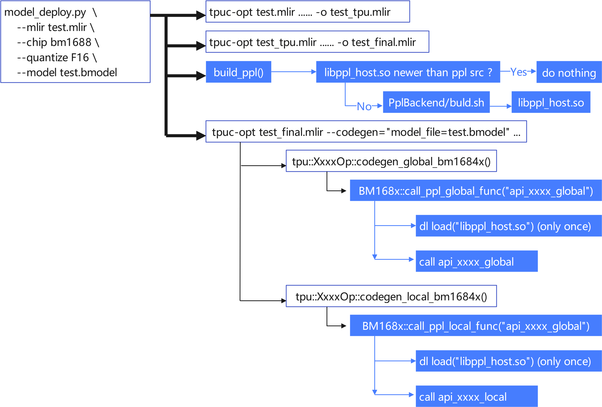

用PPL写后端算子
=========================

PPL 是基于 C/C++ 语法扩展的、针对 TPU 编程的专用编程语言 (DSL)。开发者可以通过 PPL 在 TPU-MLIR 中编写后端算子。本章节以 ``add_const_fp`` 算子为例，介绍如何编写后端算子，以及 PPL 代码是如何被编译和使用的。

PPL 后端算子的实现位于 ``tpu-mlir/lib/PplBackend/src`` 目录；如果是发布包，则在 TPU-MLIR 发布包的 ``PplBackend/src`` 目录。有关如何编写 PPL 源码的详细信息，请参考 ``tpu-mlir/third_party/ppl/doc`` 中的文档。

如何编写和调用后端算子
----------------------------

第一步：实现三个源码文件

需要创建三个源码文件，一个是设备端的 ``pl`` 源码，一个是主机端的接口 ``cpp`` 源码， 另一个是主机端的tiling函数 ``cpp`` 源码。以 ``add_const_fp`` 为例，文件名分别为：

- ``add_const_fp.pl``：实现 ``add_const_f32`` ， ``add_const_f16`` 及 ``add_const_bf16`` 等 kernel 接口。
- ``add_const_fp_tile.cpp``：实现 ``add_tiling`` 函数以调用这些 kernel 接口。
- ``add_const_fp_api.cpp``：实现 ``api_add_const_fp_global`` 函数以调用 ``add_tiling`` 接口。

**tiling.cpp文件示例**

 .. code-block:: cpp

    // 添加pl文件自动生成的头文件
    #include "add_const_fp.h"
    // 添加tpu-mlir数据类型及结构体头文件
    #include "tpu_mlir/Backend/BM168x/Param.h"

    // 需要用extern C来定义入口函数
    extern "C" {
    // 如果pl文件提供了多个算子，可以提前定义函数指针，这样可以减少一些重复代码
    // 注意pl文件中的指针类型需要用gaddr_t定义
    using KernelFunc = int (*)(gaddr_t, gaddr_t, float, int, int, int, int, int,
                               bool);
    // 添加入口函数，输入参数由用户自定义
    int add_tiling(gaddr_t ptr_dst, gaddr_t ptr_src, float rhs, int N, int C, int H,
                   int W, bool relu, int dtype) {
      KernelFunc func;
      // 根据输入数据类型，选择合适的算子
      if (dtype == DTYPE_FP32) {
        func = add_const_f32;
      } else if (dtype == DTYPE_FP16) {
        func = add_const_f16;
      } else if (dtype == DTYPE_BFP16) {
        func = add_const_bf16;
      } else {
        assert(0 && "unsupported dtype");
      }

      // 计算block size，可以将block size对齐到EU_NUM，
      // 这样可以减少内存分配失败的次数，并且因为TPU上的内存大部分是按照EU_NUM对齐的，
      // 所以不会影响到内存分配
      int block_w = align_up(N * C * H * W, EU_NUM);
      int ret = -1;
      while (block_w > 1) {
        ret = func(ptr_dst, ptr_src, rhs, N, C, H, W, block_w, relu);
        if (ret == 0) {
          return 0;
        } else if (ret == PplLocalAddrAssignErr) {
          // 当错误类型为PplLocalAddrAssignErr时，说明block size太大，
          // local 内存放不下，需要减小block size
          block_w = align_up(block_w / 2, EU_NUM);
          continue;
        } else if (ret == PplL2AddrAssignErr) {
          // 当错误类型为PplL2AddrAssignErr时，说明block size太大，
          // L2 内存放不下，需要减小block size，本示例没有分配L2内存，
          // 因此不会出现这个错误
          assert(0);
        } else {
          // 其他错误，需要debug
          assert(0);
          return ret;
        }
      }
      return ret;
    }
    }

**注意事项**

 - add_const_fp.h 头文件中包含了一些错误码和芯片相关的参数定义：
 - pl 文件中的指针需要使用gaddr_t类型定义

.. list-table:: 内置错误码
   :widths: 30 30
   :header-rows: 1

   * - 参数名
     - 说明
   * - PplLocalAddrAssignErr
     - Local内存分配失败
   * - FileErr
     -
   * - LlvmFeErr
     -
   * - PplFeErr
     - AST转IR失败
   * - PplOpt1Err
     - 优化pass opt1失败
   * - PplOpt2Err
     - 优化pass opt2失败
   * - PplFinalErr
     - 优化pass final失败
   * - PplTransErr
     - 代码生成失败
   * - EnvErr
     - 环境变量异常
   * - PplL2AddrAssignErr
     - L2内存分配失败
   * - PplShapeInferErr
     - shape推导失败
   * - PplSetMemRefShapeErr
     -
   * - ToPplErr
     -
   * - PplTensorConvErr
     -
   * - PplDynBlockErr
     -

.. list-table:: 内置芯片参数
   :widths: 30 30
   :header-rows: 1

   * - 参数名
     - 说明
   * - EU_NUM
     - EU数量
   * - LANE_NUM
     - LANE数量

第二步：调用 Kernel 接口

在 ``lib/Dialect/Tpu/Interfaces/BM1684X/AddConst.cpp`` 的 ``void tpu::AddConstOp::codegen_global_bm1684x()`` 函数中，调用 ``api_add_const_fp_global``，代码如下：

.. code-block:: cpp

    BM168x::call_ppl_global_func("api_add_const_fp_global", &param,
                                 sizeof(param), input_spec->data(),
                                 output_spec->data());

如果该算子支持局部执行，则实现 ``api_xxxxOp_local``，并使用 ``BM168x::call_ppl_local_func`` 进行调用。

.. code-block:: cpp

    BM168x::call_ppl_local_func("api_xxxx_local", &spec, sizeof(spec),
                                &sec_info, input_spec->data(),
                                output_spec->data());

以上便完成了后端算子的实现。

PPL 集成到 TPU-MLIR 的流程
----------------------------

1. 将 PPL 编译器精简后放入 ``third_party/ppl`` 目录，并更新 PPL 编译器，参考该目录下的 README.md 文件。
2. 在 ``model_deploy.py`` 中集成 PPL 源码编译，流程如图所示：

.. _ppl_flow:

   PPL Workflow
