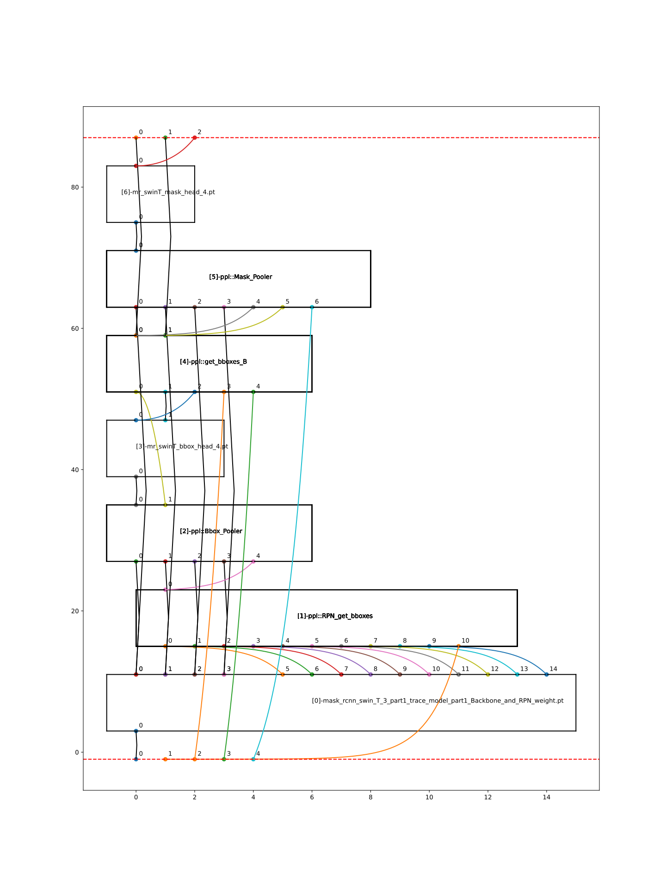

MaskRCNN 大算子接口指南
========================

MaskRCNN 基础
-------------------

两阶的 MaskRCNN 由两类组成:

- **3 个有权值模块**:  ``backbone.pt`` 和2个 ``bbox/mask`` 中间有权值层(按顺序命名为 ``torch_bbox/mask.pt`` ).
- **5 个动态无权值模块**:包括 ``RPN head``, ``bbox pooler``, ``bbox head``, ``mask pooler``, ``mask head``.

因此,完整的MaskRCNN 可以通过以下过程表示:

- **bbox 检测头**: ``backbone.pt`` => ``RPN head`` => ``bbox pooler`` => ``torch_bbox.pt`` => ``bbox head``.
- **mask 检测头**: ``backbone.pt`` => ``RPN head`` => ``mask pooler`` => ``torch_mask.pt`` => ``mask head``.

模块快速分割方法
~~~~~~~~~~~~~~~~~~~~~~~

由于 MaskRCNN  拆分依赖原框架工程的兼容情况,  用户可能无法trace每部分,本章节中以 ``mask head`` 为无法trace的例子.

MaskRCNN 的两类模块分割点,  即再次进入有权值模块首层的接入点.

MaskRCNN 大算子
-------------------

由于基于细粒度操作的MaskRCNN部署, 操作动态IR的难度较高,因此提出了以下MaskRCNN 大算子解决方案:

**粗粒度**:

1. **内置 MaskRCNN 专属后端**:现在 mlir-backend 直接支持动态无权值模块, 目前包括 ``RPN head``, ``bbox head``, ``bbox pooler`` 和 ``mask pooler``. 因此,大多数与前端推理图解析和优化相关的繁重工作得以节省, 如避免了大量动态形参推理或变种细粒度算子的支持.

2. **模型重建**:用户只需 4 个结构信息即可重建完整的 MaskRCNN:

 - **io_map**: 描述模块接口, 与MaskRCNN拓扑同构.定义为 ``(目标模块索引, 操作数索引):(源模块索引: 操作数索引)``.
 - **config.yaml**: 用于存储MaskRCNN超参数的 YAML 文件,事先提供.
 - **BackBone**: 通常从顶部到 RPN,事先从原始 MaskRCNN 中拆分.
 - **有权值模块**: ``bbox/mask`` 中间有权值层,事先从原始 MaskRCNN 中拆分.

快速入门
-------------------
在深入了解新的 MaskRCNN 特性之前,  请先了解新的 MaskRCNN yaml文件格式和单元测试.

准备您的 YAML
~~~~~~~~~~~~~~~~~~

在 ``regression/dataset/MaskRCNN/CONFIG_MaskRCNN.yaml`` 中准备了一个默认的 YAML, 其结构如下:

 - **model_transform的编译参数**:重建 MaskRCNN 的结构信息.

   - **io_map**: 即定义 ``(目标模块索引, 操作数索引):(源模块索引: 操作数索引)``,其中 -1 表示整体模型的顶层输入,-2 表示整体模型的顶层输出,0、1、2... 表示 MaskRCNN 模块的 ID.
       例如,{(0,0):(-1,0),(1,0):(0,0),(-2,0):(1,0)},表示 模块[0] 的 input[0] 来自整体模型的 input[0], 模块[1] 的 input[0] 来自 模块[0] 的 output[0],整体模型的 output[0] 来自 模块[1] 的 output[0].
   - **maskrcnn_output_num**: 整体 MaskRCNN 的最终输出操作数的数量.
   - **maskrcnn_structure**: 描述 MaskRCNN 模块顺序.1 表示 torch.pt 模型,0 表示 PPLOp.例如,[1,0,1] 表示第一个模块是  torch 模型,第二个模块是  PPLOp,第三个模块是  torch 模型.
   - **maskrcnn_ppl_op**:  后端已经用PPL实现的 MaskRCNN 算子名称.
   - **numPPLOp_InWithoutWeight_MaskRCNN**: 每个 PPLOp 的输入操作数；请不要计入权重.

 - **MaskRCNN 的超参数**: 必要 MaskRCNN 配置参数, 来自源码 MaskRCNN 框架.

模块单元测试
~~~~~~~~~~~~~~~
``--case`` 提供单试模块的选择,当前支持 4 个动态无权值模块测试: ``RPN head``, ``bbox pooler``, ``bbox head``, ``mask pooler``.

更多指导请参见 `test_MaskRCNN.py`.

.. code-block:: bash

    $ test_MaskRCNN.py --case MaskRCNN_Utest_RPNGetBboxes --debug

新前端接口API
-------------------

[步骤 1] 运行 model_transform
~~~~~~~~~~~~~~~~~~~~~~~~~~~~~~

用于将 MaskRCNN 转换为 MLIR 文件.

 - **跳过推理**:请注意, 在此步骤中不需要形参推理或计算推理, 无需输入/比较参考的 数据 ``.npz`` 文件,但需要事先提供 ``config.yaml``.
 - **跳过预处理**:请注意, 在此步骤中, 默认无预处理.
 - **新的启动符**: 注意 ``enable_maskrcnn``.

.. code-block:: bash

    $ model_transform.py \
        --model_def  backbone.pt \
        --model_extern torch_bbox.pt,torch_mask.pt \
        --model_name MaskRCNN \
        --input_shapes [[1,3,800,1216],[1,1,4741,4],[1,1,20000,4],[1,1,20000,4],[1,1,100,4]] \
        --mlir MaskRCNN.mlir \
        --enable_maskrcnn \
        --path_yaml regression/dataset/MaskRCNN/CONFIG_MaskRCNN.yaml

[步骤 2] 生成输入数据
~~~~~~~~~~~~~~~~~~~~~~~~~~~~~~
MaskRCNN 输入格式
^^^^^^^^^^^^^^^^^^^^^^^^^^^
MaskRCNN 大算子框架需要 5 个输入:

 - **预处理图片**:经过预处理的图片.
 - **max_shape_RPN/max_shape_GetBboxB**:如果输入图片的形参为 ``S1``,原始形参为 ``S0``,则最大形参为 ``int(S0 * S1 / S0)``,并扩展为常量权重张量.
 - **scale_factor_GetBboxB/scale_factor_MaskPoolerB**:如果输入图片的形参为 ``S1``,原始形参为 ``S0``,则缩放因子为 ``float(S1 / S0)``,并扩展为常量权重张量.

输入格式化工具
^^^^^^^^^^^^^^^^^

在 `tpu-mlir/python/tools/tool_maskrcnn.py` 提供了一个格式化输入数据工具,以帮助您生成满足上述要求的数据.

- **跳过预处理**: 输入图像应为经过预处理的图像，因为 MaskRCNN 的预处理过程通常很复杂，并依赖于原框架中的特定函数.

除了 ``path_yaml``，还需要指定三个参数:

 - **path_input_image**: 经过预处理的图像，保存为 npz 格式.
 - **basic_max_shape_inverse**:预处理后的高度和宽度.
 - **basic_scalar_factor**: 正是上述的 ``float(S1 / S0)``, ``basic_max_shape_inverse`` 除以原始形状重新排序后的 ``height, width``.

结果数据将存储在与 ``path_input_image`` 相同的路径中，但后缀为 ``SuperiorMaskRCNNInputPreprocessed``.

请查看 ``tool_maskrcnn.py`` 以获取更多指导.

.. code-block:: bash

    $ tool_maskrcnn.py \
      --path_yaml              ./regression/dataset/MaskRCNN/CONFIG_MaskRCNN.yaml \
      --path_input_image       Superior_IMG_BackBone.npz \
      --basic_max_shape_inverse 1216,800 \
      --basic_scalar_factor     1.8734375,1.8735363 \
      --debug

[步骤 3] 运行 model_deploy
~~~~~~~~~~~~~~~~~~~~~~~~~~~~~~~~~~~~

- **跳过推理**: 此处跳过量化比较和仿真比较。

- **强制参数**: ``--quantize`` 模式被强制为 ``F32``, ``--processor`` 被强制为 ``BM1684X``

 - **新的启动符**: 注意 ``enable_maskrcnn``.

.. code-block:: bash

    $ model_deploy.py \
        --mlir MaskRCNN.mlir \
        --quantize F32 \
        --processor BM1684X \
        --model MaskRCNN.bmodel \
        --debug \
        --enable_maskrcnn

IO_MAP 指南
--------------

手动生成 io_map 分为两个步骤:

 - **模块接口的完备定义**: 准确收集输入和输出的操作数和形参,以及模块连接.
 - **创建相应的 io_map**: 应准确且唯一地重建完整的 MaskRCNN.

[步骤 1] 描述模块接口
~~~~~~~~~~~~~~~~~~~~~~~~~~~~~~
如开始所述, 完整的 MaskRCNN 被截断为多个模块.

请为每个模块描述以下信息:

- **输入**:输入操作数或常量权重

 * **形参**:以 4 维shape表示.
 * **数据类型**:仅支持 fp32 或 int32.
 * **连接**: 每个输入找出其来源的上层模块(可能不是上一个相邻模块), 和上层模块相应输出的操作序数.

请注意, -1 表示完整 MaskRCNN 的输入, 而 -2 表示完整模型的输出

**[-1] Top_In**

.. list-table::
   :widths: 15 25 30 10
   :header-rows: 1

   * - 输入编号
     - 名称
     - 形参
     - 数据类型
   * - 输入 0)
     - 'img.1'
     - [1,3,800,1216]
     -
   * - 输入 1)
     - 'max_shape_RPN'
     - [bs,1,max_filter_num,4]
     - int32
   * - 输入 2)
     - 'max_shape_GetBboxB'
     - [1,bs*20000,1,4]
     - int32
   * - 输入 3)
     - 'scale_factor_GetBboxB'
     - [1,bs,20000,4]
     - FP32
   * - 输入 4)
     - 'scale_factor_MaskPooler'
     - [bs,1,roi_slice,4]
     - FP32

**[Torch] SubBlock-0: BackBone.pt**

.. list-table::
   :header-rows: 1

   * - IO类型
     - 名称
     - 形参
     - 数据类型
     - 连接信息[源模块-操作数序号]
   * - 输入 0)
     - 'img.1'
     - [1,3,800,1216]
     - FP32
     - from_[TOP_IN]Input-0
   * - 输出 0)
     - '11'
     - [1,256,200,304]
     - FP32
     -
   * - 输出 1)
     - '12'
     - [1,256,100,152]
     - FP32
     -
   * - 输出 2)
     - '13'
     - [1,256,50,76]
     - FP32
     -
   * - 输出 3)
     - '16'
     - [1,256,25,38]
     - FP32
     -
   * - 输出 4)
     - '15'
     - [1,256,13,19]
     - FP32
     -
   * - 输出 5)
     - '18'
     - [1,3,200,304]
     - FP32
     -
   * - 输出 6)
     - '19'
     - [1,3,100,152]
     - FP32
     -
   * - 输出 7)
     - '20'
     - [1,3,50,76]
     - FP32
     -
   * - 输出 8)
     - '21'
     - [1,3,25,38]
     - FP32
     -
   * - 输出 9)
     - '22'
     - [1,3,3,19]
     - FP32
     -
   * - 输出 10)
     - '23'
     - [1, 2,200,304]
     - FP32
     -
   * - 输出 11)
     - '24'
     - [1,12,100,152]
     - FP32
     -
   * - 输出 12)
     - '25'
     - [1,12,50,76]
     - FP32
     -
   * - 输出 13)
     - '26'
     - [1,12,25,38]
     - FP32
     -
   * - 输出 14)
     - '27'
     - [1,12,13,19]
     - FP32
     -

**[PPL] SubBlock-1: ppl::RPN_get_bboxes**

.. list-table::
   :header-rows: 1

   * - IO类型
     - 名称
     - 形参
     - 连接信息[源模块-操作数序号]
   * - 输出
     - 0 result_list
     - [bs,1,max_per_img,num_levels]
     -
   * - 输入
     - 1 cls_scores_0
     - [bs,3,200,304]
     - [Torch][SubBlock-0]Output 5)
   * - 输入
     - 2 cls_scores_1
     - [bs,3,100,152]
     - [Torch][SubBlock-0]Output 6)
   * - 输入
     - 3 cls_scores_2
     - [bs,3,50,76]
     - [Torch][SubBlock-0]Output 7)
   * - 输入
     - 4 cls_scores_3
     - [bs,3,25,38]
     - [Torch][SubBlock-0]Output 8)
   * - 输入
     - 5 cls_scores_4
     - [bs,3,13,19]
     - [Torch][SubBlock-0]Output 9)
   * - 输入
     - 6 bbox_preds_0
     - [bs,12,200,304]
     - [Torch][SubBlock-0]Output 10)
   * - 输入
     - 7 bbox_preds_1
     - [bs,12,100,152]
     - [Torch][SubBlock-0]Output 11)
   * - 输入
     - 8 bbox_preds_2
     - [bs,12,50,76]
     - [Torch][SubBlock-0]Output 12)
   * - 输入
     - 9 bbox_preds_3
     - [bs,12,25,38]
     - [Torch][SubBlock-0]Output 13)
   * - 输入
     - 10 bbox_preds_4
     - [bs,12,13,19]
     - [Torch][SubBlock-0]Output 14)
   * - 输入
     - 11 max_shape
     - [bs,1,max_filter_num,4]
     - [TOP_IN]Input-1
   * - 输入
     - 12 mlvl_anchors_0
     - [bs,1,3*200*304,4]
     - [mlir][Weight]
   * - 输入
     - 13 mlvl_anchors_1
     - [bs,1,3*100*152,4]
     - [mlir][Weight]
   * - 输入
     - 14 mlvl_anchors_2
     - [bs,1,3*50*76,4]
     - [mlir][Weight]
   * - 输入
     - 15 mlvl_anchors_3
     - [bs,1,3*25*38,4]
     - [mlir][Weight]
   * - 输入
     - 16 mlvl_anchors_4
     - [bs,1,3*13*19,4]
     - [mlir][Weight]

**[PPL] SubBlock-2: ppl::Bbox_Pooler**

.. list-table::
   :header-rows: 1

   * - IO类型
     - 名称
     - 形参
     - 连接信息[源模块-操作数序号]
   * - 输出
     - 0 result_res
     - [bs*250,256,PH,PW]
     -
   * - 输出
     - 1 result_rois
     - [bs,max_per_img,1,roi_len]
     -
   * - 输入
     - 2 feat0
     - [bs,256,H,W]
     - [Torch][SubBlock-0]Output 0)
   * - 输入
     - 3 feat1
     - [bs,256,H/2,W/2]
     - [Torch][SubBlock-0]Output 1)
   * - 输入
     - 4 feat2
     - [bs,256,H/4,W/4]
     - [Torch][SubBlock-0]Output 2)
   * - 输入
     - 5 feat3
     - [bs,256,H/8,W/8]
     - [Torch][SubBlock-0]Output 3)
   * - 输入
     - 6 rois_multi_batch
     - [bs,roi_slice,1,roi_len]
     - [PPL][SubBlock-1]result_list

**[Torch] SubBlock-3: torch_bbox.pt**

.. list-table::
   :header-rows: 1

   * - Batch
     - IO类型
     - 名称
     - 形参
     - 数据类型
     - 连接信息[源模块-操作数序号]
   * - Batch-1
     - 输入
     - 0
     - [250,256,7,7]
     - FP32
     - [PPL][SubBlock-2]result_res
   * -
     - 输出
     - 0
     - [250,81]
     - FP32
     -
   * -
     - 输出
     - 1
     - [250,320]
     - FP32
     -

**[PPL] SubBlock-4: ppl::get_bboxes_B**

.. list-table::
   :header-rows: 1

   * - Batch
     - IO类型
     - 名称
     - 形参
     - 连接信息[源模块-操作数序号]
   * - Batch 1
     - 输出
     - result_det_bboxes
     - [bs,1,100,5]
     -
   * -
     - 输出
     - result_det_labels
     - [bs,1,100,1]
     -
   * -
     - 输入
     - rois
     - [1,bs*250,1,5]
     - [PPL][SubBlock-2]1-result_rois
   * -
     - 输入
     - bbox_pred
     - [1,bs*250,1,320]
     - [Torch][SubBlock-3]Output 1
   * -
     - 输入
     - cls_score
     - [1,bs*250,1,81]
     - [Torch][SubBlock-3]Output 0
   * -
     - 输入
     - max_val
     - [1,bs*20000,1,4]
     - [TOP_IN]Input-2
   * -
     - 输入
     - scale_factor
     - [1,bs,20000,4]
     - [TOP_IN]Input-3

**[PPL] SubBlock-5: ppl::Mask_Pooler**

.. list-table::
   :header-rows: 1

   * - IO类型
     - 序号
     - 名称
     - 形参
     - 连接信息[源模块-操作数序号]
   * - 输出
     - 0
     - result_res
     - [roi_num,C,PH,PW]
     -
   * - 输入
     - 1
     - x0
     - [bs,256,H,W]
     - [Torch][SubBlock-0]Output 0
   * - 输入
     - 2
     - x1
     - [bs,C,H/2,W/2]
     - [Torch][SubBlock-0]Output 1
   * - 输入
     - 3
     - x2
     - [bs,C,H/4,W/4]
     - [Torch][SubBlock-0]Output 2
   * - 输入
     - 4
     - x3
     - [bs,C,H/8,W/8]
     - [Torch][SubBlock-0]Output 3
   * - 输入
     - 5
     - det_bboxes_multi_batch
     - [bs,1,roi_slice,roi_len]
     - [PPL][SubBlock-4]0-result_det_bboxes
   * - 输入
     - 6
     - det_labels_multi_batch
     - [bs,1,roi_slice,1]
     - [PPL][SubBlock-4]1-result_det_labels
   * - 输入
     - 7
     - scale_factor
     - [bs,1,roi_slice,4]
     - [TOP_IN]Input-4

**[Torch] SubBlock-6: torch_mask.pt**

.. list-table::
   :header-rows: 1

   * - Batch
     - IO类型
     - 序号
     - 名称
     - 形参
     - 数据类型
     - 连接信息[源模块-操作数序号]
   * - Batch 1
     - 输入
     - 0
     - input.2
     - [100,256,14,14]
     - FP32
     - [PPL][SubBlock-5]0-result_res
   * -
     - 输出
     - 0
     - 75
     - [100,80,28,28]
     - FP32
     -
   * - Batch 4
     - 输入
     - 0
     - input.2
     - [400,256,14,14]
     - FP32
     -
   * -
     - 输出
     - 0
     - 75
     - [400,80,28,28]
     - FP32
     -

**[-2] TOP_OUT**

.. list-table::
   :header-rows: 1

   * - IO类型
     - 序号
     - 形参
     - 数据类型
     - 连接信息[源模块-操作数序号]
   * - 输出
     - 0
     - [bs,1,100,5]
     - FP32
     - [PPL][SubBlock-5]0-result_det_bboxes
   * - 输出
     - 1
     - [bs,1,100,1]
     - FP32
     - [PPL][SubBlock-5]1-result_det_labels
   * - 输出
     - 2
     - [100,80,28,28]
     - FP32
     - [Torch][SubBlock-6]

[步骤 2] 描述 IO_MAP
~~~~~~~~~~~~~~~~~~~~~~~
以以下格式重新组织上述模块接口:

-  **模块名称**:一个模块的名称和序号.
-  **上层输入**:每个输入找出其来源的上层模块(可能不是上一个相邻模块), 和上层模块相应输出的操作序数.
-  **连接数**:记录输入操作数的总数.
-  **映射**: (目标模块索引, 操作数索引):(源模块索引: 操作数索引)

请注意, -1 表示完整 MaskRCNN 的输入, 而 -2 表示完整模型的输出.

**[0]TORCH_0-rpn**

- **上层输入**:

  * ← [-1]TOP_IN[0]
- **连接数**: 1
- **映射**:

  * (0,0):(-1,0)

**[1]PPL-RPNGetBboxes**

- **上层输入**:

  * ← [0]TORCH_0-rpn[5:15]
  * ← [-1]TOP_IN[1]
- **连接数**: 10
- **映射**:

  * (1,0):(0,5)
  * (1,1):(0,6)
  * (1,2):(0,7)
  * (1,3):(0,8)
  * (1,4):(0,9)
  * (1,5):(0,10)
  * (1,6):(0,11)
  * (1,7):(0,12)
  * (1,8):(0,13)
  * (1,9):(0,14)
  * (1,10):(-1,1)

**[2]PPL-Bbox_Pooler**

- **上层输入**:

  * ← [0]TORCH_0-rpn[0:4]
  * ← [1]PPL-RPNGetBboxes[0]
- **连接数**: 4 + 1
- **映射**:

  * (2,0):(0,0)
  * (2,1):(0,1)
  * (2,2):(0,2)
  * (2,3):(0,3)
  * (2,4):(1,0)

**[3]Torch-2**

- **上层输入**:

  * ← [2]PPL-Bbox_Pooler
- **连接数**: 1
- **映射**:

  * (3,0):(2,0)

**[4]PPL-GetBboxB**

- **上层输入**:

  * ← [2]PPL-Bbox_Pooler[1]
  * ← [3]Torch-2[0:2]_inverse
  * ← [-1]TOP_IN[2:4]

- **连接数**: 1 + 2 (逆向) + 2
- **映射**:

  * (4,0):(2,1)
  * (4,1):(3,1)
  * (4,2):(3,0)
  * (4,3):(-1,2)
  * (4,4):(-1,3)

**[5]ppl-MaskPooler**

- **上层输入**:

  * ← [0]Torch-RPN[0:4]
  * ← [4]PPL-GetBboxB[0:2]
  * ← [-1]TOP_IN[4]
- **连接数**: 4 + 2
- **映射**:

  * (5,0):(0,0)
  * (5,1):(0,1)
  * (5,2):(0,2)
  * (5,3):(0,3)
  * (5,4):(4,0)
  * (5,5):(4,1)
  * (5,6):(-1,4)

**[6]Torch-3**

- **上层输入**:

  * ← [5]ppl-MaskPooler
- **连接数**: 1
- **映射**:

  * (6,0):(5,0)

**[-2]TOP_OUT**

- **上层输入**:

  * ← [4]PPL-GetBboxB[0:2]
  * ← [6]Torch-3
- **连接数**: 2 + 1
- **映射**:

  * (-2,0):(4,0)
  * (-2,1):(4,1)
  * (-2,2):(6,0)

IO_MAP参数整理
~~~~~~~~~~~~~~~~~~~~~~~
收集上述所有映射信息后,生成 io_map 字典:

- **io_map**: {(0,0):(-1,0),(1,0):(0,5),(1,1):(0,6),(1,2):(0,7),(1,3):(0,8),(1,4):(0,9),(1,5):(0,10),

  (1,6):(0,11),(1,7):(0,12),(1,8):(0,13),(1,9):(0,14),(1,10):(-1,1),(2,0):(0,0),(2,1):(0,1),(2,2):(0,2),

  (2,3):(0,3),(2,4):(1,0),(3,0):(2,0),(4,0):(2,1),(4,1):(3,1),(4,2):(3,0),(4,3):(-1,2),(4,4):(-1,3),

  (5,0):(0,0),(5,1):(0,1),(5,2):(0,2),(5,3):(0,3),(5,4):(4,0),(5,5):(4,1),(5,6):(-1,4),(6,0):(5,0),

  (-2,0):(4,0),(-2,1):(4,1),(-2,2):(6,0)}

现直接在 ``model_transform`` 中使用它,  编译过程中将生成一个 ``revised_io_map_${model_name}.svg`` 图片,以帮助您检查和可视化 io_map, 如下图.

.. _io_map 可视化 :

mAP 推理
-----------------------------------------
转换和部署这样的粗粒度 MaskRCNN 进行到这里还不够, 要在 COCO2017 数据集上mAP推理,  需要仔细地接入原始推理框架.

有关更多推断细节,请参阅我们的 model-zoo 项目.
