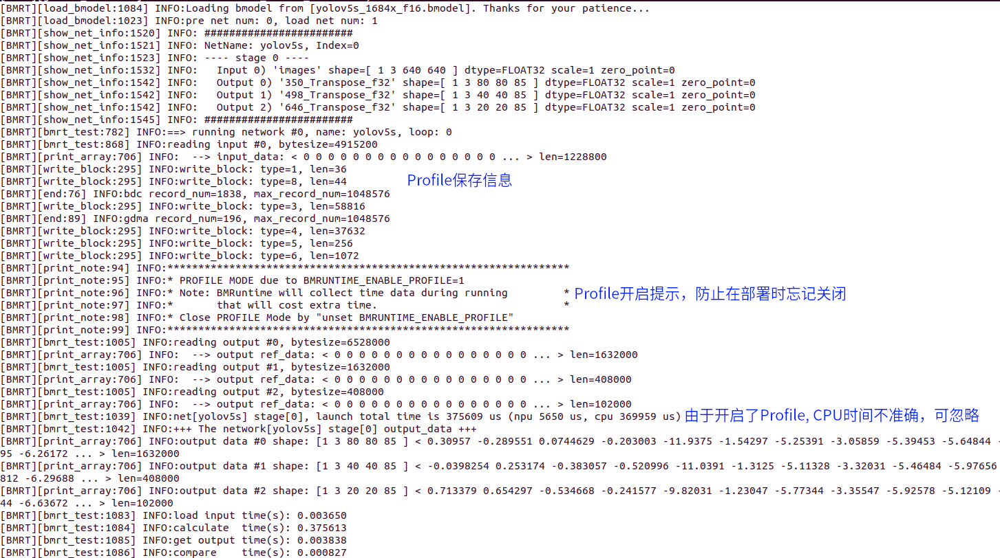
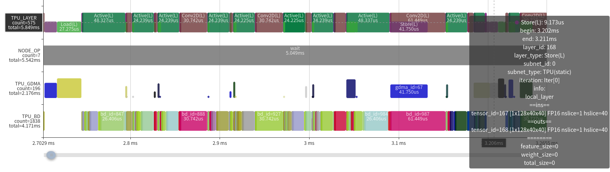
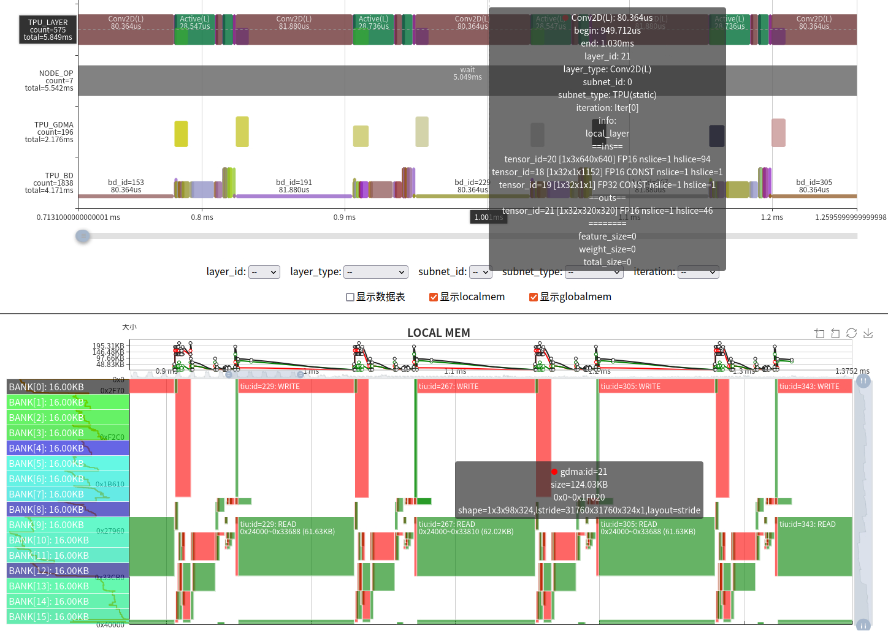

TPU Profile工具使用及分析
============================

1. TPU软件与硬件架构
-----------------------

完整的TPU推理应用是通过软硬件相互配合完成的，如下图所示：

软件方面，Host端实现了libsophon、驱动两个软件包。驱动负责对实际的Host与设备基础通信和资源管理机制的抽象，提供了基础的功能接口。对于TPU推理来说，libsophon提供了具体的功能，其中BMLib(`libbmlib.so`)实现对驱动接口封装，提供兼容保证，简化调用流程，提升编程的效率和可移植性，TPU-RUNTIME(`libbmrt.so`)提供了模型(bmodel)的加载、管理与执行等功能。

硬件方面，TPU内部主要由MCU、GDMA、TIU三个engine来完成工作的。

- MCU在BM1684X上是一个单核的A53处理器，通过firmware固件程序完成向GDMA、TIU两个engine下发命令、驱动通信、简单计算等具体功能，实现了算子的具体逻辑。
- GDMA和TIU是实际的执行引擎，GDMA用于Global mem与Local mem之间传输数据，实现了1D、矩阵、4D等数据搬运功能；TIU对local mem中的数据执行密集计算命令，包括卷积、矩阵乘法、算术等原子操作。

.. image:: ../assets/framework_for_profile.png
   :alt: Framework For TPU

TPU Profile是将Profile数据转换为可视化网页的工具。Profile数据的来源包括内部GDMA PMU和TIU PMU两个硬件模块记录的运行计时数据、各个软件模块关键函数信息、bmodel里的元数据等。这些数据是在编译模型、以及应用运行时收集的。在实际部署中，默认是关闭的，可以通过环境变量来开启。

本文主要是利用Profile数据及TPU Profile工具，可视化模型的完整运行流程，来让读者对TPU内部有一个直观的认识。

2. 编译bmodel
--------------------

(本操作及下面操作会用到 `TPU-MLIR <https://github.com/sophgo/tpu-mlir>`_)

由于Profile数据会编译中的一些layer信息保存到bmodel中，导致bmodel体积变大，所以默认是关闭的。打开方式是在调用 `model_deploy.py` 加上 ``--debug`` 选项。如果在编译时未开启该选项，运行时开启Profile得到的数据在可视化时，会有部分数据缺失。

下面以 tpu-mlir 工程中的 yolov5s 模型来演示。

.. code-block:: shell

   # 生成 top mlir
   model_transform.py \
       --model_name yolov5s \
       --model_def ../yolov5s.onnx \
       --input_shapes [[1,3,640,640]] \
       --mean 0.0,0.0,0.0 \
       --scale 0.0039216,0.0039216,0.0039216 \
       --keep_aspect_ratio \
       --pixel_format rgb \
       --output_names 350,498,646 \
       --test_input ../image/dog.jpg \
       --test_result yolov5s_top_outputs.npz \
       --mlir yolov5s.mlir

.. code-block:: shell

   # 将top mlir转换成fp16精度的bmodel
   model_deploy.py \
     --mlir yolov5s.mlir \
     --quantize F16 \
     --chip bm1684x \
     --test_input yolov5s_in_f32.npz \
     --test_reference yolov5s_top_outputs.npz \
     --model yolov5s_1684x_f16.bmodel \
     --debug # 记录profile数据

通过以上命令，将 ``yolov5s.onnx`` 编译成了 ``yolov5s_bm1684x_f16.bmodel``。更多用法可以参见 `TPU-MLIR <https://github.com/sophgo/tpu-mlir>`_。

3. 生成Profile原始数据
---------------------------

同编译过程，运行时的Profile功能默认是关闭的，防止在做profile保存与传输时产生额外时间消耗。需要开启profile功能时，在运行编译好的应用前设置环境变量 ``BMRUNTIME_ENABLE_PROFILE=1`` 即可。下面用libsophon中提供的模型测试工具 ``bmrt_test`` 来作为应用，生成profile数据。

.. code-block:: shell

   # 通过环境变量(BMRUNTIME_ENABLE_PROFILE)使能profile, 生成二进制数据
   BMRUNTIME_ENABLE_PROFILE=1 bmrt_test --bmodel resnet50_fix8b.bmodel

下面是开启Profile后运行输出的日志：

同时在当前目录生成 ``bmprofile_data-1`` 文件夹, 为全部的Profile数据。

4. 可视化Profile数据
---------------------------

tpu-mlir提供了 ``tpu_profile.py`` 脚本，来把生成的二进制profile数据转换成网页文件，来进行可视化。命令如下：

.. code-block:: shell

   # 将bmprofile_data_0目录的profile原始数据转换成网页放置到bmprofile_out目录
   # 如果有图形界面，会直接打开浏览器，直接看到结果
   tpu_profile.py bmprofile_data-1 bmprofile_out

   ls bmprofile_out
   # echarts.min.js  profile_data.js  result.html

用浏览器打开 ``bmprofile_out/result.html`` 可以看到profile的图表。

此外，该工具还有其他用法，可以通过 ``tpu_profile.py --help`` 来查看。

5. 结果分析
--------------

5.1 整体界面说明
~~~~~~~~~~~~~~~~~~~~~

完整界面大致可分为运行时序图和内存时空图。默认情况下内存时空图是折叠的，需要通过界面的“显示LOCALMEM”和“显示GLOBAL MEM”来展开。

下面对这两部分分别说明如何来分析TPU运行状态：

.. image:: ../assets/whole_time_chart.png
   :alt: 运行时序图

上图是运行时序图，根据图中标号说明如下：

0. 在做Profile时，在Host的时间可能不准确，该部分仅用于表示子网分隔标记。
1. 该行表示的是整个网络中各个Layer的时序，是由下面的TPU_GDMA, TPU_BD(TIU)实际运行衍生计算得来。一个Layer Group会将一段算子分成数据搬运和计算两部分，并且是并行运行的，所以用半高的色块表示数据搬运，全高表示计算，避免重叠。
2. 该行表示MCU上的操作，记录的关键函数包括设置GDMA、TIU指令及等待完成等。加和后通常可以表示完整的实际运行时间。
3. 该行表示TPU中GDMA操作的时序。其中色块的高度表示实际使用的数据传输带宽大小。
4. 该行表示TPU中TIU操作的时序。其中色块高度表示该计算的有效利用率。

从NODE_OP的下方的统计 ``total=5.542ms``，说明整个网络运行时间是5.542ms，也可以看出在实际网络运行时，配置指令只占非常短的时间，大部时间在等待。

整体运行过程可以分为三个部分 A 段, B–E 段, F 段。其中，A 段是利用MCU将用户空间的输入数据搬运到计算指令空间；F 段是利用MCU将计算指令空间的输出数据搬回到用户空间。下面主要对 B–E 段的模型计算过程进行说明。

熟悉 `TPU-MLIR <https://github.com/sophgo/tpu-mlir>`_ 的同学应该清楚，完整的网络并不是 Layer By Layer 来运行的，中间会经过将多个 Layer 根据硬件资源和调度关系进行融合，将加载、计算、保存分离出来，去掉中间不必要的数据搬进与搬出，形成一个 Layer Group，并划分成多个 Slice 来周期运行。整个网络根据结构可能会分成多个 Layer Group。可以观察 B、C、D 段的 Layer Pattern，中间有半高的加载保存操作，而且呈现了一定周期的循环，根据这些，我们可以判断出 B、C、D 是三个被融合后的 Layer Group。而且后面 E 段并没有明显的周期，这几个 Layer 是没有被融合的 Global Layer。整体上看，网络中只有 20% 的部分没有被融合，在这个层面上看，网络结构对于编译器相对比较友好。

.. image:: ../assets/whole_mem_chart.png
   :alt: 内存时空图

上图是整体的内存时空图，包括了 LOCAL MEM 和 GLOBAL MEM 上下两部分。横轴表示时间，可以结合上面的运行时序图来看。纵轴表示内存空间范围。图中绿色块高度表示占用空间大小，宽度表示占用时间长短，此外，红色表示 GDMA 写入或 TIU 输出，绿色表示 GDMA 读取或 TIU 输入。

- LOCAL MEM 是 TPU 内部计算空间，对于 BM1684X 来说，TIU 一共有 64 个 Lane，每个 Lane 可使用 128KB 的内存，并分为了 16 个 bank。由于各个 Lane 的操作与内存是一致的，故图中只放了 Lane0 的内存占用情况。在计算过程中，还有一个需要注意的地方，计算的输入和输出最好不要在同一个 Bank 上，由于数据读写冲突，会影响计算效率。
- GLOBAL MEM 空间相对比较庞大，通常在 4GB–12GB 范围，为方便显示，只针对运行时使用的空间块进行显示。由于只有 GDMA 能与 GLOBAL MEM 通信，故绿色表示 GDMA 的读取操作，红色表示 GDMA 的写入操作。

从内存时空图中可以看出，对于 Layer Group 来说，Local Mem 的使用也呈周期性；TIU 的输入和输出通常是在每个 Bank 边界上，并且没有冲突。仅就这个网络来说，Local Mem 占用空间相对均匀，整个范围都有分布。从 GLOBAL MEM 的时空图上可以看到，以 Layer Group 运行时，写数据操作相对较少，读数据偏多。而在 Global Layer 运行时，会经过写回->读出->写回->…等操作。

此外，还可以看到运行时的 GLOBAL MEM 空间占用细节，可以分解为 Coeff 占用 14.07MB、Runtime 占用 15.20MB、Tensor 占用 6.23MB。

5.2 Global Layer
~~~~~~~~~~~~~~~~~~~~~

下面以比较简单的 Global Layer 来分析，根据 Layer 信息，Cast 的前一层由于是 Permute（图中未显示）导致无法与其他算子融合。

.. image:: ../assets/global_layer_time_chart.png
   :alt: Global Layer 时间图

.. image:: ../assets/global_layer_mem_chart.png
   :alt: Global Layer 内存图

从 Layer 上可以看到参数信息，当前层是将 1×3×80×80×85 的 fp16 tensor 数据转换为 fp32。计算过程为：

   time --------------------------------------->

   Load0 | Compute0 | Store0   |          |
         | Load1    | Compute1 | Store1   |
         |          | Load2    | Compute2 | Store2

由于只有一个 GDMA 器件，Load 和 Store 只能串行执行，所以流水变成了：

   time --------------------------------------->

   GDMA: Load0 | Load1    | Store0, Load2  | Store1   | Store2
   TIU:        | Compute0 | Compute1       | Compute2 |

从对应的内存时空图也可以看出完整的数据流动关系，输入数据是 fp16 转换到输出 fp32 后，内存翻倍了，因而传输时间大概为原来的两倍。

在计算过程中虽然已经做到流水并行，但由于受带宽限制，无法满足算力的需要，所以整个运行时间取决于数据搬进与搬出的时间。从另一方面也说明了 Layer 融合的必要性。

5.3 Local Layer Group
~~~~~~~~~~~~~~~~~~~~~~~~~

根据上面的 Layer Group 的情况，分为两种 case 来分析:

1. 效率较高的情况。主要特征是：

   - 除了前面和后面，中间的只有很少的 GDMA 操作，显著地减少了数据的搬进搬出。
   - TIU 操作效率都比较高，几乎算力全部是有效的。
   - TIU 操作之间没有空隙（也是因为 GDMA 传输时间比较短）。

   在这种情况下，可提升的空间非常有限了，只能从网络结构或其他方面来优化。

2. 算力利用率比较低的情况。这种情况主要是网络算子参数与 TPU 架构不友好造成的。我们的 BM1684X 上有 64 个 Lane，对应于输入的 IC，也就是说输入 IC 是 64 的倍数才能充分利用 TIU 的 Conv 原子操作。但从图中参数可以看到网络 Conv 的输入 Channel 为 3，导致有效计算只有 3/64。

遇到参数不友好的情况，有以下几种解决办法：

- 充分利用 LOCAL MEM 增大 Slice 以减少循环次数；
- 利用一些变换，如数据排列，来充分利用 TPU。其实对于首层为输入 Channel 为 3 的情况，我们引入了一种 3IC 的技术，已经解决了这种计算效率低的问题；
- 修改原始代码，调整相关计算。

在实际中，也遇到过很多无法避免的效率低下的情况，只能随着我们对 TPU 计算理解逐步加深，通过改进 TPU 架构或指令来解决。

6. 总结
-----------

本文演示了对 TPU 做 Profile 的完整流程，并介绍了如何利用 Profile 的可视化图表来分析 TPU 中的运行过程与问题。

Profile 工具对我们开发 AI 编译器来说，是一个必要的工具。我们不仅需要在理论上分析和思考优化手段和方法，还需要从芯片内部实际运行角度来观察计算过程中的瓶颈，为软件和硬件设计和演进提供深层次的信息。另外，Profile 工具也为我们 Debug 提供了一种手段，可以直观地发现错误，比如内存踩踏、同步出错等问题。

此外，TPU Profile 的显示功能在不断完善中。
