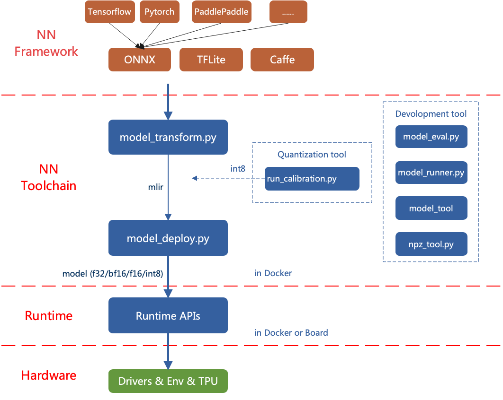

TPU-MLIR Introduction
=====================

TPU-MLIR is the Tensor Computing Processor compiler project for Depp Learning processors. This project provides a complete toolchain, which can convert pre-trained neural networks under different frameworks into binary files ``bmodel`` that can be efficiently run on tensor computing processors.
The code has been open-sourced to github.

The overall architecture of TPU-MLIR is shown in the figure (:ref:`framework`).

.. _framework:

   TPU-MLIR overall architecture

The current directly supported frameworks are PyTorch, ONNX, TFLite and Caffe. Models from other frameworks need to be converted to onnx models. The method of converting models from other frameworks to onnx can be found on the onnx official website:
https://github.com/onnx/tutorials.

To convert a model, firstly you need to execute it in the specified docker. With the required environment, conversion work can be done in two steps, converting the original model to mlir file by ``model_transform`` and converting the mlir file to bmodel/cvimodel by ``model_deploy``. To obtain an INT8 model, you need to call ``run_calibration`` to generate a calibration table and pass it to ``model_deploy``.

If the INT8 model does not meet the accuracy requirements, ``search_qtable`` can be used to generate a quantization table that decides which layers run in floating point, and the resulting table is passed to ``model_deploy`` to produce a mixed-precision model.

This article mainly introduces the process of this model conversion.
