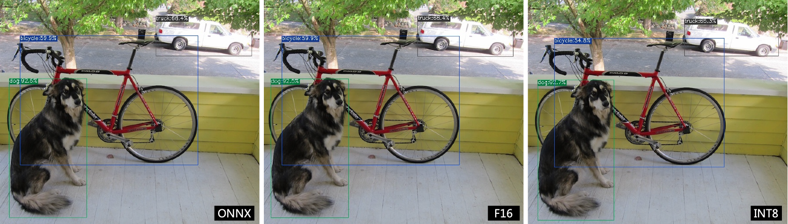

Compile the ONNX model
======================

This chapter takes ``yolov5s.onnx`` as an example to introduce how to compile
and transfer an onnx model to run on the BM1684X platform.

The model is from the official website of yolov5: https://github.com/ultralytics/yolov5/releases/download/v6.0/yolov5s.onnx

This chapter requires the tpu_mlir python package.

.. list-table::
   :widths: 35 20 30
   :header-rows: 1

   * - platform
     - file name
     - info
   * - cv183x/cv182x/cv181x/cv180x
     - xxx.cvimodel
     - please refer to the :ref:`CV18xx Guidance <onnx to cvimodel>`
   * - Other
     - xxx.bmodel
     - please refer to the :ref:`following <onnx to bmodel>`

.. _onnx to bmodel:

Install tpu_mlir
------------------

Go to the Docker container and execute the following command to install tpu_mlir:

.. code-block:: shell

   $ pip install tpu_mlir[onnx]
   # or
   $ pip install tpu_mlir-*-py3-none-any.whl[onnx]

Prepare working directory
-------------------------

.. include:: get_resource.rst

Create a ``model_yolov5s`` directory, and put both model files and image files into the ``model_yolov5s`` directory.

The operation is as follows:

.. code-block:: shell
   :linenos:

   $ mkdir model_yolov5s && cd model_yolov5s
   $ wget https://github.com/ultralytics/yolov5/releases/download/v6.0/yolov5s.onnx
   $ cp -rf tpu_mlir_resource/dataset/COCO2017 .
   $ cp -rf tpu_mlir_resource/image .
   $ mkdir workspace && cd workspace

ONNX to MLIR
------------------

If the input is image, we need to know the preprocessing of the model before transferring it. If the model uses preprocessed npz files as input, no preprocessing needs to be considered.
The preprocessing process is formulated as follows ( :math:`x` represents the input):

.. math::

   y = (x - mean) \times scale

The image of the official yolov5 is rgb. Each value will be multiplied by ``1/255``, respectively corresponding to
``0.0,0.0,0.0`` and ``0.0039216,0.0039216,0.0039216`` when it is converted into mean and scale.

The model conversion command is as follows:

.. code-block:: shell

   $ model_transform \
       --model_name yolov5s \
       --model_def ../yolov5s.onnx \
       --input_shapes [[1,3,640,640]] \
       --mean 0.0,0.0,0.0 \
       --scale 0.0039216,0.0039216,0.0039216 \
       --keep_aspect_ratio \
       --pixel_format rgb \
       --output_names 350,498,646 \
       --test_input ../image/dog.jpg \
       --test_result yolov5s_top_outputs.npz \
       --mlir yolov5s.mlir

.. _model_transform param:

The main parameters of ``model_transform`` are described as follows (for a complete introduction, please refer to the user interface chapter of the TPU-MLIR Technical Reference Manual):

.. list-table:: Function of model_transform parameters
   :widths: 20 12 50
   :header-rows: 1

   * - Name
     - Required?
     - Explanation
   * - model_name
     - Y
     - Model name
   * - model_def
     - Y
     - Model definition file (e.g., ``.onnx`` , ``.tflite`` or ``.prototxt`` files)
   * - input_shapes
     - N
     - Shape of the inputs, such as ``[[1,3,640,640]]`` (a two-dimensional array), which can support multiple inputs
   * - input_types
     - N
     - Type of the inputs, such int32; separate by ',' for multi inputs; float32 as default
   * - resize_dims
     - N
     - The size of the original image to be adjusted to. If not specified, it will be resized to the input size of the model
   * - keep_aspect_ratio
     - N
     - When the size of test_input is different from input_shapes, whether to keep the aspect ratio when resizing, the default is false; when set, the insufficient part will be padded with 0
   * - mean
     - N
     - The mean of each channel of the image. The default is 0.0,0.0,0.0
   * - scale
     - N
     - The scale of each channel of the image. The default is 1.0,1.0,1.0
   * - pixel_format
     - N
     - Image type, can be rgb, bgr, gray or rgbd. The default is bgr
   * - channel_format
     - N
     - Channel type, can be nhwc or nchw for image input, otherwise it is none. The default is nchw
   * - output_names
     - N
     - The names of the output. Use the output of the model if not specified, otherwise use the specified names as the output
   * - test_input
     - N
     - The input file for validation, which can be an jpg, npy or npz file. No validation will be carried out if it is not specified
   * - test_result
     - N
     - Output file to save verification result with suffix ``.npz``
   * - excepts
     - N
     - Names of network layers that need to be excluded from validation. Separated by comma
   * - mlir
     - Y
     - Specify the output mlir file name and path, with the suffix ``.mlir``

After converting to an mlir file, a ``${model_name}_in_f32.npz`` file will be generated, which is the input file for the subsequent models.

MLIR to F16 bmodel
------------------

To convert the mlir file to the f16 bmodel, we need to run:

.. code-block:: shell

   $ model_deploy \
       --mlir yolov5s.mlir \
       --quantize F16 \
       --processor bm1684x \
       --test_input yolov5s_in_f32.npz \
       --test_reference yolov5s_top_outputs.npz \
       --tolerance 0.99,0.99 \
       --model yolov5s_1684x_f16.bmodel

.. _model_deploy param:

The main parameters of ``model_deploy`` are as follows (for a complete introduction, please refer to the user interface chapter of the TPU-MLIR Technical Reference Manual):

.. list-table:: Function of model_deploy parameters
   :widths: 18 12 50
   :header-rows: 1

   * - Name
     - Required?
     - Explanation
   * - mlir
     - Y
     - Mlir file
   * - quantize
     - Y
     - Quantization type (e.g., F32/F16/BF16/INT8), the quantization types supported by different processors are shown in the table below.
   * - processor
     - Y
     - The platform that the model will use. Support bm1690/bm1688/bm1684x/bm1684/cv186x/cv183x/cv182x/cv181x/cv180x.
   * - calibration_table
     - N
     - The calibration table path. Required when it is INT8/F8E4M3 quantization
   * - tolerance
     - N
     - Tolerance for the minimum similarity between MLIR quantized and MLIR fp32 inference results
   * - test_input
     - N
     - The input file for validation, which can be an jpg, npy or npz file. No validation will be carried out if it is not specified
   * - test_reference
     - N
     - Reference data for validating mlir tolerance (in npz format). It is the result of each operator
   * - compare_all
     - N
     - Compare all tensors, if set.
   * - excepts
     - N
     - Names of network layers that need to be excluded from validation. Separated by comma
   * - op_divide
     - N
     - cv183x/cv182x/cv181x/cv180x only, Try to split the larger op into multiple smaller op to achieve the purpose of ion memory saving, suitable for a few specific models
   * - model
     - Y
     - Name of output model file (including path)
   * - num_core
     - N
     - When the target is selected as bm1688, it is used to select the number of tpu cores for parallel computing, and the default setting is 1 tpu core
   * - skip_validation
     - N
     - Skip bmodel correctness verification to boost deployment efficiency; bmodel verification is on by default

.. list-table:: Quantization types supported by different processors
   :widths: 18 15
   :header-rows: 1

   * - Processor
     - Supported quantize
   * - BM1688
     - F32/F16/BF16/INT8/INT4
   * - BM1684X
     - F32/F16/BF16/INT8
   * - BM1684
     - F32/INT8
   * - CV186X
     - F32/F16/BF16/INT8/INT4
   * - CV183X/CV182X/CV181X/CV180X
     - BF16/INT8
   * - BM1690
     - F32/F16/BF16/INT8/F8E4M3/F8E5M2

After compilation, a file named ``yolov5s_1684x_f16.bmodel`` is generated.

MLIR to INT8 bmodel
-------------------

Calibration table generation
~~~~~~~~~~~~~~~~~~~~~~~~~~~~

Before converting to the INT8 model, you need to run calibration to get the calibration table. The number of input data is about 100 to 1000 according to the situation.

Then use the calibration table to generate a symmetric or asymmetric bmodel. It is generally not recommended to use the asymmetric one if the symmetric one already meets the requirements, because
the performance of the asymmetric model will be slightly worse than the symmetric model.

Here is an example of the existing 100 images from COCO2017 to perform calibration:

.. code-block:: shell

   $ run_calibration yolov5s.mlir \
       --dataset ../COCO2017 \
       --input_num 100 \
       -o yolov5s_cali_table

After running the command above, a file named ``yolov5s_cali_table`` will be generated, which is used as the input file for subsequent compilation of the INT8 model.

Compile to INT8 symmetric quantized model
~~~~~~~~~~~~~~~~~~~~~~~~~~~~~~~~~~~~~~~~~

Execute the following command to convert to the INT8 symmetric quantized model:

.. code-block:: shell

   $ model_deploy \
       --mlir yolov5s.mlir \
       --quantize INT8 \
       --calibration_table yolov5s_cali_table \
       --processor bm1684x \
       --test_input yolov5s_in_f32.npz \
       --test_reference yolov5s_top_outputs.npz \
       --tolerance 0.85,0.45 \
       --model yolov5s_1684x_int8_sym.bmodel

After compilation, a file named ``yolov5s_1684x_int8_sym.bmodel`` is generated.

Effect comparison
----------------------

In tpu_mlir package, there are yolov5 use cases written in python, using the ``detect_yolov5`` command to detect objects in images.

This command corresponds to the source code path ``{package/path/to/tpu_mlir}/python/samples/detect_yolov5.py``.

It can be learned how the model is used by reading the code. Firstly, preprocess to get the model's input, then do inference to get the output, and finally do post-processing.

Use the following codes to validate the inference results of onnx/f16/int8 respectively.

The onnx model is run as follows to get ``dog_onnx.jpg``:

.. code-block:: shell

   $ detect_yolov5 \
       --input ../image/dog.jpg \
       --model ../yolov5s.onnx \
       --output dog_onnx.jpg

The f16 bmodel is run as follows to get ``dog_f16.jpg`` :

.. code-block:: shell

   $ detect_yolov5 \
       --input ../image/dog.jpg \
       --model yolov5s_1684x_f16.bmodel \
       --output dog_f16.jpg

The int8 symmetric bmodel is run as follows to get ``dog_int8_sym.jpg``:

.. code-block:: shell

   $ detect_yolov5 \
       --input ../image/dog.jpg \
       --model yolov5s_1684x_int8_sym.bmodel \
       --output dog_int8_sym.jpg

The result images are compared as shown in the figure (:ref:`yolov5s_result`).

.. _yolov5s_result:

   Comparison of TPU-MLIR for YOLOv5s' compilation effect

Due to different operating environments, the final performance will be somewhat different from :numref:`yolov5s_result`.

Model performance test
----------------------

The following operations need to be performed outside of Docker,

Install the ``libsophon``
~~~~~~~~~~~~~~~~~~~~~~~~~

Please refer to the ``libsophon`` manual to install ``libsophon``.

Check the performance of ``BModel``
~~~~~~~~~~~~~~~~~~~~~~~~~~~~~~~~~~~

After installing ``libsophon``, you can use ``bmrt_test`` to test the accuracy and performance of the ``bmodel``. You can choose a suitable model by estimating the maximum fps of the model based on the output of ``bmrt_test``.

.. code-block:: shell

   # Test the bmodel compiled above
   # --bmodel parameter followed by bmodel file,

   $ cd path/to/model_yolov5s/workspace
   $ bmrt_test --bmodel yolov5s_1684x_f16.bmodel
   $ bmrt_test --bmodel yolov5s_1684x_int8_sym.bmodel

Take the output of the last command as an example (the log is partially truncated here):

.. code-block:: shell
   :linenos:

   [BMRT][load_bmodel:983] INFO:pre net num: 0, load net num: 1
   [BMRT][show_net_info:1358] INFO: ########################
   [BMRT][show_net_info:1359] INFO: NetName: yolov5s, Index=0
   [BMRT][show_net_info:1361] INFO: ---- stage 0 ----
   [BMRT][show_net_info:1369] INFO:   Input 0) 'images' shape=[ 1 3 640 640 ] dtype=FLOAT32
   [BMRT][show_net_info:1378] INFO:   Output 0) '350_Transpose_f32' shape=[ 1 3 80 80 85 ] ...
   [BMRT][show_net_info:1378] INFO:   Output 1) '498_Transpose_f32' shape=[ 1 3 40 40 85 ] ...
   [BMRT][show_net_info:1378] INFO:   Output 2) '646_Transpose_f32' shape=[ 1 3 20 20 85 ] ...
   [BMRT][show_net_info:1381] INFO: ########################
   [BMRT][bmrt_test:770] INFO:==> running network #0, name: yolov5s, loop: 0
   [BMRT][bmrt_test:834] INFO:reading input #0, bytesize=4915200
   [BMRT][print_array:702] INFO:  --> input_data: < 0 0 0 0 0 0 0 0 0 0 0 0 0 0 0 0 ...
   [BMRT][bmrt_test:982] INFO:reading output #0, bytesize=6528000
   [BMRT][print_array:702] INFO:  --> output ref_data: < 0 0 0 0 0 0 0 0 0 0 0 0 0 0...
   [BMRT][bmrt_test:982] INFO:reading output #1, bytesize=1632000
   [BMRT][print_array:702] INFO:  --> output ref_data: < 0 0 0 0 0 0 0 0 0 0 0 0 0 0...
   [BMRT][bmrt_test:982] INFO:reading output #2, bytesize=408000
   [BMRT][print_array:702] INFO:  --> output ref_data: < 0 0 0 0 0 0 0 0 0 0 0 0 0 0...
   [BMRT][bmrt_test:1014] INFO:net[yolov5s] stage[0], launch total time is 4122 us (npu 4009 us, normal 113 us)
   [BMRT][bmrt_test:1017] INFO:+++ The network[yolov5s] stage[0] output_data +++
   [BMRT][print_array:702] INFO:output data #0 shape: [1 3 80 80 85 ] < 0.301003    ...
   [BMRT][print_array:702] INFO:output data #1 shape: [1 3 40 40 85 ] < 0 0.228689  ...
   [BMRT][print_array:702] INFO:output data #2 shape: [1 3 20 20 85 ] < 1.00135     ...
   [BMRT][bmrt_test:1058] INFO:load input time(s): 0.008914
   [BMRT][bmrt_test:1059] INFO:calculate  time(s): 0.004132
   [BMRT][bmrt_test:1060] INFO:get output time(s): 0.012603
   [BMRT][bmrt_test:1061] INFO:compare    time(s): 0.006514

The following information can be learned from the output above:

1. Lines 05-08: the input and output information of bmodel
2. Line 19: running time on the Tensor Computing Processor, of which the processor takes 4009us and the non-accelerated part takes 113us. The time of the latter mainly refers to the waiting time of calling at HOST
3. Line 24: the time to load data into the NPU's DDR
4. Line 25: the total time of Line 19
5. Line 26: the output data retrieval time
