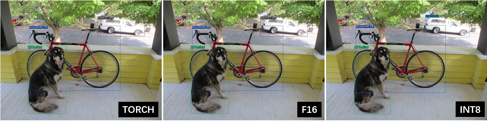

Compile the Torch Model
=======================

This chapter takes ``yolov5s.pt`` as an example to introduce how to compile and transfer an pytorch model to run on the BM1684X platform.

This chapter requires the tpu_mlir python package.

Install tpu_mlir
------------------

Go to the Docker container and execute the following command to install tpu_mlir:

.. code-block:: shell

   $ pip install tpu_mlir[torch]
   # or
   $ pip install tpu_mlir-*-py3-none-any.whl[torch]

Prepare working directory
-------------------------

.. include:: get_resource.rst

Create a ``model_yolov5s_pt`` directory, and put both model files and image files
into the ``model_yolov5s_pt`` directory.

The operation is as follows:

.. code-block:: shell
   :linenos:

   $ mkdir model_yolov5s_pt && cd model_yolov5s_pt
   $ wget -O yolov5s.pt "https://github.com/sophgo/tpu-mlir/raw/master/regression/model/yolov5s.pt"
   $ cp -rf tpu_mlir_resource/dataset/COCO2017 .
   $ cp -rf tpu_mlir_resource/image .
   $ mkdir workspace && cd workspace

TORCH to MLIR
------------------

The model in this example has a `RGB` input with mean and scale of  ``0.0,0.0,0.0`` and ``0.0039216,0.0039216,0.0039216`` respectively.

The model conversion command:

.. code-block:: shell

   $ model_transform \
       --model_name yolov5s_pt \
       --model_def ../yolov5s.pt \
       --input_shapes [[1,3,640,640]] \
       --mean 0.0,0.0,0.0 \
       --scale 0.0039216,0.0039216,0.0039216 \
       --keep_aspect_ratio \
       --pixel_format rgb \
       --test_input ../image/dog.jpg \
       --test_result yolov5s_pt_top_outputs.npz \
       --mlir yolov5s_pt.mlir

After converting to mlir file, a ``${model_name}_in_f32.npz`` file will be generated, which is the input file of the model. It is worth noting that we only support static models, and the model needs to call ``torch.jit.trace()`` to generate a static model before compilation.

MLIR to F16 bmodel
------------------

Convert the mlir file to the bmodel of f16, the operation method is as follows:

.. code-block:: shell

   $ model_deploy \
       --mlir yolov5s_pt.mlir \
       --quantize F16 \
       --processor bm1684x \
       --test_input yolov5s_pt_in_f32.npz \
       --test_reference yolov5s_pt_top_outputs.npz \
       --tolerance 0.99,0.99 \
       --model yolov5s_pt_1684x_f16.bmodel

After comiplation, a file named ``yolov5s_pt_1684x_f16.bmodel`` will be generated.

MLIR to INT8 bmodel
--------------------

Calibration table generation
~~~~~~~~~~~~~~~~~~~~~~~~~~~~~

Before converting to the INT8 model, you need to run calibration to get the calibration table. Here is an example of the existing 100 images from COCO2017 to perform calibration:

.. code-block:: shell

   $ run_calibration yolov5s_pt.mlir \
       --dataset ../COCO2017 \
       --input_num 100 \
       -o yolov5s_pt_cali_table

After running the command above, a file named ``yolov5s_pt_cali_table`` will be generated, which is used as the input file for subsequent compilation of the INT8 model.

Compile to INT8 symmetric quantized model
~~~~~~~~~~~~~~~~~~~~~~~~~~~~~~~~~~~~~~~~~

Execute the following command to convert to the INT8 symmetric quantized model:

.. code-block:: shell

   $ model_deploy \
       --mlir yolov5s_pt.mlir \
       --quantize INT8 \
       --calibration_table yolov5s_pt_cali_table \
       --processor bm1684x \
       --test_input yolov5s_pt_in_f32.npz \
       --test_reference yolov5s_pt_top_outputs.npz \
       --tolerance 0.85,0.45 \
       --model yolov5s_pt_1684x_int8_sym.bmodel

After compilation, a file named ``yolov5s_pt_1684x_int8_sym.bmodel`` will be generated.

Effect comparison
------------------

Use the command ``detect_yolov5`` path to perform object detection on the image.

Use the following codes to verify the execution results of pytorch/ f16/ int8 respectively.

The pytorch model is run as follows to get ``dog_torch.jpg``:

.. code-block:: shell

   $ detect_yolov5 \
       --input ../image/dog.jpg \
       --model ../yolov5s.pt \
       --output dog_torch.jpg

The f16 bmodel is run as follows to get ``dog_f16.jpg`` :

.. code-block:: shell

   $ detect_yolov5 \
       --input ../image/dog.jpg \
       --model yolov5s_pt_1684x_f16.bmodel \
       --output dog_f16.jpg

The int8 asymmetric bmodel is run as follows to get ``dog_int8_sym.jpg`` :

.. code-block:: shell

   $ detect_yolov5 \
       --input ../image/dog.jpg \
       --model yolov5s_pt_1684x_int8_sym.bmodel \
       --output dog_int8_sym.jpg

The result images are compared as shown in the figure (:ref:`yolov5s_pt_result`).

.. _yolov5s_pt_result:

   Comparison of TPU-MLIR for YOLOv5s compilation effect

Due to different operating environments, the final performance will be somewhat different from :numref:`yolov5s_pt_result`.
