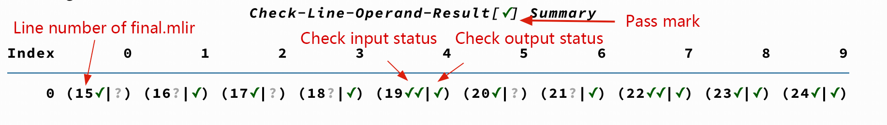

Appendix.06: TDB Guidance
==================================
This chapter mainly introduces the use of the Tensor Debugger(TDB) tool. TDB provides a debugging window similar to pdb and gdb interfaces, which can be used to debug the BModel running process, including adding breakpoints, single-step execution, viewing memory data, data comparison, and other functions.

This tool currently supports BM1684, BM1684X, and BM1688.

Preparatory work
------------------

**Environment configuration**

First you need to refer to :ref:`Environment Setup chapter <env setup>` to complete the environment configuration, enter the Docker container of TPU-MLIR, and install tpu_mlir in it.

If you have completed the environment configuration, you can ignore this step.

**Generate bmodel**

Before using TDB, you need to generate the bmodel file through TPU-MLIR, refer to :ref:`Compile the ONNX model chapter <onnx to bmodel>` to generate the bmodel file from the model.

You need to use the following two commands:

.. code-block:: shell

   # Convert the ONNX model to top_mlir
   $ model_transform
   # Convert top_mlir to bmodel
   $ model_deploy

Here, the ``model_deploy`` command needs to add ``--debug`` and ``--compare_all`` arguments to save the ``tpu_output.npz`` file and keep the intermediate data.

When the bmodel is built, a directory with the ``compilation.bmodel`` and ``final.mlir`` files is automatically generated, this directory is called the ``Context`` directory.

Start TDB
------------------

.. code-block:: shell

   $ tdb [-h]
         [--inputs [INPUTS]]
         [--ref_data [REF_DATA ...]]
         [--plugins [PLUGINS]]
         [--ddr_size [DDR_SIZE]] [-v]
         [context_dir]

The main parameters of the ``tdb`` command are described as follows:

.. list-table:: Function of tdb parameters
   :widths: 20 12 50
   :header-rows: 1

   * - Name
     - Required?
     - Explanation
   * - context_dir
     - Y
     - The directory where the bmodel file resides, which is the current directory by default
   * - -h, --help
     - N
     - Display help information
   * - --inputs
     - N
     - Specify input data for the bmodel file
   * - --ref_data
     - N
     - Specify reference data for the bmodel file
   * - --plugins
     - N
     - Add extra plugins
   * - --ddr_size
     - N
     - Specify the ddr_size of the cmodel
   * - -v, --verbose
     - N
     - Use the progress bar

Example of starting TDB:

.. code-block:: shell

   $ tdb
   # equivalent to
   $ tdb ./

TDB command summary
------------------

After entering TDB, press tab twice to get the command prompt. The display looks like this:

.. figure:: ../assets/tdb_tab.png

After entering TDB, the following commands can be used:

.. list-table:: TDB command summary
   :widths: 10 30
   :header-rows: 1

   * - Command
     - Explanation
   * - s/start
     - Load the bmodel and initialize it
   * - r/run
     - Execute from the beginning to the end, the run instruction contains the initialization function
   * - b/break
     - Add breakpoints in final.mlir
   * - delete
     - Delete breakpoint
   * - n/next
     - Execute the next instruction, you can use ``n [num]`` to execute more than one instruction
   * - c/continue
     - Continue the instruction until the break point or the end of the run
   * - info
     - Print breakpoint information or instructions in different formats
   * - p/print
     - Print the current instruction or the data corresponding to the instruction
   * - w/watch
     - Monitors a certain input/output of the current or previous atomic instruction and returns a prompt when the data at its address changes
   * - q/quit
     - Quit TDB
   * - py [py_cmd]
     - Execute python commands in TDB, integrated with pdb's code completion function

Where ``num`` represents number; ``py_cmd`` denotes the python command.

TDB usage process
------------------

.. code-block:: shell

   # start TDB in context directory
   $ cd path/to/context_dir
   $ tdb
   # initialize
   $ s
   # execute line by line
   $ n
   # add breakpoint
   $ b
   # keep running
   $ c
   # continue debugging
   $ info/p/w
   # quit
   $ q

TDB function description
------------------

next feature
~~~~~~~~~~~~~~~~~~~~

.. code-block:: shell

   # execute line by line use next
   (tdb) n
   # execute multiple instructions
   (tdb) n [num]
   # execute 3 instructions
   (tdb) n 3

The instruction displayed after the ``n`` command is the next unexecuted instruction.

breakpoint feature
~~~~~~~~~~~~~~~~~~~~

Breakpoint feature include viewing breakpoints, adding/removing breakpoints, and turning breakpoints on/off. Here's how to use it:

.. list-table:: breakpoint feature
   :widths: 10 20 20
   :header-rows: 1

   * - Command
     - Explanation
     - Example
   * - info b/break
     - View breakpoint information
     - info b; info break
   * - b/break
     - Add breakpoint
     - b 1
   * - enable
     - Enable breakpoint
     - enable 1; enable 1,2
   * - disable
     - Disable breakpoint
     - disable 1; disable 1,2
   * - delete
     - Delete breakpoint
     - delete 1

Currently supported breakpoint types are as follows:

**value-id**

The Operation prefix in ``final.mlir`` corresponding to bmodel, for example:

.. code-block:: shell

   %140 = "tpu.Load"(%6) {do_bcast = false …

where ``%140`` and ``%6`` are ``value-id`` , adding this type of breakpoint example is as follows:

.. code-block:: shell

   (tdb) b %140
   (tdb) b %6

**op-name**

The Operation name in ``final.mlir`` , in the above example,  ``tpu.Load`` is the Op name, add this type of breakpoint example is as follows:

.. code-block:: shell

   (tdb) b tpu.Load

**cmd-id**

The ``cmd-id`` of asm which is resolved. In the above example, D1 and B0 are ``cmd-id`` . The example of adding this type of breakpoint is as follows:

.. code-block:: shell

   (tdb) b D2
   (tdb) b B4

info feature
~~~~~~~~~~~~~~~~~~~~

The info feature can print breakpoint information or instructions in different formats as follows:

**info b**

View breakpoint information.

.. code-block:: shell

   (tdb) info b
   index     type enable     text hit
       1  dialect      y tpu.load   0
       2     addr      y       R0   3
       3   cmd-id      y       D1   0
       4 value-id      y       %7   0

**info asm**

Show the current asm instruction.

.. code-block:: shell

   (tdb) info asm
   %R0, %B15 = "arith.add"(%R13, %C1.0, %D3) {round_mode = 0} : (memref<1x32x54x160xf32, strides: [8640, 8640, 160, 1]>, f32, none) -> (memref<1x32x54x160xf32, strides: [8640, 8640, 160, 1]>, none)

**info mlir**

Show the Operation in final.mlir that corresponds to the current instruction.

.. code-block:: shell

   (tdb) info mlir
   %137 = "tpu.Active"(%134) {ginfo = #tpu.lg<out_addr = 212992, out_size = 35456, buffer_addr = 0, buffer_size = 71040, eu_align = true, n_idx = [0], n_slice = [1], c_idx = [0], c_slice = [32], d_idx = [0], d_slice = [1], h_idx = [0, 53, 107, 161, 215, 267], h_slice = [54, 55, 55, 55, 53, 53], w_idx = [0, 159], w_slice = [160, 161], id = 6, stage = 1, group_type = 0>, mode = #tpu<active_mode SILU>} : (tensor<1x32x320x320xf32>) -> tensor<1x32x320x320xf32> loc(#loc19)

**info reg**

Show the value of each field after the current command has been parsed.

.. code-block:: shell

   (tdb) info reg
   {'cmd_short': 1, 'cmd_id': 15, 'cmd_id_dep': 3, 'tsk_typ': 3, 'tsk_eu_typ': 2, 'opd0_const': 0, 'opd1_const': 1, 'opd2_const': 0, 'tsk_opd_num': 2, 'cmd_id_en': 1, 'pwr_step': 0, 'intr_en': 0, 'res0_prec': 2, 'opd0_prec': 2, 'opd1_prec': 2, 'opd2_prec': 0, 'opd0_sign': 1, 'opd1_sign': 1, 'res0_str': 0, 'opd0_str': 0, 'opd1_str': 0, 'opd2_n_str': 0, 'rsvd0': 0, 'res0_n': 1, 'res0_c': 32, 'res0_h': 54, 'res0_w': 160, 'res0_addr': 0, 'opd0_addr': 212992, 'opd1_addr': 1065353216, 'opd2_addr': 0, 'res0_n_str': 0, 'res0_c_str': 0, 'opd0_n_str': 0, 'opd0_c_str': 0, 'opd1_n_str': 0, 'opd1_c_str': 0, 'res0_h_str': 0, 'res0_w_str': 0, 'opd0_h_str': 0, 'opd2_sign': 0, 'rsvd1': 0, 'opd0_w_str': 0, 'opd1_h_str': 0, 'opd1_w_str': 0, 'rsvd2': 0}

**info loc**

Show the corresponding Operation information of ``tensor_location.json`` in the Context directory.

.. code-block:: shell

   (tdb) info loc
   {'core_id': 0,
   'file_line': 27,
   'loc_index': 4,
   'opcode': 'tpu.Active',
   'operands': [@163840({name=122_Conv, layout=eu_align, slice=[0:1, 0:32, 0:1, 0:54, 0:160], mlir_type=tensor<1x32x320x320xf32>, memory_type=<1x32x54x160xf32>})],
   'results': [@212992({name=124_Mul, layout=eu_align, slice=[0:1, 0:32, 0:1, 0:54, 0:160], mlir_type=tensor<1x32x320x320xf32>, memory_type=<1x32x54x160xf32>})],
   'slice_all': False,
   'subnet_id': 0,
   'tiu_dma_id_after': [17, 3],
   'tiu_dma_id_before': [1, 3]}

print feature
~~~~~~~~~~~~~~~~~~~~

The print feature not only prints the current asm instruction, but also the input and output data of the instruction, the method of use is as follows:

.. list-table:: print feature
   :widths: 10 20 10
   :header-rows: 1

   * - Command
     - Explanation
     - Example
   * - p op
     - Show upcoming commands
     - p op
   * - p pre/next
     - Show the previous or next instruction
     - p pre; p next
   * - p in
     - Show the input data for the next unexecuted instruction
     - p in; p in 0
   * - p out
     - Show the output data of the previous executed instruction
     - p out; p out 0

watchpoint feature
~~~~~~~~~~~~~~~~~~~~

The watchpoint feature can monitor the input/output data of an instruction and return an alert when the data of a monitored variable changes, the method of use is as follows:

**w**

Show the currently added watchpoints, see the following example:

.. code-block:: shell

   (tdb) w
   index    cmd_type cmd_id core_id enabled                                                   value
       1 CMDType.dma      2       0       y %G0: memref<1x32x3x36xf32, strides: [3456, 108, 36, 1]>

**w in**

Adds one of the inputs for the next pending instruction as a watchpoint, see the following example:

.. code-block:: shell

   (tdb) n
   %R15.2688, %D2 = "dma.tensor"(%G0, %B0) {decompress = False} : (memref<1x32x3x36xf32, strides: [3456, 108, 36, 1]>, none) -> (memref<1x32x3x36xf32, strides: [108, 108, 36, 1]>, none)
   (tdb) w in 0
   (tdb) w
   index    cmd_type cmd_id core_id enabled                                                   value
       1 CMDType.dma      2       0       y %G0: memref<1x32x3x36xf32, strides: [3456, 108, 36, 1]>

as you can see, ``w in 0`` adds the first input ``%G0`` of the next pending instruction as watchpoint.

**w out**

Adds one of the outputs of the last executed instruction as a watchpoint, see the following example:

.. code-block:: shell

   (tdb) w out 0
   (tdb) w
   index    cmd_type cmd_id core_id enabled                                                         value
       1 CMDType.dma      2       0       y       %G0: memref<1x32x3x36xf32, strides: [3456, 108, 36, 1]>
       2 CMDType.dma      1       0       y %R0: memref<1x3x110x322xf32, strides: [35424, 35424, 322, 1]>

**p w idx old/now**

Prints the value of the added watchpoint, as shown in the following example:

Where idx is the index of the watchpoint returned using the w command, old means to view the data when the watchpoint was originally added, and now means to view the current data of the watchpoint.

The old/now can be omitted and the default is now, which means view the current data of the watchpoint.

.. code-block:: shell

   (tdb) w
   index    cmd_type cmd_id core_id enabled                                                         value
       1 CMDType.dma      2       0       y       %G0: memref<1x32x3x36xf32, strides: [3456, 108, 36, 1]>
       2 CMDType.dma      1       0       y %R0: memref<1x3x110x322xf32, strides: [35424, 35424, 322, 1]>
   (tdb) p w 1
   (tdb) p w 1 old

**w delete [idx]**

Deletes the added watchpoint, as shown in the following example:

When idx is entered, the corresponding watchpoint will be deleted; when idx is not entered, all watchpoints will be deleted.

.. code-block:: shell

   (tdb) w
   index    cmd_type cmd_id core_id enabled                                                         value
       1 CMDType.dma      2       0       y       %G0: memref<1x32x3x36xf32, strides: [3456, 108, 36, 1]>
       2 CMDType.dma      1       0       y %R0: memref<1x3x110x322xf32, strides: [35424, 35424, 322, 1]>
       3 CMDType.tiu     11       0       y %R13: memref<1x32x54x160xsi16, strides: [8640, 8640, 160, 1]>
   (tdb) w delete 1
   (tdb) w
   index    cmd_type cmd_id core_id enabled                                                         value
       2 CMDType.dma      1       0       y %R0: memref<1x3x110x322xf32, strides: [35424, 35424, 322, 1]>
       3 CMDType.tiu     11       0       y %R13: memref<1x32x54x160xsi16, strides: [8640, 8640, 160, 1]>
   (tdb) w delete
   (tdb) w
   index cmd_type cmd_id core_id enabled value

py feature
~~~~~~~~~~~~~~~~~~~~

The py feature can execute python commands directly in the TDB environment, the method of use is as follows:

.. code-block:: shell

   (tdb) py a = 2
   (tdb) py b = a + 2
   (tdb) py print(b)
   4

BModel Disassembler
------------------

BModel Disassembler can disassemble the bmodel file to get the assembly code of atomic instruction in MLIR format, which is asm instruction. They are used to analyze the final runtime instruction of the model.

When you use it, you need to enter the Context directory first, and the method of use is as follows:

.. code-block:: shell

   $ bmodel_dis [-h] [--format {mlir,reg,bits,bin,reg-set}] bmodels [bmodels ...]

where ``--format`` can specify the output format, which default use mlir format, ``bmodels`` means the bmodel file to be parsed. Example usage is as follows:

.. code-block:: shell

   $ bmodel_dis compilation.bmodel
   $ bmodel_dis --format reg compilation.bmodel

The output can be saved to a file as follows:

.. code-block:: shell

   $ bmodel_dis compilation.bmodel > dis_bmodel.mlir
   $ bmodel_dis --format reg compilation.bmodel > dis_reg.json

BModel Checker
------------------

BModel Checker is used to find errors (codegen errors) in a bmodel, if during model_deploy you find that the generated bmodel cannot be aligned with the tpu's reference data, you can use this tool to locate the error.BModel for BM1684, BM1684X, BM1688 processors is currently supported.

When generating a bmodel file, the model_deploy command needs to add the ``--debug`` and ``-compare_all`` parameters, which are used to save the ``tpu_output.npz`` file and retain intermediate data.

The usage is as follows:

.. code-block:: shell

   $ bmodel_checker [-h]
                    [--tolerance TOLERANCE]
                    [--report REPORT] [--fail_fast]
                    [--quiet] [--no_interactive]
                    [--dump_mode {failed,all,never}]
                    context_dir reference_data

The main parameters of ``bmodel_checker`` are described as follows:

.. list-table:: Function of bmodel_checker parameters
   :widths: 20 12 50
   :header-rows: 1

   * - Name
     - Required?
     - Explanation
   * - context_dir
     - Y
     - bmodel file directory
   * - reference_data
     - Y
     - tpu_output.npz file location
   * - quiet
     - N
     - The execution progress bar is not displayed
   * - fail_fast
     - N
     - Stop at the first error
   * - dump_mode
     - N
     - Specifies the data to be downloaded by the dump command, the default value is failed, it can also be all or never
   * - tolerance
     - N
     - Specify comparison tolerances, default is "0.99,0.90"
   * - report
     - N
     - Save the wrong data to file, default is ``failed_bmodel_outputs.npz``
   * - no_interactive
     - N
     - After running bmodel_checker, it exits TDB mode directly
   * - cache_mode
     - No
     - Cache mode, with three options: online, offline, generate. Default is online.

To use ``bmodel_checker`` you need to enter the Context directory, as shown in the following example:

.. code-block:: shell

   $ bmodel_checker ./ ../yolov5s_bm1684x_f32_tpu_outputs.npz
   $ bmodel_checker ./ ../yolov5s_bm1684x_f32_tpu_outputs.npz --fail_fast
   $ bmodel_checker ./ ../yolov5s_bm1684x_f32_tpu_outputs.npz --tolerance 0.99,0.90

After executing the ``bmodel_checker`` command, the checker report is output and the error outputs are saved to the ``failed_bmodel_outputs.npz`` file, which is described below:

where the "check" means pass, which the data is checked and its similarity conforms to ``cos > 0.99, eul > 0.9`` (This is the default threshold, which can be modified by the tolerance parameter); The "cross" means an error, which the data does not reach the required similarity; The "question mark" means an unknown, which the reference data is not found and the correctness of the data cannot be determined. A complete checker report of a yolov5s model is shown below:

.. figure:: ../assets/tdb_check_summary_yolo.png

After outputting the check report, it automatically enters the interactive mode. The interactive mode provides a detailed view of the errors and also allows you to quickly jump between lines, as shown in the following example of a ``cswin_tiny`` model.

**check summary**

The check report can be reprinted by using the ``check summary`` command:

.. figure:: ../assets/tdb_check_summary_cswin.png

It is worth noting that you can aggregate inputs and outputs with the same line numbers using the ``check summary reduce`` command.

**check data**

.. code-block:: shell

   (tdb) check data [file-line]

where ``file-line`` is the line number in the checker report, which corresponds to the line number of ``final.mlir`` . This command gives a description of all the input and output data of the command corresponding to ``file-line``, an example is shown below:

.. figure:: ../assets/tdb_check_data_1.png

.. code-block:: shell

   (tdb) check data [file-line] [index]

Where ``index`` is the index of the data output by the ``check data [file-line]`` command. This command gives detailed information about the corresponding ``index`` data, and an example of comparing the correct data is shown below:

.. figure:: ../assets/tdb_check_data_2.png

An example of comparison error data is shown below:

.. figure:: ../assets/tdb_check_data_3.png

**SoC Devices**

When executing on SoC devices, in order to perform comparisons without introducing an mlir dependency, it is necessary to first generate a cache within a Docker environment. Subsequently, the cached model can be used for comparison in the SoC device environment.

.. code-block:: shell

   $ bmodel_checker ./ ../yolov5s_bm1684x_f32_tpu_outputs.npz --cache_mode generate # on docker
   $ bmodel_checker ./ ../yolov5s_bm1684x_f32_tpu_outputs.npz --cache_mode offline # on soc

