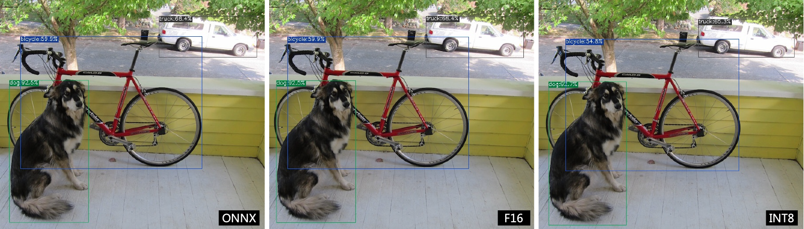

编译ONNX模型
============

本章以 ``yolov5s.onnx`` 为例，介绍如何编译迁移一个onnx模型至深度学习处理器平台运行。

该模型来自yolov5的官网: https://github.com/ultralytics/yolov5/releases/download/v6.0/yolov5s.onnx

本章需要安装TPU-MLIR。

.. list-table::
   :widths: 35 20 30
   :header-rows: 1

   * - 平台
     - 文件名
     - 说明
   * - cv183x/cv182x/cv181x/cv180x
     - xxx.cvimodel
     - 请参考: :ref:`CV18xx使用指南 <onnx to cvimodel>`
   * - 其它
     - xxx.bmodel
     - :ref:`继续本章节 <onnx to bmodel>`

.. _onnx to bmodel:

安装TPU-MLIR
------------------

进入Docker容器，并执行以下命令安装TPU-MLIR：

.. code-block:: shell

   $ pip install tpu_mlir[onnx]
   # or
   $ pip install tpu_mlir-*-py3-none-any.whl[onnx]

准备工作目录
------------------

.. include:: get_resource.rst

建立 ``model_yolov5s`` 目录，并把模型文件和图片文件都放入 ``model_yolov5s`` 目录中。

操作如下:

.. code-block:: shell
   :linenos:

   $ mkdir model_yolov5s && cd model_yolov5s
   $ wget https://github.com/ultralytics/yolov5/releases/download/v6.0/yolov5s.onnx
   $ cp -rf tpu_mlir_resource/dataset/COCO2017 .
   $ cp -rf tpu_mlir_resource/image .
   $ mkdir workspace && cd workspace

ONNX转MLIR
------------------

如果模型是图片输入，在转模型之前我们需要了解模型的预处理。如果模型用预处理后的npz文件做输入，则不需要考虑预处理。

预处理过程用公式表达如下( :math:`x` 代表输入):

.. math::

   y = (x - mean) \times scale

官网yolov5的图片是rgb格式，每个值会乘以 ``1/255`` ，转换成mean和scale对应为
``0.0,0.0,0.0`` 和 ``0.0039216,0.0039216,0.0039216`` 。

模型转换命令如下:

.. code-block:: shell

   $ model_transform \
       --model_name yolov5s \
       --model_def ../yolov5s.onnx \
       --input_shapes [[1,3,640,640]] \
       --mean 0.0,0.0,0.0 \
       --scale 0.0039216,0.0039216,0.0039216 \
       --keep_aspect_ratio \
       --pixel_format rgb \
       --output_names 350,498,646 \
       --test_input ../image/dog.jpg \
       --test_result yolov5s_top_outputs.npz \
       --mlir yolov5s.mlir

.. _model_transform param:

``model_transform`` 主要参数说明如下（完整介绍请参见TPU-MLIR开发参考手册用户界面章节）:

.. list-table:: model_transform 参数功能
   :widths: 20 10 50
   :header-rows: 1

   * - 参数名
     - 必选？
     - 说明
   * - model_name
     - 是
     - 指定模型名称
   * - model_def
     - 是
     - 指定模型定义文件, 比如 ``.onnx`` 或 ``.tflite`` 或 ``.prototxt`` 文件
   * - input_shapes
     - 否
     - 指定输入的shape, 例如 ``[[1,3,640,640]]`` ; 二维数组, 可以支持多输入情况
   * - input_types
     - 否
     - 指定输入的类型, 例如int32; 多输入用,隔开; 不指定情况下默认处理为float32
   * - resize_dims
     - 否
     - 原始图片需要resize之后的尺寸; 如果不指定, 则resize成模型的输入尺寸
   * - keep_aspect_ratio
     - 否
     - 当test_input与input_shapes不同时，在resize时是否保持长宽比, 默认为false; 设置时会对不足部分补0
   * - mean
     - 否
     - 图像每个通道的均值, 默认为0.0,0.0,0.0
   * - scale
     - 否
     - 图片每个通道的比值, 默认为1.0,1.0,1.0
   * - pixel_format
     - 否
     - 图片类型, 可以是rgb、bgr、gray、rgbd四种格式, 默认为bgr
   * - channel_format
     - 否
     - 通道类型, 对于图片输入可以是nhwc或nchw, 非图片输入则为none, 默认为nchw
   * - output_names
     - 否
     - 指定输出的名称, 如果不指定, 则用模型的输出; 指定后用该指定名称做输出
   * - test_input
     - 否
     - 指定输入文件用于验证, 可以是jpg或npy或npz; 可以不指定, 则不会进行正确性验证
   * - test_result
     - 否
     - 指定验证后的输出文件, ``.npz``格式
   * - excepts
     - 否
     - 指定需要排除验证的网络层的名称, 多个用 , 隔开
   * - mlir
     - 是
     - 指定输出的mlir文件名称和路径, ``.mlir`` 后缀

转成mlir文件后，会生成一个 ``${model_name}_in_f32.npz`` 文件，该文件是模型的输入文件。

MLIR转F16模型
------------------

将mlir文件转换成f16的bmodel，操作方法如下:

.. code-block:: shell

   $ model_deploy \
       --mlir yolov5s.mlir \
       --quantize F16 \
       --processor bm1684x \
       --test_input yolov5s_in_f32.npz \
       --test_reference yolov5s_top_outputs.npz \
       --model yolov5s_1684x_f16.bmodel

.. _model_deploy param:

``model_deploy`` 的主要参数说明如下（完整介绍请参见TPU-MLIR开发参考手册用户界面章节）:

.. list-table:: model_deploy 参数功能
   :widths: 18 10 50
   :header-rows: 1

   * - 参数名
     - 必选？
     - 说明
   * - mlir
     - 是
     - 指定mlir文件
   * - quantize
     - 是
     - 指定默认量化类型, 支持F32/F16/BF16/INT8等, 不同处理器支持的量化类型如下表所示。
   * - processor
     - 是
     - 指定模型将要用到的平台,
       支持bm1690, bm1688, bm1684x, bm1684, cv186x, cv183x, cv182x, cv181x, cv180x
   * - calibration_table
     - 否
     - 指定校准表路径, 当存在INT8/F8E4M3量化的时候需要校准表
   * - tolerance
     - 否
     - 表示 MLIR 量化后的结果与 MLIR fp32推理结果相似度的误差容忍度
   * - test_input
     - 否
     - 指定输入文件用于验证, 可以是jpg或npy或npz; 可以不指定, 则不会进行正确性验证
   * - test_reference
     - 否
     - 用于验证模型正确性的参考数据(使用npz格式)。其为各算子的计算结果
   * - compare_all
     - 否
     - 验证正确性时是否比较所有中间结果, 默认不比较中间结果
   * - excepts
     - 否
     - 指定需要排除验证的网络层的名称, 多个用,隔开
   * - op_divide
     - 否
     - cv183x/cv182x/cv181x/cv180x only, 尝试将较大的op拆分为多个小op以达到节省ion内存的目的, 适用少数特定模型
   * - model
     - 是
     - 指定输出的model文件名称和路径
   * - num_core
     - 否
     - 当target选择为bm1688时,用于选择并行计算的tpu核心数量,默认设置为1个tpu核心
   * - skip_validation
     - 否
     - 跳过验证bmodel正确性环节，用于提升模型部署的效率，默认执行bmodel验证

对于不同处理器和支持的quantize类型对应关系如下表所示：

.. list-table:: 不同处理器支持的 quantize 量化类型
   :widths: 18 15
   :header-rows: 1

   * - 处理器
     - 支持的quantize
   * - BM1688
     - F32/F16/BF16/INT8/INT4
   * - BM1684X
     - F32/F16/BF16/INT8
   * - BM1684
     - F32/INT8
   * - CV186X
     - F32/F16/BF16/INT8/INT4
   * - CV183X/CV182X/CV181X/CV180X
     - BF16/INT8
   * - BM1690
     - F32/F16/BF16/INT8/F8E4M3/F8E5M2

编译完成后，会生成名为 ``yolov5s_1684x_f16.bmodel`` 的文件。

MLIR转INT8模型
------------------

生成校准表
~~~~~~~~~~~~~~~~~~~~

转INT8模型前需要跑calibration，得到校准表; 输入数据的数量根据情况准备100~1000张左右。

然后用校准表，生成对称或非对称bmodel。如果对称符合需求，一般不建议用非对称，因为
非对称的性能会略差于对称模型。

这里用现有的100张来自COCO2017的图片举例，执行calibration:

.. code-block:: shell

   $ run_calibration yolov5s.mlir \
       --dataset ../COCO2017 \
       --input_num 100 \
       -o yolov5s_cali_table

运行完成后会生成名为 ``yolov5s_cali_table`` 的文件，该文件用于后续编译INT8模型的输入文件。

编译为INT8对称量化模型
~~~~~~~~~~~~~~~~~~~~~~~~

转成INT8对称量化模型，执行如下命令:

.. code-block:: shell

   $ model_deploy \
       --mlir yolov5s.mlir \
       --quantize INT8 \
       --calibration_table yolov5s_cali_table \
       --processor bm1684x \
       --test_input yolov5s_in_f32.npz \
       --test_reference yolov5s_top_outputs.npz \
       --tolerance 0.85,0.45 \
       --model yolov5s_1684x_int8_sym.bmodel

编译完成后，会生成名为 ``yolov5s_1684x_int8_sym.bmodel`` 的文件。

效果对比
------------------

在本发布包中有用python写好的yolov5用例，使用 ``detect_yolov5`` 命令，用于对图片进行目标检测。

该命令对应源码路径 ``{package/path/to/tpu_mlir}/python/samples/detect_yolov5.py`` 。

阅读该代码可以了解模型是如何使用的: 先预处理得到模型的输入，然后推理得到输出，最后做后处理。

用以下代码分别来验证onnx/f16/int8的执行结果。

onnx模型的执行方式如下，得到 ``dog_onnx.jpg`` :

.. code-block:: shell

   $ detect_yolov5 \
       --input ../image/dog.jpg \
       --model ../yolov5s.onnx \
       --output dog_onnx.jpg

f16 bmodel的执行方式如下，得到 ``dog_f16.jpg`` :

.. code-block:: shell

   $ detect_yolov5 \
       --input ../image/dog.jpg \
       --model yolov5s_1684x_f16.bmodel \
       --output dog_f16.jpg

int8对称bmodel的执行方式如下，得到 ``dog_int8_sym.jpg`` :

.. code-block:: shell

   $ detect_yolov5 \
       --input ../image/dog.jpg \
       --model yolov5s_1684x_int8_sym.bmodel \
       --output dog_int8_sym.jpg

对比结果如下:

.. _yolov5s_result:

   TPU-MLIR对YOLOv5s编译效果对比

由于运行环境不同，最终的效果和精度与 :numref:`yolov5s_result` 会有些差异。

模型性能测试
------------

以下操作需要在Docker外执行，

安装 ``libsophon`` 环境
~~~~~~~~~~~~~~~~~~~~~~~

请参考 ``libsophon`` 使用手册安装 ``libsophon`` 。

检查 ``BModel`` 的性能
~~~~~~~~~~~~~~~~~~~~~~~

安装好 ``libsophon`` 后，可以使用 ``bmrt_test`` 来测试编译出的 ``bmodel`` 的正确性及性能。可以根据 ``bmrt_test`` 输出的性能结果，来估算模型最大的fps，来选择合适的模型。

.. code-block:: shell

   # 下面测试上面编译出的bmodel
   # --bmodel参数后面接bmodel文件,

   $ cd path/to/model_yolov5s/workspace
   $ bmrt_test --bmodel yolov5s_1684x_f16.bmodel
   $ bmrt_test --bmodel yolov5s_1684x_int8_sym.bmodel

以最后一个命令输出为例(此处对日志做了部分截断处理):

.. code-block:: shell
   :linenos:

   [BMRT][load_bmodel:983] INFO:pre net num: 0, load net num: 1
   [BMRT][show_net_info:1358] INFO: ########################
   [BMRT][show_net_info:1359] INFO: NetName: yolov5s, Index=0
   [BMRT][show_net_info:1361] INFO: ---- stage 0 ----
   [BMRT][show_net_info:1369] INFO:   Input 0) 'images' shape=[ 1 3 640 640 ] dtype=FLOAT32
   [BMRT][show_net_info:1378] INFO:   Output 0) '350_Transpose_f32' shape=[ 1 3 80 80 85 ] ...
   [BMRT][show_net_info:1378] INFO:   Output 1) '498_Transpose_f32' shape=[ 1 3 40 40 85 ] ...
   [BMRT][show_net_info:1378] INFO:   Output 2) '646_Transpose_f32' shape=[ 1 3 20 20 85 ] ...
   [BMRT][show_net_info:1381] INFO: ########################
   [BMRT][bmrt_test:770] INFO:==> running network #0, name: yolov5s, loop: 0
   [BMRT][bmrt_test:834] INFO:reading input #0, bytesize=4915200
   [BMRT][print_array:702] INFO:  --> input_data: < 0 0 0 0 0 0 0 0 0 0 0 0 0 0 0 0 ...
   [BMRT][bmrt_test:982] INFO:reading output #0, bytesize=6528000
   [BMRT][print_array:702] INFO:  --> output ref_data: < 0 0 0 0 0 0 0 0 0 0 0 0 0 0...
   [BMRT][bmrt_test:982] INFO:reading output #1, bytesize=1632000
   [BMRT][print_array:702] INFO:  --> output ref_data: < 0 0 0 0 0 0 0 0 0 0 0 0 0 0...
   [BMRT][bmrt_test:982] INFO:reading output #2, bytesize=408000
   [BMRT][print_array:702] INFO:  --> output ref_data: < 0 0 0 0 0 0 0 0 0 0 0 0 0 0...
   [BMRT][bmrt_test:1014] INFO:net[yolov5s] stage[0], launch total time is 4122 us (npu 4009 normal 113 us)
   [BMRT][bmrt_test:1017] INFO:+++ The network[yolov5s] stage[0] output_data +++
   [BMRT][print_array:702] INFO:output data #0 shape: [1 3 80 80 85 ] < 0.301003    ...
   [BMRT][print_array:702] INFO:output data #1 shape: [1 3 40 40 85 ] < 0 0.228689  ...
   [BMRT][print_array:702] INFO:output data #2 shape: [1 3 20 20 85 ] < 1.00135     ...
   [BMRT][bmrt_test:1058] INFO:load input time(s): 0.008914
   [BMRT][bmrt_test:1059] INFO:calculate  time(s): 0.004132
   [BMRT][bmrt_test:1060] INFO:get output time(s): 0.012603
   [BMRT][bmrt_test:1061] INFO:compare    time(s): 0.006514

从上面输出可以看到以下信息:

1. 05-08行是bmodel的网络输入输出信息
2. 19行是运行时间，其中深度学习处理器用时4009us，非加速用时113us。这里非加速用时主要是指在HOST端调用等待时间
3. 24行是加载数据到NPU的DDR的时间
4. 25行相当于19行的总时间
5. 26行是输出数据取回时间
