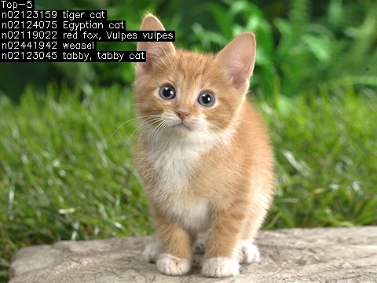
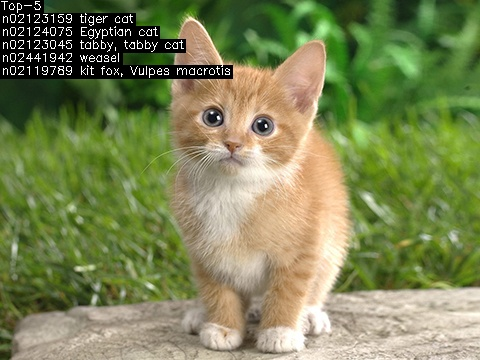

混精度使用方法
=============

本章以分类网络 ``xception`` 网络模型为例，介绍如何使用混精度。

本章需要如下文件(其中xxxx对应实际的版本信息):

**tpu-mlir_xxxx.tar.gz (tpu-mlir的发布包)**

加载tpu-mlir
------------------

.. include:: env_var.rst

准备工作目录
------------------

建立 ``xception`` 目录，注意是与tpu-mlir同级目录；并把模型文件和图片文件都
放入 ``xception`` 目录中。

操作如下:

.. code-block:: console
   :linenos:

   $ mkdir xception && cd xception
   $ wget http://s3.amazonaws.com/store.carml.org/models/caffe/xception/deploy_xception.prototxt
   $ wget http://s3.amazonaws.com/store.carml.org/models/caffe/xception/xception.caffemodel
   $ cp -rf $TPUC_ROOT/regression/dataset/ILSVRC2012 .
   $ cp -rf $TPUC_ROOT/regression/image .
   $ mkdir workspace && cd workspace

这里的 ``$TPUC_ROOT`` 是环境变量，对应tpu-mlir_xxxx目录。

验证原始模型
----------------

``classify_xception.py`` 是已经写好的验证程序，可以用来对 ``xception`` 网络进行验证。执行过程如下:

.. code-block:: console
   :linenos:

   $ classify_xception.py \
        --model_def ../deploy_xception.prototxt \
        --model_data ../xception.caffemodel \
        --input ../image/cat.jpg \
        --output xception_caffe.jpg \
        --category_file ../ILSVRC2012/synset_words.txt

执行完后得到图片 ``xception_caffe.jpg``，如下( :ref:`caffe_result` ):

.. _caffe_result:

   xception Caffe执行效果

可以看出，它准确的识别出了"猫"

.. _convert_int8:
转成INT8对称量化模型
-------------------

如果前面章节介绍的转模型方法，这里不做参数说明，只有操作过程。

第一步: 转成F32 mlir
~~~~~~~~~~~~~~~~~~~~~~

.. code-block:: console

   $ model_transform.py \
       --model_name xception \
       --model_def ../deploy_xception.prototxt \
       --model_data ../xception.caffemodel \
       --input_shapes [[1,3,299,299]] \
       --mean 103.94,116.78,123.68 \
       --scale 0.0078,0.0078,0.0078 \
       --pixel_format bgr \
       --test_input ../image/cat.jpg \
       --test_result xception_top_outputs.npz \
       --mlir xception.mlir

第二步: 生成calibartion table
~~~~~~~~~~~~~~~~~~~~~~~~~~~~

.. code-block:: console

   $ run_calibration.py xception.mlir \
       --dataset ../ILSVRC2012 \
       --input_num 100 \
       -o xception_cali_table

第三步: 转对称量化模型
~~~~~~~~~~~~~~~~~~~~~

.. code-block:: console

   $ model_deploy.py \
       --mlir xception.mlir \
       --quantize INT8 \
       --calibration_table xception_cali_table \
       --chip bm1684x \
       --test_input xception_in_f32.npz \
       --test_reference xception_top_outputs.npz \
       --tolerance 0.80,0.40 \
       --model xception_1684x_int8_sym.bmodel

第四步: 验证模型
~~~~~~~~~~~~~~~~~~~

.. code-block:: console
   :linenos:

   $ classify_xception.py \
        --model_def xception_1684x_int8_sym.bmodel \
        --input ../image/cat.jpg \
        --output xception_int8.jpg \
        --category_file ../ILSVRC2012/synset_words.txt

执行完后得到图片 ``xception_int8.jpg``，如下( :ref:`int8_result` ):

.. _int8_result:

   xception int8对称量化执行效果

可以看出，它也能识别出"猫"，但top5的整体顺序与原始模型有些许差异。

转成混精度量化模型
-------------------

在转int8对称量化模型的基础上( :ref:`convert_int`)，执行如下步骤。

第一步: 生成混精度量化表

使用 ``run_qtable.py``生成混精度量化表，相关参数说明如下：

.. list-table:: run_qtable.py 参数功能
   :widths: 18 10 50
   :header-rows: 1

   * - 参数名
     - 必选？
     - 说明
   * - 无
     - 是
     - 指定mlir文件
   * - dataset
     - 否
     - 指定输入样本的目录，该路径放对应的图片，或npz，或npy
   * - data_list
     - 否
     - 指定样本列表，与dataset必须二选一
   * - calibration_table
     - 是
     - 输入calibration table文件
   * - chip
     - 是
     - 指定模型将要用到的平台，支持bm1684x（目前只支持这一种，后续会支持多款TPU
       平台
   * - input_num
     - 否
     - 指定输入样本数量，默认用10个
   * - num_layers
     - 否
     - 指定采用浮点计算的op的数量，默认8个
   * - o
     - 是
     - 输入混精度表

这里执行命令，如下：

.. code-block:: console
   :linenos:

   $ run_qtable.py xception.mlir \
       --dataset ../ILSVRC2012 \
       --calibration_table xception_cali_table \
       --chip bm1684x \
       -o xception_qtable

生成的混精度量化表 ``xception_qtable``，内容如下：

.. code-block:: console

    xception3_conv1_2 F32
    xception3_conv2_1 F32
    xception5_elewise F32
    xception2_match_conv F32
    xception2_conv1_2 F32
    xception2_conv1_1 F32
    xception2_conv2_2 F32
    xception1_conv1_1 F32

该表中，第一列表示相应的operation，第二列表示类型。另外也会生成一个loss表文件 ``full_loss_table.txt``，内容如下：

.. code-block:: console

    No.0   : Layer: xception3_conv1_2     Loss: -29.94545865058899
    No.1   : Layer: xception3_conv2_1     Loss: -30.070380806922913
    No.2   : Layer: xception5_elewise     Loss: -30.783406615257263
    No.3   : Layer: xception2_match_conv  Loss: -30.84109926223755
    No.4   : Layer: xception2_conv1_2     Loss: -30.859117031097412
    No.5   : Layer: xception2_conv1_1     Loss: -30.87668538093567
    No.6   : Layer: xception2_conv2_2     Loss: -30.961023271083832
    No.7   : Layer: xception1_conv1_1     Loss: -31.05075192451477
    No.8   : Layer: xception2_conv2_1     Loss: -31.269444704055786
    No.9   : Layer: xception4_conv2_2     Loss: -31.705634236335754
    No.10  : Layer: xception2_elewise     Loss: -31.80374312400818
    No.11  : Layer: xception1_conv1_2     Loss: -31.821878910064697
    ......

该表按Loss顺利排列，可以看出混精度量化表取的该Loss表的前10层。

第二步: 生成混精度量化模型
~~~~~~~~~~~~~~~~~~~~~~~~

.. code-block:: console

   $ model_deploy.py \
       --mlir xception.mlir \
       --quantize INT8 \
       --quantize_table xception_qtable \
       --calibration_table xception_cali_table \
       --chip bm1684x \
       --test_input xception_in_f32.npz \
       --test_reference xception_top_outputs.npz \
       --tolerance 0.80,0.40 \
       --model xception_1684x_mix.bmodel

第三步: 验证混精度模型
~~~~~~~~~~~~~~~~~~~~~~

.. code-block:: console

   $ classify_xception.py \
        --model_def xception_1684x_mix.bmodel \
        --input ../image/cat.jpg \
        --output xception_mix.jpg \
        --category_file ../ILSVRC2012/synset_words.txt

得到图片xception_mix.jpg，如下( :ref:`mix_result` ):

.. _mix_result:

   xception 混精度对称量化执行效果
