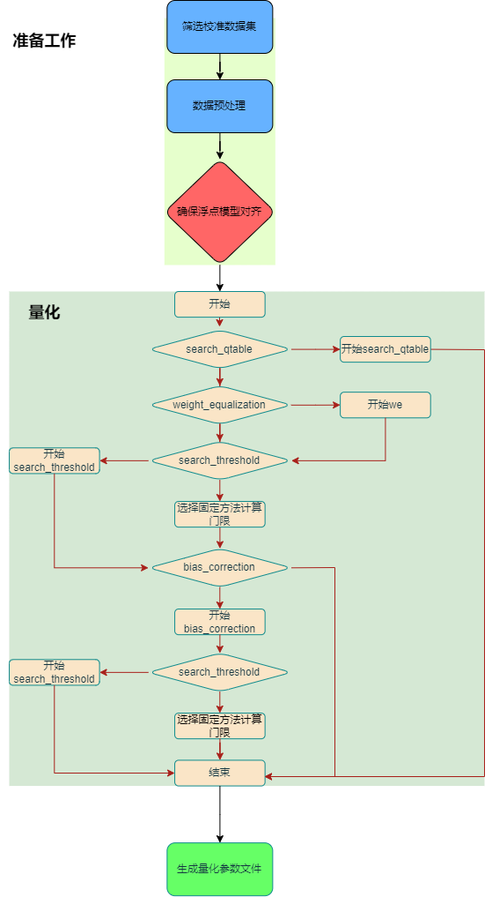
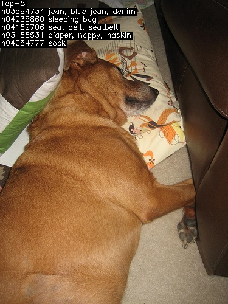

.. _quantization:

===================
量化与量化调优
===================

神经网络在大规模部署时候，往往对吞吐量也就是推理时间有较高要求，硬件也专门对低比特计算进行了优化，其算力更加突出。所以以尽量高的精度进行低比特量化就显得尤为重要。
但是要保持高精度和高吞吐率，网络往往需要以混合精度方式运行，即大部分算子以低比特定点计算，少部分以浮点进行计算。如何决定哪些算子使用浮点往往与网络和网络权重有直接关系，需要根据网络特点来选择。

TPU-MLIR所采用的混合精度方式为搜索网络中不适于低比特量化的层生成 ``quantize_table`` ，用以在 ``model_deploy`` 阶段指定这些层采用较高比特的量化方式。

本章首先会对TPU-MLIR当前的全int8对称量化进行介绍,然后对TPU-MLIR现有的 ``quantize_table`` 自动生成工具使用方式进行介绍。

TPU-MLIR全int8对称量化
========================

TPU-MLIR默认采用全int8对称量化,全int8是指除编译器默认执行浮点运算的算子(如 ``layernorm`` )外,其余算子均进行int8量化。本节介绍如何使用TPU-MLIR全int8对称量化工具。

当按照之前教程通过 ``model_transform`` 命令将模型生成对应mlir文件之后,若要对模型进行int8对称量化,还需要通过 ``run_calibration`` 命令生成校准表 ``cali_table`` ,对于不同类型模型该如何使用
``run_calibration`` 命令的参数,从而使得生成的量化模型精度较好,下面将给出详细指导。

run_calibration流程介绍
-------------------------------

下图( :ref:`calibration` )量化部分展示了当前 ``run_calibration`` 整体流程,其中包括了自动混精模块 ``search_qtable``,自动校准方法选择模块 ``search_threshold`` ,跨层权重均衡模块 ``weight_equalization``
以及偏置修正模块 ``bias_correction`` 等,后面小节我们将结合实际情况给出上述方法的使用细节。

.. _calibration:

   run_calibration整体流程

run_calibration参数介绍
-------------------------------

下表给出了 ``run_calibration`` 命令的参数介绍。

.. list-table:: run_calibration.py 参数
   :widths: 25 60
   :header-rows: 1

   * - 参数
     - 描述
   * - mlir_file
     - mlir文件
   * - sq
     - 开启SmoothQuant
   * - we
     - 开启weight_equalization
   * - bc
     - 开启bias_correction
   * - dataset
     - 校准数据集
   * - data_list
     - 样本列表
   * - input_num
     - 校准样本数量
   * - inference_num
     - search_qtable 和 search_threshold 推理过程所需图片数量,默认为30
   * - bc_inference_num
     - bias_correction 推理过程所需图片数量,默认为30
   * - tune_list
     - tuning用到的样本列表
   * - tune_num
     - tuning的图像数量
   * - histogram_bin_num
     - 指定 kld 计算的直方图 bin 数量,默认为2048
   * - expected_cos
     - 期望search_qtable混精模型输出与浮点模型输出的相似度,取值范围[0,1],默认为0.99
   * - min_layer_cos
     - bias_correction中该层量化输出与浮点输出的相似度下限,当低于该下限时需要对该层进行补偿,取值范围[0,1],默认为0.99
   * - max_float_layers
     - search_qtable 设置浮点层数量,默认为5
   * - processor
     - 处理器类型,默认为bm1684x
   * - cali_method
     - 选择校准模式;不添加该参数默认为KLD校准。“use_percentile9999”采用99.99分位作为门限。“use_max”采用绝对值最大值作为门限。“use_torch_observer_for_cali”采用torch的observer进行校准。"use_mse"采用octav进行校准。
   * - fp_type
     - search_qtable浮点层数据类型
   * - post_process
     - 后处理路径
   * - global_compare_layers
     - 指定全局对比层，例如 layer1,layer2 或 layer1:0.3,layer2:0.7
   * - search
     - 指定搜索类型,其中包括search_qtable,search_threshold,false。其中默认为false,不开启搜索
   * - transformer
     - 是否是transformer模型,search_qtable中如果是transformer模型可分配指定加速策略,默认为False
   * - quantize_method_list
     - search_qtable用来搜索的门限方法,默认为MSE,可选择范围为MSE,KL,MAX,Percentile9999
   * - benchmark_method
     - 指定search_threshold中相似度计算方法,默认为cos
   * - kurtosis_analysis
     - 指定生成各层激活值的kurtosis
   * - part_quantize
     - 指定模型部分量化,获得cali_table同时会自动生成qtable。可选择N_mode,H_mode,custom_mode,H_mode通常精度较好
   * - custom_operator
     - 指定需要量化的算子,配合开启上述custom_mode后使用
   * - part_asymmetric
     - 指定当开启对称量化后,模型某些子网符合特定pattern时,将对应位置算子改为非对称量化
   * - mix_mode
     - 指定search_qtable特定的混精类型,目前支持8_16和4_8两种
   * - cluster
     - 指定search_qtable寻找敏感层时采用聚类算法
   * - quantize_table
     - search_qtable输出的混精度量化表
   * - o
     - 输出门限表
   * - debug_cmd
     - debug命令
   * - debug_log
     - 日志输出级别

run_calibration参数使用介绍
-------------------------------

根据用户需求以及用户对模型本身和量化的了解程度,本节也针对性的给出了不同情况下 ``run_calibration`` 参数使用的方式。

.. list-table:: run_calibration参数适用情况
   :widths: 8 25 8 8 25
   :header-rows: 1

   * - 场景
     - 描述
     - 量化速度
     - 校准方法
     - 推荐方法
   * - case1
     - 模型初次量化
     - 不敏感
     - 不清楚
     - search_threshold
   * - case2
     - 模型初次量化
     - /
     - 清楚
     - cali_method直接选择对应校准方法
   * - case3
     - 模型初次量化
     - 敏感
     - 不清楚
     - cali_method选择固定校准方法,具体校准方法选择细节可看后续章节
   * - case4
     - 模型量化后在bm1684处理器上部署精度无法满足需求
     - /
     - /
     - 开启sq、we和bc方法

case1:当对您的模型进行初步量化时,也就是第一次使用 ``run_calibration`` 命令,此时您对当前模型所适应的校准方法并不清楚,并且对量化速度并不敏感,这里推荐您使用 ``search_threshold`` 方法,该方法可以
自动选择对应您当前模型最适合的校准方法,并且输出该种方法生成的校准表 ``cali_table`` 到您指定的输出路径。同时也会生成一个log日志文件 ``Search_Threshold``,里面记录了不同校准方法的量化信息。具体操作如下:

.. code-block:: shell

   $ run_calibration mlir.file \
       --dataset data_path \
       --input_num 100 \
       --processor bm1684x \
       --search search_threshold \
       --inference_num 30 \
       -o cali_table

注意事项:1.此时需要选择processor参数,该参数对应模型想要部署的处理器平台,当前默认是bm1684x。2. ``inference_num`` 对应 ``search_threshold`` 过程所需的推理数据数量(该数据将从您给定的dataset中抽取)。
``inference_num`` 越大, ``search_threshold`` 结果也更加准确,但所需的量化时间也更长,这里默认 ``inference_num`` 等于30,可根据实际情况自定义。

case2:当对您的模型进行初步量化时您已经清楚该模型适合于何种校准方法,此时可以直接根据 ``cali_method`` 参数去选择固定的校准方法。具体操作如下:

.. code-block:: shell

   $ run_calibration mlir.file \
       --dataset data_path \
       --input_num 100 \
       --cali_method use_mse \
       -o cali_table

注意事项:1.当不添加 ``cali_method`` 参数时,此时将采用默认的KLD校准方法。2.目前 ``cali_method`` 支持五种选择,包括 ``use_mse``, ``use_max`` , ``use_percentile9999`` , ``use_aciq_gauss`` 以及 ``use_aciq_laplace``。

case3:当您对量化时间比较敏感,希望尽可能快的生成校准表 ``cali_table`` ,但您不清楚该如何选择校准方法时,这里推荐您直接根据 ``cali_method`` 参数去选择固定的校准方法,相比于TPU-MLIR V1.8版本的量化速度,
V1.9版本的单个校准方法量化速度提升100%,因此所需时间也平均降低到之前的50%左右,加速效果明显。在V1.9版本校准方法中, ``use_mse`` 是平均量化速度最快的。对于校准方法的选择,可以参考以下几点经验性的结论:
1.当您的模型是不带有attention结构的非transformer模型,可以选择 ``use_mse`` 校准方法。具体操作如下:

.. code-block:: shell

   $ run_calibration mlir.file \
       --dataset data_path \
       --input_num 100 \
       --cali_method use_mse \
       -o cali_table

或者也可选择默认的KLD校准方法。具体操作如下:

.. code-block:: shell

   $ run_calibration mlir.file \
       --dataset data_path \
       --input_num 100 \
       -o cali_table

如果上述两种方法精度均不满足需求,可能需要采取混合精度策略或者混合门限方法,具体介绍可看后面小节。

2.当您的模型是带有attention结构的transformer模型,可以选择 ``use_mse`` 校准方法,如果 ``use_mse`` 校准方法效果略差,则可以尝试 ``use_max`` 校准方法,具体操作如下:

.. code-block:: shell

   $ run_calibration mlir.file \
       --dataset data_path \
       --input_num 100 \
       --cali_method use_max \
       -o cali_table

如果 ``use_max`` 效果也无法满足需求,此时需要采取混合精度策略,可依据后续介绍的混精方法进行尝试。

除去上面总体的选择规则,也提供一些选择校准方法的细节:1.如果您的模型是yolo系列的检测模型,建议采取默认的KLD校准方法。2.如果您的模型是有多个输出的分类模型,建议采取默认的KLD校准方法。

case4:当您的模型是部署在bm1684处理器上时,如果通过上述方法获得的全int8量化模型精度较差,可以尝试开启SmoothQuant(``sq``)、跨层权重均衡( ``we``)和偏置修正( ``bc``),具体操作就是在原先的命令上面添加 ``sq``、``we`` 和 ``bc`` 参数。如果使用了
``search_threshold`` 进行搜索,添加sq、we和bc操作如下:

.. code-block:: shell

   $ run_calibration mlir.file \
       --sq \
       --we \
       --bc \
       --dataset data_path \
       --input_num 100 \
       --processor bm1684 \
       --search search_threshold \
       --inference_num 30 \
       --bc_inference_num 100 \
       -o cali_table

如果使用 ``cali_method`` 选择固定校准方法,下面以 ``use_mse`` 为例添加 ``sq``、``we`` 和 ``bc`` 方法,具体操作如下:

.. code-block:: shell

   $ run_calibration mlir.file \
       --sq \
       --we \
       --bc \
       --dataset data_path \
       --input_num 100 \
       --processor bm1684 \
       --cali_method use_mse \
       --bc_inference_num 100 \
       -o cali_table

如果您采用的是默认的KLD校准方法,去掉 ``cali_method`` 参数即可。

注意事项:1.这里需要指定processor参数为bm1684。2. ``bc_inference_num`` 参数是使用 ``bc`` 量化方法时所需的推理数据数量(该数据将从您给定的dataset中抽取),这里图片数量不应太少。3. ``sq``、``we`` 和 ``bc`` 方法可单独使用,可以仅仅选择 ``we`` 方法,在操作上直接去掉 ``sq`` 和 ``bc`` 参数即可。4. run_calibration过程中会检查每个算子，找到进行shape计算的算子在当前目录生成名为net_name_shape_ops的qtable，将这些算子设置为不量化，里面内容可以手动和下面混精的配置合并作为qtable用在model_deploy中。

TPU-MLIR混合精度量化概述
==============================

TPU-MLIR支持模型混精度量化,其核心步骤在于获得记录算子名称及其量化类型的 ``quantize_table``,后称 ``qtable``。

TPU-MLIR支持两种获取 ``qtable`` 的获取路径,对于典型模型,TPU-MLIR提供基于经验的 ``pattern-match`` 方法。对于特殊模型或非典型模型,TPU-MLIR提供三种基于检索的方法,分别为 ``search_qtable`` , ``run_sensitive_layer`` 和 ``fp_forward`` 。
在后续四个章节中会详细介绍上述四种方法工具

pattern-match
=====================

``pattern-match`` 方法集成于 ``run_calibration`` 中,不需要显示指定参数,当前共有两类模型提供经验 ``qtable`` ,一类为 YOLO 系列,另一类为 BERT 等 Transformer 系列。
在获得 ``cali_table`` 后,如果模型匹配上现有pattern,则会在 ``path/to/cali_table/`` 文件夹下生成qtable。

YOLO系列自动混精度方法
-------------------------------

当前共支持YOLOV5,V6,V7,V8,V9,V10,11,12系列模型。

YOLO系列模型较为经典,使用广泛,在官方支持的模型导出时,通常会将数值差异较大的不同后处理分支合并输出,导致模型量化为全INT8精度损失大。
由于YOLO系列模型通常具有相似结构特征,即三级maxpool结构, ``pattern-match`` 会自动判断模型是否属于YOLO系列,如是,进一步识别后处理部分算子,将这些算子设置为不量化,生成qtable,该qtable可以手动和下面混精的配置合并作为qtable用在model_deploy中。
以yolov8模型输出为例:

.. code-block:: shell
  :linenos:

  ['top.MaxPool', 'top.MaxPool', 'top.MaxPool', 'top.Concat'] (Name: yolo_block) is a subset of the main list. Count: 1
  The [yolov6_8_9_11_12] post-processing pattern matches this model. Block count: 1
  The [yolov6_8_9_11_12] post-processing pattern is: ['top.Sub', 'top.Add', 'top.Add', 'top.Sub', 'top.MulConst', 'top.Concat', 'top.Mul', 'top.Concat']
  The qtable has been generated in: path/to/cali_table/qtable !!!

transformer系列自动混精度方法
-------------------------------

当前共支持BERT, EVA, DeIT, Swin, CSWin, ViT, DETR系列模型。

如识别到上述模块,会将Add后的LayerNorm,SiLU,GELU算子设置为不量化。同时,ViT会识别Softmax/GELU后的MatMul算子；EVA会识别Add,SiLU->Mul后的MatMul算子；
Swin会识别Add,Depth2Space和Reshape->LayerNorm前的Permute算子；DeIT会识别非Conv,Scale,Reshape及非LayerNorm/Reshape后的MatMul外所有算子。将这些算子设置为不量化,生成qtable。

search_qtable
=====================

``search_qtable`` 是集成于 ``run_calibration`` 中的混精功能,当全int8量化精度无法满足需求时,需要采用混合精度方法,也就是将部分算子设置为浮点运算。
``search_qtable`` 是对于 ``run_sensitive_layer`` 的优化版本。相比 ``run_sensitive_layer``, ``search_qtable`` 速度更快,支持更多自定义参数。
本节以检测网络 ``mobilenet-v2`` 网络模型为例, 介绍如何使用 ``search_qtable``。

.. 该模型来自nnmodels/pytorch_models/accuracy_test/classification/mobilenet_v2.pt。

本节需要安装TPU-MLIR。

安装TPU-MLIR
------------------

.. code-block:: shell

   $ pip install tpu_mlir[all]
   # or
   $ pip install tpu_mlir-*-py3-none-any.whl[all]

准备工作目录
------------------

.. include:: get_resource.rst
单输入模型校准数据集准备与使用说明（以mobilenet-v2为例）：

1.建立目录结构
  建立 ``mobilenet-v2`` 目录, 并把模型文件和图片文件都放入 ``mobilenet-v2`` 目录中。
2.准备校准数据集
  --dataset使用ILSVRC2012数据集, 其中包含1000类图片, 每类1000张图片, 这里仅使用其中的100张图片进行校准
3.数据集格式
  用户可以自行创建 dataset 目录，并直接将图片文件（如 JPEG、PNG 等）放入该目录。
  run_calibration.py 会自动读取图片，并根据模型输入 shape、mean、scale 等参数，自动完成预处理和格式转换为 numpy 数组，作为模型的输入。
  而多输入模型必须用结构化数据（如 npz），因为只有这些格式能明确区分每个输入的名字、shape、dtype。

操作如下:

单输入：

.. code-block:: shell
  :linenos:

   $ mkdir mobilenet-v2 && cd mobilenet-v2
   $ wget https://github.com/sophgo/tpu-mlir/releases/download/v1.4-beta.0/mobilenet_v2.pt
   $ cp -rf tpu_mlir_resource/dataset/ILSVRC2012 .
   $ mkdir workspace && cd workspace

多输入模型校准数据集准备与使用说明（以bert_base_squad_uncased-2.11.0为例）：

1.建立目录结构
  建立 ``bert_base_squad_uncased-2.11.0`` 目录, 并把模型文件和图片文件都放入 ``bert_base_squad_uncased-2.11.0`` 目录中。
2.准备校准数据集
  --dataset使用SQuAD数据集, 其中包含多个样本, 每个样本包含多个输入数据。
3.数据集格式
  用户可以自行创建 dataset 目录，目录下必须放置 npz 文件，每个 npz 文件代表一个样本，包含所有输入的 key（名字、shape、dtype都要和模型输入一致）。
  不能直接放图片。

多输入：

.. code-block:: shell
  :linenos:

   $ mkdir bert_base_squad_uncased-2.11.0 && cd bert_base_squad_uncased-2.11.0
   download bert_base_squad_uncased-2.11.0.onnx
   download SQuAD/mlir
   download squad_uncased_data.npz
   $ mkdir workspace && cd workspace

测试Float和INT8对称量化模型分类效果
-----------------------------------

如上述章节介绍的转模型方法, 这里不做参数说明, 只有操作过程。

步骤1: 转成FP32 mlir
~~~~~~~~~~~~~~~~~~~~~~

.. code-block:: shell

   $ model_transform.py \
       --model_name mobilenet_v2 \
       --model_def ../mobilenet_v2.pt \
       --input_shapes [[1,3,224,224]] \
       --resize_dims 256,256 \
       --mean 123.675,116.28,103.53 \
       --scale 0.0171,0.0175,0.0174 \
       --pixel_format rgb \
       --mlir mobilenet_v2.mlir

多输入：

.. code-block:: shell

    $ model_transform.py \
        --model_name bert_base_squad_uncased-2.11.0 \
        --model_def ../bert_base_squad_uncased-2.11.0.onnx \
        --test_input ../squad_uncased_data.npz \
        --input_shapes '[[1, 384], [1, 384], [1, 384]]' \
        --test_result bert_base_squad_uncased-2.11.0_top_outputs.npz \
        --mlir bert_base_squad_uncased-2.11.0.mlir

步骤2: 生成calibartion table
~~~~~~~~~~~~~~~~~~~~~~~~~~~~~~~~~~~~~~~

这里我们采用 ``use_mse`` 方法进行校准。

.. code-block:: shell

   $ run_calibration.py mobilenet_v2.mlir \
       --dataset ../ILSVRC2012 \
       --input_num 100 \
       --cali_method use_mse \
       -o mobilenet_v2_cali_table

多输入：

.. code-block:: shell

   $ run_calibration.py bert_base_squad_uncased-2.11.0.mlir \
        --dataset ../SQuAD/mlir \
        --input_num 10 \
        --tune_num 0 \
        --debug_cmd use_mse \
        -o bert_base_squad_uncased-2.11.0.calitable
步骤3: 转FP32 bmodel
~~~~~~~~~~~~~~~~~~~~~~~~~~

.. code-block:: shell

   $ model_deploy.py \
       --mlir mobilenet_v2.mlir \
       --quantize F32 \
       --processor bm1684 \
       --model mobilenet_v2_bm1684_f32.bmodel

步骤4: 转对称量化模型
~~~~~~~~~~~~~~~~~~~~~~~~~~

.. code-block:: shell

   $ model_deploy.py \
       --mlir mobilenet_v2.mlir \
       --quantize INT8 \
       --processor bm1684 \
       --calibration_table mobilenet_v2_cali_table \
       --model mobilenet_v2_bm1684_int8_sym.bmodel

步骤5: 验证FP32模型和INT8对称量化模型
~~~~~~~~~~~~~~~~~~~~~~~~~~~~~~~~~~~~~~~~~~

``classify_mobilenet_v2`` 是已经写好的验证程序，可以用来对 ``mobilenet_v2`` 网络进行验证。执行过程如下，FP32模型：

.. code-block:: shell

   $ classify_mobilenet_v2.py \
       --model_def mobilenet_v2_bm1684_f32.bmodel \
       --input ../ILSVRC2012/n02090379_7346.JPEG \
       --output mobilenet_v2_fp32_bmodel.JPEG \
       --category_file ../ILSVRC2012/synset_words.txt

在输出结果图片 ``mobilenet_v2_fp32_bmodel_1.JPEG`` 中，正确结果 ``sleeping bag`` 排在第一名：

.. _mobilenet_v2_fp32_bmodel_1.JPEG:

   classify_mobilenet_v2 fp32执行效果

INT8对称量化模型：

.. code-block:: shell

   $ classify_mobilenet_v2.py \
       --model_def mobilenet_v2_bm1684_int8_sym.bmodel \
       --input ../ILSVRC2012/n02090379_7346.JPEG \
       --output mobilenet_v2_INT8_sym_bmodel.JPEG \
       --category_file ../ILSVRC2012/synset_words.txt

在输出结果图片 ``mobilenet_v2_INT8_sym_bmodel_1.JPEG`` 中，正确结果 ``sleeping bag`` 排在第二名：

.. _mobilenet_v2_INT8_sym_bmodel_1.JPEG:

   classify_mobilenet_v2 int8执行效果

转成混精度量化模型
-----------------------

在转int8对称量化模型的基础上, 执行如下步骤。

步骤1: 执行search_qtable命令
~~~~~~~~~~~~~~~~~~~~~~~~~~~~~

``search_qtable`` 功能目前集成于 ``run_calibration`` 流程中,因此在使用时只需要在 ``run_calibration`` 命令中添加相关参数即可。 ``run_calibration`` 中与 ``search_qtable`` 相关参数说明如下:

.. list-table:: search_qtable 参数功能
   :widths: 23 8 50
   :header-rows: 1

   * - 参数名
     - 必选？
     - 说明
   * - 无
     - 是
     - 指定mlir文件
   * - dataset
     - 否
     - 指定输入样本的目录, 该路径放对应的图片, 或npz, 或npy
   * - data_list
     - 否
     - 指定样本列表, 与dataset必须二选一
   * - processor
     - 是
     - 指定模型将要用到的平台,
       支持bm1690, bm1688, bm1684x, bm1684, cv186x, cv183x, cv182x, cv181x, cv180x
   * - fp_type
     - 否
     - 指定混精度使用的float类型, 支持auto,F16,F32,BF16，默认为auto，表示由程序内部自动选择
   * - input_num
     - 是
     - 指定用于量化的输入样本数量
   * - inference_num
     - 否
     - 指定用于推理的输入样本数量, 默认用30个
   * - max_float_layers
     - 否
     - 指定用于生成qtable的op数量, 默认用5个
   * - tune_list
     - 否
     - 指定用于调整threshold的样本路径
   * - tune_num
     - 否
     - 指定用于调整threshold的样本数量，默认为5
   * - post_process
     - 否
     - 用户自定义后处理文件路径, 默认为空
   * - expected_cos
     - 否
     - 指定期望网络最终输出层的最小cos值,一般默认为0.99即可，越小时可能会设置更多层为浮点计算
   * - debug_cmd
     - 否
     - 指定调试命令字符串，开发使用, 默认为空
   * - global_compare_layers
     - 否
     - 指定用于替换最终输出层的层，并用于全局比较,例如： ``layer1,layer2`` 或 ``layer1:0.3,layer2:0.7``
   * - search
     - 是
     - 指定搜索类型,其中包括 ``search_qtable``, ``search_threshold`` ,false。这里需要选择 ``search_qtable``
   * - transformer
     - 否
     - 是否是transformer模型,search_qtable中如果是transformer模型可分配指定加速策略,默认是False
   * - quantize_method_list
     - 否
     - search_qtable用来搜索的校准方法,默认仅使用MSE校准方法,可选择 ``MSE``, ``KL``, ``MAX``, ``Percentile9999``
   * - quantize_table
     - 是
     - 输出混精度量化表
   * - calibration_table
     - 是
     - 校准表输出路径

``search_qtable`` 支持用户自定义的后处理方法 ``post_process_func.py`` ，可以放在当前工程目录下，也可以放在其他位置，如果放在其他位置需要在 ``post_process`` 中指明文件的完整路径。后处理方法函数名称需要定义为 ``PostProcess`` ，输入数据为网络的输出，输出数据为后处理结果。创建 ``post_process_func.py`` 文件，其示例内容如下：

.. code-block:: python

   def PostProcess(data):
       print("in post process")
       return data

``search_qtable`` 可以自定义混合门限的校准方法,由参数 ``quantize_method_list`` 控制,默认仅采用 ``MSE`` 校准方法进行搜索。当你想要使用KLD和MSE混合搜索时,参数 ``quantize_method_list`` 输入 ``KL,MSE`` 即可。 ``search_qtable`` 针对transformer模型设置了加速策略,如果模型是带有attention结构的transformer模型,可以设置参数 ``transformer`` 为True。

使用 ``search_qtable`` 搜索损失较大的layer,注意尽量使用bad cases进行搜索。

本例中采用100张图片做量化,30张图片做推理,使用KLD和MSE校准方法混合搜索,执行命令如下:

.. code-block:: shell

   $ run_calibration.py mobilenet_v2.mlir \
       --dataset ../ILSVRC2012 \
       --input_num 100 \
       --inference_num 30 \
       --expected_cos 0.99 \
       --quantize_method_list KL,MSE \
       --search search_qtable \
       --transformer False \
       --processor bm1684 \
       --post_process post_process_func.py \
       --quantize_table mobilenet_v2_qtable \
       --calibration_table mobilenet_v2_cali_table \

执行完后最后输出如下打印:

.. code-block:: shell

    the layer input3.1 is 0 sensitive layer, loss is 0.004858517758037473, type is top.Conv
    the layer input5.1 is 1 sensitive layer, loss is 0.002798812150635266, type is top.Scale
    the layer input11.1 is 2 sensitive layer, loss is 0.0015642610676610547, type is top.Conv
    the layer input13.1 is 3 sensitive layer, loss is 0.0009357141882855302, type is top.Scale
    the layer input6.1 is 4 sensitive layer, loss is 0.0009211346574943269, type is top.Conv
    the layer input2.1 is 5 sensitive layer, loss is 0.0007767164275293004, type is top.Scale
    the layer input0.1 is 6 sensitive layer, loss is 0.0006842551513905892, type is top.Conv
    the layer input128.1 is 7 sensitive layer, loss is 0.0003780628201499603, type is top.Conv
    ......
    run result:
    int8 outputs_cos:0.986809 old
    mix model outputs_cos:0.993372
    Output mix quantization table to mobilenet_v2_qtable
    total time:667.644282579422
    success search qtable

上面int8 outputs_cos表示int8模型网络输出和fp32的cos相似度，mix model outputs_cos表示前五个敏感层使用混精度后网络输出的cos相似度，total time表示搜索时间为667秒，
另外，生成的混精度量化表 ``mobilenet_v2_qtable``, 内容如下:

.. code-block:: shell

    # op_name   quantize_mode
    input3.1 F32
    input5.1 F32
    input11.1 F32
    input13.1 F32
    input6.1 F32

该表中, 第一列表示相应的layer, 第二列表示类型, 支持的类型有F32/F16/BF16/INT8。 ``search_qtable`` 会根据用户自定义的 ``expected_cos`` 参数值来确定混精量化表中混精层的数量,举例来说，
如果 ``expected_cos`` 参数值等于0.99,那么混精量化表中混精层个数对应着混精模型输出比对达到该水平的最小混精层数，当然混精量化表中混精层数会根据模型算子数量设置上限,如果最小混精层数超过上限，
那么只会取该上限对应的混精层。与此同时，也会生成一个log日志文件 ``Search_Qtable``, 内容如下:

.. code-block:: shell
    :linenos:

    INFO:root:quantize_method_list =['KL', 'MSE']
    INFO:root:run float mode: mobilenet_v2.mlir
    INFO:root:run int8 mode: mobilenet_v2.mlir
    INFO:root:all_int8_cos=0.9868090914371674
    INFO:root:run int8 mode: mobilenet_v2.mlir
    INFO:root:layer name check pass !
    INFO:root:all layer number: 117
    INFO:root:all layer number no float: 116
    INFO:root:transformer model: False, all search layer number: 116
    INFO:root:Global metrics layer is : None
    INFO:root:start to handle layer: input0.1, type: top.Conv
    INFO:root:adjust layer input0.1 th, with method KL, and threshlod 9.442267236793155
    INFO:root:run int8 mode: mobilenet_v2.mlir
    INFO:root:outputs_cos_los = 0.0006842551513905892
    INFO:root:adjust layer input0.1 th, with method MSE, and threshlod 9.7417731
    INFO:root:run int8 mode: mobilenet_v2.mlir
    INFO:root:outputs_cos_los = 0.0007242344141149548
    INFO:root:layer input0.1, layer type is top.Conv, best_th = 9.442267236793155, best_method = KL, best_cos_loss = 0.0006842551513905892
    .....

日志文件首先给出了自定义的参数,包括混合门限所使用的校准方法 ``quantize_method_list``,要搜索的op数量all search layer number以及
是否是transformer model等信息。然后记录了每个op在给定校准方法(此处是MSE和KL)下得到的threshold,
同时给出了在只对该op使用对应threshold做int8计算后的混精度模型与原始float模型输出的相似度的loss(1-余弦相似度)。
此外,日志还包含了屏幕端输出的每个op的loss信息以及最后的混精度模型与原始float模型的余弦相似度。
用户可以使用程序输出的qtable,也可以根据loss信息对qtable进行修改,然后生成混精度模型。
在 ``search_qtable`` 结束后,最优的threshold会被更新到一个新的量化表 ``new_cali_table.txt``,
该量化表存储在当前工程目录下，在生成混精度模型时需要调用新量化表。

步骤2: 生成混精度量化模型
~~~~~~~~~~~~~~~~~~~~~~~~~~~~

.. code-block:: shell

   $ model_deploy \
       --mlir mobilenet_v2.mlir \
       --quantize INT8 \
       --processor bm1684 \
       --calibration_table new_cali_table.txt \
       --quantize_table mobilenet_v2_qtable \
       --model mobilenet_v2_bm1684_int8_mix.bmodel

步骤3: 验证混精度模型
~~~~~~~~~~~~~~~~~~~~~~~~~~

.. code-block:: shell

   $ classify_mobilenet_v2 \
       --model_def mobilenet_v2_bm1684_int8_mix.bmodel \
       --input ../ILSVRC2012/n02090379_7346.JPEG \
       --output mobilenet_v2_INT8_mix_bmodel_1.JPEG \
       --category_file ../ILSVRC2012/synset_words.txt

在输出结果图片 ``mobilenet_v2_INT8_mix_bmodel_1.JPEG`` 中，正确结果 ``sleeping bag`` 排在第一名：

.. _mobilenet_v2_INT8_mix_bmodel_1.JPEG:

   classify_mobilenet_v2 混精模型执行效果

run_sensitive_layer
=======================

本节以检测网络 ``mobilenet-v2`` 网络模型为例, 介绍如何使用敏感层搜索。

.. 该模型来自nnmodels/pytorch_models/accuracy_test/classification/mobilenet_v2.pt。

本节需要安装TPU-MLIR。

安装TPU-MLIR
------------------

.. code-block:: shell

   $ pip install tpu_mlir[all]
   # or
   $ pip install tpu_mlir-*-py3-none-any.whl[all]

准备工作目录
------------------

.. include:: get_resource.rst

建立 ``mobilenet-v2`` 目录, 并把模型文件和图片文件都放入 ``mobilenet-v2`` 目录中。

操作如下:

.. code-block:: shell
  :linenos:

   $ mkdir mobilenet-v2 && cd mobilenet-v2
   $ wget https://github.com/sophgo/tpu-mlir/releases/download/v1.4-beta.0/mobilenet_v2.pt
   $ cp -rf tpu_mlir_resource/dataset/ILSVRC2012 .
   $ mkdir workspace && cd workspace

测试Float和INT8对称量化模型分类效果
-----------------------------------

如前面章节介绍的转模型方法, 这里不做参数说明, 只有操作过程。

步骤0: 转成FP32 mlir
~~~~~~~~~~~~~~~~~~~~~~

.. code-block:: shell

   $ model_transform \
       --model_name mobilenet_v2 \
       --model_def ../mobilenet_v2.pt \
       --input_shapes [[1,3,224,224]] \
       --resize_dims 256,256 \
       --mean 123.675,116.28,103.53 \
       --scale 0.0171,0.0175,0.0174 \
       --pixel_format rgb \
       --mlir mobilenet_v2.mlir

步骤1: 生成calibartion table
~~~~~~~~~~~~~~~~~~~~~~~~~~~~~~~~~

.. code-block:: shell

   $ run_calibration mobilenet_v2.mlir \
       --dataset ../ILSVRC2012 \
       --input_num 100 \
       -o mobilenet_v2_cali_table

步骤2: 转FP32 bmodel
~~~~~~~~~~~~~~~~~~~~~~~~~~

.. code-block:: shell

   $ model_deploy \
       --mlir mobilenet_v2.mlir \
       --quantize F32 \
       --processor bm1684 \
       --model mobilenet_v2_bm1684_f32.bmodel

步骤3: 转对称量化模型
~~~~~~~~~~~~~~~~~~~~~~~~~~

.. code-block:: shell

   $ model_deploy \
       --mlir mobilenet_v2.mlir \
       --quantize INT8 \
       --processor bm1684 \
       --calibration_table mobilenet_v2_cali_table \
       --model mobilenet_v2_bm1684_int8_sym.bmodel

步骤4: 验证FP32模型和INT8对称量化模型
~~~~~~~~~~~~~~~~~~~~~~~~~~~~~~~~~~~~~~~~~~

classify_mobilenet_v2是已经写好的验证程序，可以用来对mobilenet_v2网络进行验证。执行过程如下，FP32模型：

.. code-block:: shell

   $ classify_mobilenet_v2 \
       --model_def mobilenet_v2_bm1684_f32.bmodel \
       --input ../ILSVRC2012/n01440764_9572.JPEG \
       --output mobilenet_v2_fp32_bmodel.JPEG \
       --category_file ../ILSVRC2012/synset_words.txt

在输出结果图片 ``mobilenet_v2_fp32_bmodel.JPEG`` 中，正确结果tench排在第一名：

.. _mobilenet_v2_fp32_bmodel.JPEG:

   classify_mobilenet_v2 fp32执行效果

INT8对称量化模型：

.. code-block:: shell

   $ classify_mobilenet_v2 \
       --model_def mobilenet_v2_bm1684_int8_sym.bmodel \
       --input ../ILSVRC2012/n01440764_9572.JPEG \
       --output mobilenet_v2_INT8_sym_bmodel.JPEG \
       --category_file ../ILSVRC2012/synset_words.txt

在输出结果图片 ``mobilenet_v2_INT8_sym_bmodel.JPEG`` 中，正确结果tench排在第一名：

.. _mobilenet_v2_INT8_sym_bmodel.JPEG:

   classify_mobilenet_v2 int8执行效果

转成混精度量化模型
-----------------------

在转int8对称量化模型的基础上, 执行如下步骤。

步骤0: 进行敏感层搜索
~~~~~~~~~~~~~~~~~~~~~~~~~

使用 ``run_sensitive_layer`` 搜索损失较大的layer，注意尽量使用bad cases进行敏感层搜索，相关参数说明如下:

.. list-table:: run_sensitive_layer 参数功能
   :widths: 23 8 50
   :header-rows: 1

   * - 参数名
     - 必选？
     - 说明
   * - 无
     - 是
     - 指定mlir文件
   * - dataset
     - 否
     - 指定输入样本的目录, 该路径放对应的图片, 或npz, 或npy
   * - data_list
     - 否
     - 指定样本列表, 与dataset必须二选一
   * - calibration_table
     - 是
     - 输入校准表
   * - processor
     - 是
     - 指定模型将要用到的平台,
       支持bm1690, bm1688, bm1684x, bm1684, cv186x, cv183x, cv182x, cv181x, cv180x
   * - fp_type
     - 否
     - 指定混精度使用的float类型, 支持auto,F16,F32,BF16，默认为auto，表示由程序内部自动选择
   * - input_num
     - 否
     - 指定用于量化的输入样本数量, 默认用10个
   * - inference_num
     - 否
     - 指定用于推理的输入样本数量, 默认用10个
   * - max_float_layers
     - 否
     - 指定用于生成qtable的op数量, 默认用5个
   * - tune_list
     - 否
     - 指定用于调整threshold的样本路径
   * - tune_num
     - 否
     - 指定用于调整threshold的样本数量，默认为5
   * - histogram_bin_num
     - 否
     - 指定用于kld方法中使用的bin数量，默认为2048
   * - post_process
     - 否
     - 用户自定义后处理文件路径, 默认为空
   * - expected_cos
     - 否
     - 指定期望网络最终输出层的最小cos值,一般默认为0.99即可，越小时可能会设置更多层为浮点计算
   * - debug_cmd
     - 否
     - 指定调试命令字符串，开发使用, 默认为空
   * - o
     - 是
     - 输出混精度量化表
   * - global_compare_layers
     - 否
     - 指定用于替换最终输出层的层，并用于全局比较,例如： ``layer1,layer2`` 或 ``layer1:0.3,layer2:0.7``
   * - fp_type
     - 否
     - 指定混合精度的浮点类型

敏感层搜索支持用户自定义的后处理方法 ``post_process_func.py`` ，可以放在当前工程目录下，也可以放在其他位置，如果放在其他位置需要在 ``post_process`` 中指明文件的完整路径。后处理方法函数名称需要定义为 ``PostProcess`` ，输入数据为网络的输出，输出数据为后处理结果。创建 ``post_process_func.py`` 文件，其示例内容如下：

.. code-block:: python

   def PostProcess(data):
       print("in post process")
       return data

本例中采用100张图片做量化, 30张图片做推理，执行命令如下:

.. code-block:: shell

   $ run_sensitive_layer mobilenet_v2.mlir \
       --dataset ../ILSVRC2012 \
       --input_num 100 \
       --inference_num 30 \
       --calibration_table mobilenet_v2_cali_table \
       --processor bm1684 \
       --post_process post_process_func.py \
       -o mobilenet_v2_qtable

执行完后最后输出如下打印:

.. code-block:: shell

    the layer input3.1 is 0 sensitive layer, loss is 0.008808857469573828, type is top.Conv
    the layer input11.1 is 1 sensitive layer, loss is 0.0016958347875666302, type is top.Conv
    the layer input128.1 is 2 sensitive layer, loss is 0.0015641432811860367, type is top.Conv
    the layer input130.1 is 3 sensitive layer, loss is 0.0014325751094084183, type is top.Scale
    the layer input127.1 is 4 sensitive layer, loss is 0.0011817314259702227, type is top.Add
    the layer input13.1 is 5 sensitive layer, loss is 0.001018420214596527, type is top.Scale
    the layer 787 is 6 sensitive layer, loss is 0.0008603856180608993, type is top.Scale
    the layer input2.1 is 7 sensitive layer, loss is 0.0007558935451825732, type is top.Scale
    the layer input119.1 is 8 sensitive layer, loss is 0.000727441637624282, type is top.Add
    the layer input0.1 is 9 sensitive layer, loss is 0.0007138056757098887, type is top.Conv
    the layer input110.1 is 10 sensitive layer, loss is 0.000662179506136229, type is top.Conv
    ......
    run result:
    int8 outputs_cos:0.978803 old
    mix model outputs_cos:0.989258
    Output mix quantization table to mobilenet_v2_qtable
    total time:402.15848112106323
    success sensitive layer search

上面int8 outputs_cos表示int8模型原本网络输出和fp32的cos相似度，mix model outputs_cos表示前五个敏感层使用混精度后网络输出的cos相似度，total time表示搜索时间为402秒，
另外，生成的混精度量化表 ``mobilenet_v2_qtable``, 内容如下:

.. code-block:: shell

    # op_name   quantize_mode
    input3.1 F32
    input11.1 F32
    input128.1 F32
    input130.1 F32
    input127.1 F32

该表中, 第一列表示相应的layer, 第二列表示类型, 支持的类型有F32/F16/BF16/INT8。
与此同时，也会生成一个log日志文件 ``SensitiveLayerSearch``, 内容如下:

.. code-block:: shell
    :linenos:

    INFO:root:start to handle layer: input3.1, type: top.Conv
    INFO:root:adjust layer input3.1 th, with method MAX, and threshlod 5.5119305
    INFO:root:run int8 mode: mobilenet_v2.mlir
    INFO:root:outputs_cos_los = 0.014830573787862011
    INFO:root:adjust layer input3.1 th, with method Percentile9999, and threshlod 4.1202815
    INFO:root:run int8 mode: mobilenet_v2.mlir
    INFO:root:outputs_cos_los = 0.011843443367980822
    INFO:root:adjust layer input3.1 th, with method KL, and threshlod 2.6186381997094728
    INFO:root:run int8 mode: mobilenet_v2.mlir
    INFO:root:outputs_cos_los = 0.008808857469573828
    INFO:root:layer input3.1, layer type is top.Conv, best_th = 2.6186381997094728, best_method = KL, best_cos_loss = 0.008808857469573828

日志文件记录了每个Op在不同量化方法（MAX/Percentile9999/KL）下得到的threshold，同
时给出了在只对该Op使用对应threshold做int8计算后的混精度模型与原始float模型输出的相似度的loss（1-余弦相似度）。
此外，日志还包含了屏幕端输出的每个op的loss信息以及最后的混精度模型与原始float模型的余弦相似度。
用户可以使用程序输出的qtable，也可以根据loss信息对qtable进行修改，然后生成混精度模型。
在敏感层搜索结束后，最优的threshold会被更新到一个新的量化表new_cali_table.txt，
该量化表存储在当前工程目录下，在生成混精度模型时需要调用新量化表。
在本例中，根据输出的loss信息，观察到input3.1的loss比其他op高很多，可以在qtable中只设置input3.1为FP32。

步骤1: 生成混精度量化模型
~~~~~~~~~~~~~~~~~~~~~~~~~~~~

.. code-block:: shell

   $ model_deploy \
       --mlir mobilenet_v2.mlir \
       --quantize INT8 \
       --processor bm1684 \
       --calibration_table new_cali_table.txt \
       --quantize_table mobilenet_v2_qtable \
       --model mobilenet_v2_bm1684_mix.bmodel

步骤2: 验证混精度模型
~~~~~~~~~~~~~~~~~~~~~~~~~~

.. code-block:: shell

   $ classify_mobilenet_v2 \
       --model_def mobilenet_v2_bm1684_mix.bmodel \
       --input ../ILSVRC2012/n01440764_9572.JPEG \
       --output mobilenet_v2_INT8_sym_bmodel.JPEG \
       --category_file ../ILSVRC2012/synset_words.txt

在输出结果图片上可以看到如下分类信息，可以看出混精度后, 正确结果tench排到了第一名。

.. code-block:: shell

    Top-5
    n01440764 tench, Tinca tinca
    n02749479 assault rifle, assault gun
    n02916936 bulletproof vest
    n02536864 coho, cohoe, coho salmon, blue jack, silver salmon, Oncorhynchus kisutch
    n04090263 rifle

fp_forward
================

对于特定网络，部分层由于数据分布差异大，量化成INT8会大幅降低模型精度，使用局部不量化功能，可以一键将部分层之前、之后、之间添加到混精度表中，在生成混精度模型时，这部分层将不被量化。

使用方法
------------------
本节将沿用第三章提到的yolov5s网络的例子，介绍如何使用局部不量化功能，快速生成混精度模型。

生成FP32和INT8模型的过程与第三章相同，下面仅介绍精度测试方案与混精度流程。

对于yolo系列模型来说，最后三个卷积层由于数据分布差异较大，常常手动添加混精度表以提升精度。使用局部不量化功能，从 ``model_transform`` 生成的Top层 mlir文件搜索到对应的层。快速添加混精度表。

.. code-block:: shell

   $ fp_forward \
       yolov5s.mlir \
       --quantize INT8 \
       --processor bm1684x \
       --fpfwd_outputs 474_Conv,326_Conv,622_Conv\
       -o yolov5s_qtable

点开yolov5s_qtable可以看见相关层都被加入到qtable中。

生成混精度模型

.. code-block:: shell

   $ model_deploy \
       --mlir yolov5s.mlir \
       --quantize INT8 \
       --calibration_table yolov5s_cali_table \
       --quantize_table yolov5s_qtable\
       --processor bm1684x \
       --test_input yolov5s_in_f32.npz \
       --test_reference yolov5s_top_outputs.npz \
       --tolerance 0.85,0.45 \
       --model yolov5s_1684x_mix.bmodel

验证FP32模型和混精度模型的精度
model-zoo中有对目标检测模型进行精度验证的程序yolo，可以在mlir.config.yaml中使用harness字段调用yolo：

相关字段修改如下

.. code-block:: shell

    $ dataset:
        imagedir: $(coco2017_val_set)
        anno: $(coco2017_anno)/instances_val2017.json

      harness:
        type: yolo
        args:
          - name: FP32
            bmodel: $(workdir)/$(name)_bm1684_f32.bmodel
          - name: INT8
            bmodel: $(workdir)/$(name)_bm1684_int8_sym.bmodel
          - name: mix
            bmodel: $(workdir)/$(name)_bm1684_mix.bmodel

切换到model-zoo顶层目录，使用tpu_perf.precision_benchmark进行精度测试，命令如下：

.. code-block:: shell

   $ python3 -m tpu_perf.precision_benchmark yolov5s_path --mlir --target BM1684X --devices 0

执行完后，精度测试的结果存放在output/yolo.csv中:

FP32模型mAP为： 37.14%

INT8模型mAP为： 34.70%

混精度模型mAP为： 36.18%

在yolov5以外的检测模型上，使用混精度的方式常会有更明显的效果。

参数说明
------------------
.. list-table:: fp_forward 参数功能
   :widths: 23 8 50
   :header-rows: 1

   * - 参数名
     - 必选？
     - 说明
   * - 无
     - 是
     - 指定mlir文件
   * - processor
     - 是
     - 指定模型将要用到的平台，支持bm1690, bm1688, bm1684x, bm1684, cv186x, cv183x, cv182x, cv181x, cv180x
   * - fpfwd_inputs
     - 否
     - 指定层（包含本层）之前不执行量化，多输入用 ``,`` 间隔
   * - fpfwd_outputs
     - 否
     - 指定层（包含本层）之后不执行量化，多输入用 ``,`` 间隔
   * - fpfwd_blocks
     - 否
     - 指定起点和终点之间的层不执行量化，起点和终点之间用 ``:`` 间隔，多个block之间用空格间隔
   * - fp_type
     - 否
     - 指定混精度使用的float类型, 支持auto,F16,F32,BF16，默认为auto，表示由程序内部自动选择
   * - o
     - 是
     - 输出混精度量化表
