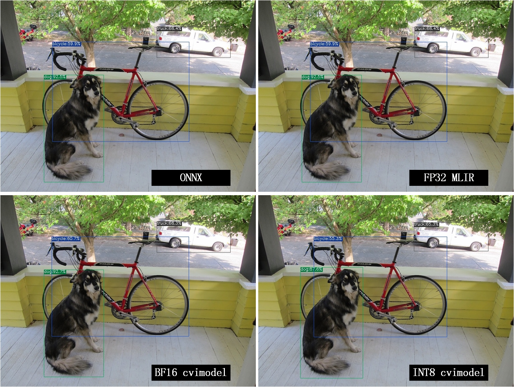

.. _onnx to cvimodel:

附录02: CV18xx使用指南
===============================

CV18xx支持ONNX系列和Caffe模型,目前不支持TFLite模型。在量化数据类型方面,CV18xx支持BF16格式的量化
和INT8格式的对称量化。本章节以CV183X为例,介绍CV18xx系列编译模型和运行runtime sample。

编译yolov5模型
------------------

安装tpu-mlir
~~~~~~~~~~~~~~~~~~~~

进入Docker容器，并执行以下命令安装TPU-MLIR：

.. code-block:: shell

   $ pip install tpu_mlir[all]
   # or
   $ pip install tpu_mlir-*-py3-none-any.whl[all]


准备工作目录
~~~~~~~~~~~~~~~~~~~~

.. include:: get_resource.rst

建立 ``model_yolov5s`` 目录, 并把模型文件和图片文件都放入 ``model_yolov5s`` 目录中。


操作如下:

.. code-block:: shell
   :linenos:

   $ mkdir model_yolov5s && cd model_yolov5s
   $ wget https://github.com/ultralytics/yolov5/releases/download/v6.0/yolov5s.onnx
   $ cp -rf tpu_mlir_resource/dataset/COCO2017 .
   $ cp -rf tpu_mlir_resource/image .
   $ mkdir workspace && cd workspace


ONNX转MLIR
~~~~~~~~~~~~~~~~~~~~

如果模型是图片输入, 在转模型之前我们需要了解模型的预处理。如果模型用预处理后的npz文件做输入, 则不需要考虑预处理。
预处理过程用公式表达如下( :math:`x` 代表输入):

.. math::

   y = (x - mean) \times scale


官网yolov5的图片是rgb, 每个值会乘以 ``1/255`` , 转换成mean和scale对应为
``0.0,0.0,0.0`` 和 ``0.0039216,0.0039216,0.0039216`` 。

模型转换命令如下:

.. code-block:: shell

   $ model_transform \
       --model_name yolov5s \
       --model_def ../yolov5s.onnx \
       --input_shapes [[1,3,640,640]] \
       --mean 0.0,0.0,0.0 \
       --scale 0.0039216,0.0039216,0.0039216 \
       --keep_aspect_ratio \
       --pixel_format rgb \
       --output_names 326,474,622 \
       --test_input ../image/dog.jpg \
       --test_result yolov5s_top_outputs.npz \
       --mlir yolov5s.mlir

``model_transform`` 的相关参数说明参考 :ref:`model_transform参数说明 <model_transform param>` 部分。

MLIR转BF16模型
~~~~~~~~~~~~~~~~~~~~

将mlir文件转换成bf16的cvimodel, 操作方法如下:

.. code-block:: shell

   $ model_deploy \
       --mlir yolov5s.mlir \
       --quantize BF16 \
       --processor cv183x \
       --test_input yolov5s_in_f32.npz \
       --test_reference yolov5s_top_outputs.npz \
       --model yolov5s_cv183x_bf16.cvimodel

``model_deploy`` 的相关参数说明参考 :ref:`model_deploy参数说明 <model_deploy param>` 部分。

MLIR转INT8模型
~~~~~~~~~~~~~~~~~~~~
转INT8模型前需要跑calibration, 得到校准表; 输入数据的数量根据情况准备100~1000张左右。然后用校准表, 生成INT8对称cvimodel

这里用现有的100张来自COCO2017的图片举例, 执行calibration:

.. code-block:: shell

   $ run_calibration yolov5s.mlir \
       --dataset ../COCO2017 \
       --input_num 100 \
       -o yolov5s_cali_table

运行完成后会生成名为 ``${model_name}_cali_table`` 的文件, 该文件用于后续编译INT8
模型的输入文件。

转成INT8对称量化cvimodel模型, 执行如下命令:

.. code-block:: shell

   $ model_deploy \
       --mlir yolov5s.mlir \
       --quantize INT8 \
       --calibration_table yolov5s_cali_table \
       --processor cv183x \
       --test_input yolov5s_in_f32.npz \
       --test_reference yolov5s_top_outputs.npz \
       --tolerance 0.85,0.45 \
       --model yolov5s_cv183x_int8_sym.cvimodel

编译完成后, 会生成名为 ``${model_name}_cv183x_int8_sym.cvimodel`` 的文件。


效果对比
~~~~~~~~~~~~~~~~~~~~

onnx模型的执行方式如下, 得到 ``dog_onnx.jpg`` :

.. code-block:: shell

   $ detect_yolov5 \
       --input ../image/dog.jpg \
       --model ../yolov5s.onnx \
       --output dog_onnx.jpg

FP32 mlir模型的执行方式如下,得到 ``dog_mlir.jpg`` :

.. code-block:: shell

   $ detect_yolov5 \
       --input ../image/dog.jpg \
       --model yolov5s.mlir \
       --output dog_mlir.jpg

BF16 cvimodel的执行方式如下, 得到 ``dog_bf16.jpg`` :

.. code-block:: shell

   $ detect_yolov5 \
       --input ../image/dog.jpg \
       --model yolov5s_cv183x_bf16.cvimodel \
       --output dog_bf16.jpg

INT8 cvimodel的执行方式如下, 得到 ``dog_int8.jpg`` :

.. code-block:: shell

   $ detect_yolov5 \
       --input ../image/dog.jpg \
       --model yolov5s_cv183x_int8_sym.cvimodel \
       --output dog_int8.jpg

.. _yolov5s_result1:


   不同模型效果对比

四张图片对比如 :numref:`yolov5s_result1` ,由于运行环境不同, 最终的效果和精度与 :numref:`yolov5s_result1` 会有些差异。

上述教程介绍了TPU-MLIR编译CV18xx系列的ONNX模型的过程,caffe模型的转换过程可参考“编译Caffe模型”章节,只需要将对应的处理器名称换成实际的CV18xx名称即可。

.. _merge weight:

合并cvimodel模型文件
--------------------------

对于同一个模型,可以依据输入的batch size以及分辨率(不同的h和w)分别生成独立的cvimodel文件。不过为了节省外存和运存,可以选择将这些相关的cvimodel文件合并为一个cvimodel文件,共享其权重部分。具体步骤如下:

步骤0: 生成batch 1的cvimodel
~~~~~~~~~~~~~~~~~~~~~~~~~~~~~~~~~~~~~~~~~~

请参考前述章节,新建workspace目录,通过model_transform将yolov5s转换成mlir fp32模型。

.. admonition:: 注意 :
  :class: attention

  1.需要合并的cvimodel使用同一个workspace目录,并且不要与不需要合并的cvimodel
  共用一个workspace;

  2.步骤0、步骤1中 --merge_weight是必需选项。


.. code-block:: shell

   $ model_transform \
       --model_name yolov5s \
       --model_def ../yolov5s.onnx \
       --input_shapes [[1,3,640,640]] \
       --mean 0.0,0.0,0.0 \
       --scale 0.0039216,0.0039216,0.0039216 \
       --keep_aspect_ratio \
       --pixel_format rgb \
       --output_names 326,474,622 \
       --test_input ../image/dog.jpg \
       --test_result yolov5s_top_outputs.npz \
       --mlir yolov5s_bs1.mlir

使用前述章节生成的yolov5s_cali_table;如果没有,则通过run_calibration工具对yolov5s.mlir进行量化校验获得calibration table文件。
然后将模型量化并生成cvimodel:

.. code-block:: shell

  # 加上 --merge_weight参数
   $ model_deploy \
       --mlir yolov5s_bs1.mlir \
       --quantize INT8 \
       --calibration_table yolov5s_cali_table \
       --processor cv183x \
       --test_input yolov5s_in_f32.npz \
       --test_reference yolov5s_top_outputs.npz \
       --tolerance 0.85,0.45 \
       --merge_weight \
       --model yolov5s_cv183x_int8_sym_bs1.cvimodel

步骤1: 生成batch 2的cvimodel
~~~~~~~~~~~~~~~~~~~~~~~~~~~~~

同步骤0,在同一个workspace中生成batch为2的mlir fp32文件:

.. code-block:: shell

   $ model_transform \
       --model_name yolov5s \
       --model_def ../yolov5s.onnx \
       --input_shapes [[2,3,640,640]] \
       --mean 0.0,0.0,0.0 \
       --scale 0.0039216,0.0039216,0.0039216 \
       --keep_aspect_ratio \
       --pixel_format rgb \
       --output_names 326,474,622 \
       --test_input ../image/dog.jpg \
       --test_result yolov5s_top_outputs.npz \
       --mlir yolov5s_bs2.mlir

.. code-block:: shell

  # 加上 --merge_weight参数
   $ model_deploy \
       --mlir yolov5s_bs2.mlir \
       --quantize INT8 \
       --calibration_table yolov5s_cali_table \
       --processor cv183x \
       --test_input yolov5s_in_f32.npz \
       --test_reference yolov5s_top_outputs.npz \
       --tolerance 0.85,0.45 \
       --merge_weight \
       --model yolov5s_cv183x_int8_sym_bs2.cvimodel

步骤2: 合并batch 1和batch 2的cvimodel
~~~~~~~~~~~~~~~~~~~~~~~~~~~~~~~~~~~~~~

使用model_tool合并两个cvimodel文件:

.. code-block:: shell

  model_tool \
    --combine \
      yolov5s_cv183x_int8_sym_bs1.cvimodel \
      yolov5s_cv183x_int8_sym_bs2.cvimodel \
      -o yolov5s_cv183x_int8_sym_bs1_bs2.cvimodel

步骤3: runtime接口调用cvimodel
~~~~~~~~~~~~~~~~~~~~~~~~~~~~~~~~~~~~~~

可以通过以下命令查看bs1和bs2指令的program id:

.. code-block:: shell

  model_tool --info yolov5s_cv183x_int8_sym_bs1_bs2.cvimodel

在运行时可以通过如下方式去运行不同的batch命令:

.. code-block:: c++

  CVI_MODEL_HANDEL bs1_handle;
  CVI_RC ret = CVI_NN_RegisterModel("yolov5s_cv183x_int8_sym_bs1_bs2.cvimodel", &bs1_handle);
  assert(ret == CVI_RC_SUCCESS);
  // 选择bs1的program id
  CVI_NN_SetConfig(bs1_handle, OPTION_PROGRAM_INDEX, 0);
  CVI_NN_GetInputOutputTensors(bs1_handle, ...);
  ....


  CVI_MODEL_HANDLE bs2_handle;
  // 复用已加载的模型
  CVI_RC ret = CVI_NN_CloneModel(bs1_handle, &bs2_handle);
  assert(ret == CVI_RC_SUCCESS);
  // 选择bs2的program id
  CVI_NN_SetConfig(bs2_handle, OPTION_PROGRAM_INDEX, 1);
  CVI_NN_GetInputOutputTensors(bs2_handle, ...);
  ...

  // 最后销毁bs1_handle, bs2_handel
  CVI_NN_CleanupModel(bs1_handle);
  CVI_NN_CleanupModel(bs2_handle);

综述: 合并过程
~~~~~~~~~~~~~~~~~~~~~~~~~~~~~~~~~~~~~~

使用上面命令,不论是相同模型还是不同模型,均可以进行合并。
合并的原理是: 模型生成过程中,会叠加前面模型的weight(如果相同则共用)。

主要步骤在于:

#. 用model_deploy生成模型时,加上--merge_weight参数
#. 要合并的模型的生成目录必须是同一个,且在合并模型前不要清理任何中间文件(叠加前面模型weight通过中间文件_weight_map.csv实现)
#. 用model_tool --combine 将多个cvimodel合并


编译和运行runtime sample
--------------------------

本章首先介绍EVB如何运行sample应用程序,然后介绍如何交叉编译sample应用程序,最后介绍docker仿真编译和运行sample。具体包括4个samples:

* Sample-1 : classifier (mobilenet_v2)

* Sample-2 : classifier_bf16 (mobilenet_v2)

* Sample-3 : classifier fused preprocess (mobilenet_v2)

* Sample-4 : classifier multiple batch (mobilenet_v2)

在EVB运行release提供的sample预编译程序
~~~~~~~~~~~~~~~~~~~~~~~~~~~~~~~~~~~~~~

需要如下文件:

* cvitek_tpu_sdk_[cv183x | cv182x | cv182x_uclibc | cv181x_glibc32 | cv181x_musl_riscv64_rvv | cv180x_musl_riscv64_rvv | cv181x_glibc_riscv64].tar.gz
* cvimodel_samples_[cv183x | cv182x | cv181x | cv180x].tar.gz

将根据处理器类型选择所需文件加载至EVB的文件系统,于evb上的linux console执行,以cv183x为例:

解压samples使用的model文件(以cvimodel格式交付),并解压TPU_SDK,并进入samples目录,执行测试,过程如下:

.. code-block:: shell

   #env
   tar zxf cvimodel_samples_cv183x.tar.gz
   export MODEL_PATH=$PWD/cvimodel_samples
   tar zxf cvitek_tpu_sdk_cv183x.tar.gz
   export TPU_ROOT=$PWD/cvitek_tpu_sdk
   cd cvitek_tpu_sdk && source ./envs_tpu_sdk.sh
   # get cvimodel info
   cd samples
   ./bin/cvi_sample_model_info $MODEL_PATH/mobilenet_v2.cvimodel

   ####################################
   # sample-1 : classifier
   ###################################
   ./bin/cvi_sample_classifier \
       $MODEL_PATH/mobilenet_v2.cvimodel \
       ./data/cat.jpg \
       ./data/synset_words.txt

   # TOP_K[5]:
   #  0.326172, idx 282, n02123159 tiger cat
   #  0.326172, idx 285, n02124075 Egyptian cat
   #  0.099609, idx 281, n02123045 tabby, tabby cat
   #  0.071777, idx 287, n02127052 lynx, catamount
   #  0.041504, idx 331, n02326432 hare

   ####################################
   # sample-2 : classifier_bf16
   ###################################
   ./bin/cvi_sample_classifier_bf16 \
       $MODEL_PATH/mobilenet_v2_bf16.cvimodel \
       ./data/cat.jpg \
       ./data/synset_words.txt

   # TOP_K[5]:
   #  0.314453, idx 285, n02124075 Egyptian cat
   #  0.040039, idx 331, n02326432 hare
   #  0.018677, idx 330, n02325366 wood rabbit, cottontail, cottontail rabbit
   #  0.010986, idx 463, n02909870 bucket, pail
   #  0.010986, idx 852, n04409515 tennis ball


   ############################################
   # sample-3 : classifier fused preprocess
   ############################################
   ./bin/cvi_sample_classifier_fused_preprocess \
       $MODEL_PATH/mobilenet_v2_fused_preprocess.cvimodel \
       ./data/cat.jpg \
       ./data/synset_words.txt

   # TOP_K[5]:
   #  0.326172, idx 282, n02123159 tiger cat
   #  0.326172, idx 285, n02124075 Egyptian cat
   #  0.099609, idx 281, n02123045 tabby, tabby cat
   #  0.071777, idx 287, n02127052 lynx, catamount
   #  0.041504, idx 331, n02326432 hare

   ############################################
   # sample-4 : classifier multiple batch
   ############################################
   ./bin/cvi_sample_classifier_multi_batch \
       $MODEL_PATH/mobilenet_v2_bs1_bs4.cvimodel \
       ./data/cat.jpg \
       ./data/synset_words.txt

   # TOP_K[5]:
   #  0.326172, idx 282, n02123159 tiger cat
   #  0.326172, idx 285, n02124075 Egyptian cat
   #  0.099609, idx 281, n02123045 tabby, tabby cat
   #  0.071777, idx 287, n02127052 lynx, catamount
   #  0.041504, idx 331, n02326432 hare

同时提供脚本作为参考,执行效果与直接运行相同,如下:

.. code-block:: shell

   ./run_classifier.sh
   ./run_classifier_bf16.sh
   ./run_classifier_fused_preprocess.sh
   ./run_classifier_multi_batch.sh

**在cvitek_tpu_sdk/samples/samples_extra目录下有更多的samples,可供参考:**

.. code-block:: shell

   ./bin/cvi_sample_detector_yolo_v3_fused_preprocess \
       $MODEL_PATH/yolo_v3_416_fused_preprocess_with_detection.cvimodel \
       ./data/dog.jpg \
       yolo_v3_out.jpg

   ./bin/cvi_sample_detector_yolo_v5_fused_preprocess \
       $MODEL_PATH/yolov5s_fused_preprocess.cvimodel \
       ./data/dog.jpg \
       yolo_v5_out.jpg

   ./bin/cvi_sample_detector_yolox_s \
       $MODEL_PATH/yolox_s.cvimodel \
       ./data/dog.jpg \
       yolox_s_out.jpg

   ./bin/cvi_sample_alphapose_fused_preprocess \
       $MODEL_PATH/yolo_v3_416_fused_preprocess_with_detection.cvimodel \
       $MODEL_PATH/alphapose_fused_preprocess.cvimodel \
       ./data/pose_demo_2.jpg \
       alphapose_out.jpg

   ./bin/cvi_sample_fd_fr_fused_preprocess \
       $MODEL_PATH/retinaface_mnet25_600_fused_preprocess_with_detection.cvimodel \
       $MODEL_PATH/arcface_res50_fused_preprocess.cvimodel \
       ./data/obama1.jpg \
       ./data/obama2.jpg

交叉编译samples程序
~~~~~~~~~~~~~~~~~~~~~~~~~~~~~~~~~~~~~~~~~

发布包有samples的源代码,按照本节方法在Docker环境下交叉编译samples程序,然后在evb上运行。

本节需要如下文件:

* cvitek_tpu_sdk_[cv183x | cv182x | cv182x_uclibc | cv181x_glibc32 | cv181x_musl_riscv64_rvv | cv180x_musl_riscv64_rvv].tar.gz
* cvitek_tpu_samples.tar.gz

aarch 64位  (如cv183x aarch64位平台)
``````````````````````````````````````

SDK准备:

.. code-block:: shell

   tar zxf host-tools.tar.gz
   tar zxf cvitek_tpu_sdk_cv183x.tar.gz
   export PATH=$PWD/host-tools/gcc/gcc-linaro-6.3.1-2017.05-x86_64_aarch64-linux-gnu/bin:$PATH
   export TPU_SDK_PATH=$PWD/cvitek_tpu_sdk
   cd cvitek_tpu_sdk && source ./envs_tpu_sdk.sh && cd ..

编译samples,安装至install_samples目录:

.. code-block:: shell

   tar zxf cvitek_tpu_samples.tar.gz
   cd cvitek_tpu_samples
   mkdir build_soc
   cd build_soc
   cmake -G Ninja \
       -DCMAKE_BUILD_TYPE=RELEASE \
       -DCMAKE_C_FLAGS_RELEASE=-O3 \
       -DCMAKE_CXX_FLAGS_RELEASE=-O3 \
       -DCMAKE_TOOLCHAIN_FILE=$TPU_SDK_PATH/cmake/toolchain-aarch64-linux.cmake \
       -DTPU_SDK_PATH=$TPU_SDK_PATH \
       -DOPENCV_PATH=$TPU_SDK_PATH/opencv \
       -DCMAKE_INSTALL_PREFIX=../install_samples \
       ..
   cmake --build . --target install


arm 32位  (如cv183x平台32位、cv182x平台)
``````````````````````````````````````````

SDK准备:

.. code-block:: shell

   tar zxf host-tools.tar.gz
   tar zxf cvitek_tpu_sdk_cv182x.tar.gz
   export TPU_SDK_PATH=$PWD/cvitek_tpu_sdk
   export PATH=$PWD/host-tools/gcc/gcc-linaro-6.3.1-2017.05-x86_64_arm-linux-gnueabihf/bin:$PATH
   cd cvitek_tpu_sdk && source ./envs_tpu_sdk.sh && cd ..

如果docker版本低于1.7,则需要更新32位系统库(只需一次):

.. code-block:: shell

   dpkg --add-architecture i386
   apt-get update
   apt-get install libc6:i386 libncurses5:i386 libstdc++6:i386


编译samples,安装至install_samples目录:

.. code-block:: shell

   tar zxf cvitek_tpu_samples.tar.gz
   cd cvitek_tpu_samples
   mkdir build_soc
   cd build_soc
   cmake -G Ninja \
       -DCMAKE_BUILD_TYPE=RELEASE \
       -DCMAKE_C_FLAGS_RELEASE=-O3 \
       -DCMAKE_CXX_FLAGS_RELEASE=-O3 \
       -DCMAKE_TOOLCHAIN_FILE=$TPU_SDK_PATH/cmake/toolchain-linux-gnueabihf.cmake \
       -DTPU_SDK_PATH=$TPU_SDK_PATH \
       -DOPENCV_PATH=$TPU_SDK_PATH/opencv \
       -DCMAKE_INSTALL_PREFIX=../install_samples \
       ..
   cmake --build . --target install


uclibc 32位平台 (cv182x uclibc平台)
``````````````````````````````````````

SDK准备:

.. code-block:: shell

   tar zxf host-tools.tar.gz
   tar zxf cvitek_tpu_sdk_cv182x_uclibc.tar.gz
   export TPU_SDK_PATH=$PWD/cvitek_tpu_sdk
   export PATH=$PWD/host-tools/gcc/arm-cvitek-linux-uclibcgnueabihf/bin:$PATH
   cd cvitek_tpu_sdk && source ./envs_tpu_sdk.sh && cd ..

如果docker版本低于1.7,则需要更新32位系统库(只需一次):

.. code-block:: shell

   dpkg --add-architecture i386
   apt-get update
   apt-get install libc6:i386 libncurses5:i386 libstdc++6:i386


编译samples,安装至install_samples目录:

.. code-block:: shell

   tar zxf cvitek_tpu_samples.tar.gz
   cd cvitek_tpu_samples
   mkdir build_soc
   cd build_soc
   cmake -G Ninja \
       -DCMAKE_BUILD_TYPE=RELEASE \
       -DCMAKE_C_FLAGS_RELEASE=-O3 \
       -DCMAKE_CXX_FLAGS_RELEASE=-O3 \
       -DCMAKE_TOOLCHAIN_FILE=$TPU_SDK_PATH/cmake/toolchain-linux-uclibc.cmake \
       -DTPU_SDK_PATH=$TPU_SDK_PATH \
       -DOPENCV_PATH=$TPU_SDK_PATH/opencv \
       -DCMAKE_INSTALL_PREFIX=../install_samples \
       ..
   cmake --build . --target install


riscv64位 musl平台 (如cv181x、cv180x riscv64位 musl平台)
``````````````````````````````````````````````````````````````

SDK准备:

.. code-block:: shell

   tar zxf host-tools.tar.gz
   tar zxf cvitek_tpu_sdk_cv181x_musl_riscv64_rvv.tar.gz
   export TPU_SDK_PATH=$PWD/cvitek_tpu_sdk
   export PATH=$PWD/host-tools/gcc/riscv64-linux-musl-x86_64/bin:$PATH
   cd cvitek_tpu_sdk && source ./envs_tpu_sdk.sh && cd ..

编译samples,安装至install_samples目录:

.. code-block:: shell

   tar zxf cvitek_tpu_samples.tar.gz
   cd cvitek_tpu_samples
   mkdir build_soc
   cd build_soc
   cmake -G Ninja \
       -DCMAKE_BUILD_TYPE=RELEASE \
       -DCMAKE_C_FLAGS_RELEASE=-O3 \
       -DCMAKE_CXX_FLAGS_RELEASE=-O3 \
       -DCMAKE_TOOLCHAIN_FILE=$TPU_SDK_PATH/cmake/toolchain-riscv64-linux-musl-x86_64.cmake \
       -DTPU_SDK_PATH=$TPU_SDK_PATH \
       -DOPENCV_PATH=$TPU_SDK_PATH/opencv \
       -DCMAKE_INSTALL_PREFIX=../install_samples \
       ..
   cmake --build . --target install

riscv64位 glibc平台 (如cv181x、cv180x riscv64位glibc平台)
``````````````````````````````````````````````````````````

SDK准备:

.. code-block:: shell

   tar zxf host-tools.tar.gz
   tar zxf cvitek_tpu_sdk_cv181x_glibc_riscv64.tar.gz
   export TPU_SDK_PATH=$PWD/cvitek_tpu_sdk
   export PATH=$PWD/host-tools/gcc/riscv64-linux-x86_64/bin:$PATH
   cd cvitek_tpu_sdk && source ./envs_tpu_sdk.sh && cd ..

编译samples,安装至install_samples目录:

.. code-block:: shell

   tar zxf cvitek_tpu_samples.tar.gz
   cd cvitek_tpu_samples
   mkdir build_soc
   cd build_soc
   cmake -G Ninja \
       -DCMAKE_BUILD_TYPE=RELEASE \
       -DCMAKE_C_FLAGS_RELEASE=-O3 \
       -DCMAKE_CXX_FLAGS_RELEASE=-O3 \
       -DCMAKE_TOOLCHAIN_FILE=$TPU_SDK_PATH/cmake/toolchain-riscv64-linux-x86_64.cmake \
       -DTPU_SDK_PATH=$TPU_SDK_PATH \
       -DOPENCV_PATH=$TPU_SDK_PATH/opencv \
       -DCMAKE_INSTALL_PREFIX=../install_samples \
       ..
   cmake --build . --target install


docker环境仿真运行的samples程序
~~~~~~~~~~~~~~~~~~~~~~~~~~~~~~~

需要如下文件:

* cvitek_tpu_sdk_x86_64.tar.gz
* cvimodel_samples_[cv183x|cv182x|cv181x|cv180x].tar.gz
* cvitek_tpu_samples.tar.gz


TPU sdk准备:

.. code-block:: shell

   tar zxf cvitek_tpu_sdk_x86_64.tar.gz
   export TPU_SDK_PATH=$PWD/cvitek_tpu_sdk
   cd cvitek_tpu_sdk && source ./envs_tpu_sdk.sh && cd ..

编译samples,安装至install_samples目录:

.. code-block:: shell

   tar zxf cvitek_tpu_samples.tar.gz
   cd cvitek_tpu_samples
   mkdir build
   cd build
   cmake -G Ninja \
      -DCMAKE_BUILD_TYPE=RELEASE \
      -DCMAKE_C_FLAGS_RELEASE=-O3 \
      -DCMAKE_CXX_FLAGS_RELEASE=-O3 \
      -DTPU_SDK_PATH=$TPU_SDK_PATH \
      -DCNPY_PATH=$TPU_SDK_PATH/cnpy \
      -DOPENCV_PATH=$TPU_SDK_PATH/opencv \
      -DCMAKE_INSTALL_PREFIX=../install_samples \
      ..
   cmake --build . --target install

运行samples程序:

.. code-block:: shell

   # envs
   tar zxf cvimodel_samples_cv183x.tar.gz
   export MODEL_PATH=$PWD/cvimodel_samples

   # get cvimodel info
   cd ../install_samples
   ./bin/cvi_sample_model_info $MODEL_PATH/mobilenet_v2.cvimodel

**其他samples运行命令参照EVB运行命令**

在开发板上进行模型测试及验证工作
----------------------------
在板子上可以通过cvitek_tpu_sdk/bin/下的model_runner程序进行模型验证；运行model_runner前需要将cvitek_tpu_sdk放到板子上，然后：

.. code-block:: shell

    cd cvitek_tpu_sdk
    source ./envs_tpu_sdk.sh

model_runner支持以下选项：

.. list-table:: model_runner 参数功能
   :widths: 18 50
   :header-rows: 1

   * - 参数名
     - 说明
   * - --model
     - 指定模型文件
   * - --input
     - 指定输入npz文件
   * - --output
     - 指定输出npz文件
   * - --pmu
     - 打印性能数据
   * - --count
     - 循环运行次数
   * - --reference
     - 指定结果对比npz文件
   * - --tolerances
     - 指定结果对比相似度限制
   * - --enable-timer
     - 打印推理耗时信息

一般使用命令如下：


.. code-block:: shell

    # 测试模型是否能正常推理
    model_runner --model yolov5s.cvimodel

    # 测试模型性能
    model_runner --model yolov5s.cvimodel --pmu

    # dump 模型结果
    model_runner --model yolov5s.cvimodel --input input.npz --output output.npz

    # 对比模型结果
    model_runner --model yolov5s.cvimodel --input input.npz --reference ref.npz


FAQ
----

模型转换常见问题
~~~~~~~~~~~~~~~~~~~~

模型转换问题
````````````````

1. pytorch,tensorflow等是否能直接转换为cvimodel?

  pytorch: 支持通过 ``jit.trace(torch_model.eval(), inputs).save(`model_name.pt`)`` 静态化后的pt模型。

  tensorflow / 其它: 暂不支持,可以通过onnx间接支持tf模型。

2. 执行model_transform报错

  ``model_transform`` 命令作用是将onnx,caffe框架模型转化为fp32 mlir形式,报错很大概率就是存在不支持的算子或者算子属性不兼容,可以反馈给tpu团队解决。

3. 执行model_deploy报错

  ``model_deploy`` 作用是先将fp32 mlir通过量化转为int8/bf16mlir形式,然后再将int8/bf16mlir转化为cvimodel。在转化的过程中,会涉及到两次相似度的对比: 一次是fp32 mlir与int8/bf16mlir之间的量化对比,一次是int8/bf16mlir与最终转化出来的cvimodel的相似度对比,若相似度对比失败则会出现下列问题:

  .. figure:: ../assets/compare_failed.png
    :height: 13cm
    :align: center

  解决方法: ``tolerance`` 参数不对。模型转换过程会对int8/bf16 mlir与fp32 mlir的输出计算相似度,而tolerance作用就是限制相似度的最低值,若计算出的相似度的最小值低于对应的预设的tolerance值则程序会停止执行, 可以考虑对tolerance进行调整。(如果相似度的最小值过低请反馈到tpu团队解决)。

4. ``model_transform`` 的 ``pixel_format`` 参数和 ``model_deploy`` 的 ``customization_format`` 参数的差异?

  channel_order是原始模型的输入图片类型(只支持gray/rgb planar/bgr planar),customization_format是转换成cvimodel后的输入图片类型,由客户自行决定,需与 :ref:`fuse_preprocess <fuse preprocess>` 共同使用(如果输入图片是通过VPSS或者VI获取的YUV图片,可以设置customization_format为YUV格式)。如果pixel_format与customization_format不一致,cvimodel推理时会自动将输入转成pixel_format指定的类型。

5. 是否支持多输入模型,怎么进行预处理?

  仅支持多输入图片使用同一种预处理方式的模型,不支持多输入图片使用不同预处理方式的模型。

量化问题
````````````

1. 跑run_calibration提示KeyError: 'images'

  传入的images的路径不对,请检查数据集的路径是否正确。

2. 跑量化如何处理多输入问题?

  多输入模型跑run_calibration时, 可使用.npz存储多个输入，或使用--data_list参数，且data_list中的每行的多个输入由“，”隔开。

3. 跑量化输入会进行预处理吗?

  会的,根据model_transform的预处理参数保存到mlir文件中,量化过程会进行加载预处理参数进行预处理。

4. 跑量化输入程序被系统kill或者显示分配内存失败

  需要先检查主机的内存是否足够,常见的模型需要8G内存左右即可。如果内存不够,可尝试在运行run_calibration时,添加以下参数来减少内存需求。

  .. code-block:: shell

     --tune_num 2   			#默认为5

5. 是否支持手动修改calibration table?

  支持,但是不建议修改。

其它常见问题
````````````````````

1. 转换后的模型是否支持加密?

  暂时不支持。

2. bf16的模型与int8模型的速度差异是多少?

  大约是3-4倍时间差异,具体的数据需要通过实验验证。

3. 是否支持动态shape?

  cvimodel不支持动态shape。如果是固定的几种shape可以依据输入的batch_size以及不同的h和w分别生成独立的cvimodel文件,通过共享权重的形式合并为一个cvimodel。详见: :ref:`合并cvimodel模型文件 <merge weight>`

模型评估常见问题
~~~~~~~~~~~~~~~~~~~~

模型的评估流程?
`````````````````

先转化为bf16模型,通过 ``model_tool --info xxxx.cvimodel`` 命令来评估模型所需要的ION内存以及所占的存储空间,接着在板子上执行 ``model_runner`` 来评估模型运行的时间,之后根据提供的sample来评估业务场景下模型精度效果。模型输出的效果准确性符合预期之后,再转化为int8模型再完成与bf16模型相同的流程

量化后精度与原来模型对不上,如何调试?
``````````````````````````````````````

1. 确保 ``model_deploy`` 的 ``--test_input``, ``--test_reference``, ``--compare_all``, ``--tolerance`` 参数进行了正确设置。

2. 比较bf16模型与原始模型的运行结果,确保误差不大。如果误差较大,先确认预处理和后处理是否正确。

3. 如果int8模型精度差:

    a. 确认 ``run_calibration`` 使用的数据集为训练模型时使用的验证集;
    b. 可以增加 ``run_calibration`` 使用的业务场景数据集(一般为100-1000张图片)。

4. 确认输入类型:

    a. 若指定 ``--fuse_preprocess`` 参数,cvimodel的input类型为uint8;
    b. 若指定 ``--quant_input`` , 一般情况下,bf16_cvimoel的input类型为bf16,int8_cvimodel的input类型为int8;
    c. input类型也可以通过model_tool --info xxx.cvimodel查看


bf16模型的速度比较慢,int8模型精度不符合预期怎么办?
````````````````````````````````````````````````````

使用混精度量化方法,可参考 :ref:`mix precision` 。

模型部署常见问题
~~~~~~~~~~~~~~~~~~~~

CVI_NN_Forward接口调用多次后出错或者卡住时间过长?
```````````````````````````````````````````````````

可能驱动或者硬件问题,需要反馈给tpu团队解决。

模型预处理速度比较慢?
```````````````````````

1. 转模型的时候可以在运行 ``model_deploy`` 时加上 ``fuse_preprocess`` 参数, 将预处理放到深度学习处理器内部来处理。

2. 如果图片是从vpss或者vi获取, 那么可以在转模型时使用 ``fuse_preprocess、aligned_input`` , 然后使用 ``CVI_NN_SetTensorPhysicalAddr`` 等接口直接将input tensor地址设置为图片的物理地址, 减少数据拷贝耗时。

docker的推理和evb推理的浮点和定点结果是否一样?
``````````````````````````````````````````````````

定点无差异, 浮点有差异, 但是相似度比较高, 误差可以忽略。

如果要跑多个模型支持多线程并行吗?
````````````````````````````````````

支持多线程, 但是多个模型在深度学习处理器上推理时是串行进行的。

填充input tensor相关接口区别
``````````````````````````````

``CVI_NN_SetTensorPtr`` : 设置input tensor的虚拟地址，原本的tensor 内存不会释放。推理时从用户设置的虚拟地址 **拷贝数据** 到原本的tensor内存上。

``CVI_NN_SetTensorPhysicalAddr`` : 设置input tensor的物理地址，原本的tensor 内存会释放。推理时直接从新设置的物理地址读取数据, **无需拷贝数据** 。从VPSS获取的Frame可以调用这个接口，传入Frame的首地址。注意需要转模型的时候 ``model_deploy`` 设置 ``--fused_preprocess --aligned_input`` 才能调用此接口。

``CVI_NN_SetTensorWithVideoFrame`` : 通过VideoFrame结构体来填充Input Tensor。注意VideoFrame的地址为物理地址。如果转模型设置 ``--fuse_preprocess --aligned_input`` ，则等同于 ``CVI_NN_SetTensorPhysicalAddr`` ，否则会将VideoFrame的数据拷贝到Input Tensor。

``CVI_NN_SetTensorWithAlignedFrames`` : 与 ``CVI_NN_SetTensorWithVideoFrame`` 类
似, 支持多batch。

``CVI_NN_FeedTensorWithFrames`` : 与 ``CVI_NN_SetTensorWithVideoFrame`` 类似。

模型载入后ion内存分配问题
`````````````````````````````

1. 调用 ``CVI_NN_RegisterModel`` 后会为weight和cmdbuf分配ion内存(从model_tool可以看到weight和cmdbuf大小)

2. 调用 ``CVI_NN_GetInputOutputTensors`` 后会为tensor(包括private_gmem, shared_gmem, io_mem)分配ion内存

3. ``CVI_NN_CloneModel`` 可以共享weight和cmdbuf内存

4. 其他接口均不会再申请ion内存, 即除了初始化, 其他阶段模型都不会再申请内存。

5. 不同模型的shared_gmem是可以共享(包括多线程情况), 因此优先初始化shared_gmem最大的模型可以节省ion内存。

加载业务程序后模型推理时间变长
`````````````````````````````````

设置环境变量 ``export TPU_ENABLE_PMU=1`` 后, 模型推理时会打印tpu日志, 记录tdma_exe_ms、tiu_exe_ms、inference_ms这3个耗时。一般加载业务后tdma_exe_ms会变长, tiu_exe_ms不变, 这是因为tdma_exe_ms是内存搬运数据耗时, 如果内存带宽不够用了, tdma耗时就会增加。

优化的方向:

  a. vpss/venc等优化chn, 降低分辨率

  b. 业务层减少内存拷贝, 如图片尽量保存引用, 减少拷贝等

  c. 模型填充Input tensor时, 使用无拷贝的方式

其他常见问题
~~~~~~~~~~~~~~~~~~~~

在cv182x/cv181x/cv180x板端环境中出现: taz:invalid option --z解压失败的情况
`````````````````````````````````````````````````````````````````````````````

先在其他linux环境下解压, 再放到板子中使用, 因为window不支持软链接, 所以在windows环境下解压可能导致软链接失效导致报错

若tensorflow模型为saved_model的pb形式, 如何进行转化为frozen_model的pb形式
``````````````````````````````````````````````````````````````````````````````

.. code-block:: shell

   import tensorflow as tf
   from tensorflow.keras.applications.mobilenet_v2 import MobileNetV2
   from tensorflow.keras.preprocessing import image
   from tensorflow.keras.applications.mobilenet_v2 import preprocess_input, decode_predictions
   import numpy as np
   import tf2onnx
   import onnxruntime as rt

   img_path = "./cat.jpg"
   # pb model and variables should in model dir
   pb_file_path = "your model dir"
   img = image.load_img(img_path, target_size=(224, 224))
   x = image.img_to_array(img)
   x = np.expand_dims(x, axis=0)
   # Or set your preprocess here
   x = preprocess_input(x)

   model = tf.keras.models.load_model(pb_file_path)
   preds = model.predict(x)

   # different model input shape and name will differently
   spec = (tf.TensorSpec((1, 224, 224, 3), tf.float32, name="input"), )
   output_path = model.name + ".onnx"

   model_proto, _ = tf2onnx.convert.from_keras(model, input_signature=spec, opset=13, output_path=output_path)
