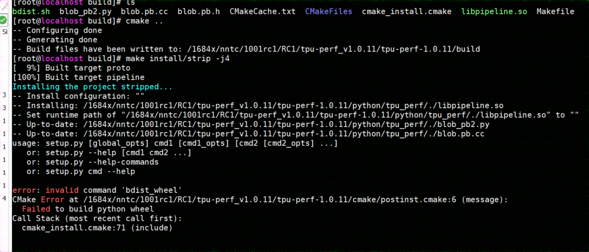
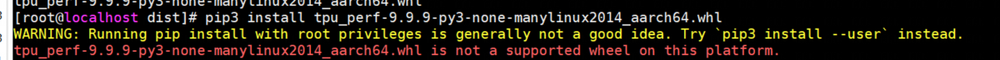
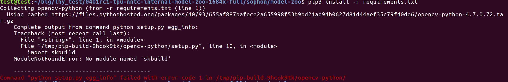

附录04：Model-zoo测试
==============================

注意事项
~~~~~~~~~~~~~~~~~~~~~

每项测试耗时若超过以下时间限制则视为异常：

* 编译测试：48小时
* 性能测试：24小时
* 精度测试：24小时（当前仅 BM1684X PCIE 需要进行精度测试）

配置系统环境
~~~~~~~~~~~~

如果是首次使用Docker, 那么请使用 :ref:`开发环境配置 <docker configuration>` 中的方法安装
并配置Docker。同时, 本章中会使用到 ``git-lfs`` , 如果首次使用 ``git-lfs`` ，用户需要在自己系统中（并非Docker容器中）执行下述命令进行安装和配置：

.. code-block:: shell

   $ curl -s https://packagecloud.io/install/repositories/github/git-lfs/script.deb.sh | sudo bash
   $ sudo apt-get install git-lfs

获取 ``model-zoo`` 模型
~~~~~~~~~~~~~~~~~~~~~~~~

在工作目录下，从SOPHGO提供的SDK包中获取 ``model-zoo`` 测试包, 并执行以下操作创建并
设置好 ``model-zoo`` ：

.. code-block:: shell

    $ mkdir -p model-zoo
    $ tar -xvf path/to/model-zoo_<date>.tar.bz2 --strip-components=1 -C model-zoo

model-zoo的目录结构如下：

.. code-block:: shell

    ├── config.yaml
    ├── requirements.txt
    ├── dataset
    ├── harness
    ├── output
    └── ...

* config.yaml：包含通用的配置：数据集的目录、模型的根目录等，以及一些复用的参数和命令
* requirements.txt：model-zoo 的 python 依赖
* dataset：目录中包含modelzoo中模型的数据集，将作为 plugin 被 tpu_perf 调用
* output：目录将用于存放编译输出的 bmodel 和一些中间数据
* 其他目录包含各个模型的信息和配置。每个模型对应的目录都有一个 config.yaml 文件，该配置文件中配置了模型的名称、路径和 FLOPs、数据集制作参数，以及模型的量化编译命令。

准备运行环境
~~~~~~~~~~~~

在系统中（Docker容器外）安装运行 ``model-zoo`` 所需的依赖:

.. code-block:: shell

   # for ubuntu 操作系统
   $ sudo apt install build-essential
   $ sudo apt install python3-dev
   $ sudo apt install -y libgl1
   # for centos 操作系统
   $ sudo yum install make automake gcc gcc-c++ kernel-devel
   $ sudo yum install python-devel
   $ sudo yum install mesa-libGL
   # 精度测试需要执行以下操作，性能测试可以不执行，推荐使用Anaconda等创建python3.7或以上的虚拟环境
   $ cd path/to/model-zoo
   $ pip3 install -r requirements.txt

另外，进行性能和精度测试时需要调用 TPU 硬件，请安装 TPU 硬件对应的 runtime 环境。

配置SoC设备
~~~~~~~~~~~~~~~~~~~~~~~~~~~~~~~~

注意: 如果您的设备是 PCIE 板卡, 可以直接跳过该节内容。

性能测试只依赖于 TPU 硬件对应的 runtime 环境, 所以在工具链编译环境编译完的模型连同 ``model-zoo`` 整个打包, 就可以在 SoC 环境使用 ``tpu_perf`` 进行性能测试。但是, SoC设备上存储有限, 完整的 ``model-zoo`` 与编译输出内容可能无法完整拷贝到 SoC 中。这里介绍一种通过 linux nfs 远程文件系统挂载来实现在 SoC 设备上运行测试的方法。

首先, 在工具链环境服务器『host 系统』安装 nfs 服务:

.. code-block:: shell

   $ sudo apt install nfs-kernel-server

在 ``/etc/exports`` 中添加以下内容(配置共享目录):

.. code-block:: shell

   /the/absolute/path/of/model-zoo *(rw,sync,no_subtree_check,no_root_squash)

其中 ``*`` 表示所有人都可以访问该共享目录, 也可以配置成特定网段或 IP 可访问, 如:

.. code-block:: shell

   /the/absolute/path/of/model-zoo 192.168.43.0/24(rw,sync,no_subtree_check,no_root_squash)

然后执行如下命令使配置生效:

.. code-block:: shell

   $ sudo exportfs -a
   $ sudo systemctl restart nfs-kernel-server

另外, 需要为 dataset 目录下的图片添加读取权限:

.. code-block:: shell

   $ chmod -R +r path/to/model-zoo/dataset

在 SoC 设备上安装客户端并挂载该共享目录:

.. code-block:: shell

   $ mkdir model-zoo
   $ sudo apt-get install -y nfs-common
   $ sudo mount -t nfs <IP>:/path/to/model-zoo ./model-zoo

这样便可以在 SoC 环境访问测试目录。SoC 测试其余的操作与 PCIE 基本一致, 请参考下文进行操作; 运行环境命令执行位置的差别, 已经在执行处添加说明。

准备数据集
~~~~~~~~~~~~

注意：由于SoC设备CPU资源有限，不推荐进行精度测试，因此SoC设备测试可以跳过数据集准备与精度测试部分

ImageNet
--------

下载 `ImageNet 2012 数据集 <https://www.kaggle.com/competitions/imagenet-object-localization-challenge/data?select=ILSVRC>`_ 。

解压后，将 ``Data/CLS_LOC/val`` 下的数据移动到 model-zoo 如下目录中：

.. code-block:: shell

   $ cd path/to/sophon/model-zoo
   $ mkdir -p dataset/ILSVRC2012/ILSVRC2012_img_val
   $ mv path/to/imagenet-object-localization-challenge/Data/CLS_LOC/val dataset/ILSVRC2012/ILSVRC2012_img_val
   # 也可以通过软链接 ln -s 将数据集目录映射到 dataset/ILSVRC2012/ILSVRC2012_img_val

COCO (可选)
-----------

如果精度测试用到了 coco 数据集（如yolo等用coco训练的网络），请按照如下步骤下载解压：

.. code-block:: shell

   $ cd path/to/model-zoo/dataset/COCO2017/
   $ wget http://images.cocodataset.org/annotations/annotations_trainval2017.zip
   $ wget http://images.cocodataset.org/zips/val2017.zip
   $ unzip annotations_trainval2017.zip
   $ unzip val2017.zip

Vid4 (可选)
-----------

如果需要对 BasicVSR 进行精度测试，请按照如下步骤下载解压 Vid4 数据集：

.. code-block:: shell

   $ pip3 install gdown
   $ cd path/to/model-zoo/dataset/basicvsr/
   $ gdown https://drive.google.com/open?id=1ZuvNNLgR85TV_whJoHM7uVb-XW1y70DW --fuzzy
   $ unzip -o Vid4.zip -d eval

准备工具链编译环境
~~~~~~~~~~~~~~~~~~

建议在 docker 环境使用工具链软件，可以参考 :ref:`基础环境配置 <docker configuration>` 安装Docker。并在工作目录（即 ``model-zoo`` 所在目录）下执行以下命令创建Docker容器：

.. code-block:: shell

   $ docker pull sophgo/tpuc_dev:v3.4
   $ docker run --name myname -v $PWD:/workspace -it sophgo/tpuc_dev:v3.4

如果要让容器在退出后删除，可以添加 ``--rm`` 参数：

.. code-block:: shell

   $ docker run --name myname -v $PWD:/workspace -it sophgo/tpuc_dev:v3.4 --rm

运行命令后会处于Docker的容器中，从SOPHGO提供的SDK包中获取最新的 ``tpu-mlir`` wheel安装包，例如 ``tpu_mlir-*-py3-none-any.whl``。在Docker容器中安装TPU-MLIR:

.. code-block:: shell

   $ pip install tpu_mlir-*-py3-none-any.whl[all]

模型性能和精度测试流程
~~~~~~~~~~~~~~~~~~~~~~

模型编译
---------

模型编译过程需要在Docker内进行，Docker内需要按照上文要求安装 ``tpu_mlir``。

``model-zoo`` 的相关 ``confg.yaml`` 配置了SDK的测试内容。以 ``resnet18-v2`` 为例，其配置文件为 ``model-zoo/vision/classification/resnet18-v2/mlir.config.yaml`` 。

执行以下命令，可以编译 ``resnet18-v2`` 模型：

.. code-block:: shell

   $ cd ../model-zoo
   $ python3 -m tpu_perf.build --target BM1684X --mlir vision/classification/resnet18-v2/mlir.config.yaml

其中， ``--target`` 用于指定处理器型号，目前支持 ``BM1684``  、 ``BM1684X`` 、 ``BM1688`` 、 ``BM1690`` 、 ``CV186X`` 。

执行以下命令, 可以编译全部高优先级测试样例:

.. code-block:: shell

   $ cd ../model-zoo
   $ python3 -m tpu_perf.build --target BM1684X --mlir -l full_cases.txt --priority_filter high

完整编译可能需要提前预留 2T 以上的空间，请根据实际情况调整。其中 ``--clear_if_success`` 参数可用于在编译成功后删除中间文件，节省空间。

此时会编译以下高优先级模型（由于model-zoo的模型在持续添加中，这里只列出部分模型）：

.. code-block:: shell

   * efficientnet-lite4
   * mobilenetv2
   * resnet18-v2
   * resnet50-v2
   * shufflenet_v2
   * squeezenet1.0
   * vgg16
   * yolov5s
   * ...

编译结束后, 会看到新生成的 ``output`` 文件夹，编译输出内容都在该文件夹中，此编译结果可以用于性能测试和精度测试，无需重新编译。但需要修改 ``output`` 文件夹的属性, 以保证其可以被Docker外系统访问：

.. code-block:: shell

   $ chmod -R a+rw output

性能测试
---------

性能测试需要在 Docker 外面的环境中进行，此处假设已经安装并配置好了 TPU 硬件对应的 runtime 环境。退出 Docker 环境:

.. code-block:: shell

   $ exit

**PCIE板卡**

PCIE 板卡下运行以下命令, 测试生成的高优先级模型的 ``bmodel`` 性能：

.. code-block:: shell

   $ cd model-zoo
   $ python3 -m tpu_perf.run --target BM1684X --mlir -l full_cases.txt --priority_filter high

其中， ``--target`` 用于指定处理器型号，目前支持 ``BM1684``  、 ``BM1684X`` 、 ``BM1688`` 、 ``BM1690`` 、 ``CV186X`` 。

注意：如果主机上安装了多块SOPHGO的加速卡，可以在使用 ``tpu_perf`` 的时候，通过添加 ``--devices id`` 来指定 ``tpu_perf`` 的运行设备：

.. code-block:: shell

   $ python3 -m tpu_perf.run --target BM1684X --devices 2 --mlir -l full_cases.txt --priority_filter high

**SoC设备**

SoC 设备使用以下步骤, 测试生成的高优先级模型的 ``bmodel`` 性能。

.. code-block:: shell

   $ cd model-zoo
   $ python3 -m tpu_perf.run --target BM1684X --mlir -l full_cases.txt --priority_filter high

**输出结果**

运行结束后, 性能数据在 ``output/stats.csv`` 中可以获得。该文件中记录了相关模型的
运行时间、计算资源利用率和带宽利用率。下方为 ``resnet18-v2`` 的性能测试结果：

.. code-block:: shell

   name,prec,shape,gops,time(ms),mac_utilization,ddr_utilization,processor_usage
   resnet18-v2,FP32,1x3x224x224,3.636,6.800,26.73%,10.83%,3.00%
   resnet18-v2,FP16,1x3x224x224,3.636,1.231,18.46%,29.65%,2.00%
   resnet18-v2,INT8,1x3x224x224,3.636,0.552,20.59%,33.20%,3.00%
   resnet18-v2,FP32,4x3x224x224,14.542,26.023,27.94%,3.30%,3.00%
   resnet18-v2,FP16,4x3x224x224,14.542,3.278,27.73%,13.01%,2.00%
   resnet18-v2,INT8,4x3x224x224,14.542,1.353,33.59%,15.46%,2.00%

精度测试
---------

注意：由于SoC设备CPU资源有限，不推荐进行精度测试，因此SoC设备测试可以跳过精度测试部分

精度测试需要在 Docker 外面的环境中进行，此处假设已经安装并配置好了 TPU 硬件对应的 runtime 环境。退出 Docker 环境:

.. code-block:: shell

   $ exit

PCIE 板卡下运行以下命令, 测试生成的高优先级模型的 ``bmodel`` 精度：

.. code-block:: shell

   $ cd model-zoo
   $ python3 -m tpu_perf.precision_benchmark --target BM1684X --mlir -l full_cases.txt --priority_filter high

其中， ``--target`` 用于指定处理器型号，目前支持 ``BM1684``  、 ``BM1684X`` 、 ``BM1688`` 、 ``BM1690`` 、 ``CV186X`` 。

注意：

- 如果主机上安装了多块SOPHGO的加速卡，可以在使用 ``tpu_perf`` 的时候，通过添加
``--devices id`` 来指定 ``tpu_perf`` 的运行设备。如：

.. code-block:: shell

   $ python3 -m tpu_perf.precision_benchmark --target BM1684X --devices 2 --mlir -l full_cases.txt --priority_filter high

- ``BM1688`` 、 ``BM1690`` 、 ``CV186X`` 精度测试需要额外配置以下环境变量：

.. code-block:: shell

   $ export SET_NUM_SAMPLES_YOLO=200
   $ export SET_NUM_SAMPLES_TOPK=100
   $ export SET_NUM_SAMPLES_BERT=200

具体参数说明可以通过以下命令获得：

.. code-block:: shell

   $ python3 -m tpu_perf.precision_benchmark --help

输出的精度数据在 ``output/topk.csv`` 中可以获得。下方为 ``resnet18-v2`` 的精度测试结果：

.. code-block:: shell

   name,top1,top5
   resnet18-v2-FP32,69.68%,89.23%
   resnet18-v2-INT8,69.26%,89.08%

FAQ
~~~~~~~~~~~~~~~~

此章节列出一些tpu_perf安装、使用中可能会遇到的问题及解决办法。

invalid command 'bdist_wheel'
-----------------------------
tpu_perf编译之后安装，如提示如下图错误，由于没有安装wheel工具导致。

则先运行：

.. code-block:: shell

   $ pip3 install wheel

再安装whl包

not a supported wheel
---------------------
tpu_perf编译之后安装，如提示如下图错误，由于pip版本导致。

则先运行：

.. code-block:: shell

   $ pip3 install --upgrade pip

再安装whl包

no module named 'xxx'
---------------------

安装运行model-zoo所需的依赖时，如提示如下图错误，由于pip版本导致。

则先运行：

.. code-block:: shell

   $ pip3 install --upgrade pip

再安装运行 model-zoo 所需的依赖

精度测试因为内存不足被kill
--------------------------
对于YOLO系列的模型精度测试，可能需要4G左右的内存空间。SoC环境如果存在内存不足被kill的情况，可以参考SOPHON
BSP 开发手册的板卡预制内存布局章节扩大内存。
