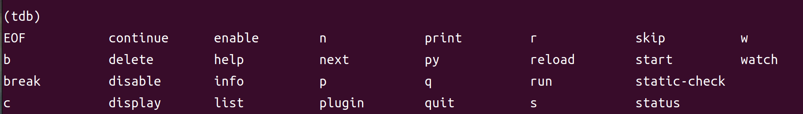
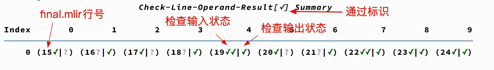
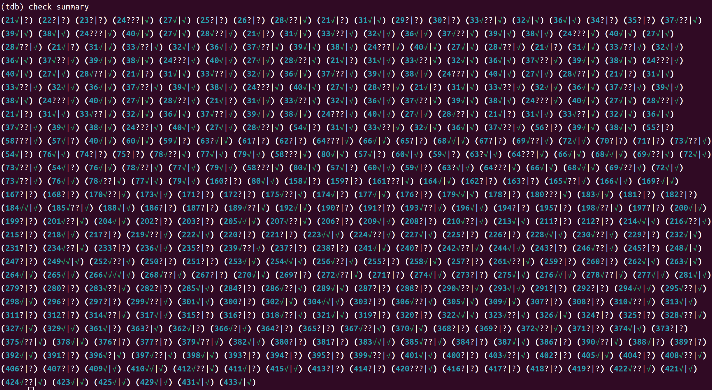
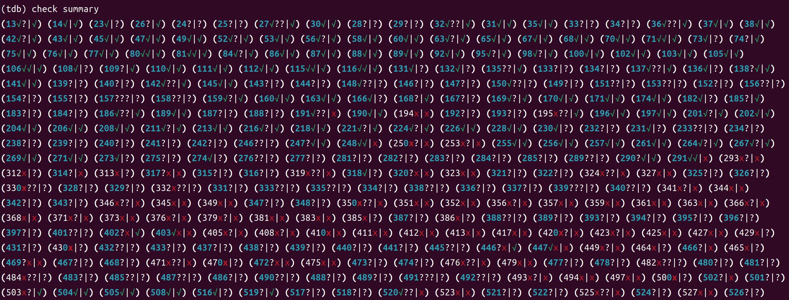
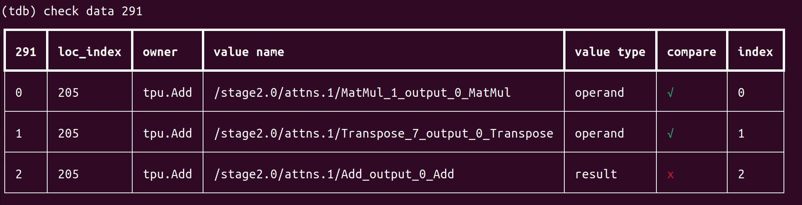
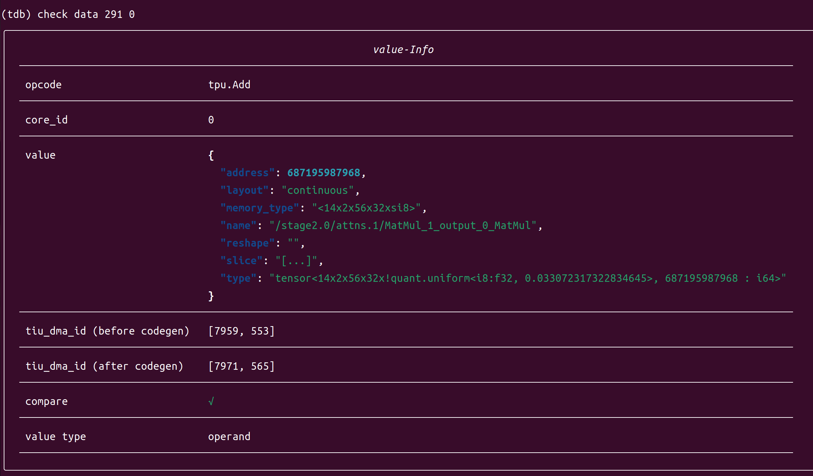
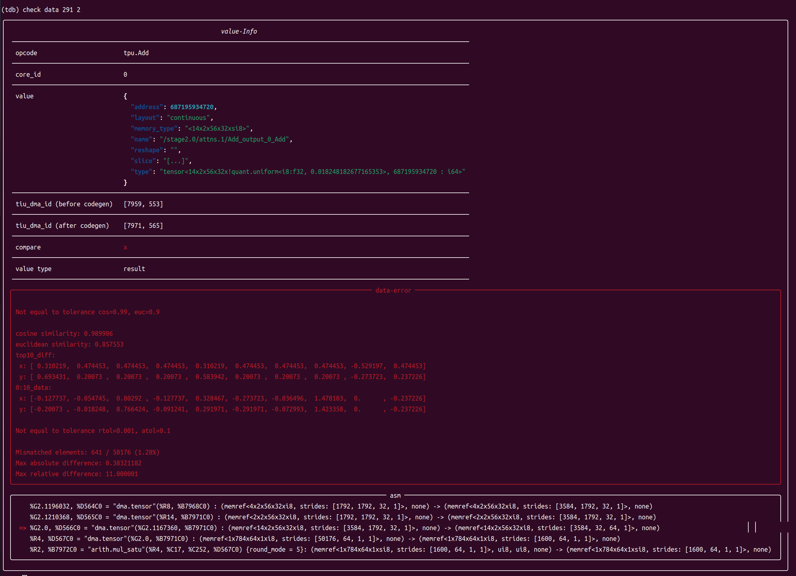

附录06：TDB调试工具使用指南
==================================
本章节主要介绍TDB(Tensor Debugger)工具的使用方法，TDB提供了一个和gdb、pdb界面类似的调试窗口，可用于调试 BModel 运行流程，具有添加断点、单步执行、查看内存数据、数据比对、等功能。

此工具目前支持 BM1684、BM1684X、BM1688。

准备工作
------------------

**环境配置**

首先需要参考 :ref:`开发环境配置章节 <env setup>` 完成环境配置，进入TPU-MLIR的Docker容器，并在其中安装tpu_mlir。

若已完成环境配置可忽略此步骤。

**生成bmodel**

在使用TDB之前需要先通过TPU-MLIR生成bmodel文件，可参考 :ref:`编译ONNX模型章节 <onnx to bmodel>` 中的命令从模型生成bmodel文件。

需要使用以下2个命令：

.. code-block:: shell

   # 将ONNX模型转换为top_mlir
   $ model_transform
   # 将top_mlir转换为bmodel
   $ model_deploy

其中，model_deploy 命令需要添加 ``--debug`` 和 ``--compare_all`` 参数，用于保存 tpu_output.npz 文件并保留中间数据。

生成 bmodel 时，会自动产生带有 compilation.bmodel 和 final.mlir 文件的目录，此目录称为 Context 目录。

.. （目前pip包不支持切换bmodel运行模式）

.. **切换bmodel运行模式**

.. 配置好TPU-MLIR的Docker中环境后，输入以下命令可切换CModel和PCIE模式：

.. .. code-block:: shell

..    # CModel模式
..    $ use_cmodel
..    # PCIE模式
..    $ use_processor

.. 默认为CMmodel模式，使用TDB时，支持PCIE模式的平台目前仅有bm1684x。

启动TDB
------------------

.. code-block:: shell

   $ tdb [-h]
         [--inputs [INPUTS]]
         [--ref_data [REF_DATA ...]]
         [--plugins [PLUGINS]]
         [--ddr_size [DDR_SIZE]] [-v]
         [context_dir]

``tdb`` 命令的主要参数说明如下：

.. list-table:: tdb 参数功能
   :widths: 20 10 50
   :header-rows: 1

   * - 参数名
     - 必选？
     - 说明
   * - context_dir
     - 是
     - bmodel文件所在目录，默认为当前目录
   * - -h, --help
     - 否
     - 显示帮助信息
   * - --inputs
     - 否
     - 指定bmodel文件的输入数据
   * - --ref_data
     - 否
     - 指定bmodel文件的参考数据
   * - --plugins
     - 否
     - 添加额外的插件
   * - --ddr_size
     - 否
     - 指定cmodel的ddr_size
   * - -v, --verbose
     - 否
     - 使用进度条

启动TDB示例：

.. code-block:: shell

   $ tdb
   # 等效于
   $ tdb ./

TDB命令汇总
------------------

在进入TDB后，按下两次 tab 可以获取命令提示。显示效果如下：

进入TDB后，可使用的命令如下：

.. list-table:: TDB 命令汇总
   :widths: 10 30
   :header-rows: 1

   * - 命令
     - 说明
   * - s/start
     - 加载 bmodel 并进行初始化
   * - r/run
     - 从头执行到结束，run 指令包含初始化功能
   * - b/break
     - 在 final.mlir 中添加断点
   * - delete
     - 删除断点
   * - n/next
     - 执行下一条指令，可以使用 n [num] 执行多条指令
   * - c/continue
     - 继续执行指令，直至断点或运行结束
   * - info
     - 打印断点信息或不同格式的指令
   * - p/print
     - 打印当前指令或指令对应的数据
   * - w/watch
     - 监视当前或上一条原子指令的某个输入/输出，当其所在地址的数据变化时返回提示
   * - q/quit
     - 退出TDB
   * - py [py_cmd]
     - 在TDB中执行 python 命令，集成了 pdb 的代码补全功能

其中，``num`` 为数字；``py_cmd`` 为python命令。

TDB使用流程
------------------

.. code-block:: shell

   # 在context目录启动TDB
   $ cd path/to/context_dir
   $ tdb
   # 初始化
   $ s
   # 逐条执行
   $ n
   # 添加断点
   $ b
   # 继续运行
   $ c
   # 继续调试
   $ info/p/w
   # 退出
   $ q

TDB功能说明
------------------

next功能
~~~~~~~~~~~~~~~~~~~~

.. code-block:: shell

   # 使用next单步执行
   (tdb) n
   # 使用next执行多条指令
   (tdb) n [num]
   # 使用next执行3条指令
   (tdb) n 3

n 命令后显示的指令为下一条未执行指令。

breakpoint功能
~~~~~~~~~~~~~~~~~~~~

breakpoint功能包含查看断点、添加/删除断点、开启/关闭断点功能。使用方法如下：

.. list-table:: breakpoint 功能
   :widths: 10 20 20
   :header-rows: 1

   * - 命令
     - 说明
     - 示例
   * - info b/break
     - 查看断点信息
     - info b; info break
   * - b/break
     - 添加断点
     - b 1
   * - enable
     - 开启断点
     - enable 1; enable 1,2
   * - disable
     - 关闭断点
     - disable 1; disable 1,2
   * - delete
     - 删除断点
     - delete 1

目前支持的断点类型如下：

**value-id**

bmodel 对应的 final.mlir 中的 Operation 前缀，例如：

.. code-block:: shell

   %140 = "tpu.Load"(%6) {do_bcast = false …

其中， ``%140`` 和 ``%6`` 即为 ``value-id`` ，添加此类型断点示例如下：

.. code-block:: shell

   (tdb) b %140
   (tdb) b %6

**op-name**

final.mlir 中的 Operation 的名称，上述例子中， ``tpu.Load`` 即为 Op 名称，添加此类型断点示例如下：

.. code-block:: shell

   (tdb) b tpu.Load

**cmd-id**

解析出的 asm 的 ``cmd-id``，上述例子中，D1 和 B0 即为 ``cmd-id``，添加此类型断点示例如下：

.. code-block:: shell

   (tdb) b D2
   (tdb) b B4

info功能
~~~~~~~~~~~~~~~~~~~~

info功能可以打印断点信息或不同格式的指令，使用方法如下：

**info b**

查看断点信息。

.. code-block:: shell

   (tdb) info b
   index     type enable     text hit
       1  dialect      y tpu.load   0
       2     addr      y       R0   3
       3   cmd-id      y       D1   0
       4 value-id      y       %7   0

**info asm**

查看当前的 asm 指令。

.. code-block:: shell

   (tdb) info asm
   %R0, %B15 = "arith.add"(%R13, %C1.0, %D3) {round_mode = 0} : (memref<1x32x54x160xf32, strides: [8640, 8640, 160, 1]>, f32, none) -> (memref<1x32x54x160xf32, strides: [8640, 8640, 160, 1]>, none)

**info mlir**

查看当前指令对应在 final.mlir 中的 Operation 。

.. code-block:: shell

   (tdb) info mlir
   %137 = "tpu.Active"(%134) {ginfo = #tpu.lg<out_addr = 212992, out_size = 35456, buffer_addr = 0, buffer_size = 71040, eu_align = true, n_idx = [0], n_slice = [1], c_idx = [0], c_slice = [32], d_idx = [0], d_slice = [1], h_idx = [0, 53, 107, 161, 215, 267], h_slice = [54, 55, 55, 55, 53, 53], w_idx = [0, 159], w_slice = [160, 161], id = 6, stage = 1, group_type = 0>, mode = #tpu<active_mode SILU>} : (tensor<1x32x320x320xf32>) -> tensor<1x32x320x320xf32> loc(#loc19)

**info reg**

查看当前指令解析后各字段的值。

.. code-block:: shell

   (tdb) info reg
   {'cmd_short': 1, 'cmd_id': 15, 'cmd_id_dep': 3, 'tsk_typ': 3, 'tsk_eu_typ': 2, 'opd0_const': 0, 'opd1_const': 1, 'opd2_const': 0, 'tsk_opd_num': 2, 'cmd_id_en': 1, 'pwr_step': 0, 'intr_en': 0, 'res0_prec': 2, 'opd0_prec': 2, 'opd1_prec': 2, 'opd2_prec': 0, 'opd0_sign': 1, 'opd1_sign': 1, 'res0_str': 0, 'opd0_str': 0, 'opd1_str': 0, 'opd2_n_str': 0, 'rsvd0': 0, 'res0_n': 1, 'res0_c': 32, 'res0_h': 54, 'res0_w': 160, 'res0_addr': 0, 'opd0_addr': 212992, 'opd1_addr': 1065353216, 'opd2_addr': 0, 'res0_n_str': 0, 'res0_c_str': 0, 'opd0_n_str': 0, 'opd0_c_str': 0, 'opd1_n_str': 0, 'opd1_c_str': 0, 'res0_h_str': 0, 'res0_w_str': 0, 'opd0_h_str': 0, 'opd2_sign': 0, 'rsvd1': 0, 'opd0_w_str': 0, 'opd1_h_str': 0, 'opd1_w_str': 0, 'rsvd2': 0}

**info loc**

查看 Context 目录中，tensor_location.json 中对应的 Operation 信息。

.. code-block:: shell

   (tdb) info loc
   {'core_id': 0,
   'file_line': 27,
   'loc_index': 4,
   'opcode': 'tpu.Active',
   'operands': [@163840({name=122_Conv, layout=eu_align, slice=[0:1, 0:32, 0:1, 0:54, 0:160], mlir_type=tensor<1x32x320x320xf32>, memory_type=<1x32x54x160xf32>})],
   'results': [@212992({name=124_Mul, layout=eu_align, slice=[0:1, 0:32, 0:1, 0:54, 0:160], mlir_type=tensor<1x32x320x320xf32>, memory_type=<1x32x54x160xf32>})],
   'slice_all': False,
   'subnet_id': 0,
   'tiu_dma_id_after': [17, 3],
   'tiu_dma_id_before': [1, 3]}

print功能
~~~~~~~~~~~~~~~~~~~~

print功能不仅可以打印当前的asm指令，还可以打印指令的输入和输出数据，使用方法如下：

.. list-table:: print 功能
   :widths: 10 20 10
   :header-rows: 1

   * - 命令
     - 说明
     - 示例
   * - p op
     - 查看即将执行的指令
     - p op
   * - p pre/next
     - 查看上一条或下一条指令
     - p pre; p next
   * - p in
     - 查看下一条未执行指令的输入数据
     - p in; p in 0
   * - p out
     - 查看上一条已执行指令的输出数据
     - p out; p out 0

watchpoint功能
~~~~~~~~~~~~~~~~~~~~

watchpoint功能可以监视指令的输入/输出数据，当某个监视变量的数据发生变化时会返回提示，使用方法如下：

**w**

查看当前已添加的 watchpoint，示例如下：

.. code-block:: shell

   (tdb) w
   index    cmd_type cmd_id core_id enabled                                                   value
       1 CMDType.dma      2       0       y %G0: memref<1x32x3x36xf32, strides: [3456, 108, 36, 1]>

**w in**

将下一条待执行指令的某个输入添加为 watchpoint，示例如下：

.. code-block:: shell

   (tdb) n
   %R15.2688, %D2 = "dma.tensor"(%G0, %B0) {decompress = False} : (memref<1x32x3x36xf32, strides: [3456, 108, 36, 1]>, none) -> (memref<1x32x3x36xf32, strides: [108, 108, 36, 1]>, none)
   (tdb) w in 0
   (tdb) w
   index    cmd_type cmd_id core_id enabled                                                   value
       1 CMDType.dma      2       0       y %G0: memref<1x32x3x36xf32, strides: [3456, 108, 36, 1]>

可以看到，w in 0 将下一条待执行指令的第一个输入 %G0 添加为 watchpoint 。

**w out**

将上一条已执行指令的某个输出添加为 watchpoint，示例如下：

.. code-block:: shell

   (tdb) w out 0
   (tdb) w
   index    cmd_type cmd_id core_id enabled                                                         value
       1 CMDType.dma      2       0       y       %G0: memref<1x32x3x36xf32, strides: [3456, 108, 36, 1]>
       2 CMDType.dma      1       0       y %R0: memref<1x3x110x322xf32, strides: [35424, 35424, 322, 1]>

**p w idx old/now**

打印已添加 watchpoint 的值，示例如下：

其中 idx 是使用 w 命令返回的 watchpoint 的 index ，old 表示查看该 watchpoint 最初被添加时的数据，now 表示查看 watchpoint 当前数据。

old/now 可省略，默认为 now，即查看 watchpoint 当前数据。

.. code-block:: shell

   (tdb) w
   index    cmd_type cmd_id core_id enabled                                                         value
       1 CMDType.dma      2       0       y       %G0: memref<1x32x3x36xf32, strides: [3456, 108, 36, 1]>
       2 CMDType.dma      1       0       y %R0: memref<1x3x110x322xf32, strides: [35424, 35424, 322, 1]>
   (tdb) p w 1
   (tdb) p w 1 old

**w delete [idx]**

删除已添加的 watchpoint，示例如下：

当输入 idx 时表示删除对应的 watchpoint，不输入 idx 时表示删除全部的 watchpoint。

.. code-block:: shell

   (tdb) w
   index    cmd_type cmd_id core_id enabled                                                         value
       1 CMDType.dma      2       0       y       %G0: memref<1x32x3x36xf32, strides: [3456, 108, 36, 1]>
       2 CMDType.dma      1       0       y %R0: memref<1x3x110x322xf32, strides: [35424, 35424, 322, 1]>
       3 CMDType.tiu     11       0       y %R13: memref<1x32x54x160xsi16, strides: [8640, 8640, 160, 1]>
   (tdb) w delete 1
   (tdb) w
   index    cmd_type cmd_id core_id enabled                                                         value
       2 CMDType.dma      1       0       y %R0: memref<1x3x110x322xf32, strides: [35424, 35424, 322, 1]>
       3 CMDType.tiu     11       0       y %R13: memref<1x32x54x160xsi16, strides: [8640, 8640, 160, 1]>
   (tdb) w delete
   (tdb) w
   index cmd_type cmd_id core_id enabled value

py功能
~~~~~~~~~~~~~~~~~~~~

py功能可以在TDB环境下直接执行python命令，使用方法如下：

.. code-block:: shell

   (tdb) py a = 2
   (tdb) py b = a + 2
   (tdb) py print(b)
   4

BModel Disassembler
------------------

BModel Disassembler 可以对 bmodel 文件进行反汇编得到 MLIR 格式的 atomic 指令的汇编代码，即 asm 指令，用于分析模型的最终运行命令。

使用时首先需要进入 Context 目录，使用方法如下：

.. code-block:: shell

   $ bmodel_dis [-h] [--format {mlir,reg,bits,bin,reg-set}] bmodels [bmodels ...]

其中， ``--format`` 可以指定输出格式，默认使用mlir格式，bmodels 表示要解析的bmodel文件。使用示例如下：

.. code-block:: shell

   $ bmodel_dis compilation.bmodel
   $ bmodel_dis --format reg compilation.bmodel

可将输出结果保存至文件，方法如下：

.. code-block:: shell

   $ bmodel_dis compilation.bmodel > dis_bmodel.mlir
   $ bmodel_dis --format reg compilation.bmodel > dis_reg.json

BModel Checker
------------------

BModel Checker 用于查找 bmodel 中的错误（codegen错误），如果在 model_deploy 时发现生成的 bmodel 无法与 tpu 的参考数据对齐，则可以使用该工具来定位错误。目前支持 BM1684、BM1684X、BM1688 处理器的 BModel。

在生成 bmodel 文件时，model_deploy 命令需要添加 ``--debug`` 和 ``--compare_all`` 参数，用于保存 tpu_output.npz 文件并保留中间数据。

使用方法如下：

.. code-block:: shell

   $ bmodel_checker [-h]
                    [--tolerance TOLERANCE]
                    [--report REPORT] [--fail_fast]
                    [--quiet] [--no_interactive]
                    [--dump_mode {failed,all,never}]
                    context_dir reference_data

``bmodel_checker`` 的主要参数说明如下：

.. list-table:: bmodel_checker 参数功能
   :widths: 20 10 50
   :header-rows: 1

   * - 参数名
     - 必选？
     - 说明
   * - context_dir
     - 是
     - bmodel文件所在目录
   * - reference_data
     - 是
     - tpu_output.npz文件位置
   * - quiet
     - 否
     - 不显示执行进度条
   * - fail_fast
     - 否
     - 在发现第一个错误的时候就停下来
   * - dump_mode
     - 否
     - 指定dump命令下载的数据，默认为failed，还可以是all或never
   * - tolerance
     - 否
     - 指定比较容差，默认为 "0.99,0.90"
   * - report
     - 否
     - 将错误结果输出成文件，默认为 failed_bmodel_outputs.npz
   * - no_interactive
     - 否
     - 运行完 bmodel_checker 会直接退出 TDB 模式
   * - cache_mode
     - 否
     - 缓存模式，有 online, offline, generate 三种选项，默认为 online

使用 ``bmodel_checker`` 需要进入 Context 目录，使用示例如下：

.. code-block:: shell

   $ bmodel_checker ./ ../yolov5s_bm1684x_f32_tpu_outputs.npz
   $ bmodel_checker ./ ../yolov5s_bm1684x_f32_tpu_outputs.npz --fail_fast
   $ bmodel_checker ./ ../yolov5s_bm1684x_f32_tpu_outputs.npz --tolerance 0.99,0.90

执行 ``bmodel_checker`` 命令后，会输出检查报告，并将错误的输出结果保存到 ``failed_bmodel_outputs.npz`` 文件中，下面对检查报告进行说明：

其中，“对勾”表示通过，即该数据被检查，且其相似度符合 ``cos>0.99, eul>0.9`` (默认阈值，可通过 tolerance 参数修改)；“叉号”表示错误，即该数据没有达到要求的相似度；“问号”表示未知，即没有找到对应的参考数据，无法确定此数据的正确性。一个 ``yolov5s`` 模型的完整检查报告如下图所示：

输出检查报告后会自动进入交互模式。交互模式可提供对错误的详细浏览，而且还可以快速在不同行之间跳转，下面以一个 ``cswin_tiny`` 模型为例展示其使用方法。

**check summary**

使用 ``check summary`` 命令可以重新打印检查报告，使用示例如下：

值得一提的是，使用 ``check summary reduce`` 命令可以聚合相同行号的输入和输出。

**check data**

.. code-block:: shell

   (tdb) check data [file-line]

其中， ``file-line`` 为检查报告中的行号，对应 final.mlir 的行号。此命令可以给出 ``file-line`` 对应指令的所有输入输出数据的描述信息，使用示例如下：

.. code-block:: shell

   (tdb) check data [file-line] [index]

其中， ``index`` 为 ``check data [file-line]`` 命令输出数据的 ``index``。此命令可以给出对应 ``index`` 数据的详细信息，对比正确的数据示例如下：

对比错误的数据示例如下：

**SoC 设备**

当在 SoC 设备上执行时，为了在不引入 mlir 依赖的情况下执行比对，需要先在 Docker 环境内生成缓存，随后在 SoC 设备环境下使用缓存模型比对模型。

.. code-block:: shell

   $ bmodel_checker ./ ../yolov5s_bm1684x_f32_tpu_outputs.npz --cache_mode generate # on docker
   $ bmodel_checker ./ ../yolov5s_bm1684x_f32_tpu_outputs.npz --cache_mode offline # on soc
