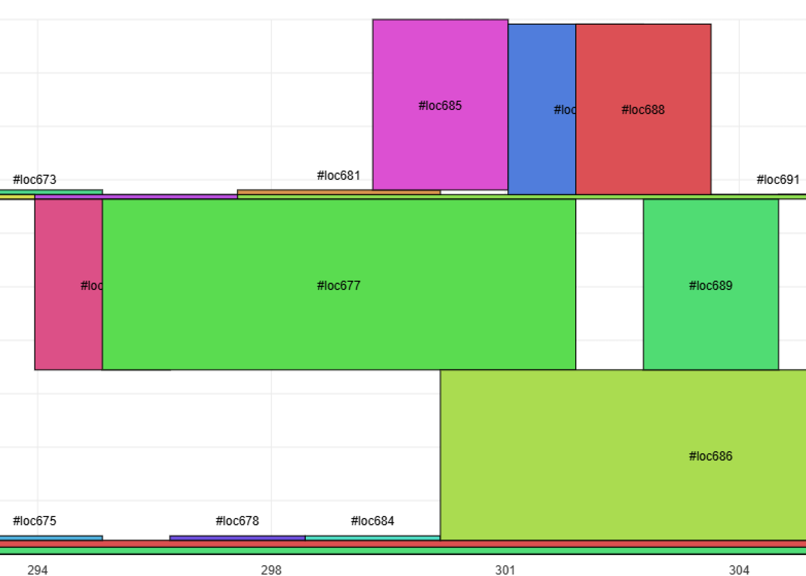

附录07：可视化工具使用指南
==================================
本章节主要介绍可视化工具的使用方法，目前提供了一个部署于在线网页的可视化工具，用于做LayerGroup相关可视化（暂不介绍）和neuron空间的可视化，可用于查看neuron的峰值占用和tensor的生存周期分析等功能。

网址：https://tpu-mlir-vis-tools.github.io/demo/#/neuron

此工具目前不支持，addr_mode除了auto之外的模式

准备工作
------------------

**环境配置**

首先需要参考 :ref:`开发环境配置章节 <env setup>` 完成环境配置，进入TPU-MLIR的Docker容器，并在其中安装tpu_mlir。

若已完成环境配置可忽略此步骤。

**生成final.mlir**

在使用可视化工具之前需要先通过TPU-MLIR生成final.mlir文件，可参考 :ref:`编译ONNX模型章节 <onnx to bmodel>` 中的命令从模型生成final.mlir文件，该文件为model_deploy过程的中间文件。

需要使用以下2个命令：

.. code-block:: shell

   # 将ONNX模型转换为top_mlir
   $ model_transform
   # 将top_mlir转换为bmodel
   $ model_deploy

页面使用方法
------------------
进入页面后选择final.mlir文件。

页面会自动处理final.mlir文件并生成空间利用率峰值图和内存分配甘特图。

.. figure:: ../assets/neuron_vis.png
   :align: center

第一个图展示了设备上的空间峰值情况，由于设备上更贴近于是一个覆盖写的操作，仅管理内存分配，而不管理内存释放，因此该图的主要作用是关注峰值在哪个时间步产生，鼠标悬浮会展示当前的分配情况。

第二个图提供更准确、细致的内存分配状态，横轴为时间步，纵轴为内存地址，展示了每个内存块的起始结束时间步和起始结束地址，支持鼠标悬浮展示，同时该图支持横向的鼠标滚轮缩放。

使用过程中一般根据图一的峰值，到图二去缩放找到占用该时间步的tensor及其loc，对应到final.mlir中去分析tensor的生命周期以及占用大小是否合理。生命周期源自模型拓扑结构，tensor的占用大小由shape与数据类型共同决定。

以下为上图峰值区域甘特图缩放区域:

以下为上图峰值区域对应的final.mlir片段

.. code-block:: text

   %419 = "tpu.MatMul"(%415, %418, %0, %0, %0) {do_relu = false, dq_type = "NONE", fuse_rq = false, hdim_is_batch = false, input_zp = 0 : i64, is_lora = false, keep_dims = true, left_reuse = 1 : i64, left_transpose = false, multipliers = [1], output_transpose = false, q_group_size = 0 : i64, quant_mode = #tpu<rq_mode MultiplierShift>, relu_limit = -1.000000e+00 : f64, right_transpose = true, right_zp = 0 : i64, round_mode = #tpu<round_mode HalfAwayFromZero>, rshifts = [0]} : (tensor<1x4800x128xf32, 4788801536 : i64>, tensor<1x4800x128xf32, 4601942016 : i64>, none, none, none) -> tensor<1x4800x4800xf32, 4791259136 : i64> loc(#loc685)
   %420 = "tpu.MulConst"(%419) {const_val = 0.088388349161020605 : f64, do_relu = false, is_scalar = false, multiplier = 1 : si32, relu_limit = -1.000000e+00 : f64, rshift = 0 : si32} : (tensor<1x4800x4800xf32, 4791259136 : i64>) -> tensor<1x4800x4800xf32, 4601942016 : i64> loc(#loc686)
   %421 = "tpu.MulConst"(%411) {const_val = 0.088388349161020605 : f64, do_relu = false, is_scalar = false, multiplier = 1 : si32, relu_limit = -1.000000e+00 : f64, rshift = 0 : si32} : (tensor<1x60x80x60x80xf32, 4694102016 : i64>) -> tensor<1x60x80x60x80xf32, 4788801536 : i64> loc(#loc687)
   %422 = "tpu.Reshape"(%421) {flatten_start_dim = -1 : i64, shape = [1, 4800, 4800]} : (tensor<1x60x80x60x80xf32, 4788801536 : i64>) -> tensor<1x4800x4800xf32, 4788801536 : i64> loc(#loc688)
   %423 = "tpu.Softmax"(%422, %0, %0, %0, %0, %0) {axis = 2 : si32, beta = 1.000000e+00 : f64, log = false, round_mode = #tpu<round_mode HalfAwayFromZero>} : (tensor<1x4800x4800xf32, 4788801536 : i64>, none, none, none, none, none) -> tensor<1x4800x4800xf32, 4694102016 : i64> loc(#loc689)

如上所示，final.mlir中一行一般表示一个算子，算子有其输入输出tensor，输出tensor在该行被定义，在后续行中作为其他操作的输入。除了这些信息之外，mlir的尾部有loc和layer_name的对应表，例如#loc686 = loc("/model/feature_flow_attn/Div_output_0_Div")。用户如果想知道该tensor对应到原模型的哪一部分，可以根据tensor的loc，查找对应的layer_name。

在上图中，loc677为定义在代码段之前的一个长生命周期tensor，作为%411用于产生输出%421即loc687。loc677、loc686和loc687(蓝色区域)共同占满时间步301-302的内存空间。注意loc687为图中蓝色部分，与后续的loc688有时空上的重叠，这是由于是reshape是inplace算子，会在地址进行原地运算，类似的情况还有slice和concat。

同时后续时间步303-304被loc688、loc689和loc686也占满了内存空间，loc686的时间步较长是因为，其在后续还作为输入被其他算子所用到。

更具体的分析可以到onnx的源码中，做模型结构上的优化分析等。

**注意：**

地址分配时有两种分配策略，取两种策略的最优作为最后的地址分配：

  * firstFit：从起始地址往后扫描找到第一个可以放的空间
  * opSizeOrder：把tensor从大到小排序，优先分配大的

如果是firstFit输入会在起始地址统一分配，opSizeOrder则会分散到不同地址中。

